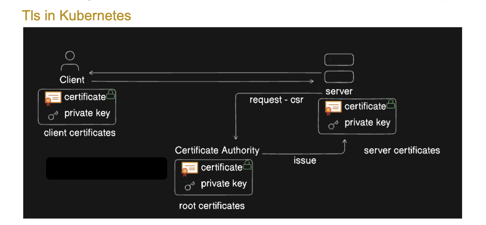
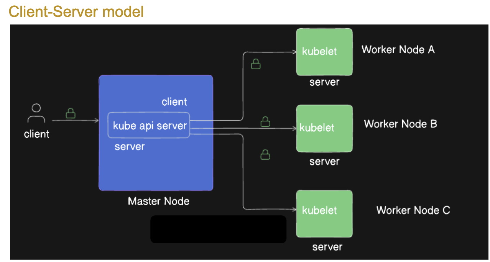
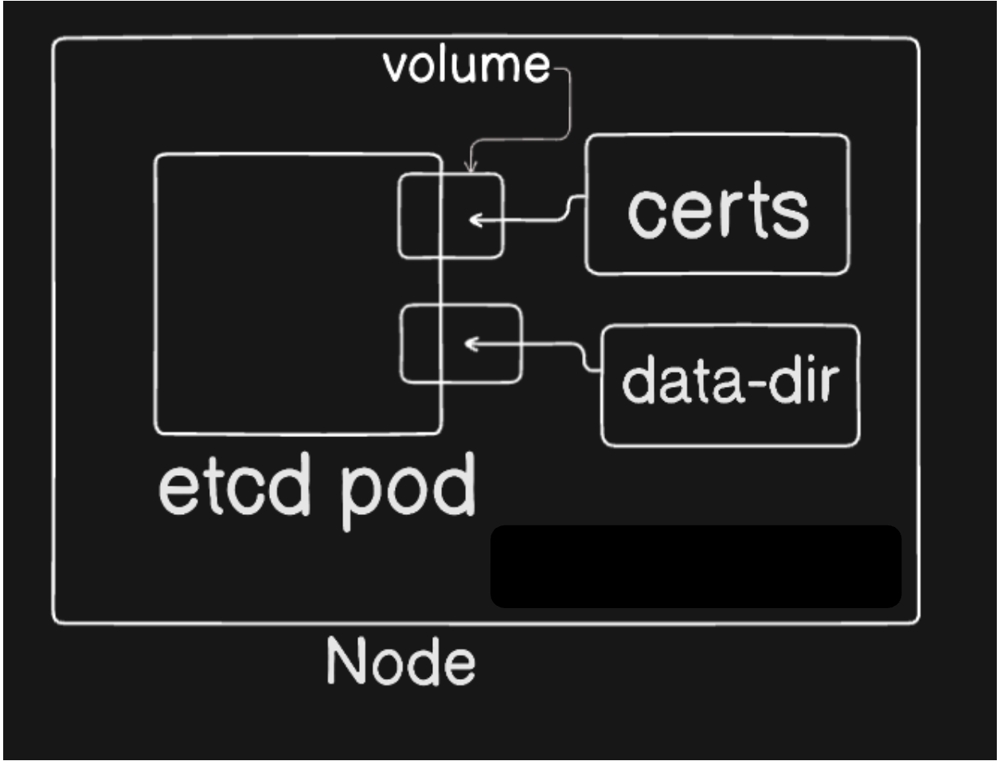

Certificates and Certificates Signing Requests
https://kubernetes.io/docs/reference/access-authn-authz/certificate-signing-requests/#create-certificatessigningrequest
Kubernetes provides a certificates.k8s.io API, which lets you provision TLS certificates signed by a Certificate Authority (CA) that you control. These CA and certificates can be used by your workloads to establish trust.
Tls in Kubernetes

Client-Server model

How certificates are loaded

Where we use certs in control plane components

Commands used

To generate a key file
openssl genrsa -out adam.key 2048

To generate a csr file
openssl req -new -key adam.key -out adam.csr -subj "/CN=adam"

To approve a csr
kubectl certificate approve <certificate-signing-request-name>

To deny a csr
kubectl certificate deny <certificate-signing-request-name>

How to issue a certificate for a user
A few steps are required in order to get a normal user to be able to authenticate and invoke an API. First, this user must have a certificate issued by the Kubernetes cluster, and then present that certificate to the Kubernetes API.

1. Create private key
   openssl genrsa -out myuser.key 2048
2. Create a cetificate signing request
   openssl req -new -key myuser.key -out myuser.csr -subj "/CN=myuser"

E.g., Lets say you are the admin of a Kubernetes cluster and a new user has been join your team as a another administrator to share your load. Now you have to provide that user access to your cluster using the certificates.
Different steps involved in that.

1. User will go and create the keys and certificate siging request for that use below command
   openssl genrsa -out myuser.key 2048 # will create a private key names myuser.key
   openssl req -new -key myuser.key -out myuser.csr -subj "/CN=myuser" # using myuser.key generate certificate signing request.
2. Now user will give you access to his certificate signing request and he will ask you to create the certificate signing request and approve it on the
   Kubernetes site.
3. So as a Kubernetes administration who has all the permission you will create a new file CSR.YAML or csr.yaml
4. The key inside myuser.csr has to be one single line but over here multiple line so lets convert it into base 64 format
   cat myuser.csr | base64 | tr -d "\n"
   does the following:

cat bittu.csr: Reads the content of the CSR file (bittu.csr).
base64: Encodes the file content in Base64.
tr -d "\n": Removes newline characters from the Base64 output, which is essential because Kubernetes requires the Base64-encoded CSR data to be on a single line.

output-
cat bittu.csr|base64 | tr -d "\n"
LS0tLS1CRUdJTiBDRVJUSUZJQ0FURSBSRVFVRVNULS0tLS0KTUlJQ1ZUQ0NBVDBDQVFBd0VERU9NQXdHQTFVRUF3d0ZZbWwwZEhVd2dnRWlNQTBHQ1NxR1NJYjNEUUVCQVFVQQpBNElCRHdBd2dnRUtBb0lCQVFDOVp2eklrV0ZBZXROZkJCazFwa2lqUmpWb1FZVEZFbmJRZEIxZm0wTE1RSVNKCjJWMnk3cG42VEpBVk1NOE1PNHU5d2lhcDYwdkpqL0RnanprRzNrTC83TDkzRWZDQ2dDK3gzcTZOamlGQ1EyUFUKYkY3bEtNeC90NTh0Zkg5OVVpcCtFMnZIN1JuZHRES3QzdkdWaHVqM2l0WjBydWNoOXRPWElCVnVvdThxcGpFdQprVS94SndtekxSNG5GOGlTa2hCL1VrOWR0UDN1Y1lEQWhYN3BjVUJZQzJ0MmdkbGlGbzZwQVQycVFWdEZaRDA5CkNSd1o5ZXF2OEp0MXdqL1hHRXZkeWJHZ2hnMEQ4cm9KQ2xWdjFMbHk1VmFYbUVVMVBHdGFKcURzTHJGcHhWTW4KMUcyTkNrUHg5VkxXR05XOUNmcGJPTnNVS2pkUWgwUUhCNUhvcXlwL0FnTUJBQUdnQURBTkJna3Foa2lHOXcwQgpBUXNGQUFPQ0FRRUFkaTRYSlFaOTBhS2JRSDVxcHptMzRiZXZ5WFNIU2ZybGhkSnV1WVdJTW95bU9vYlBJaEFzCnllMTBsV1dlbHBjdVhWUk1kSExVTnFmTUFwZjBlOFRFRXgwZ05Qa1VpWGhOTnpLaVkxVXQ3bXBxeWtrdW90ZGEKTzhSUG8yMm1VdTBla0NkMVRWUllHaXJ2S3BjaFdWdXBpekJPWDN1YXQvaU93bnRNdm5hZ0p1M1FPamI2RllmWgpBRnE2RVhPSnB4L2NpS0FBQjFKbHMyKzd2ZTB0MjN6RzhXcXlsSFBiakpPTUVxRkRZeWsySWYvVmVyekl5L2FICm93TW1pSmFzNVpHaEo0Z0FsT0Q5ZFJXYWJldDBDYVZTc1VRVmYrNEFod1VPTFpKK0x2WHRCb2s1OHF1dFRhN3YKYmJ3dXFkbFNaZWpqSlU5K3NlOFNncDZObmFoQUFDMU15dz09Ci0tLS0tRU5EIENFUlRJRklDQVRFIFJFUVVFU1QtLS0tLQo=%

5. mkdir csr.yaml
6. vim csr.yaml
   apiVersion: certificates.k8s.io/v1
   kind: CertificateSigningRequest
   metadata:
   name: buttu
   spec:
   request: LS0tLS1CRUdJTiBDRVJUSUZJQ0FURSBSRVFVRVNULS0tLS0KTUlJQ1ZUQ0NBVDBDQVFBd0VERU9NQXdHQTFVRUF3d0ZZbWwwZEhVd2dnRWlNQTBHQ1NxR1NJYjNEUUVCQVFVQQpBNElCRHdBd2dnRUtBb0lCQVFDOVp2eklrV0ZBZXROZkJCazFwa2lqUmpWb1FZVEZFbmJRZEIxZm0wTE1RSVNKCjJWMnk3cG42VEpBVk1NOE1PNHU5d2lhcDYwdkpqL0RnanprRzNrTC83TDkzRWZDQ2dDK3gzcTZOamlGQ1EyUFUKYkY3bEtNeC90NTh0ZVVpcCtFMnZIN1JuZHRES3QzdkdWaHVqM2l0WjBydWNoOXRPWElCVnVvdThxcGpFdQprVS94SndtekxSNG5GOGlTa2hCL1VrOWR0UDN1Y1lEQWhYN3BjVUJZQzJ0MmdkbGlGbzZwQVQycVFWdEZaRDA5CkNSd1o5ZXF2OEp0MXdqL1hHRXZkeWJHZ2hnMEQ4cm9KQ2xWdjFMbHk1VmFYbUVVMVBHdGFKcURzTHJGcHhWTW4KMUcyTkNrUHg5VkxXR05XOUNmcGJPTnNVS2pkUWgwUUhCNUhvcXlwL0FnTUJBQUdnQURBTkJna3Foa2lHOXcwQgpBUXNGQUFPQ0FRRUFkaTRYSlFaOTBhS2JRSDVxcHptMzRiZXZ5WFNIU2ZybGhkSnV1WVdJTW95bU9vYlBJaEFzCnllMTBsV1dlbHBjdVhWUk1kSExVTnFmTUFwZjBlOFRFRXgwZ05Qa1VpWGhOTnpLaVkxVXQ3bXBxeWtrdW90ZGEKTzhSUG8yMm1VdTBla0NkMVRWUllHaXJ2S3BjaFdWdXBpekJPWDN1YXQvaU93bnRNdm5hZ0p1M1FPamI2RllmWgpBRnE2RVhPSnB4L2NpS0FBQjFKbHMyKzd2ZTB0MjN6RzhXcXlsSFBiakpPTUVxRkRZeWsySWYvVmVyekl5L2FICm93TW1pSmFzNVpHaEo0Z0FsT0Q5ZFJXYWJldDBDYVZTc1VRVmYrNEFod1VPTFpKK0x2WHRCb2s1OHF1dFRhN3YKYmJ3dXFkbFNaZWpqSlU5K3NlOFNncDZObmFoQUFDMU15dz09Ci0tLS0tRU5EIENFUlRJRklDQVRFIFJFUVVFU1QtLS0tLQo= # encoded base 64 format of bittu.csr
   signerName: kubernetes.io/kube-apiserver-client
   expirationSeconds: 604800 # 1 week = 604800 seconds  
    usages:

   - client auth

7. kubectl apply -f csr.yaml
   output:kubectl apply -f csr.yaml
   certificatesigningrequest.certificates.k8s.io/buttu created
8. kubectl get csr
   OutPut:
   kubectl get csr  
   NAME AGE SIGNERNAME REQUESTOR REQUESTEDDURATION CONDITION
   buttu 42s kubernetes.io/kube-apiserver-client kubernetes-admin 7d Pending

here condition is pending bcz we have not approved yet so if we sure about the received myuser.csr then we can approve it manually
9. kubectl describe csr/buttu # To check the details
or
kubectl describe csr/buttu 
10. User created a certificate signing request and shared it with you, You as the administrator created this object kind: CertificateSigningRequest but you have not approved it yet. 
11. This certificate signing request has to be approved by authorized CA(Certificate Authority), because this is for our internal Kubernetes cluster we are not using any "PUBLIC CA" we are using the internal CA.
Internal CA could be hosted on a server or by default it is hosted on your master server.
CA on server - combination of "public certificate" and "private key" 
12. Approve or Deny the request
kubectl certificate approve buttu
Output:
kubectl certificate approve buttu
certificatesigningrequest.certificates.k8s.io/buttu approved 
13. kubectl get csr
OutPut:
kubectl get csr  
NAME AGE SIGNERNAME REQUESTOR REQUESTEDDURATION CONDITION
buttu 19m kubernetes.io/kube-apiserver-client kubernetes-admin 7d Approved,Issued 
14. Now the next part is, you have generated the certificate signing request and the certificate is now approved, now you have to share this with the user.
so what you can do,
kubectl get csr buttu -o yaml > bittu_issuedcert.yaml
cat bittu_issuedcert.yaml # copy certificate from here and decode then send to back to user

echo "LS0tLS1CRUdJTiBDRVJUSUZJQ0FURS0tLS0tCk1JSUM5VENDQWQyZ0F3SUJBZ0lRZU1pZDRBZFdrUldFdit1QWdTTm5PVEFOQmdrcWhraUc5dzBCQVFzRkFEQVYKTVJNd0VRWURWUVFERXdwcmRXSmxjbTVsZEdWek1CNFhEVEkxTURFeE5UQXdOREkxTTFvWERUSTFNREV5TWpBdwpOREkxTTFvd0VERU9NQXdHQTFVRUF4TUZZbWwwZEhVd2dnRWlNQTBHQ1NxR1NJYjNEUUVCQVFVQUE0SUJEd0F3CmdnRUtBb0lCQVFDOVp2eklrV0ZBZXROZkJCazFwa2lqUmpWb1FZVEZFbmJRZEIxZm0wTE1RSVNKMlYyeTdwbjYKVEpBVk1NOE1PNHU5d2lhcDYwdkpqL0RnanprRzNrTC83TDkzRWZDQ2dDK3gzcTZOamlGQ1EyUFViRjdsS014Lwp0NTh0Zkg5OVVpcCtFMnZIN1JuZHRES3QzdkdWaHVqM2l0WjBydWNoOXRPWElCVnVvdThxcGpFdWtVL3hKd216CkxSNG5GOGlTa2hCL1VrOWR0UDN1Y1lEQWhYN3BjVUJZQzJ0MmdkbGlGbzZwQVQycVFWdEZaRDA5Q1J3WjllcXYKOEp0MXdqL1hHRXZkeWJHZ2hnMEQ4cm9KQ2xWdjFMbHk1VmFYbUVVMVBHdGFKcURzTHJGcHhWTW4xRzJOQ2tQeAo5VkxXR05XOUNmcGJPTnNVS2pkUWgwUUhCNUhvcXlwL0FnTUJBQUdqUmpCRU1CTUdBMVVkSlFRTU1Bb0dDQ3NHCkFRVUZCd01DTUF3R0ExVWRFd0VCL3dRQ01BQXdId1lEVlIwakJCZ3dGb0FVcXB2eTgvbjhBNHFvZUpXUHl0NGsKVTUwQmlzOHdEUVlKS29aSWh2Y05BUUVMQlFBRGdnRUJBQ1BlTWN4eEluaTZCUk96L3pBamV3RGJvdlZpdVdUZQpqVW9HYXozNWNIeXZSNktOWUNyQk1IQm1CNkhnMXgwWVN4ck9jZUhNeWVtTVlXMEF2OGlEdTM0TkE3N0p1eUJyCnBlSDJ4SjNxOUVwSmZsMy9Wb0pwdGFHU1EyRUY0ZXpZcTZqWGcrK1VaVk9qU2JpdGtISVNXcXVhLzFkTnFwNWkKYWUrQmI2elg3d0tudDNIUm9nOTZGc0hiYkZUUFNOUG9nbU5WZE9QajMvRFFjSUFqcjV5TGFneVpYY2NqMkFNcgp5UDNtR0ZtOVZWM3NqcnhCODlicWpFL0xmSkhWUWYwVmdxUnJ2ZGowQnFHRFROM3VxVHl1Wjl5UUJxYzMrSUYyClhXWUQ5NWxNZHNNbU5yM3dpWGwzYmtUcndGTld3U29YcUwyRDNiOWhxZ0hCbGlMdXcydm01bkE9Ci0tLS0tRU5EIENFUlRJRklDQVRFLS0tL0K" | base64 -d

OutPut:
-----BEGIN CERTIFICATE-----
MIIC9TCCAd2gAwIBAgIQeMid4AdWkRWEv+uAgSNnOTANBgkqhkiG9w0BAQsFADAV
MRMwEQYDVQQDEwprdWJlcm5ldGVzMB4XDTI1MDExNTAwNDI1M1oXDTI1MDEyMjAw
NDI1M1owEDEOMAwGA1UEAxMFYml0dHUwggEiMA0GCSqGSIb3DQEBAQUAA4IBDwAw
ggEKAoIBAQC9ZvzIkWFAetNfBBk1pkijRjVoQYTFEnbQdB1fm0LMQISJ2V2y7pn6
TJAVMM8MO4u9wiap60vJj/DgjzkG3kL/7L93EfCCgC+x3q6NjiFCQ2PUbF7lKMx/
t58tfH99Uip+E2vH7RndtDKt3vGVhuj3itZ0ruch9tOXIBVuou8qpjEukU/xJwmz
LR4nF8iSkhB/Uk9dtP3ucYDAhX7pcUBYC2t2gdliFo6pAT2qQVtFZD09CRwZ9eqv
8Jt1wj/XGEvdybGghg0D8roJClVv1Lly5VaXmEU1PGtaJqDsLrFpxVMn1G2NCkPx
9VLWGNW9CfpbONsUKjdQh0QHB5Hoqyp/AgMBAAGjRjBEMBMGA1UdJQQMMAoGCCsG
AQUFBwMCMAwGA1UdEwEB/wQCMAAwHwYDVR0jBBgwFoAUqpvy8/n8A4qoeJWPyt4k
U50Bis8wDQYJKoZIhvcNAQELBQADggEBACPeMcxxIni6BROz/zAjewDbovViuWTe
jUoGaz35cHyvR6KNYCrBMHBmB6Hg1x0YSxrOceHMyemMYW0Av8iDu34NA77JuyBr
peH2xJ3q9EpJfl3/VoJptaGSQ2EF4ezYq6jXg++UZVOjSbitkHISWqua/1dNqp5i
ae+Bb6zX7wKnt3HRog96FsHbbFTPSNPogmNVdOPj3/DQcIAjr5yLagyZXccj2AMr
yP3mGFm9VV3sjrxB89bqjE/LfJHVQf0VgqRrvdj0BqGDTN3uqTyuZ9yQBqc3+IF2
XWYD95lMdsMmNr3wiXl3bkTrFNWwSoXqL2D3b9hqgHBliLuw2vm5nA=
-----END CERTIFICATE-----
You can add this certificate to the kubeconfig.yaml file and then you can assign a certain role to this user, so that user will have certain permission and that will be done, User can access the server using that certificate.
