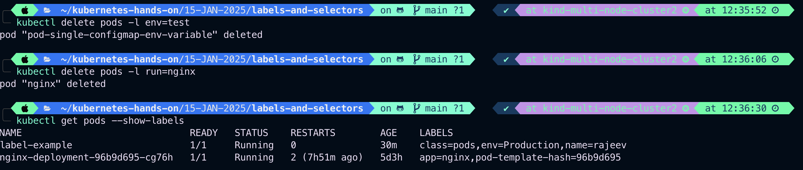

# Labels and Selectors 
- Labels are the mechanism you use to organise kubernetes objects.
- A label is a key value pair without any predefined meaning that can be attached to the objects.
- labels are similar to __tag__ in __AWS__ or __Git__ where you use a name to quick reference.
- You are free to choose __labels__ as you need it to refer an __environment__ which is used for __dev__ or __Testing__ or __Production__, refer a product group like DepartmentA, DepartmentB
- Multiple labels can be added to a single object.

E.g,
```
vim pod.yaml

```
```
apiVersion: v1
kind: Pod
metadata: 
  name: label-example
  labels:
    env: Production
    class: pods
spec:
  containers:
  - name: label-example
    image: nginx
    command: ["bin/bash", "-c", "while true; do echo "Hello Rajeev"; sleep 5; done"]
```
Apply the pod.yaml file
```
kubectl apply -f pod.yaml
```
Output:

Check labels of Pods 
```
kubectl get pods --show-labels
```
Output :

#
 Add label to an existing pod through __imperative way__  
 ```
 kubectl label pod label-example env=test
 ```
 
 #
 Now List Pods matching a label
 ```
 kubectl get pods -l env=Production
 ```
 
 As we can see __key__, __pair__ of labels are case sensitive

#
Now list pods which lables are not Production
```
kubectl get pods -l env!=Production
```
```
kubectl get pods --show-labels
```
OutPut:


We can select multiple lables 
```
kubectl get pods -l env!=Production,env!=test
```
```
kubectl get pods --show-labels
```
OutPut:

#
 ___Delete Pod using labels___
 - check pods labels
 ```
 kubectl get pods --show-labels
 ```
 Output:
 
- Now let's delete pods with labels env=test and run=nginx
```
kubectl delete pods -l env=test
kubectl delete pods -l run=nginx
kubectl get pods --show-labels
```
Output:


# Labels-Selectors
- Unlike ___name/UIDs___, labels do not provides uniqueness, as in general, we can expect many objects to carry the same label.
- Once ___label___ are attaches to an ___OBJECT___, we would need a filter to narrow down and these are called ___Selectors___.
- The ___api___ currently supports two types of ___Selectors___ 
>> 1. Equality based: = and !=
    - E.g., 
    name: rajeev  
    class: node
    class: pod
    env: dev
    env: test
    env: prod
>> 2. Set Based: in, notin and exists 
    - E.g., 
      env in (Production, dev)
      env notin (Production, dev)
      env exists (Production, dev)
- A label selector can be made of multiple requirements which are comma-separated
```
kubectl get <resource> --selector=<label-key>=<label-value>
```
1. Basic Example: Filter by a single label
```
kubectl get pods \
--selector=env=Production
```
OutPut:

This lists all pods with the label **env=Production**

2. Multiple Labels: Logical AND To match resources with multiple labels, separate the labels with commas (__,__):
```
kubectl get pods --selector=env=production,app=nginx

```
OutPut:

This lists pods with both _env=production_ and _app=nginx_.
All the given label should available on single object or resources or else it will give output as No resources found in default(current) namespace, We can mention namespace as well with -n <namespace-name> to find in specific namespace.

3. Filter by Key Existence To filter resources that have a specific label key, use:
```
kubectl get pods --selector='env'

```
OutPut:

This lists pods that have the env label (regardless of its value).

4. Negation: Exclude a Label Use ! to exclude resources with a specific label:
```
kubectl get pods --selector='!env'
```
OutPut:

This lists pods that do not have the env label.

5. Filter by Label Value Inequality To filter resources where a label value does not match, use !=
```
kubectl get pods --selector='env!=Production'
kubectl get pods --show-labels

```
OutPut:

This lists pods where the env label exists but its value is not production.

6. Filter All Resources by Label You can use the --all-namespaces flag to search across all namespaces:
```
kubectl get pods --selector=env=Production -all-namespaces
```
OutPut:

List pods along-with labels across all namesapaces 
```
kubectl get pods --show-labels --all-namespaces
```
OutPut:

List all namespaces
```
kubectl get ns
```
OutPut:

# Advance Options
1. Output formats
- Wide Format:
```
kubectl get pods --selector=env=Production -o wide
kubectl get pods -o wide
kubectl get pods --show-labels -o wide
```
Output:

2. JSON or YAML:
```
kubectl get pods --selector=env=Production -o json
kubectl get pods --selector=env=Production -o yaml

```
This returns the yaml file of matching label pods 
We can save those yaml or json file 
```
kubectl get pods --selector=env=Production -o json > pod.json
kubectl get pods --selector=env=Production -o yaml > pod.yaml
ls -la
```
Output:

# Where to Use --selector
The --selector flag works with most kubectl commands, including:
- kubectl get
- kubectl delete
- kubectl describe
- kubectl logs

