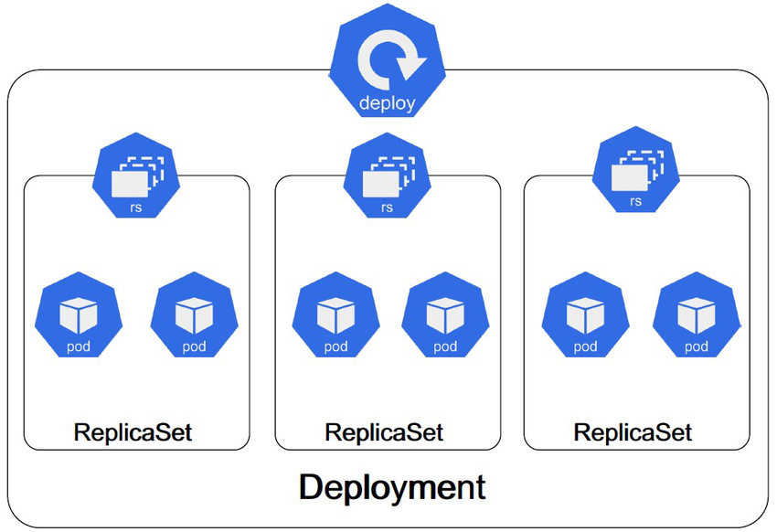
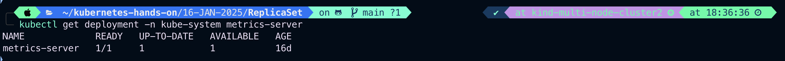

# Deployment & Rollback

**_ReplicationController_** and **_ReplicaSet_** is not able to do **_Updates_** and **_Rollback_** apps in the cluster.

- A deployment object is act as a supervisor for pods, giving you fine graned control over **_how and when a new pod is Rolled out, Updated or Roll Back to previous state_**
- when using deployment object, we first define the state of the app, then **_k8s cluster_** schedule mentioned app instance onto specific individual nodes.
- k8s then monitors, if the node hosting an instance goes down or pod is deleted the **_deployment controller_** replaces it.
- This provide a self healing mechanism to address machine failure or maintenance.
  
- A Deployment provides declarative updates for Pods and ReplicaSets.

## Use Case

- **_Create a Deployment to rollout a ReplicaSet_**. The ReplicaSet creates Pods in the background. Check the status of the rollout to see if it succeeds or not.
- **_Declare the new state of the Pods_** by updating the **_PodTemplateSpec_** of the Deployment. A new ReplicaSet is created and the Deployment manages moving the Pods from the old ReplicaSet to the new one at a controlled rate. Each new ReplicaSet updates the revision of the Deployment.
- **_Rollback to an earlier Deployment revision_** if the current state of the Deployment is not stable. Each rollback updates the revision of the Deployment.
- **_Scale up the Deployment to facilitate more load._**
- **_Pause the rollout of a Deployment_** to apply multiple fixes to its **_PodTemplateSpec_** and then resume it to start a new rollout.
- **_Use the status of the Deployment as an indicator_** that a rollout has stuck.
- **_Clean up older ReplicaSets_** that you don't need anymore.

Resource Recommendation to read.
[Deployment](https://kubernetes.io/docs/reference/kubernetes-api/workload-resources/deployment-v1/)
[Deployment](https://kubernetes.io/docs/concepts/workloads/controllers/deployment/)

- If there is problem in the Deployment, K8s will automatically Roll Back to the previous version, however you can explicitly rollback to specific version, as in our case to Revision1(The original pod version)
- You can rollback to a specific version by specifying it with **_--to-revision_**
  Example:

```
   kubectl rollout undo deployment/mydeployment
   --to-revision=2
```

Note: The name of the ReplicaSet is always formatted as  
[___Deployment-name___]**_-_**[___Random-string___]

```
kubectl get deploy
```

If you have metrics-server installed

```
kubectl get deployment -n kube-system metrics-server
```


