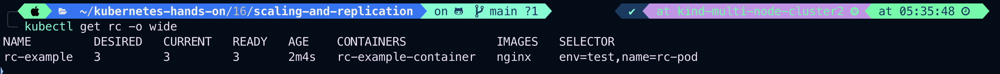

# Scaling and Replication

- Kubernetes was designed to **_Orchestration_** multiple containers and replication.
- Need for multiple containers/replication helps us with these.
- Reliability: By having multiple version of application, you prevent problems if one or more fails.

- Load Balancing: Having multiple versions of containers enables you to send traffic to different instances to prevent overloading on a single instance or node.
- Scaling:
  When load does not becomes too much
  for the number of existing instances, Kubernetes
  enables you to easily scale up
  your application, adding
  extea instances as needed.

- Rolling Updates: Updates to a service
  by replacing pods one by one.

# ReplicationController

- A Replication controller is an object that enables you
  to easily creates multiple pods, then make sure that desired number of pods always exists.
- If a Pod created using RC(Replication controller) will automatically replaced if they does **_crash_**, **_failed_**, or **_terminated_**.
- RC is recommended if you just want to make sure one pod is always running, even after system reboot.
- You can run the **_RC_** with one replica and the RC will make sure that the pod is always running.
- Legacy API for managing workloads that can scale horizontally. Superseded by the Deployment and ReplicaSet APIs.
- A Deployment that configures a ReplicaSet is now the recommended way to set up replication.

Let's create a ReplicationController manifest

```
vim rc_example.yaml
```

```
apiVersion: v1
kind: ReplicationController
metadata:
  name: rc-example
  labels:
    env: test
    class: rc-pods
    name: rc-pods
    tier: frontend
spec:
  replicas: 3
  selector:
    name: rc-pods
  template:
    metadata:
      name: rc-pods
      labels:
        env: test
        tier: frontend
        name: rc-pods
        class: rc-pods
    spec:
      containers:
      - name: rc-example-container
        image: nginx
        command: ["bin/bash", "-c", "while true;, do echo 'Hello Rajeev'; sleep 10; done"]
```

or

```
apiVersion: v1
kind: ReplicationController
metadata:
  name: rc-example
  labels:
    env: test
    name: rc-pod
    class: replication-controller
spec:
  replicas: 3
  selector:
    name: rc-pod
    env: test
  template:
    metadata:
      name: rc-example
      labels:
        name: rc-pod
        env: test
        class: replication-controller
    spec:
      containers:
      - name: rc-example-container
        image: nginx
        command: [ "bin/bash", "-c", "while true; do echo 'Hello Rajeev'; sleep 10; done" ]
        ports:
        - containerPort: 80

```

Explanation:

> kind: ReplicationController
>
> > > this defines to create the object of **_Replication_** type.

> replicas: 3
>
> > > This elements defines the desired number of pods.

> selector:
>
> > > tells the controller which pods to watch/belong to this
> > > RC.

> name: rc-pods
>
> > > This match the labels

> template:
>
> > > Define a template to launch a new pod.

> labels:
>
> > > Selectors values need to match the labels values specified in the pod template

Now let's apply rc_example.yaml

```
kubectl apply -f rc_example.yaml
```

Output:

verify replicas

```
kubectl get rc -o wide
```

or

```
kubectl get rc/rc_example -o wide
```

Output:

list ReplicationController Pods

```
kubectl get pods -o wide
```

Output:

Let's delete pod rc-example-7mmdm and see whether creating another one or not

```
kubectl delete pod rc-example-7mmdm
```

Output:

Now let's check, new replica scheduled or not by ReplicationController object after deleting rc-example-7mmdm pod

```
kubectl get pods -o wide
```

Output:

We can see clearly new replica is running post deleting a pod named rc-example-7mmdm

If you want to delete this ReplicationController use below command

```
kubectl delete rc/rc_example
```

Output:


```
kubectl get pods -o wide
```


Now let's scale up or down the replicas from 3 to 10

```
kubectl scale --replicas=10 rc/rc_example
```

Output:

Verify the replicas

```
kubectl get pods -o wide
```

Output:

Now scale down from 10 to 2 and verify it

```
kubectl scale --replicas=2 rc/rc_example
```

Output:


