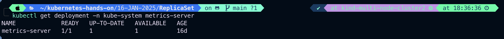
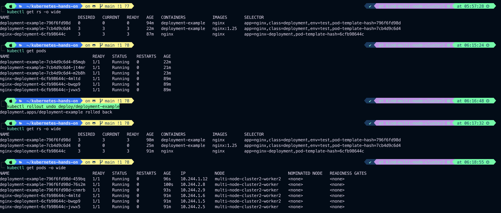
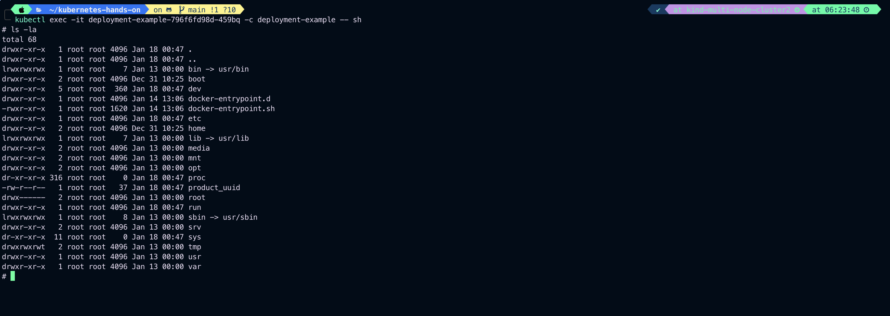

# Deployment & Rollback

**_ReplicationController_** and **_ReplicaSet_** is not able to do **_Updates_** and **_Rollback_** apps in the cluster.

- A deployment object is act as a supervisor for pods, giving you fine graned control over **_how and when a new pod is Rolled out, Updated or Roll Back to previous state_**
- when using deployment object, we first define the state of the app, then **_k8s cluster_** schedule mentioned app instance onto specific individual nodes.
- k8s then monitors, if the node hosting an instance goes down or pod is deleted the **_deployment controller_** replaces it.
- This provide a self healing mechanism to address machine failure or maintenance.
  
- A Deployment provides declarative updates for Pods and ReplicaSets.

## Use Case

- **_Create a Deployment to rollout a ReplicaSet_**. The ReplicaSet creates Pods in the background. Check the status of the rollout to see if it succeeds or not.
- **_Declare the new state of the Pods_** by updating the **_PodTemplateSpec_** of the Deployment. A new ReplicaSet is created and the Deployment manages moving the Pods from the old ReplicaSet to the new one at a controlled rate. Each new ReplicaSet updates the revision of the Deployment.
- **_Rollback to an earlier Deployment revision_** if the current state of the Deployment is not stable. Each rollback updates the revision of the Deployment.
- **_Scale up the Deployment to facilitate more load._**
- **_Pause the rollout of a Deployment_** to apply multiple fixes to its **_PodTemplateSpec_** and then resume it to start a new rollout.
- **_Use the status of the Deployment as an indicator_** that a rollout has stuck.
- **_Clean up older ReplicaSets_** that you don't need anymore.

Resource Recommendation to read.
[Deployment](https://kubernetes.io/docs/reference/kubernetes-api/workload-resources/deployment-v1/)
[Deployment](https://kubernetes.io/docs/concepts/workloads/controllers/deployment/)

- If there is problem in the Deployment, K8s will automatically Roll Back to the previous version, however you can explicitly rollback to specific version, as in our case to Revision1(The original pod version)
- You can rollback to a specific version by specifying it with **_--to-revision_**
  Example:

```
   kubectl rollout undo deployment/mydeployment
   --to-revision=2
```

Note: The name of the ReplicaSet is always formatted as  
[___Deployment-name___]**_-_**[___Random-string___]

```
kubectl get deploy
```

If you have metrics-server installed

```
kubectl get deployment -n kube-system metrics-server
```



#

### Creating Deployment

The following is an example of a Deployment. It creates a ReplicaSet to bring up three nginx Pods:

```
vim deployment_example.yaml
```

```
apiVersion: apps/v1
kind: Deployment
metadata:
  name: deployment-example
  labels:
    env: test
    class: deployment
    tier: frontend
    app: nginx
spec:
  replicas: 2
  selector:
    matchLabels:
      env: test
      class: deployment
      app: nginx
  template:
    metadata:
      name: deployment-example
      labels:
        env: test
        class: deployment
        tier: frontend
        app: nginx
    spec:
      containers:
      - name: deployment-example
        image: nginx
        command: ["/bin/bash", "-c", "while true; do echo 'Hello Rajeev'; sleep 20; done]
        ports:
        - containerPort: 80
```

Creat/Apply deployment-example.yaml

```
kubectl apply -f deployment_example.yaml
```

Output:


List Deployment/deploy

```
kubectl get deploy
```

Output:


#

We can create deployment through Imperative way

1. Create a deployment named nginx-deployment with the Nginx

```
kubectl create deploy nginx-deployment --image=nginx --replicas=3
```

Output:


### Generate deployment yaml file and save as nginx-deployment1.yaml

```
kubectl create deploy nginx-deployment --image=nginx --replicas=3 --dry-run=client -o yaml > nginx-deployment1.yaml
```

Output:


#

### Exposing a Deployment

After creating the deployment, expose it as a service if you want it accessible:

```
kubectl expose deploy/nginx-deployment --type=LoadBalancer --port=80
```

Output:


List all services

```
kubectl get svc
```

Output:


Describe nginx-deployment to see all details

```
kubectl describe deploy/nginx-deployment
```

Output:

To check what is running inside container

```
kubectl logs <pod-name>
```

```
kubectl logs deployment-example-796f6fd98d-bqm57
```

Output:


To scale Up or Down

```
kubectl get rs
```

```
kubectl scale rs/deployment-example-796f6fd98d --replicas=5 deployment/deployment-example
```

```
kubectl scale --replicas=3 deploy/deployment-example
```

```
kubectl get deploy -o wide

kubectl get rs -o wide
```

Output:


#

### To check status of Roll out

```
kubectl rollout status deploy/deploy-example
```

Output:


### To check the history of rollout

```
kubectl rollout history deploy/deployment-example
```

Output:


### To move back to previous verson

```
kubectl rollout undo deploy/deployment-example
```

Output:


### To update the image of a deployment imperatively in Kubernetes, use the kubectl set image command.

To check container name

```
kubectl describe deploy/deployment-example
```


```
kubectl set image deploy/deploy-example <container-name>=<new-image>
```

```
kubectl set image deploy/deployment-example deployment-example=nginx:1.25
```

Output:


### Verify


```
kubectl rollout history deploy/deployment-example
```

Output:


To rollback

```
kubectl rollout undo deploy/deployment-example
```

Output:


Now check rollout history

```
kubectl rollout history deploy/deployment-example
```

Output:


To get into the container for do changes

```
kubectl exec -it <deploy/podname> -c <container-name> -- sh
```

```
kubectl exec -it deployment-example-796f6fd98d-459bq -c deployment-example -- sh
```

Output:



#

# Failed Deployment

Your deployment may get stuck trying to deploy it's
newest ReplicsSet without ever completing. This can occur due to some of the following factors.

1. Insufficient Quota
2. Rediness Probes Failure
3. Image Pull Error
4. Insufficient Permission
5. Limit Ranges
6. Application Runtime misconfiguration
