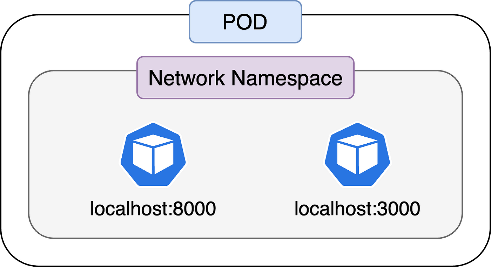
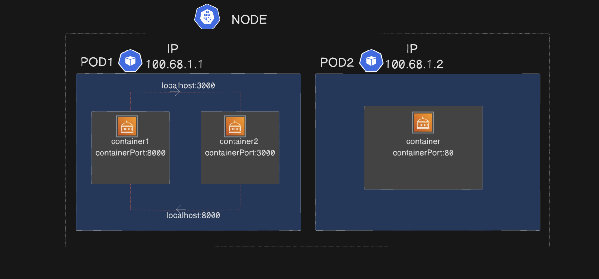
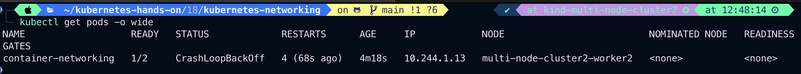
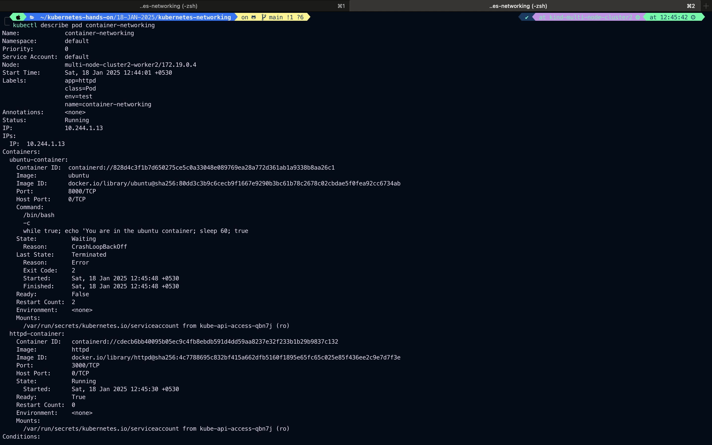
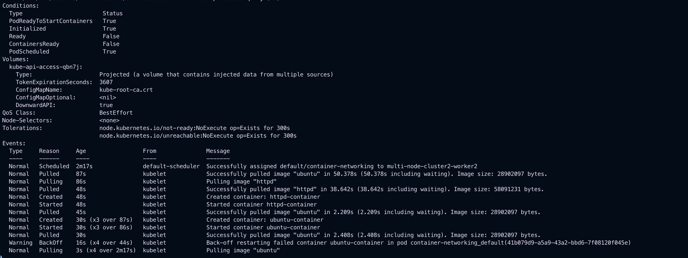
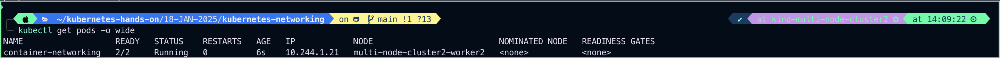
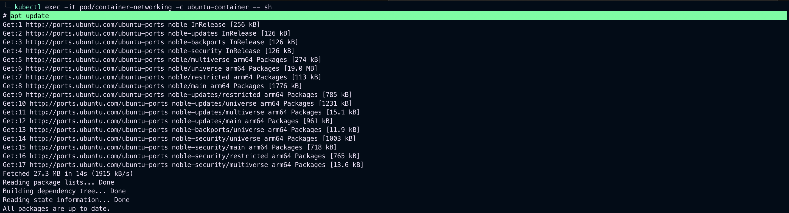
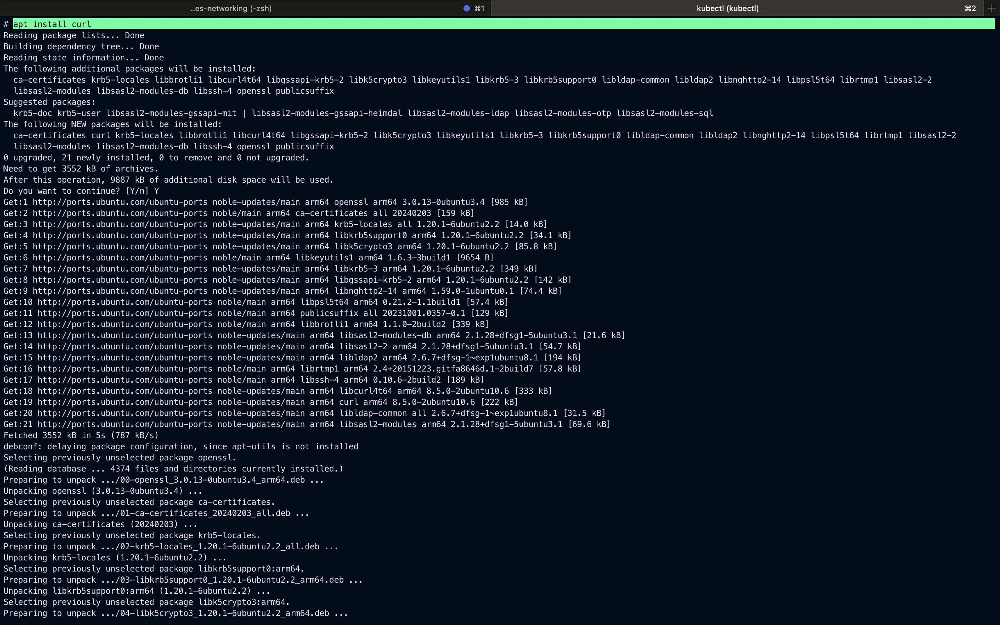

# Kubernetes Networking, services, NodePort and Volumes

Kubenetes Networking addresses four concerns

1. Container within Pod use networking to communicate via loopback.
   
   
2. Cluster networking provides communication between different Pods.
3. The service resources lets you expose an application runnint on a Pod to be reachable from outside your cluster.
4. You can also use services to publish services only for consumption inside your cluster container to container communication on same pod happen through localhost within the container.

#

#### Container within Pod use networking to communicate via loopback.

Example:

```
vim container-networking.yaml
```

```
apiVersion: v1
kind: Pod
metadata:
  name: container-networking
  labels:
    name: container-networking
    class: Pod
    env: test
    app: httpd
spec:
  containers:
  - name: ubuntu-container
    image: ubuntu
    command: ["/bin/bash", "-c", 'while true; echo 'You are in the ubuntu container; sleep 60; true']
    ports:
    - containerPort: 8000
  - name: httpd-container
    image: httpd
    ports:
    - containerPort: 3000
```

Output:


### Lets exec into ubuntu container and try acces httpd container

```
kubectl get pods -o wide
```

Output:


## The CrashLoopBackOff status indicates that one of the containers in your pod is repeatedly failing to start or run properly. Let’s diagnose and resolve the issue.

### Steps:

1. Describe the Pod

```
kubectl describe pod/container-networking
```

Output:



2. Check Pod Logs
   Since you have two containers (ubuntu-container and httpd-container), check the logs of the failing container. Identify which container is crashing.

```
kubectl logs pod/container-networking -c ubuntu-container
```


or

```
kubectl logs pod/container-networking -c httpd-container
```

From step 1 we can see clearly our ubuntu container we are getting **_CrashLoopBackOff_** error

```
kubectl logs pod/container-networking -c ubuntu-container
```


Now we got the issue cause in command field in ubuntu-container

## error-

**_/bin/bash: -c: line 1: unexpected EOF while looking for matching `''_**

Replace

```
command: ["/bin/bash", "-c", "while true; do echo 'You are in the ubuntu container'; sleep 60; done"]

```

to

```
args: ["-c", "while true; do echo 'You are in the ubuntu container'; sleep 60; done"]

```

### Port Conflict:

- Both containers use ports (8000 and 3000). Ensure these ports are not conflicting or being used by other applications.

### Image Issues:

- Check if the specified images (ubuntu and httpd) are valid and accessible from your Kubernetes nodes.

### Resources

Insufficient CPU or memory might cause container crashes. Add resource requests and limits:

```
resources:
  requests:
    memory: "64Mi"
    cpu: "250m"
  limits:
     memory: "128Mi"
     cpu: "500m"
```

```
vim container-networking.yaml
```

```
apiVersion: v1
kind: Pod
metadata:
  name: container-networking
  labels:
    name: container-networking
    class: Pod
    env: test
    app: httpd
spec:
  containers:
  - name: ubuntu-container
    image: ubuntu
    command: ["/bin/bash", "-c", "while true; do echo 'You are in the nginx container'; sleep 20; done"]
    ports:
    - containerPort: 8000
  - name: httpd-container
    image: httpd
    ports:
    - containerPort: 80
```

# Update YAML and Reapply

```
kubectl delete pod/container-networking
kubectl apply -f multi-container-networking.yaml
```


```
kubectl get pods -o wide
```



# exec into ubuntu-container and acess httpd-container

```
kubectl exec -it pod/container-networking -c ubuntu-container -- sh
```

```
apt update
apt install curl
curl localhost:80
exit
```

Output:



