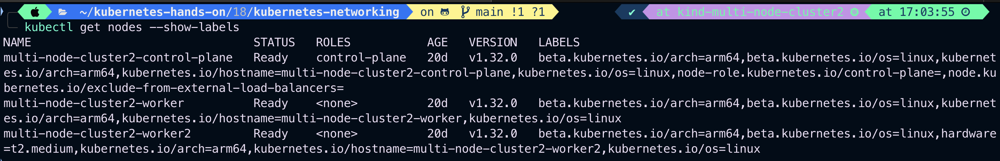
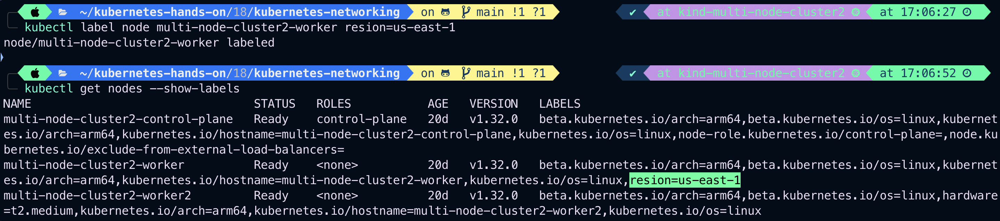
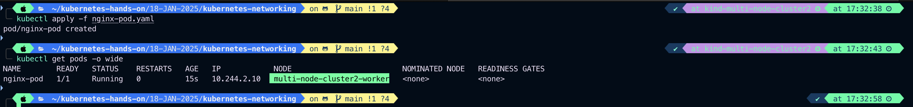
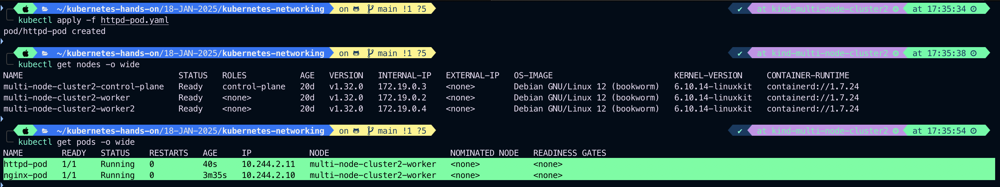
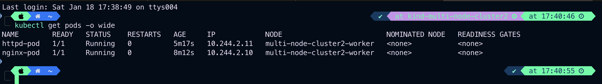
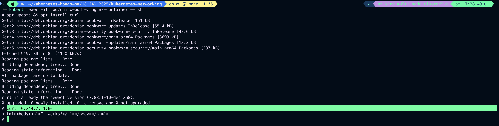

# Kubernetes Networking, services, NodePort and Volumes

Kubenetes Networking addresses four concerns

1. Container within Pod use networking to communicate via loopback.
   
   
2. Cluster networking provides communication between different Pods.
3. The service resources lets you expose an application runnint on a Pod to be reachable from outside your cluster.
4. You can also use services to publish services only for consumption inside your cluster container to container communication on same pod happen through localhost within the container.

#

#### Container within Pod use networking to communicate via loopback.

Example:

```
vim container-networking.yaml
```

```
apiVersion: v1
kind: Pod
metadata:
  name: container-networking
  labels:
    name: container-networking
    class: Pod
    env: test
    app: httpd
spec:
  containers:
  - name: ubuntu-container
    image: ubuntu
    command: ["/bin/bash", "-c", 'while true; echo 'You are in the ubuntu container; sleep 60; true']
    ports:
    - containerPort: 8000
  - name: httpd-container
    image: httpd
    ports:
    - containerPort: 3000
```

Output:


### Lets exec into ubuntu container and try acces httpd container

```
kubectl get pods -o wide
```

Output:


## The CrashLoopBackOff status indicates that one of the containers in your pod is repeatedly failing to start or run properly. Let’s diagnose and resolve the issue.

### Steps:

1. Describe the Pod

```
kubectl describe pod/container-networking
```

Output:


2. Check Pod Logs
   Since you have two containers (ubuntu-container and httpd-container), check the logs of the failing container. Identify which container is crashing.

```
kubectl logs pod/container-networking -c ubuntu-container
```


or

```
kubectl logs pod/container-networking -c httpd-container
```

From step 1 we can see clearly our ubuntu container we are getting **_CrashLoopBackOff_** error

```
kubectl logs pod/container-networking -c ubuntu-container
```


Now we got the issue cause in command field in ubuntu-container

## error-

**_/bin/bash: -c: line 1: unexpected EOF while looking for matching `''_**

Replace

```
command: ["/bin/bash", "-c", "while true; do echo 'You are in the ubuntu container'; sleep 60; done"]

```

to

```
args: ["-c", "while true; do echo 'You are in the ubuntu container'; sleep 60; done"]

```

### Port Conflict:

- Both containers use ports (8000 and 3000). Ensure these ports are not conflicting or being used by other applications.

### Image Issues:

- Check if the specified images (ubuntu and httpd) are valid and accessible from your Kubernetes nodes.

### Resources

Insufficient CPU or memory might cause container crashes. Add resource requests and limits:

```
resources:
  requests:
    memory: "64Mi"
    cpu: "250m"
  limits:
     memory: "128Mi"
     cpu: "500m"
```

```
vim container-networking.yaml
```

```
apiVersion: v1
kind: Pod
metadata:
  name: container-networking
  labels:
    name: container-networking
    class: Pod
    env: test
    app: httpd
spec:
  containers:
  - name: ubuntu-container
    image: ubuntu
    command: ["/bin/bash", "-c", "while true; do echo 'You are in the nginx container'; sleep 20; done"]
    ports:
    - containerPort: 8000
  - name: httpd-container
    image: httpd
    ports:
    - containerPort: 80
```

# Update YAML and Reapply

```
kubectl delete pod/container-networking
kubectl apply -f multi-container-networking.yaml
```


```
kubectl get pods -o wide
```


# exec into ubuntu-container and acess httpd-container

```
kubectl exec -it pod/container-networking -c ubuntu-container -- sh
```

```
apt update
apt install curl
curl localhost:80
exit
```

Output:


#

# Now try to establish connection between two different Pods within the same machine

In Kubernetes, each Pod has an IP address. A Pod can communicate with another Pod by directly addressing its IP address, but the recommended way is to use Services.
A Service is a set of Pods, which can be reached by a single, fixed DNS name or IP address.

- Pod to Pod communication on same worker node happens through **_Pod IP_**
- By default Pod IP is not accessible outside the node.

Example:

### Create two pods on the same node

```
kubectl get nodes -o wide
```



### Label resion=us-east-1 on multi-node-cluster2-worker

```
kubectl label node multi-node-cluster2-worker resion=us-east-1
```



### Create first pod file named- nginx-pod.yaml, should schedule on multi-node-cluster2-worker node, Here we will use nodeSelector to schedule this pod on multi-node-cluster2-worker

```
vim nginx-pod.yaml
```

```
apiVersion: v1
kind: Pod
metadata:
  name: nginx-pod
  labels:
    env: test
    class: pod
spec:
  containers:
  - name: nginx-container
    image: nginx
    ports:
    - containerPort: 8080
  nodeSelector:
    resion: us-east-1
```

### Create second pod file named httpd-pod.yaml, should schedule on multi-node-cluster2-worker, here we will use Node Affinity to schedule this pod on multi-node-cluster2-worker

```
vim httpd-pod.yaml
```

```
apiVersion: v1
kind: Pod
metadata:
  name: httpd-pod
  labels:
    env: test
    class: pod
spec:
  affinity:
    nodeAffinity:
      requiredDuringSchedulingIgnoredDuringExecution:
        nodeSelectorTerms:
        - matchExpressions:
          - key: resion
            operator: In
            values:
            - us-east-1
  containers:
  - name: httpd-container
    image: httpd
    ports:
    - containerPort: 80
```

### Apply nginx-pod.yaml and httpd-pod.yaml

```
kubectl apply -f nginx-pod.yaml
```



```
kubectl apply -f httpd-pod.yaml
```



#

## Lets get inside nginx-pod and try to access httpd-pod

First check the IP address of the nginx-pod and httpd-po

```
kubectl get pods -o wide
```



### For nginx-pod

```
kubectl exec -it pod/nginx-pod -c nginx-container -- sh
```

inside the nginx-container

```
apt update && apt install curl
curl 10.244.2.11:80
```

Output:


### For httpd-pod

```
kubectl exec -it pod/httpd-pod -c httpd-container -- sh

```

Inside the httpd-container

```
apt update && apt install curl
curl 10.244.2.13:80
```

Output:

