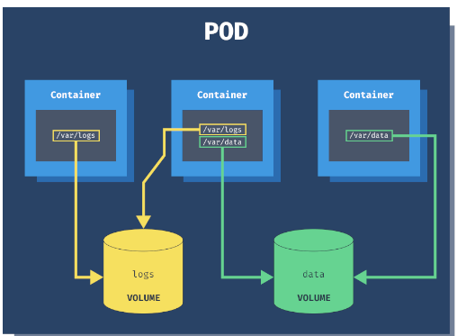
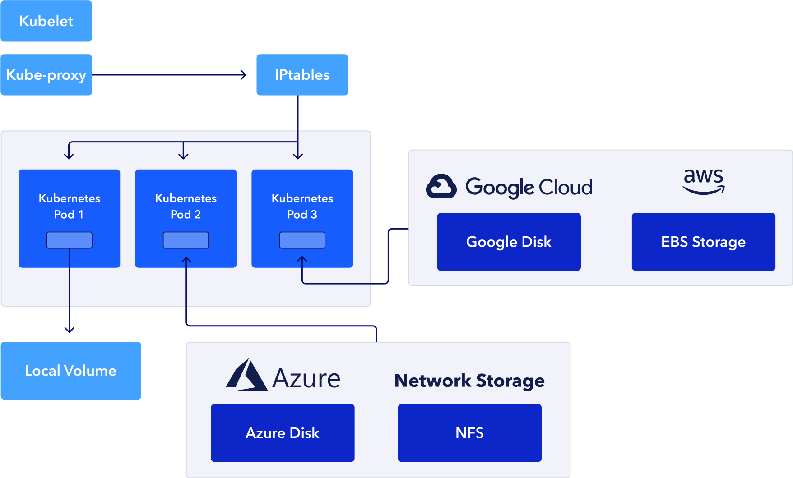
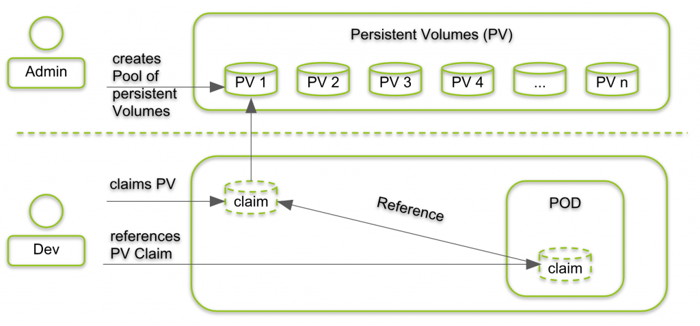

# Volume

- containers are short lived in nature
- All data stored inside a container is deleted if the container crashes. However the **kubelete** will restart it with new state, which means that it will not have any old data.
- To overcome this problem, Kubernetes uses **_Volumes_**. A volume is essentially a **directory** backed by a storage medium. The storage medium and it's content are determined by the Volume type.
- In k8s a volume is attached to a Pod and shared among the containers of that Pod.
- The volume has the same life span as the Pod, and it **outlives** the containers of the Pod. This allows data to be preserved across container restart.

#

# Volume Types

- A volume type decide the property of the directory, like size, content, etc.
- **node-local** type such as **emptydir** and **hostpath**
- File sharing types such as **nfs**.
- Cloud provers specific types like **awselasticblockstore(AWS-EBS)**, **azuredisk**
- distributed file system type, for example **glusterfs** **cephfs**
- Special purpose like **secret** **gitrepo**

#

# emptydir

- Uses this when we want to share contents between multiple containers on the same Pod & not to the host machin.
- An **emptydir volume** is first created when a Pod is assign to a node, and exist as long as the pod is running on that node.
- As the name says, It is initially empty.
- Containers in the Pod can all **read and write** the same files in the **emptydir Volume** though that volume can be mounted at the same or different paths in each container.
- When a Pod is removed from a node for any reason, the data in the **emptydir** is deleted forever.
- A container crashing does not remove a Pod from a node, so the data in an **emptydir** is safe across container crashes.
-
