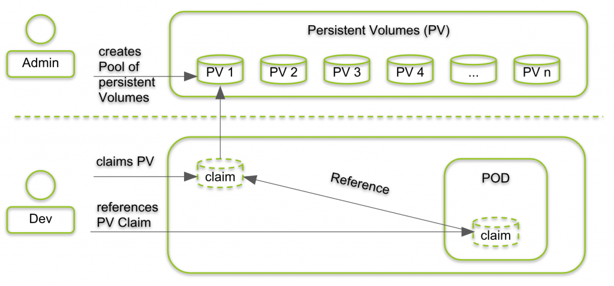
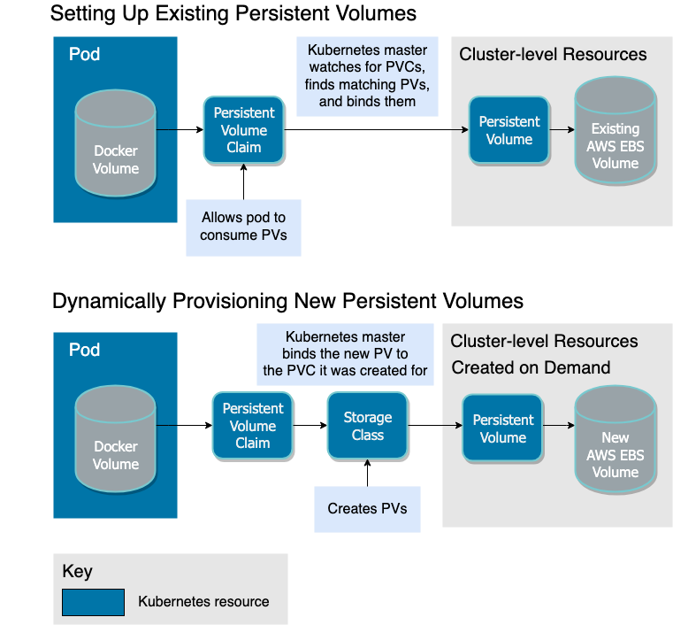
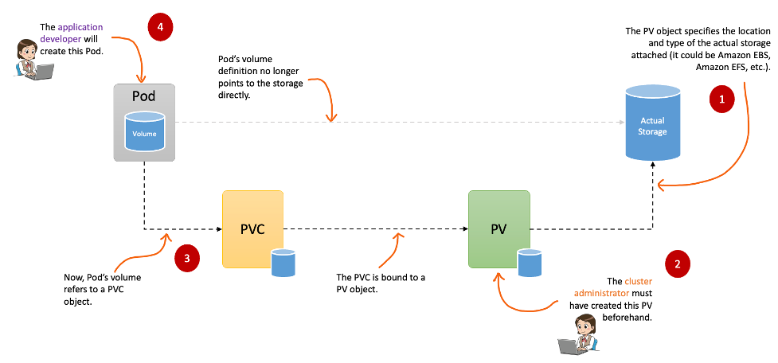

# Persistent Volume

- In a typical IT environment, storage is managed by the storage/system administrator. The end user will just get instructions to use the storage, but does not have to worry about the underlying storage management.
- In the **Containerized** world, we would like to follow similar rules, but it becomes chalanging, given the many volume types we have seen earlier. Kubernetes resolves this problem with the **Persisten Volume (PV)** subsystem.
- A persisten volume is a cluster wide resource that you can use to store data in a way that persist beyond the lifetime of a Pod.
- The PersistenVolume is not backed by localy attach storage on a worker node but by **networked storage system** such as **_EBS or NFS_ or a distributed file system like Ceph**.
- Kubernetes provides APIs for user and administrator to manage and consume storage. To manage the Volume, It uses the **Persistent Volume API resource type** and to consume it uses **Persistent Volume Claim API resource type**
  
  
  
