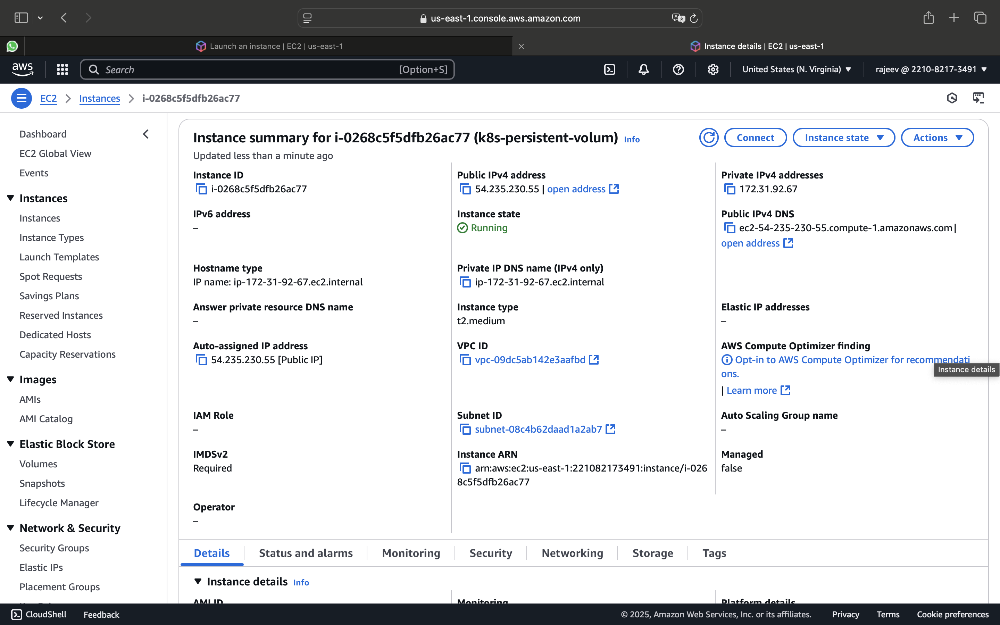
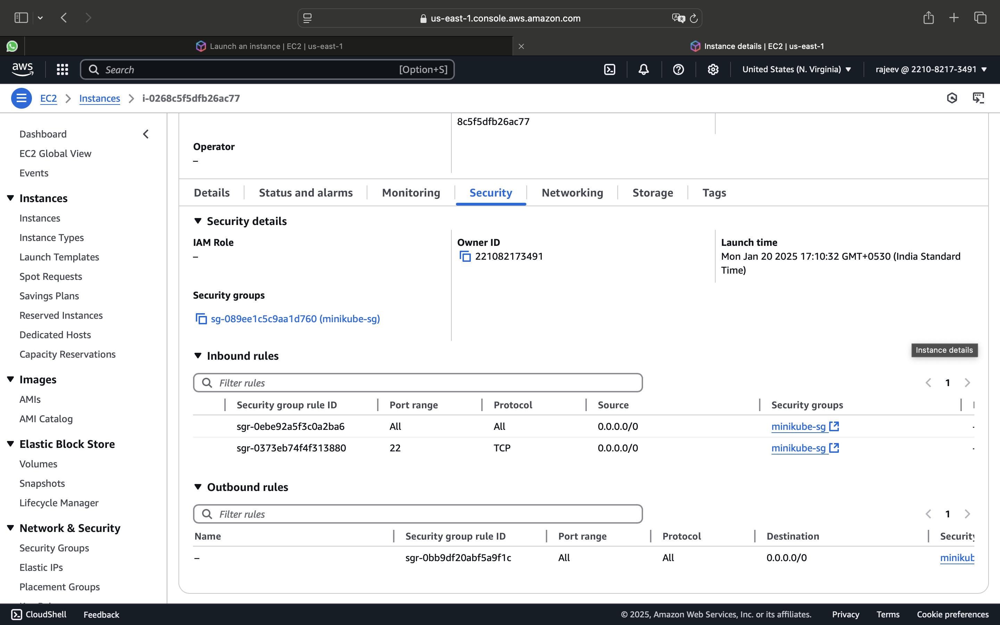
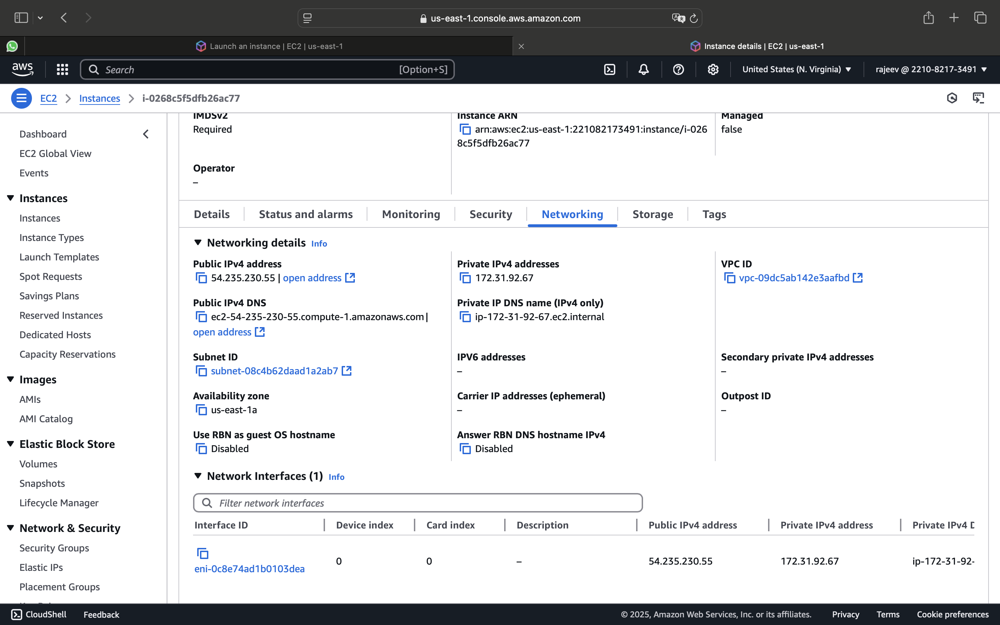
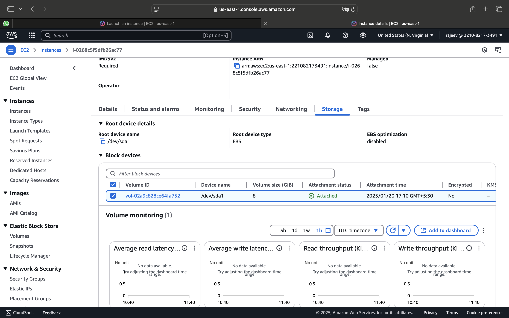
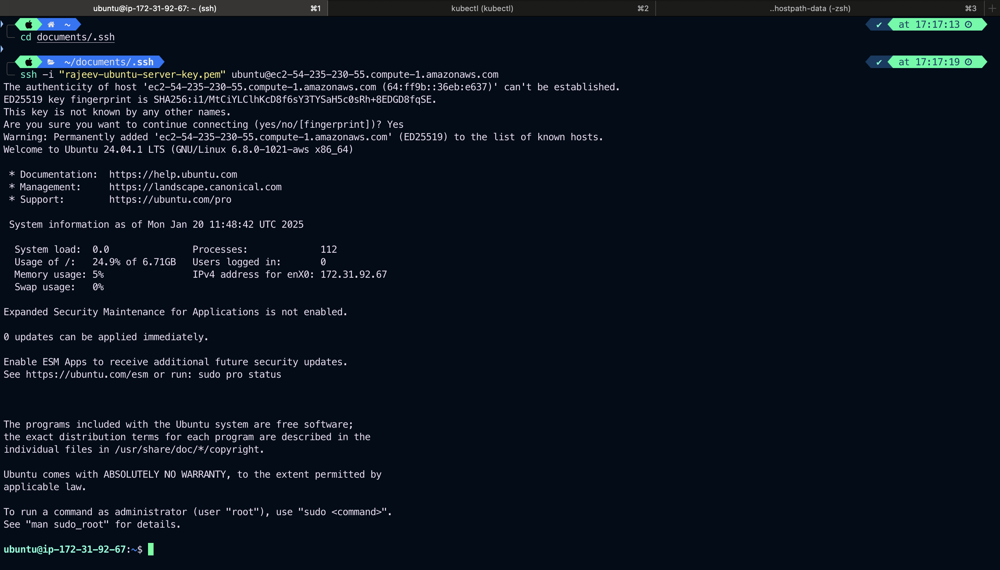

# PersistentVolume(PV) and PersistentVolumeClaim(PVC)

- In a typical IT environment, storage is managed by the storage/system administrator. The end user will just get instructions to use the storage, but does not have to worry about the underlying storage management.
- In the <font style="color: yellow">**Containerized**</font> world, we would like to follow similar rules, but it becomes chalanging, given the many volume types we have seen earlier. Kubernetes resolves this problem with the **Persisten Volume (PV)** subsystem.
- A persisten volume is a cluster wide resource that you can use to store data in a way that persist beyond the lifetime of a Pod.
- The PersistenVolume is not backed by localy attach storage on a worker node but by **networked storage system** such as **_EBS or NFS_ or a distributed file system like Ceph**.
- Kubernetes provides APIs for user and administrator to manage and consume storage. To manage the Volume, It uses the **Persistent Volume API resource type** and to consume it uses **Persistent Volume Claim API resource type**
  
  
  

#

# PersistentVolumeClaim

- In order to use a **PV(Persistent Volume**) you need to **claim** it first, using a **Prsistent Volume Clame(PVC)**.
- The **PVC(Persistent Volume Claim)** request a **<font  style="color: yellow">Persistent Volume(PV)</font>** with your desired specification (**size, access modes, speed etc**) from Kubernetes and once a suitable Persistent Volume is found, it is bound to a <span style="color: yellow"> **PersistentVolumeClaim** </span>
- After a successful bound to a Pod, you can mount it as a volume.
- Once a user finishes it's works, the attached <font style="color: yellow">PersistentVolume</font> can be released. The underlying PV can there be reclaimed and recycled for the future usage.

# <span style="color: green"> AWS EBS </span>

An AWS EBS volume mounts on AWS EBS volume into your Pod. Unlike <span style="color: yellow"> emptydir </span>, which is erased when a Pod is removed, the contents of an <span style="color: yellow"> AWS EBS Volume</span> are preserved and the volume us marely unmounted.

# <span style="color: red"> Restrictions </span>

- The node on which Pod are running must be <span style="color: yellow"> AWS EC2 instance </span>
- Those instances need to be in the <span style="color: yellow"> same reagion and availability zone as the EBS volume</span>
- <span style="color: yellow"> EBS</span> only support a single EC2 instance mounting a volume.

Example

### Creat an AWS instance with ubuntu , t2.medium, allow all traffic in security group, select az us-east-1 , region us-east-1a






### SSH to terminal



### Install Docker

```
sudo apt update && apt -y install docker.io
```

or

1. Install Required Dependencies

```

sudo apt install -y apt-transport-https ca-certificates curl software-properties-common

```

2.Add Docker’s Official GPG Key and Repository:

```
curl -fsSL https://download.docker.com/linux/ubuntu/gpg | sudo gpg --dearmor -o /usr/share/keyrings/docker-archive-keyring.gpg
echo "deb [arch=amd64 signed-by=/usr/share/keyrings/docker-archive-keyring.gpg] https://download.docker.com/linux/ubuntu $(lsb_release -cs) stable" | sudo tee /etc/apt/sources.list.d/docker.list > /dev/null

```

3. Install Docker:

```
sudo apt update
sudo apt install -y docker-ce docker-ce-cli containerd.io

```

4. Enable and Start Docker

```
sudo systemctl enable docker
sudo systemctl start docker

```

### Install kubectl

1. Download the Latest Binary

```
curl -LO "https://dl.k8s.io/release/$(curl -L -s https://dl.k8s.io/release/stable.txt)/bin/linux/amd64/kubectl"

```

```
https://docs.aws.amazon.com/eks/latest/userguide/install-kubectl.html
```

### Install minikube

Open in browser

```
https://dev.to/dm8ry/how-to-install-minikube-on-ubuntu-2404-2gdj
```

### Start Minikube

```
apt install conntrack
```

```
minikube start --vm-driver=none
```

```
minikube status
```

### Verify Resources on EC2 Instance

Verify Resources on EC2 Instance
Ensure your EC2 instance has sufficient resources to run a multi-node cluster. Minimum requirements for Kind:

CPU: At least 2 vCPUs
Memory: At least 4 GB of RAM
Disk Space: At least 20 GB of free disk space

### Create multinode cluster

```
vim multinode.yaml
```

```
apiVersion: kind.x-k8s.io/v1alpha4
kind: Cluster
name: multinode
nodes:
  - role: control-plane
    image: kindest/node:v1.16.3 # Replace with the desired Kubernetes version
    extraPortMappings:
      - containerPort: 80    # Map port 80 on the host to port 80 in the cluster
        hostPort: 8080
        protocol: TCP
      - containerPort: 443   # Map port 443 on the host to port 443 in the cluster
        hostPort: 8443
        protocol: TCP
  - role: worker
    image: kindest/node:v1.16.3 # Same Kubernetes version as control-plane
  - role: worker
    image: kindest/node:v1.16.3
networking:
  apiServerAddress: "0.0.0.0" # Expose API server on all interfaces
  apiServerPort: 6443         # Port for the API server
```

```
kind create cluster --config multinode.yaml
```

### PERSISTENT VOLUME

```
vim mypv.yaml
```

```
apiVersion: v1
kind: PersistentVolume
metadata:
  name: myebsvol
spec:
  capacity:
    storage: 1Gi
  accessModes:
    - ReadWriteOnce
  persistentVolumeReclaimPolicy: Recycle
  awsElasticBlockStore:
    volumeID:           # YAHAN APNI EBS VOLUME ID DAALO
    fsType: ext4
```

### PersistentVolumeClaim

```
vim mypvc.yaml
```

```
apiVersion: v1
kind: PersistentVolumeClaim
metadata:
  name: myebsvolclaim
spec:
  accessModes:
    - ReadWriteOnce
  resources:
    requests:
      storage: 1Gi
```

### Deployment

```
vim deploypvc.yaml
```

```
apiVersion: apps/v1
kind: Deployment
metadata:
  name: pvdeploy
spec:
  replicas: 1
  selector:      # tells the controller which pods to watch/belong to
    matchLabels:
     app: mypv
  template:
    metadata:
      labels:
        app: mypv
    spec:
      containers:
      - name: shell
        image: centos
        command: ["bin/bash", "-c", "sleep 10000"]
        volumeMounts:
        - name: mypd
          mountPath: "/tmp/persistent"
      volumes:
      - name: mypd
          persistentVolumeClaim:
            claimName: myebsvolclaim
```
