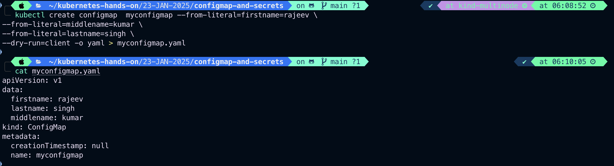
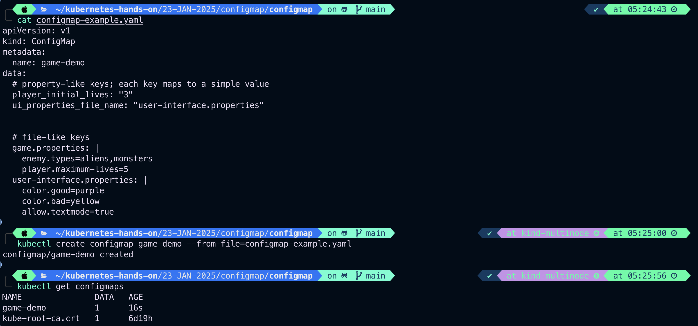
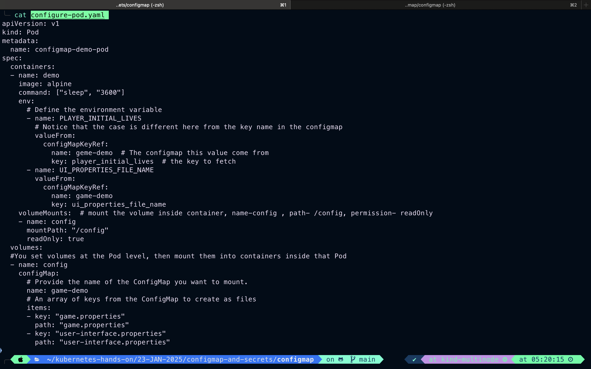
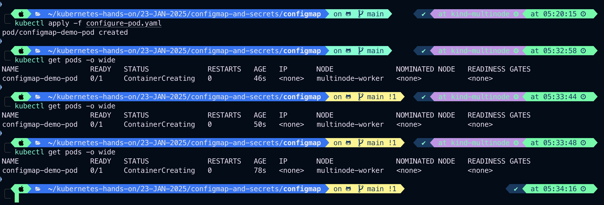

# Configmap and Secrets

- While performing application deployments on k8s cluster, sometime we need to change the application configuration file depending on environment like dev, QA, stage or prod.
- Changing this application configuration file means we need to change source code, commit the change, creating a new image and then go through the complete deployment process.
- Hence these configuration should be decoupled from image content in order to keep containerised application portable.
- This is where Kubernetes configmap comes into the picture. It allows us to handle configuration files much more efficiently.
- Configmap is useful for storing and sharing, non-sensitive, unencrypted configuration information use Secrets otherwise.
- Configmap can be used to store fine-graned information like individual properties or entire configfiles.
- Configmap are not intended to act as a replacement for a properties file.
- Configmap can be accessed in following ways:
  - As <span style="color:yellow">environment variable</span>
  - As <span style="color:yellow">volume</span> in the Pod
  - As <span style="color:yellow">command-line arguments</span>
- A ConfigMap allows you to decouple environment-specific configuration from your container images, so that your applications are easily portable.

## Caution:

ConfigMap does not provide secrecy or encryption. If the data you want to store are confidential, use a Secret rather than a ConfigMap, or use additional (third party) tools to keep your data private.

## Secrets

<span style="color:yellow">Stores sensitive information, such as password, auth tokens and ssh keys.</span>

## Note:

A ConfigMap is not designed to hold large chunks of data. <span style="color:yellow">The data stored in a ConfigMap cannot exceed 1 MiB</span>. If you need to store settings that are larger than this limit, you may want to consider mounting a volume or use a separate database or file service.

#

```
kubectl create configmap <map-name> <data-source>
```

```
kubectl create configmap <map-name> --from-file=<file-to-read>
```

```
kubectl create configmap  myconfigmap --from-literal=firstname=rajeev \
--from-literal=middlename=kumar \
--from-literal=lastname=singh \
--dry-run=client -o yaml > myconfigmap.yaml
```



#

# ConfigMaps and Pods

You can write a Pod spec that refers to a <span style="color:yellow">ConfigMap</span> and configures the container(s) in that Pod based on the data in the ConfigMap. The Pod and the ConfigMap must be in the same namespace.

- <span style="color:yellow">**namespace**</span>: An abstraction used by Kubernetes to support isolation of group of resources within a single cluster.

## Note:

The spec of a<span style="color:yellow"> **static Pod** </span>cannot refer to a ConfigMap or any other API objects.

- <span style="color:yellow">**static Pod**</span>: A Pod managed directly by the **kubelet daemon** on a specific node.

### Here's an example ConfigMap that has some keys with single values, and other keys where the value looks like a fragment of a configuration format.

```
vim configmap-example.yaml
```

```
apiVersion: v1
kind: ConfigMap
metadata:
  name: game-demo
data:
  # property-like keys; each key maps to a simple value
  player_initial_lives: "3"
  ui_properties_file_name: "user-interface.properties"


  # file-like keys each keys map to multiple values
  game.properties: |
    enemy.types=aliens,monsters
    player.maximum-lives=5
  user-interface.properties: |
    color.good=purple
    color.bad=yellow
    allow.textmode=true
```

```
kubectl create configmap game-demo --from-file=configmap-example.yaml
```

```
kubectl get configmaps
```



## There are four different ways that you can use a ConfigMap to configure a container inside a Pod:

- Inside a container command and args
- Environment variables for a container
- Add a file in read-only volume, for the application to read
- Write code to run inside the Pod that uses the Kubernetes API to read a ConfigMap

### These different methods lend themselves to different ways of modeling the data being consumed. For the first three methods, the kubelet uses the data from the ConfigMap when it launches container(s) for a Pod.

### The fourth method means you have to write code to read the ConfigMap and its data. However, because you're using the Kubernetes API directly, your application can subscribe to get updates whenever the ConfigMap changes, and react when that happens. By accessing the Kubernetes API directly, this technique also lets you access a ConfigMap in a different namespace.

### Example: Here's an example Pod that uses values from game-demo to configure a Pod:

```
vim configure-pod.yaml
```

```
apiVersion: v1
kind: Pod
metadata:
  name: configmap-demo-pod
spec:
  containers:
  - name: demo
    image: alpine
    command: ["sleep", "3600"]
    env:
      # Define the environment variable
      - name: PLAYER_INITIAL_LIVES
        # Notice that the case is different here from the key name in the configmap
        valueFrom:
          configMapKeyRef:
            name: geme-demo  # The configmap this value come from
            key: player_initial_lives  # the key to fetch
      - name: UI_PROPERTIES_FILE_NAME
        valueFrom:
          configMapKeyRef:
            name: game-demo
            key: ui_properties_file_name
    volumeMounts:  # mount the volume inside container, name-config , path- /config, permission- readOnly
    - name: config
      mountPath: "/config"
      readOnly: true
  volumes:
  #You set volumes at the Pod level, then mount them into containers inside that Pod
  - name: config
    configMap:
      # Provide the name of the ConfigMap you want to mount.
      name: game-demo
      # An array of keys from the ConfigMap to create as files
      items:
      - key: "game.properties"
        path: "game.properties"
      - key: "user-interface.properties"
        path: "user-interface.properties"
```

```
cat configure-pod.yaml
```



### Apply and List the Pod

```
kubectl apply -f configure-pod.yaml
```

```
kubectl get pods -o wide
```



For this example, defining a volume and mounting it inside the **demo** container as<span style="color:yellow">**/config**</span> creates two files,<span style="color:yellow">**/config/game.properties**</span> and <span style="color:yellow">**/config/user-interface.properties**</span>, even though there are four keys in the ConfigMap. This is because the Pod definition specifies an items array in the volumes section. If you omit the <span style="color:yellow">**items**</span> array entirely, every key in the ConfigMap becomes a file with the same name as the key, and you get 4 files.

#

# Using ConfigMaps

- ConfigMaps can be mounted as data volumes. ConfigMaps can also be used by other parts of the system, without being directly exposed to the Pod. For example, ConfigMaps can hold data that other parts of the system should use for configuration.

## The most common way to use ConfigMaps

- configure settings for containers running in a Pod in the same namespace.
- You can also use a ConfigMap separately.

### For example, you might encounter addons or operators that adjust their behavior based on a ConfigMap.

- <span style="color:yellow">**addons**</span>: Resources that extend the functionality of k8s.
- <span style="color:yellow">**operators**</span>: A specialized controller used to manage a custom resource.

## Using ConfigMaps as files from a Pod

### To consume a ConfigMap in a volume in a Pod:

1. Create a ConfigMap or use an existing one. Multiple Pods can reference the same ConfigMap.
2. Modify your Pod definition to add a volume under .spec.volumes[]. Name the volume anything, and have a .spec.volumes[].configMap.name field set to reference your ConfigMap object.
3. Add a <font style="color: yellow">**.spec.containers[].volumeMounts[]**</font> to each container that needs the ConfigMap. Specify <font style="color: yellow">**.spec.containers[].volumeMounts[].readOnly = true**</font> and╰─ <font style="color: yellow">**.spec.containers[].volumeMounts[].mountPath**</font> to an unused directory name where you would like the ConfigMap to appear.
4. Modify your image or command line so that the program looks for files in that directory. Each key in the ConfigMap **data** map becomes the filename under **mountPath**.

### Example: This is an example of a Pod that mounts a ConfigMap in a volume:

```
apiVersion: v1
kind: Pod
metadata:
  name: mypod
spec:
  containers:
  - name: mypod
    image: redis
    volumeMounts:
    - name: foo
      mountPath: "/etc/foo"
      readOnly: true
  volumes:
  - name: foo
    configMap:
      name: myconfigmap
```

- Each ConfigMap you want to use needs to be referred to in .spec.volumes.
- If there are multiple containers in the Pod, then each container needs its own volumeMounts block, but only one .spec.volumes is needed per ConfigMap.

#

# Mounted ConfigMaps are updated automatically

- When a ConfigMap currently consumed in a volume is updated, projected keys are eventually updated as well.
- The kubelet checks whether the mounted ConfigMap is fresh on every periodic sync.
- However, the kubelet uses its local cache for getting the current value of the ConfigMap.
- The type of the <font style="color: yellow">cache</font> is configurable using the <font style="color: yellow">**configMapAndSecretChangeDetectionStrategy**</font> field in the╰─ <font style="color: yellow">**KubeletConfiguration struct**</font> .
- A ConfigMap can be either propagated by watch (default), ttl-based, or by redirecting all requests directly to the API server.
- As a result, the total delay from the moment when the ConfigMap is updated to the moment when new keys are projected to the Pod can be as long as the kubelet sync period + cache propagation delay, where the cache propagation delay depends on the chosen cache type (it equals to watch propagation delay, ttl of cache, or zero correspondingly).
- <span style="color:yellow">ConfigMaps consumed as environment variables are not updated automatically and require a pod restart.</span>

# <span style="color:red">Note:</span>

A container using a ConfigMap as a subPath volume mount will not receive ConfigMap updates.

#

# Using Configmaps as environment variables

## To use a Configmap in an environment variable in a Pod:

1. For each container in your Pod specification, add an environment variable for each Configmap key that you want to use to the <span style="color:green">env[].valueFrom.configMapKeyRef </span>field.
2. Modify your image and/or command line so that the program looks for values in the specified environment variables.

### Example: This is an example of defining a ConfigMap as a pod environment variable:

The following ConfigMap (myconfigmap.yaml) stores two properties: username and access_level:

```
vim /configmap/myconfigmap.yaml
```

```
apiVersion: v1
kind: ConfigMap
metadata:
  name: myconfigmap
data:
  username: k8s-admin
  access_level: "1"
```

## The following command will create the ConfigMap object:

```
kubectl apply -f myconfigmap.yaml

```

## The following Pod consumes the content of the ConfigMap as environment variables:

```
cd configmap
```

```
vim env-configmap.yaml
```

```
apiVersion: v1
kind: Pod
metadata:
  name: env-configmap
spec:
  containers:
    - name: app
      command: ["/bin/sh", "-c", "printenv"]
      image: busybox:latest
      envFrom:
        - configMapRef:
            name: myconfigmap

```

The envFrom field instructs Kubernetes to create environment variables from the sources nested within it. The inner configMapRef refers to a ConfigMap by its name and selects all its key-value pairs. Add the Pod to your cluster, then retrieve its logs to see the output from the printenv command. This should confirm that the two key-value pairs from the ConfigMap have been set as environment variables:

```
kubectl apply -f env-configmap.yaml

```

```
kubectl logs pod/ env-configmap
```

The output is similar to this:

```
...
username: "k8s-admin"
access_level: "1"
...

```

### Sometimes a Pod won't require access to all the values in a ConfigMap. For example, you could have another Pod which only uses the username value from the ConfigMap. For this use case, you can use the <span style="color:yellow">env.valueFrom</span> syntax instead, which lets you select individual keys in a ConfigMap. The name of the environment variable can also be different from the key within the ConfigMap.

### For Example

```
apiVersion: v1
kind: Pod
metadata:
  name: env-configmap
spec:
  containers:
  - name: envars-test-container
    image: nginx
    env:
    - name: CONFIGMAP_USERNAME
      valueFrom:
        configMapKeyRef:
          name: myconfigmap
          key: username
```

- In the Pod created from this manifest, you will see that the environment variable <span style="color:yellow">CONFIGMAP_USERNAME</span> is set to the value of the <span style="color:yellow">username</span> value from the ConfigMap. Other keys from the ConfigMap data are not copied into the environment.
- <span style="color:yellow">It's important to note that the range of characters allowed for environment variable names in pods is restricted. If any keys do not meet the rules, those keys are not made available to your container, though the Pod is allowed to start.</span>

#

# Immutable ConfigMaps

## FEATURE STATE: Kubernetes v1.21 [stable]

- The Kubernetes feature Immutable **_Secrets_** and **_ConfigMaps_** provides an option to set individual Secrets and ConfigMaps as immutable.

## For clusters that extensively use ConfigMaps (at least tens of thousands of unique ConfigMap to Pod mounts), preventing changes to their data has the following advantages:

- protects you from accidental (or unwanted) updates that could cause applications outages
- improves performance of your cluster by significantly reducing load on kube-apiserver, by closing watches for ConfigMaps marked as immutable.

## You can create an immutable ConfigMap by setting the immutable field to true.

### For Example

```
apiVersion: v1
kind: ConfigMap
metadata:
  name: myconfigmap
data:
  username: k8s-admin
  access_level: "1"
immutable: true
```

- Once a ConfigMap is marked as immutable, it is **_not_** possible to revert this change nor to mutate the contents of the **_data_** or the **_binaryData_** field.
