# Namespaces

- In Kubernetes, **_namespaces_** provide a mechanism for isolating groups of resources within a single cluster.
- Names of resources need to be unique within a namespace, but not across namespaces.
- Namespace-based scoping is applicable only for namespaced objects (**_e.g. Deployments, Services_**, etc.) and not for **_cluster-wide objects_** (e.g. StorageClass, Nodes, PersistentVolumes, etc.).

#

# When to Use Multiple Namespaces

- Namespaces are intended for use in environments with many users spread across multiple teams, or projects.
- For clusters with a few to tens of users, you should not need to create or think about namespaces at all. Start using namespaces when you need the features they provide.
- Namespaces provide a scope for names.
- Names of resources need to be unique within a namespace, but not across namespaces.
- Namespaces cannot be nested inside one another and each Kubernetes resource can only be in one namespace.
- Namespaces are a way to divide cluster resources between multiple users (via [resource quota](https://kubernetes.io/docs/concepts/policy/resource-quotas/)).
- It is not necessary to use multiple namespaces to separate slightly different resources, such as different versions of the same software: use labels to distinguish resources within the same namespace.

# Note:

For a production cluster, consider not using the default namespace. Instead, make other namespaces and use those.

# Initial namespaces

Kubernetes starts with four initial namespaces:

1. **default**: Kubernetes includes this namespace so that you can start using your new cluster without first creating a namespace.
2. kube-node-lease: This namespace holds [Lease](https://kubernetes.io/docs/concepts/architecture/leases/) objects associated with each node. Node leases allow the kubelet to send [heartbeats](https://kubernetes.io/docs/concepts/architecture/nodes/#node-heartbeats) so that the control plane can detect node failure.
3. **kube-public**: This namespace is readable by **_all clients_** (including those not authenticated). This namespace is mostly reserved for cluster usage, in case that some resources should be visible and readable publicly throughout the whole cluster. The public aspect of this namespace is only a convention, not a requirement.
4. **kube-system**: The namespace for objects created by the Kubernetes system.

#

# Working with Namespaces

Creation and deletion of namespaces are described in the [Admin Guide documentation for namespaces](https://kubernetes.io/docs/tasks/administer-cluster/namespaces/).

#

# Admin Guide documentation for namespaces

## Share a Cluster with Namespaces

## Viewing namespaces

- List the current namespaces in a cluster using:

  ```
  kubectl get namespaces

  ```

  or

  ```
  kubectl get ns
  ```

  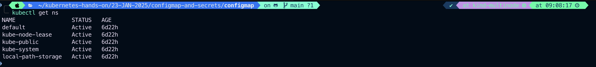

- You can also get the summary of a specific namespace using:

  ```
  kubectl get namespaces <name>

  ```

  ```
  kubectl get ns kube-system
  ```

  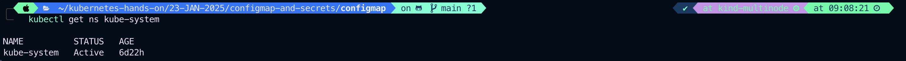

- Or you can get detailed information with:

  ```
   kubectl describe namespaces <name>

  ```

  ```
  kubectl describe ns kube-system
  ```

  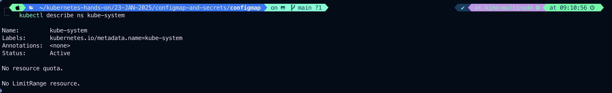
  Note that these details show both resource quota (if present) as well as resource limit ranges.

  Resource quota tracks aggregate usage of resources in the Namespace and allows cluster operators to define Hard resource usage limits that a Namespace may consume.

  A limit range defines min/max constraints on the amount of resources a single entity can consume in a Namespace.

# A namespace can be in one of two phases:

- **Active** the namespace is in use.
- **Terminating** the namespace is being deleted, and can not be used for new objects.

#

Namespace
Namespace provides a scope for Names. Use of multiple namespaces is optional.

- apiVersion: v1
- kind: Namespace
- metadata ([ObjectMeta](https://kubernetes.io/docs/reference/kubernetes-api/common-definitions/object-meta/#ObjectMeta))
  Standard object's metadata. More info: https://git.k8s.io/community/contributors/devel/sig-architecture/api-conventions.md#metadata
- spec (NamespaceSpec)

Spec defines the behavior of the Namespace. More info: https://git.k8s.io/community/contributors/devel/sig-architecture/api-conventions.md#spec-and-status

- status (NamespaceStatus)

Status describes the current status of a Namespace. More info: https://git.k8s.io/community/contributors/devel/sig-architecture/api-conventions.md#spec-and-status

#

# Creating a new namespace

## Note:

Avoid creating namespace with prefix kube-, since it is reserved for Kubernetes system namespaces.

- Create a new YAML file called my-namespace.yaml with the contents:

  ```
   apiVersion: v1
   kind: Namespace
   metadata:
     name: <insert-namespace-name-here>

  ```

  ```
    vim my-namespace.yaml
  ```

  ```
   apiVersion: v1
   kind: Namespace
   metadata:
     name: test-namespace
  ```

  ```
   kubectl apply -f my-namespace.yaml
  ```

  ```
  kubectl get ns
  ```

  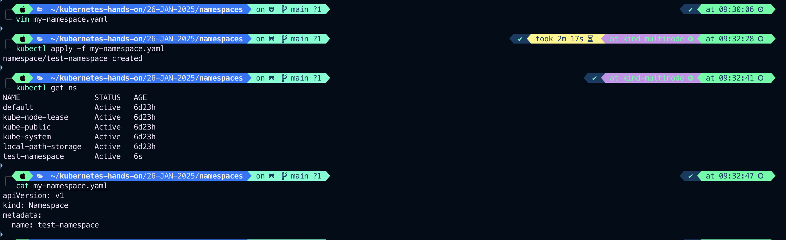

- Alternatively, you can create namespace using below command:

  ```
   kubectl create ns my-test-namespace
  ```

  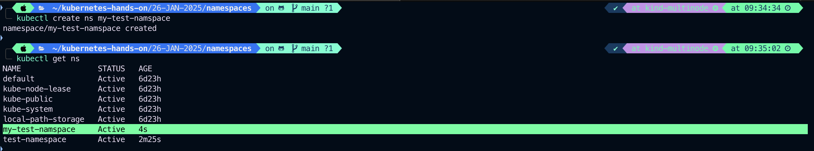
  The name of your namespace must be a valid [DNS label](https://kubernetes.io/docs/concepts/overview/working-with-objects/names/#dns-label-names).

#

There's an optional field **finalizers**, which allows observables to purge resources whenever the namespace is deleted. Keep in mind that if you specify a nonexistent finalizer, the namespace will be created but will get stuck in the **Terminating** state if the user tries to delete it.

More information on finalizers can be found in the namespace [design doc](https://github.com/kubernetes/design-proposals-archive/blob/main/architecture/namespaces.md#finalizers).

#

# Deleting a namespace

- Delete a namespace with

```
kubectl delete namespaces <insert-some-namespace-name>

```

```
kubectl get ns
```

```
kubectl delete ns/my-test-namespace \
kubectl delete ns/test-namespace \
kubectl delete ns/local-path-storage \
```

```
kubectl get ns
```

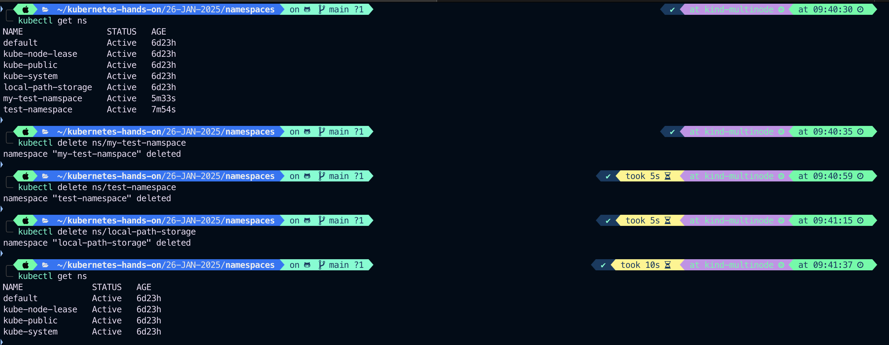

## Warning: This deletes everything under the namespace!

This delete is asynchronous, so for a time you will see the namespace in the Terminating state.

#

# Subdividing your cluster using Kubernetes namespaces

By default, a Kubernetes cluster will instantiate a default namespace when provisioning the cluster to hold the default set of Pods, Services, and Deployments used by the cluster.

Assuming you have a fresh cluster, you can introspect the available namespaces by doing the following:

```
kubectl get ns
```

or

```
kubectl get namespaces
```

## Create new namespaces

For this exercise, we will create two additional Kubernetes namespaces to hold our content.

In a scenario where an organization is using a shared Kubernetes cluster for development and production use cases:

- The development team would like to maintain a space in the cluster where they can get a view on the list of Pods, Services, and Deployments they use to build and run their application. In this space, Kubernetes resources come and go, and the restrictions on who can or cannot modify resources are relaxed to enable agile development.
- The operations team would like to maintain a space in the cluster where they can enforce strict procedures on who can or cannot manipulate the set of Pods, Services, and Deployments that run the production site.

One pattern this organization could follow is to partition the Kubernetes cluster into two namespaces: **development** and **production**. Let's create two new namespaces to hold our work.

### Create the development namespace using kubectl:

```
vim namespace-dev.yaml
```

```
apiVersion: v1
kind: Namespace
metadata:
  labels:
    name: development
  name: development
```

```
kubectl apply -f namespace-dev.yaml
```

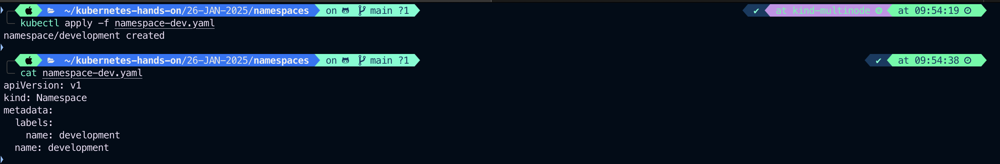

### And then let's create the **_production_** namespace using kubectl:

```
vim namespace-prod.yaml
```

```
apiVersion: v1
kind: Namespace
metadata:
  labels:
    name: production
  name: production
```

```
kubectl apply -f namespace-prod.yaml
```

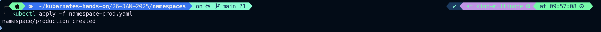

### To be sure things are right, list all of the namespaces in our cluster.

```
kubectl get ns --show-labels
```

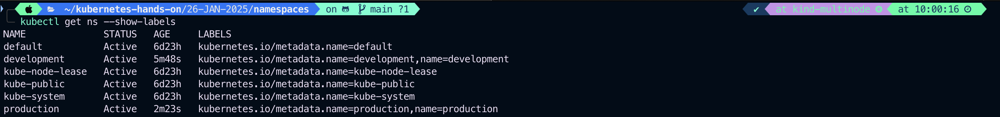

```
kubectl get ns development --show-labels
```

```
kubectl get ns production --show-labels
```

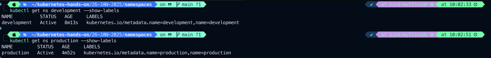

## Create pods in each namespace

- A Kubernetes namespace provides the scope for Pods, Services, and Deployments in the cluster.
- Users interacting with one namespace do not see the content in another namespace.

To demonstrate this, let's spin up a simple Deployment and Pods in the **development** namespace.

```
vim namespace-dev-deploy.yaml
```

```
apiVersion: apps/v1
kind: Deployment
metadata:
  creationTimestamp: null
  labels:
    app: namespace-dev-deploy
  name: namespace-dev-deploy
  namespace: development
spec:
  replicas: 2
  selector:
    matchLabels:
      app: namespace-dev-deploy
  strategy: {}
  template:
    metadata:
      creationTimestamp: null
      labels:
        app: namespace-dev-deploy
    spec:
      containers:
      - image: registry.k8s.io/serve_hostname
        name: serve-hostname-8vbtk
        resources: {}
status: {}
```

```
kubectl apply -f namespace-dev-deploy.yaml
```


or

```
kubectl create deployment namespace-dev-deploy \
  --image=registry.k8s.io/serve_hostname \
  -n=development --replicas=2
```

We have created a deployment whose replica size is 2 that is running the pod called **namespace-dev-deploy** with a basic container that serves the hostname.

List deployment

```
kubectl get deploy -o wide -n development
```

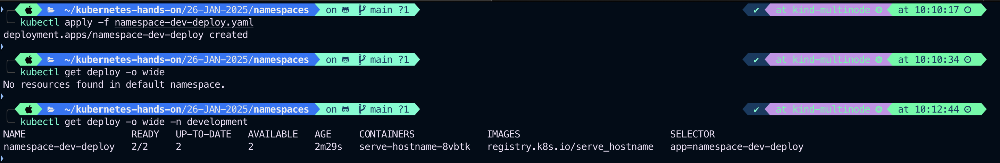

```
kubectl get pods -o wide -l app=namespace-dev-deploy -n development
```

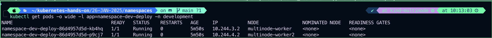
And this is great, developers are able to do what they want, and they do not have to worry about affecting content in the production namespace.

### Let's switch to the production namespace and show how resources in one namespace are hidden from the other. The production namespace should be empty, and the following commands should return nothing.

```
kubectl get deployment -n=production
```

```
kubectl get pods -o wide -n production
```

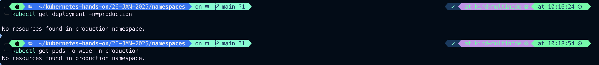

### Production likes to run cattle, so let's create some cattle pods.

```
vim namespace-prod-deploy.yaml
```

```
apiVersion: apps/v1
kind: Deployment
metadata:
  creationTimestamp: null
  labels:
    app: cattle
  name: cattle
  namespace: production
spec:
  replicas: 1
  selector:
    matchLabels:
      app: cattle
  strategy: {}
  template:
    metadata:
      creationTimestamp: null
      labels:
        app: cattle
    spec:
      containers:
      - image: registry.k8s.io/serve_hostname
        name: serve-hostname-j8jkg
        resources: {}
status: {}
```

```
kubectl apply -f namespace-prod-deploy.yaml
```

```
kubectl scale --replicas=5 -n=production deployment cattle
```

```
kubectl get deployment -n=production

```

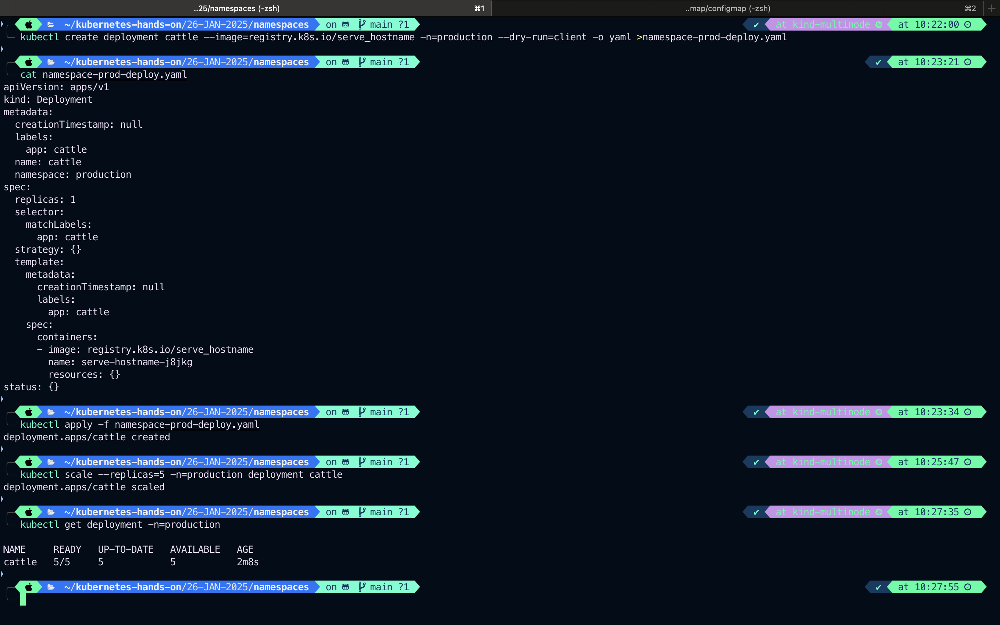

#### Or

```
kubectl create deployment cattle --image=registry.k8s.io/serve_hostname -n=production
kubectl scale deployment cattle --replicas=5 -n=production

kubectl get deployment -n=production
```

```
kubectl get pods -o wide -n production -l app=cattle
```

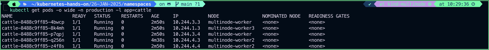
At this point, it should be clear that the resources users create in one namespace are hidden from the other namespace.

#### As the policy support in Kubernetes evolves, we will extend this scenario to show how you can provide different authorization rules for each namespace.

# Understanding the motivation for using namespaces

- A single cluster should be able to satisfy the needs of multiple users or groups of users
- Kubernetes namespaces help different projects, teams, or customers to share a Kubernetes cluster.

## It does this by providing the following:

1. A scope for [names](https://kubernetes.io/docs/concepts/overview/working-with-objects/names/).
2. A mechanism to attach authorization and policy to a subsection of the cluster.

Use of multiple namespaces is optional.
Each user community wants to be able to work in isolation from other communities. Each user community has its own:

1. **_resources_** (pods, services, replication controllers, etc.)
2. **_policies_** (who can or cannot perform actions in their community)
3. **_constraints_** (this community is allowed this much quota, etc.)

#

## A cluster operator may create a Namespace for each unique user community.

The Namespace provides a unique scope for:

1. **_named resources_** (to avoid basic naming collisions)
2. delegated management authority to trusted users
3. ability to limit community resource consumption

### Use cases include:

1. As a cluster operator, I want to support multiple user communities on a single cluster.
2. As a cluster operator, I want to delegate authority to partitions of the cluster to trusted users in those communities.
3. As a cluster operator, I want to limit the amount of resources each community can consume in order to limit the impact to other communities using the cluster.
4. As a cluster user, I want to interact with resources that are pertinent to my user community in isolation of what other user communities are doing on the cluster.

#

# Understanding namespaces and DNS

When you create a Service, it creates a corresponding DNS entry. This entry is of the form <span style="color:yellow">**_service-name.namespace-name.svc.cluster.local_**</span>, which means that if a container uses <span style="color:yellow">**_service-name_**</span> it will resolve to the service which is local to a namespace. This is useful for using the same configuration across multiple namespaces such as Development, Staging and Production. If you want to reach across namespaces, you need to use the <span style="color:yellow"> fully qualified domain name (FQDN)</span>.

#

# Not all objects are in a namespace

Most Kubernetes resources (e.g. pods, services, replication controllers, and others) are in some namespaces. However namespace resources are not themselves in a namespace. And low-level resources, such as [nodes](https://kubernetes.io/docs/concepts/architecture/nodes/) and [persistentVolume](https://kubernetes.io/docs/concepts/storage/persistent-volumes/), are not in any namespace.

## To see which Kubernetes resources are and aren't in a namespace:

```
# In a namespace
kubectl api-resources --namespaced=true

# Not in a namespace
kubectl api-resources --namespaced=false
```

#### Lets see one by one

```
kubectl api-resources --namespaced=true
```

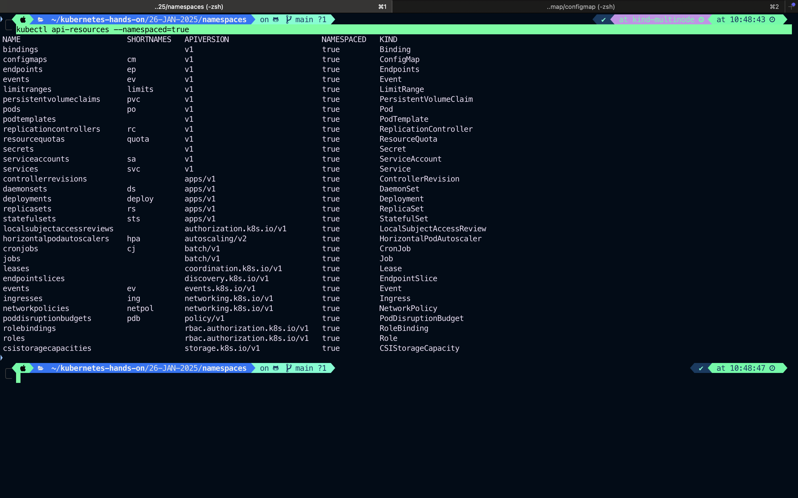

```
kubectl api-resources --namespaced=false
```

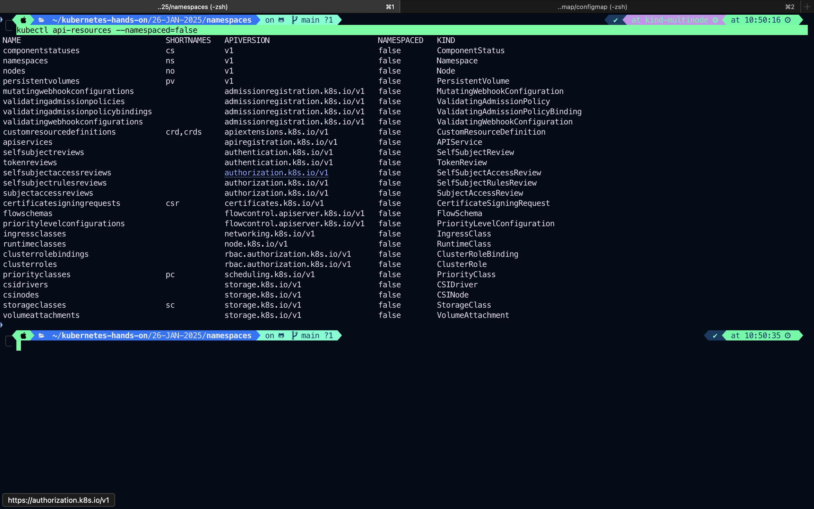

#

# Automatic labelling

## FEATURE STATE: Kubernetes 1.22 [stable]

The Kubernetes control plane sets an immutable label **kubernetes.io/metadata.name** on all namespaces. The value of the label is the namespace name.
