# Resource Quotas

- When several users or teams share a cluster with a fixed number of nodes, there is a concern that one team could use more than its fair share of resources.
- Resource quotas are a tool for administrators to address this concern.
- A resource quota, defined by a **_ResourceQuota_** object, provides constraints that limit aggregate resource consumption per namespace.
- It can limit the quantity of objects that can be created in a namespace by type, as well as the total amount of compute resources that may be consumed by resources in that namespace.

## Resource quotas work like this:

- Different teams work in different namespaces. This can be enforced with [RBAC](https://kubernetes.io/docs/reference/access-authn-authz/rbac/).
- The administrator creates one **ResourceQuota** for each namespace.
- Users create resources (pods, services, etc.) in the namespace, and the quota system tracks usage to ensure it does not exceed hard resource limits defined in a **ResourceQuota**.
- If creating or updating a resource violates a quota constraint, the request will fail with HTTP status code <mark>403 FORBIDDEN</mark> with a message explaining the constraint that would have been violated.
- If quotas are enabled in a namespace for compute resources like <mark>cpu</mark> and <mark>memory</mark>, users must specify requests or limits for those values; otherwise, the quota system may reject pod creation. Hint: Use the <mark>LimitRanger</mark> admission controller to force defaults for pods that make no compute resource requirements.

#

# Configure Memory and CPU Quotas for a Namespace

### Define overall memory and CPU resource limits for a namespace.

how to set quotas for the total amount memory and CPU that can be used by all Pods running in a namespace. You specify quotas in a [ResourceQuota](https://kubernetes.io/docs/reference/kubernetes-api/policy-resources/resource-quota-v1/) object.

## ResourceQuota

ResourceQuota sets aggregate quota restrictions enforced per namespace

- apiVersion: v1
- kind: ResourceQuota
- metadata (ObjectMeta)
  Standard object's metadata. More info: https://git.k8s.io/community/contributors/devel/sig-architecture/api-conventions.md#metadata
- spec ([ResourceQuotaSpec](https://kubernetes.io/docs/reference/kubernetes-api/policy-resources/resource-quota-v1/#ResourceQuotaSpec))

### Before you begin

- You need to have a Kubernetes cluster, and the kubectl command-line tool must be configured to communicate with your cluster. It is recommended to run this tutorial on a cluster with at least two nodes that are not acting as control plane hosts. If you do not already have a cluster, you can create one by using [minikube](https://minikube.sigs.k8s.io/docs/tutorials/multi_node/).
- You must have access to create namespaces in your cluster.
- Each node in your cluster must have at least 1 GiB of memory.

#

# Create a namespace

```
vim quota-mem-cpu-example
```

```
apiVersion: v1
kind: Namespace
metadata:
  creationTimestamp: null
  name: quota-mem-cpu-example
spec: {}
status: {}
```

```
kubectl apply -f quota-mem-cpu-example
```

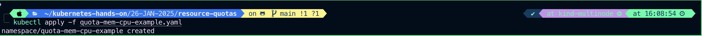

#

```
kubectl get ns
```

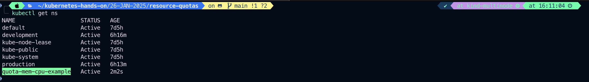

#

```
kubectl describe ns/quota-mem-cpu-example
```

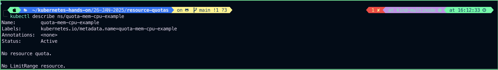

#### or

```
kubectl create namespace quota-mem-cpu-example

```

#

# Create a ResourceQuota

```
vim quota-mem-cpu.yaml
```

```
apiVersion: v1
kind: ResourceQuota
metadata:
  name:  mem-cpu-demo
spec:
  hard:
    requests.cpu: "1"
    requests.memory: 1Gi
    limits.cpu: "2"
    limits.memory: 2Gi
```

#### Create the ResourceQuota

```
kubectl apply -f quota-mem-cpu.yaml -n quota-mem-cpu-example
```

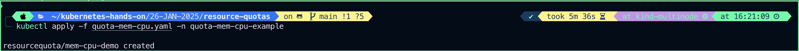

## View detailed information about the ResourceQuota:

```
kubectl get -n quota-mem-cpu-example resourcequotas/mem-cpu-demo -o yaml
```

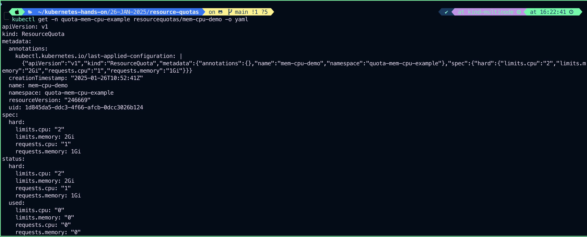

#

```
kubectl get -n quota-mem-cpu-example resourcequotas/mem-cpu-demo
```

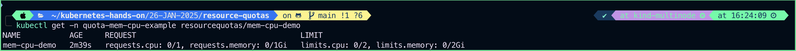

#

```
kubectl describe ns/quota-mem-cpu-example
```

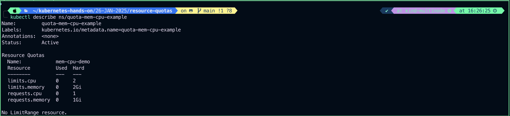

#

# The ResourceQuota places these requirements on the quota-mem-cpu-example namespace:

- For every Pod in the namespace, each container must have a memory request, memory limit, cpu request, and cpu limit.
- The memory request total for all Pods in that namespace must not exceed 1 GiB.
- The memory limit total for all Pods in that namespace must not exceed 2 GiB.
- The CPU request total for all Pods in that namespace must not exceed 1 cpu.
- The CPU limit total for all Pods in that namespace must not exceed 2 cpu.

#

# See [meaning of CPU](https://kubernetes.io/docs/concepts/configuration/manage-resources-containers/#meaning-of-cpu) to learn what Kubernetes means by “1 CPU”.

# Create a Pod

```
vim quota-mem-cpu-pod.yaml
```

```
apiVersion: v1
kind: Pod
metadata:
  name: quota-mem-cpu-demu
  namespace: quota-mem-cpu-example
spec:
  containers:
    - name: quota-mem-cpu-demo-ctr
      image:  nginx
      resources:
        requests:
          cpu: "400m"
          memory: "600Mi"
        limits:
          cpu: "800m"
          memory: "800Mi"
```

### Create the Pod:

```
kubectl apply -f quota-mem-cpu-pod.yaml
```

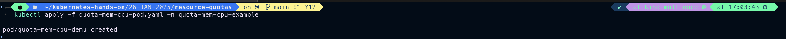

### Verify that the Pod is running and that its (only) container is healthy:

```

```

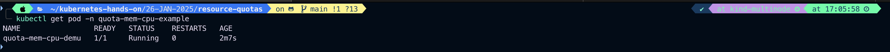

#

```
kubectl get pods -o wide -n quota-mem-cpu-example
```


#

## Once again, view detailed information about the ResourceQuota:

```
kubectl get resourcequotas mem-cpu-demo  -n quota-mem-cpu-example -o yaml
```

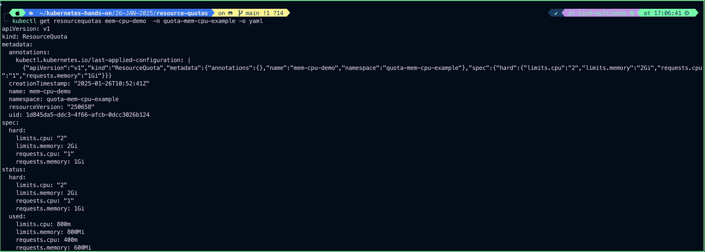

#

```
kubectl describe ns quota-mem-cpu-example
```

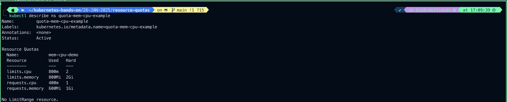
The output shows the quota along with how much of the quota has been used. You can see that the memory and CPU requests and limits for your Pod do not exceed the quota.

#

# Attempt to create a second Pod

```
vim quota-mem-cpu-pod-2.yaml
```

```
apiVersion: v1
kind: Pod
metadata:
  name: quota-mem-cpu-demo
  namespace: quota-mem-cpu-example
spec:
  containers:
    - name: quota-mem-cpu-demo-2-ctr
      image: nginx
      resources:
        requests:
          cpu: "400m"
          memory: "700Mi"
        limits:
          cpu: "800m"
          memory: "1Gi"

```

In the manifest, you can see that the Pod has a memory request of 700 MiB. Notice that the sum of the used memory request and this new memory request exceeds the memory request quota: 600 MiB + 700 MiB > 1 GiB.

### Attempt to create the Pod:

```
kubectl apply -f quota-mem-cpu-pod-2.yaml
```

The second Pod does not get created. The output shows that creating the second Pod would cause the memory request total to exceed the memory request quota.
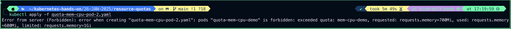

#

# Instead of managing total resource use within a namespace, you might want to restrict individual Pods, or the containers in those Pods. To achieve that kind of limiting, use a [LimitRange](https://kubernetes.io/docs/concepts/policy/limit-range/).
