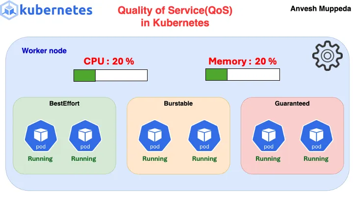
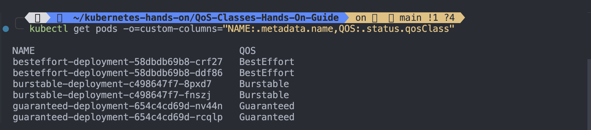

# Quality of Service (QoS)

In Kubernetes, Quality of Service (QoS) is a mechanism to prioritize the allocation of resources such as CPU and memory among different Pods running on a node. Kubernetes defines three QoS classes for Pods:

1. **Guaranteed**: Pods that have specified both a CPU and memory request, and they match their limit. These Pods are ensured to be allocated the requested resources, and they are not subject to being evicted due to resource shortages.

2. **Burstable**: Pods that have specified both a CPU and memory request, but they may exceed their requests for burstable periods. These Pods can consume resources beyond their requests but are limited by their specified limits. They are subject to being evicted if the node experiences resource contention.

3. **BestEffort**: Pods that do not have any resource requests or limits. These Pods are not guaranteed any specific amount of resources and are the first to be evicted when the node runs out of resources.

Kubernetes uses these QoS classes to make decisions about scheduling, eviction, and scaling. For example, when a node is under resource pressure, Kubernetes may first evict BestEffort Pods to free up resources, followed by Burstable Pods, and only evict Guaranteed Pods as a last resort. Additionally, QoS information can be useful for cluster administrators to understand how resource-intensive different workloads are and to optimize resource allocation accordingly.

## Retrieve the QoS class for a Pod

Rather than see all the fields, you can view just the field you need:

```bash
kubectl --namespace=qos-example get pod qos-demo-4 -o jsonpath='{ .status.qosClass}{"\n"}'
```

---

# Practical Examples

Let’s deploy the all three types QOS class pods.

`step 1.`

## Deploy Guaranteed Pod

- Create a file named
  `guaranteed-pods-deployment.yaml` with the following content

```py
apiVersion: apps/v1
kind: Deployment
metadata:
  name: guaranteed-deployment
  labels:
    app: guaranteed-deployment-example
spec:
  replicas: 2
  selector:
    matchLabels:
      app: myapp
  template:
    metadata:
      labels:
        app: myapp
    spec:
      containers:
      - name: myapp
        image: <Image>
        env:
        - name: "DB_HOSTNAME"
          value: "type here the required details"
        resources:
          requests:
            memory: "128Mi"
            cpu: "100m"
          limits:
            memory: "128Mi"
            cpu: "100m"
        ports:
        - containerPort: 80


```

`Apply manifest` using

```sh
kubectl apply -f guaranteed-pods-deployment.yaml
```

---

`Step 2.`

## Deploy Burstable Pods

- Create a file name `burstable-pods-deployment.yaml` with the following content.

```py
apiVersion: apps/v1
kind: Deployment
metadata:
  name: burstable-deployment
  labels:
    app: burstable-deployment-example
spec:
  replicas: 2
  selector:
    matchLabels:
      app: myapp-burstable
  template:
    metadata:
      labels:
        app: myapp-burstable
    spec:
      containers:
      - name: burstable-myapp-container
        image: nginx
        env:
        - name: "DB_HOSTNAME"
          value: "type here the required details"
        resources:
          requests:
            memory: "64Mi"
            cpu: "50m"
          limits:
            memory: "128Mi"
            cpu: "100m"
        ports:
        - containerPort: 80


```

`Apply manifest` using

```sh
kubectl apply -f burstable-pods-deployment.yaml
```

---

`Step 3.`

## Deploy BestEffort Pod

- Create a file named `BestEffort-pods-deployment.yaml` with the following code

```py
apiVersion: apps/v1
kind: Deployment
metadata:
  name: besteffort-deployment
  labels:
    app: besteffort-deployment-examples
spec:
  replicas: 2
  selector:
    matchLabels:
      app: myapp
  template:
    metadata:
      labels:
        app: myapp
    spec:
      containers:
      - name: myapp
        image: nginx
        ports:
        - containerPort: 80

```

`Apply manifest` using

```sh
kubectl apply -f BestEffort-pods-deployment.yaml
```

---

`Step 4.`

## Increase Resources

Let’s observe the eviction order of pods in Kubernetes when a worker node is under resource pressure. We’ll start by watching the pods to monitor their eviction sequence. Now we will initiate the stress-ng process on the worker node to put it under pressure(using pod or directly we can run this on worker node by SSH).

---

`Here’s what we’ll do:`

```sh
kubectl get pods
```

```sh
kubectl get pods -o=custom-columns="NAME:.metadata.name,QOS:.status.qosClass"

```



---

`Step 5`

## Identify Your Worker Node

List your nodes:

```sh
kubectl get nodes
```

`Output:`

```sh
kubectl get nodes

NAME                        STATUS   ROLES           AGE   VERSION
kind-calico-control-plane   Ready    control-plane   14d   v1.32.0
kind-calico-worker          Ready    <none>          14d   v1.32.0
kind-calico-worker2         Ready    <none>          14d   v1.32.0
```

---

Select a worker node where the deployments are running. To get the node for a specific pod:

```sh
kubectl get pods -o wide
```

`Output:`

```sh
kubectl get pods -o wide
NAME                                     READY   STATUS    RESTARTS   AGE   IP                NODE                  NOMINATED NODE   READINESS GATES
besteffort-deployment-58dbdb69b8-crf27   1/1     Running   0          12m   192.168.52.89     kind-calico-worker2   <none>           <none>
besteffort-deployment-58dbdb69b8-ddf86   1/1     Running   0          12m   192.168.210.221   kind-calico-worker    <none>           <none>
burstable-deployment-c498647f7-8pxd7     1/1     Running   0          16m   192.168.52.88     kind-calico-worker2   <none>           <none>
burstable-deployment-c498647f7-fnszj     1/1     Running   0          16m   192.168.210.220   kind-calico-worker    <none>           <none>
guaranteed-deployment-654c4cd69d-nv44n   1/1     Running   0          35m   192.168.52.87     kind-calico-worker2   <none>           <none>
guaranteed-deployment-654c4cd69d-rcqlp   1/1     Running   0          35m   192.168.210.219   kind-calico-worker    <none>           <none>
```

```sh
kubectl get pods/besteffort-deployment-58dbdb69b8-crf27 -o wide
```

`Output:`

```sh
kubectl get pods/besteffort-deployment-58dbdb69b8-crf27 -o wide
NAME                                     READY   STATUS    RESTARTS   AGE   IP              NODE                  NOMINATED NODE   READINESS GATES
besteffort-deployment-58dbdb69b8-crf27   1/1     Running   0          13m   192.168.52.89   kind-calico-worker2   <none>           <none>

```

`Step 6.`

## Apply CPU/Memory Pressure to the Node

`Option 1`
Using a Pod to Simulate Load
Deploy a stress test pod on the worker node

- Create a file named `stress-pod-deployment.yaml` with the following content.

```py
apiVersion: apps/v1
kind: Deployment
metadata:
  name: stress-pod-deployment
spec:
  replicas: 2
  selector:
    matchLabels:
      app: stress-pod
  template:
    metadata:
      labels:
        app: stress-pod
    spec:
      nodeSelector:
        kubernetes.io/hostname: kind-calico-worker2
      containers:
      - name: stress-pod-container
        image: polinux/stress
        command: [ "stress" ]
        args: [ "--cpu", "2", "--vm", "1", "--vm-bytes", "256", "--timeout", "600s" ]
        resources:
          limits:
            memory: "256Mi"
            cpu: "200m"


```

`Apply the pod:`

```sh
kubectl apply -f stress-pod-deployment.yaml
```

`Step 6.`

## Monitor Evictions

1. Check for the eviction events:

```sh
kubectl get events --sort-by=.metadata.creationTimestamp

```

Look for eviction messages like:

```sh
PodEvicted: Node is under memory pressure

```

2. Watch pod statuses in real-time

```sh
kubectl get pods --watch

```

`Output:`

```sh
kubectl get events --sort-by=.metadata.creationTimestamp

LAST SEEN   TYPE      REASON                    OBJECT                                        MESSAGE
2d16h       Normal    Pulled                    pod/myapp                                     Container image "registry.k8s.io/busybox:1.27.2" already present on machine
2d16h       Warning   BackOff                   pod/myapp                                     Back-off restarting failed container myapp-container in pod myapp_default(9d0b54f5-676e-4f87-bb12-4f14d4ac8bd0)
59m         Normal    NodeHasSufficientPID      node/kind-calico-worker2                      Node kind-calico-worker2 status is now: NodeHasSufficientPID
59m         Normal    NodeAllocatableEnforced   node/kind-calico-control-plane                Updated Node Allocatable limit across pods
59m         Warning   Rebooted                  node/kind-calico-control-plane                Node kind-calico-control-plane has been rebooted, boot id: 583601da-a646-4ea0-94d4-15e86e40c421
59m         Normal    NodeHasNoDiskPressure     node/kind-calico-worker2                      Node kind-calico-worker2 status is now: NodeHasNoDiskPressure
59m         Normal    NodeHasSufficientPID      node/kind-calico-control-plane                Node kind-calico-control-plane status is now: NodeHasSufficientPID
58m         Normal    SandboxChanged            pod/backend                                   Pod sandbox changed, it will be killed and re-created.
59m         Normal    Starting                  node/kind-calico-control-plane                Starting kubelet.
59m         Normal    NodeHasSufficientMemory   node/kind-calico-control-plane                Node kind-calico-control-plane status is now: NodeHasSufficientMemory
59m         Warning   Rebooted                  node/kind-calico-worker2                      Node kind-calico-worker2 has been rebooted, boot id: 583601da-a646-4ea0-94d4-15e86e40c421
59m         Normal    NodeHasSufficientMemory   node/kind-calico-worker2                      Node kind-calico-worker2 status is now: NodeHasSufficientMemory
59m         Normal    NodeHasNoDiskPressure     node/kind-calico-control-plane                Node kind-calico-control-plane status is now: NodeHasNoDiskPressure
59m         Normal    Starting                  node/kind-calico-worker2                      Starting kubelet.
59m         Normal    NodeAllocatableEnforced   node/kind-calico-worker2                      Updated Node Allocatable limit across pods
58m         Normal    SandboxChanged            pod/nginx-pod                                 Pod sandbox changed, it will be killed and re-created.
58m         Normal    SandboxChanged            pod/mysql                                     Pod sandbox changed, it will be killed and re-created.
58m         Normal    SandboxChanged            pod/frontend                                  Pod sandbox changed, it will be killed and re-created.
59m         Warning   Rebooted                  node/kind-calico-worker                       Node kind-calico-worker has been rebooted, boot id: 583601da-a646-4ea0-94d4-15e86e40c421
59m         Normal    NodeAllocatableEnforced   node/kind-calico-worker                       Updated Node Allocatable limit across pods
59m         Normal    NodeHasSufficientPID      node/kind-calico-worker                       Node kind-calico-worker status is now: NodeHasSufficientPID
59m         Normal    NodeHasNoDiskPressure     node/kind-calico-worker                       Node kind-calico-worker status is now: NodeHasNoDiskPressure
59m         Normal    NodeHasSufficientMemory   node/kind-calico-worker                       Node kind-calico-worker status is now: NodeHasSufficientMemory
59m         Normal    Starting                  node/kind-calico-worker                       Starting kubelet.
58m         Normal    SandboxChanged            pod/myapp                                     Pod sandbox changed, it will be killed and re-created.
58m         Normal    Starting                  node/kind-calico-worker
58m         Normal    Starting                  node/kind-calico-control-plane
58m         Normal    Starting                  node/kind-calico-worker2
58m         Normal    RegisteredNode            node/kind-calico-worker2                      Node kind-calico-worker2 event: Registered Node kind-calico-worker2 in Controller
58m         Normal    RegisteredNode            node/kind-calico-control-plane                Node kind-calico-control-plane event: Registered Node kind-calico-control-plane in Controller
58m         Normal    RegisteredNode            node/kind-calico-worker                       Node kind-calico-worker event: Registered Node kind-calico-worker in Controller
58m         Normal    SuccessfulCreate          replicaset/guaranteed-deployment-5b6f8668fc   Created pod: guaranteed-deployment-5b6f8668fc-vwxqr
58m         Normal    Scheduled                 pod/guaranteed-deployment-5b6f8668fc-vwxqr    Successfully assigned default/guaranteed-deployment-5b6f8668fc-vwxqr to kind-calico-worker
58m         Normal    Scheduled                 pod/guaranteed-deployment-5b6f8668fc-5q4rk    Successfully assigned default/guaranteed-deployment-5b6f8668fc-5q4rk to kind-calico-worker2
58m         Normal    ScalingReplicaSet         deployment/guaranteed-deployment              Scaled up replica set guaranteed-deployment-5b6f8668fc from 0 to 2
58m         Normal    SuccessfulCreate          replicaset/guaranteed-deployment-5b6f8668fc   Created pod: guaranteed-deployment-5b6f8668fc-5q4rk
58m         Normal    SandboxChanged            pod/guaranteed-deployment-5b6f8668fc-vwxqr    Pod sandbox changed, it will be killed and re-created.
58m         Warning   FailedCreatePodSandBox    pod/guaranteed-deployment-5b6f8668fc-vwxqr    Failed to create pod sandbox: rpc error: code = Unknown desc = failed to setup network for sandbox "8c21c5005d27cb8e9652852840e863980470e7f7d8d5212828e4f282e4129627": plugin type="calico" failed (add): error getting ClusterInformation: connection is unauthorized: Unauthorized
58m         Warning   FailedCreatePodSandBox    pod/guaranteed-deployment-5b6f8668fc-5q4rk    Failed to create pod sandbox: rpc error: code = Unknown desc = failed to setup network for sandbox "d5519a90c9c054be9523c77377c86cc8cfb62b2c01820ed6333ba65a1daeb31b": plugin type="calico" failed (add): error getting ClusterInformation: connection is unauthorized: Unauthorized
58m         Normal    SandboxChanged            pod/guaranteed-deployment-5b6f8668fc-5q4rk    Pod sandbox changed, it will be killed and re-created.
58m         Warning   FailedCreatePodSandBox    pod/guaranteed-deployment-5b6f8668fc-5q4rk    Failed to create pod sandbox: rpc error: code = Unknown desc = failed to setup network for sandbox "a9e9b4b8dd57cac0479cbd50e96853dcba672696218576748e37883d8fabbf67": plugin type="calico" failed (add): error getting ClusterInformation: connection is unauthorized: Unauthorized
58m         Warning   FailedCreatePodSandBox    pod/guaranteed-deployment-5b6f8668fc-vwxqr    Failed to create pod sandbox: rpc error: code = Unknown desc = failed to setup network for sandbox "04a975b8f057674d6041b3b7b3083f0e2aa35fdc67d61286a090b94299d2328d": plugin type="calico" failed (add): error getting ClusterInformation: connection is unauthorized: Unauthorized
58m         Warning   FailedCreatePodSandBox    pod/guaranteed-deployment-5b6f8668fc-vwxqr    Failed to create pod sandbox: rpc error: code = Unknown desc = failed to setup network for sandbox "d1d23644d65ca3f6ee28290efe39a3101411f050ea5376cc740da96d361c8aa5": plugin type="calico" failed (add): error getting ClusterInformation: connection is unauthorized: Unauthorized
58m         Warning   FailedCreatePodSandBox    pod/guaranteed-deployment-5b6f8668fc-5q4rk    Failed to create pod sandbox: rpc error: code = Unknown desc = failed to setup network for sandbox "c29c27b89f3e22ae27edb1ec87754001d507ab968adb687c8dd580b831ad2014": plugin type="calico" failed (add): error getting ClusterInformation: connection is unauthorized: Unauthorized
58m         Warning   FailedCreatePodSandBox    pod/guaranteed-deployment-5b6f8668fc-5q4rk    Failed to create pod sandbox: rpc error: code = Unknown desc = failed to setup network for sandbox "bd50405e1d509225392ad25e3f47cc112bd362c48bb40355337de0a24e394e8f": plugin type="calico" failed (add): error getting ClusterInformation: connection is unauthorized: Unauthorized
58m         Warning   FailedCreatePodSandBox    pod/guaranteed-deployment-5b6f8668fc-vwxqr    Failed to create pod sandbox: rpc error: code = Unknown desc = failed to setup network for sandbox "f9a432263bd5cdc29e567830aa35d316551692011cbe2bb7ee49b80102dd8943": plugin type="calico" failed (add): error getting ClusterInformation: connection is unauthorized: Unauthorized
58m         Warning   FailedCreatePodSandBox    pod/guaranteed-deployment-5b6f8668fc-5q4rk    Failed to create pod sandbox: rpc error: code = Unknown desc = failed to setup network for sandbox "8a807f77b36606add0a3d42fd2deb48ed08bd1f3fa7e02950744735a68d79602": plugin type="calico" failed (add): error getting ClusterInformation: connection is unauthorized: Unauthorized
58m         Warning   FailedCreatePodSandBox    pod/guaranteed-deployment-5b6f8668fc-vwxqr    Failed to create pod sandbox: rpc error: code = Unknown desc = failed to setup network for sandbox "da78033ff396b0de3589cc38b37014317a3213dae395b8b69f8fc51dd431bfa0": plugin type="calico" failed (add): error getting ClusterInformation: connection is unauthorized: Unauthorized
58m         Warning   FailedCreatePodSandBox    pod/guaranteed-deployment-5b6f8668fc-5q4rk    Failed to create pod sandbox: rpc error: code = Unknown desc = failed to setup network for sandbox "f6b001967be2e91ad60c567563ead5df8d149bfd9c72b5fc061378894d24b531": plugin type="calico" failed (add): error getting ClusterInformation: connection is unauthorized: Unauthorized
58m         Warning   FailedCreatePodSandBox    pod/guaranteed-deployment-5b6f8668fc-vwxqr    Failed to create pod sandbox: rpc error: code = Unknown desc = failed to setup network for sandbox "6987fd4453bac8b8b30583d87e03a843dade2897131a7739dd8675f29dc6a99b": plugin type="calico" failed (add): error getting ClusterInformation: connection is unauthorized: Unauthorized
58m         Warning   FailedCreatePodSandBox    pod/guaranteed-deployment-5b6f8668fc-vwxqr    Failed to create pod sandbox: rpc error: code = Unknown desc = failed to setup network for sandbox "d4fb12b632df91e8d68a289394da85329f02f7faf8b8708a402363c1b033221b": plugin type="calico" failed (add): error getting ClusterInformation: connection is unauthorized: Unauthorized
58m         Warning   FailedCreatePodSandBox    pod/guaranteed-deployment-5b6f8668fc-vwxqr    Failed to create pod sandbox: rpc error: code = Unknown desc = failed to setup network for sandbox "eb3e4cedf8c4bd7adcf1b1cf37f1b3d5fba1b9afa1a897b8a56c0d1a2c94ae15": plugin type="calico" failed (add): error getting ClusterInformation: connection is unauthorized: Unauthorized
58m         Warning   FailedCreatePodSandBox    pod/guaranteed-deployment-5b6f8668fc-5q4rk    Failed to create pod sandbox: rpc error: code = Unknown desc = failed to setup network for sandbox "6c8ebc3d43441fd5d2155ef1ab563cd8ef5231056ff86f5b472ee68c879f765f": plugin type="calico" failed (add): error getting ClusterInformation: connection is unauthorized: Unauthorized
58m         Warning   FailedCreatePodSandBox    pod/guaranteed-deployment-5b6f8668fc-vwxqr    Failed to create pod sandbox: rpc error: code = Unknown desc = failed to setup network for sandbox "b4dfcc9032c042a97d61e59d18a719634505e180c53ecc9cb530fed2ea76f797": plugin type="calico" failed (add): error getting ClusterInformation: connection is unauthorized: Unauthorized
58m         Warning   FailedCreatePodSandBox    pod/guaranteed-deployment-5b6f8668fc-5q4rk    Failed to create pod sandbox: rpc error: code = Unknown desc = failed to setup network for sandbox "96e032025ac782437d911494dab6bb9ccee53aa8927035781635a37c06a843e2": plugin type="calico" failed (add): error getting ClusterInformation: connection is unauthorized: Unauthorized
58m         Warning   FailedCreatePodSandBox    pod/guaranteed-deployment-5b6f8668fc-5q4rk    Failed to create pod sandbox: rpc error: code = Unknown desc = failed to setup network for sandbox "cdaa61ffb076dd23781a34bc5227330cdc19e5987f29968edccc165bd5342772": plugin type="calico" failed (add): error getting ClusterInformation: connection is unauthorized: Unauthorized
58m         Warning   FailedCreatePodSandBox    pod/guaranteed-deployment-5b6f8668fc-vwxqr    (combined from similar events): Failed to create pod sandbox: rpc error: code = Unknown desc = failed to setup network for sandbox "caa7b8af64e25b680327c90bf1d40866b3040f152fe3a2d4f33178bc3e00803f": plugin type="calico" failed (add): error getting ClusterInformation: connection is unauthorized: Unauthorized
58m         Warning   FailedCreatePodSandBox    pod/guaranteed-deployment-5b6f8668fc-5q4rk    (combined from similar events): Failed to create pod sandbox: rpc error: code = Unknown desc = failed to setup network for sandbox "8e50c005ca31eb99eb1afd4c6e479fb9a4f7d4c9c9702a4f12a80ca9e013a875": plugin type="calico" failed (add): error getting ClusterInformation: connection is unauthorized: Unauthorized
58m         Warning   InspectFailed             pod/guaranteed-deployment-5b6f8668fc-vwxqr    Failed to apply default image tag "<Image>": couldn't parse image name "<Image>": invalid reference format: repository name (library/<Image>) must be lowercase
58m         Warning   Failed                    pod/guaranteed-deployment-5b6f8668fc-vwxqr    Error: InvalidImageName
58m         Warning   InspectFailed             pod/guaranteed-deployment-5b6f8668fc-5q4rk    Failed to apply default image tag "<Image>": couldn't parse image name "<Image>": invalid reference format: repository name (library/<Image>) must be lowercase
58m         Warning   Failed                    pod/guaranteed-deployment-5b6f8668fc-5q4rk    Error: InvalidImageName
58m         Normal    Pulling                   pod/frontend                                  Pulling image "nginx"
58m         Normal    Pulling                   pod/backend                                   Pulling image "nginx"
58m         Normal    Pulling                   pod/nginx-pod                                 Pulling image "nginx"
58m         Normal    Created                   pod/frontend                                  Created container: nginx
58m         Normal    Pulled                    pod/frontend                                  Successfully pulled image "nginx" in 4.55s (4.55s including waiting). Image size: 68638658 bytes.
58m         Normal    Started                   pod/frontend                                  Started container nginx
47m         Normal    Created                   pod/myapp                                     Created container: myapp-container
47m         Normal    Pulled                    pod/myapp                                     Container image "registry.k8s.io/busybox:1.27.2" already present on machine
55m         Warning   Failed                    pod/myapp                                     Error: failed to create containerd task: failed to create shim task: OCI runtime create failed: runc create failed: unable to start container process: error during container init: exec: "bin/bash": stat bin/bash: no such file or directory: unknown
48m         Warning   BackOff                   pod/myapp                                     Back-off restarting failed container myapp-container in pod myapp_default(9d0b54f5-676e-4f87-bb12-4f14d4ac8bd0)
58m         Normal    Created                   pod/backend                                   Created container: nginx
58m         Normal    Started                   pod/backend                                   Started container nginx
58m         Normal    Pulled                    pod/backend                                   Successfully pulled image "nginx" in 10.059s (10.061s including waiting). Image size: 68638658 bytes.
58m         Normal    Pulling                   pod/mysql                                     Pulling image "mysql:latest"
57m         Normal    Pulled                    pod/mysql                                     Successfully pulled image "mysql:latest" in 6.055s (6.055s including waiting). Image size: 236518751 bytes.
57m         Normal    Created                   pod/mysql                                     Created container: mysql
57m         Normal    Started                   pod/mysql                                     Started container mysql
57m         Normal    Pulled                    pod/nginx-pod                                 Successfully pulled image "nginx" in 13.254s (21.496s including waiting). Image size: 68638658 bytes.
57m         Normal    Created                   pod/nginx-pod                                 Created container: nginx-container
57m         Normal    Started                   pod/nginx-pod                                 Started container nginx-container
57m         Normal    SuccessfulCreate          replicaset/guaranteed-deployment-654c4cd69d   Created pod: guaranteed-deployment-654c4cd69d-nv44n
57m         Normal    ScalingReplicaSet         deployment/guaranteed-deployment              Scaled up replica set guaranteed-deployment-654c4cd69d from 0 to 1
57m         Normal    Scheduled                 pod/guaranteed-deployment-654c4cd69d-nv44n    Successfully assigned default/guaranteed-deployment-654c4cd69d-nv44n to kind-calico-worker2
57m         Normal    Started                   pod/guaranteed-deployment-654c4cd69d-nv44n    Started container myapp
57m         Normal    Created                   pod/guaranteed-deployment-654c4cd69d-nv44n    Created container: myapp
57m         Normal    Pulled                    pod/guaranteed-deployment-654c4cd69d-nv44n    Container image "nginx" already present on machine
57m         Normal    ScalingReplicaSet         deployment/guaranteed-deployment              Scaled up replica set guaranteed-deployment-654c4cd69d from 1 to 2
57m         Normal    ScalingReplicaSet         deployment/guaranteed-deployment              Scaled down replica set guaranteed-deployment-5b6f8668fc from 2 to 1
57m         Normal    SuccessfulDelete          replicaset/guaranteed-deployment-5b6f8668fc   Deleted pod: guaranteed-deployment-5b6f8668fc-5q4rk
57m         Normal    SuccessfulCreate          replicaset/guaranteed-deployment-654c4cd69d   Created pod: guaranteed-deployment-654c4cd69d-rcqlp
57m         Normal    Scheduled                 pod/guaranteed-deployment-654c4cd69d-rcqlp    Successfully assigned default/guaranteed-deployment-654c4cd69d-rcqlp to kind-calico-worker
57m         Normal    Started                   pod/guaranteed-deployment-654c4cd69d-rcqlp    Started container myapp
57m         Normal    Created                   pod/guaranteed-deployment-654c4cd69d-rcqlp    Created container: myapp
57m         Normal    Pulled                    pod/guaranteed-deployment-654c4cd69d-rcqlp    Container image "nginx" already present on machine
57m         Normal    ScalingReplicaSet         deployment/guaranteed-deployment              Scaled down replica set guaranteed-deployment-5b6f8668fc from 1 to 0
57m         Normal    SuccessfulDelete          replicaset/guaranteed-deployment-5b6f8668fc   Deleted pod: guaranteed-deployment-5b6f8668fc-vwxqr
42m         Normal    Killing                   pod/mysql                                     Stopping container mysql
42m         Normal    Killing                   pod/backend                                   Stopping container nginx
42m         Normal    Killing                   pod/frontend                                  Stopping container nginx
41m         Normal    Killing                   pod/nginx-pod                                 Stopping container nginx-container
38m         Normal    ScalingReplicaSet         deployment/burstable-deployment               Scaled up replica set burstable-deployment-c498647f7 from 0 to 2
38m         Normal    SuccessfulCreate          replicaset/burstable-deployment-c498647f7     Created pod: burstable-deployment-c498647f7-fnszj
38m         Normal    Scheduled                 pod/burstable-deployment-c498647f7-8pxd7      Successfully assigned default/burstable-deployment-c498647f7-8pxd7 to kind-calico-worker2
38m         Normal    Scheduled                 pod/burstable-deployment-c498647f7-fnszj      Successfully assigned default/burstable-deployment-c498647f7-fnszj to kind-calico-worker
38m         Normal    SuccessfulCreate          replicaset/burstable-deployment-c498647f7     Created pod: burstable-deployment-c498647f7-8pxd7
38m         Normal    Pulling                   pod/burstable-deployment-c498647f7-fnszj      Pulling image "nginx"
38m         Normal    Pulling                   pod/burstable-deployment-c498647f7-8pxd7      Pulling image "nginx"
38m         Normal    Created                   pod/burstable-deployment-c498647f7-fnszj      Created container: burstable-myapp-container
38m         Normal    Pulled                    pod/burstable-deployment-c498647f7-fnszj      Successfully pulled image "nginx" in 3.755s (3.755s including waiting). Image size: 68638658 bytes.
38m         Normal    Started                   pod/burstable-deployment-c498647f7-fnszj      Started container burstable-myapp-container
38m         Normal    Started                   pod/burstable-deployment-c498647f7-8pxd7      Started container burstable-myapp-container
38m         Normal    Pulled                    pod/burstable-deployment-c498647f7-8pxd7      Successfully pulled image "nginx" in 4.519s (4.52s including waiting). Image size: 68638658 bytes.
38m         Normal    Created                   pod/burstable-deployment-c498647f7-8pxd7      Created container: burstable-myapp-container
34m         Normal    Scheduled                 pod/besteffort-deployment-58dbdb69b8-crf27    Successfully assigned default/besteffort-deployment-58dbdb69b8-crf27 to kind-calico-worker2
34m         Normal    Scheduled                 pod/besteffort-deployment-58dbdb69b8-ddf86    Successfully assigned default/besteffort-deployment-58dbdb69b8-ddf86 to kind-calico-worker
34m         Normal    SuccessfulCreate          replicaset/besteffort-deployment-58dbdb69b8   Created pod: besteffort-deployment-58dbdb69b8-crf27
34m         Normal    SuccessfulCreate          replicaset/besteffort-deployment-58dbdb69b8   Created pod: besteffort-deployment-58dbdb69b8-ddf86
34m         Normal    ScalingReplicaSet         deployment/besteffort-deployment              Scaled up replica set besteffort-deployment-58dbdb69b8 from 0 to 2
34m         Normal    Pulling                   pod/besteffort-deployment-58dbdb69b8-crf27    Pulling image "nginx"
34m         Normal    Pulling                   pod/besteffort-deployment-58dbdb69b8-ddf86    Pulling image "nginx"
34m         Normal    Pulled                    pod/besteffort-deployment-58dbdb69b8-crf27    Successfully pulled image "nginx" in 2.428s (2.428s including waiting). Image size: 68638658 bytes.
34m         Normal    Created                   pod/besteffort-deployment-58dbdb69b8-crf27    Created container: myapp
34m         Normal    Started                   pod/besteffort-deployment-58dbdb69b8-crf27    Started container myapp
34m         Normal    Pulled                    pod/besteffort-deployment-58dbdb69b8-ddf86    Successfully pulled image "nginx" in 8.791s (8.791s including waiting). Image size: 68638658 bytes.
34m         Normal    Created                   pod/besteffort-deployment-58dbdb69b8-ddf86    Created container: myapp
34m         Normal    Started                   pod/besteffort-deployment-58dbdb69b8-ddf86    Started container myapp
5m57s       Normal    ScalingReplicaSet         deployment/stress-pod-deployment              Scaled up replica set stress-pod-deployment-55b898bdb5 from 0 to 2
5m57s       Normal    SuccessfulCreate          replicaset/stress-pod-deployment-55b898bdb5   Created pod: stress-pod-deployment-55b898bdb5-s9ww7
5m57s       Normal    SuccessfulCreate          replicaset/stress-pod-deployment-55b898bdb5   Created pod: stress-pod-deployment-55b898bdb5-vz4tv
5m56s       Normal    Scheduled                 pod/stress-pod-deployment-55b898bdb5-s9ww7    Successfully assigned default/stress-pod-deployment-55b898bdb5-s9ww7 to kind-calico-worker2
5m56s       Normal    Scheduled                 pod/stress-pod-deployment-55b898bdb5-vz4tv    Successfully assigned default/stress-pod-deployment-55b898bdb5-vz4tv to kind-calico-worker2
5m55s       Normal    Pulling                   pod/stress-pod-deployment-55b898bdb5-s9ww7    Pulling image "polinux/stress"
5m55s       Normal    Pulling                   pod/stress-pod-deployment-55b898bdb5-vz4tv    Pulling image "polinux/stress"
5m33s       Normal    Pulled                    pod/stress-pod-deployment-55b898bdb5-vz4tv    Successfully pulled image "polinux/stress" in 21.744s (21.744s including waiting). Image size: 4041495 bytes.
5m33s       Normal    Created                   pod/stress-pod-deployment-55b898bdb5-vz4tv    Created container: stress-pod-container
5m33s       Normal    Started                   pod/stress-pod-deployment-55b898bdb5-vz4tv    Started container stress-pod-container
5m31s       Normal    Created                   pod/stress-pod-deployment-55b898bdb5-s9ww7    Created container: stress-pod-container
5m31s       Normal    Pulled                    pod/stress-pod-deployment-55b898bdb5-s9ww7    Successfully pulled image "polinux/stress" in 2.632s (24.32s including waiting). Image size: 4041495 bytes.
5m30s       Normal    Started                   pod/stress-pod-deployment-55b898bdb5-s9ww7    Started container stress-pod-container
```

---

Watch Pod status in real time

```sh
kubectl get pods -w -o wide
```

Output:`

```sh
kubectl get pods -w -o wide
NAME                                     READY   STATUS    RESTARTS       AGE    IP              NODE                  NOMINATED NODE   READINESS GATES
besteffort-deployment-75b6888b86-g8hf2   1/1     Running   0              106s   192.168.52.92   kind-calico-worker2   <none>           <none>
besteffort-deployment-75b6888b86-sn92c   1/1     Running   0              106s   192.168.52.93   kind-calico-worker2   <none>           <none>
burstable-deployment-65d94f975-dd4rn     1/1     Running   0              99s    192.168.52.94   kind-calico-worker2   <none>           <none>
burstable-deployment-65d94f975-nx8dv     1/1     Running   0              99s    192.168.52.95   kind-calico-worker2   <none>           <none>
guaranteed-deployment-6cdf64678b-lndrn   1/1     Running   0              91s    192.168.52.97   kind-calico-worker2   <none>           <none>
guaranteed-deployment-6cdf64678b-qwdk7   1/1     Running   0              91s    192.168.52.96   kind-calico-worker2   <none>           <none>
stress-pod-deployment-55b898bdb5-s9ww7   1/1     Running   1 (5m ago)     15m    192.168.52.90   kind-calico-worker2   <none>           <none>
stress-pod-deployment-55b898bdb5-vz4tv   1/1     Running   1 (5m3s ago)   15m    192.168.52.91   kind-calico-worker2   <none>           <none>
stress-pod-deployment-55b898bdb5-vz4tv   0/1     Completed   1 (10m ago)    20m    192.168.52.91   kind-calico-worker2   <none>           <none>
stress-pod-deployment-55b898bdb5-vz4tv   1/1     Running     2 (5s ago)     20m    192.168.52.91   kind-calico-worker2   <none>           <none>
stress-pod-deployment-55b898bdb5-s9ww7   0/1     Completed   1 (10m ago)    20m    192.168.52.90   kind-calico-worker2   <none>           <none>
stress-pod-deployment-55b898bdb5-s9ww7   1/1     Running     2 (12s ago)    20m    192.168.52.90   kind-calico-worker2   <none>           <none>
stress-pod-deployment-7d4586cbdf-9pdzw   0/1     Pending     0              0s     <none>          <none>                <none>           <none>
stress-pod-deployment-7d4586cbdf-9pdzw   0/1     Pending     0              0s     <none>          kind-calico-worker2   <none>           <none>
stress-pod-deployment-7d4586cbdf-9pdzw   0/1     ContainerCreating   0              0s     <none>          kind-calico-worker2   <none>           <none>
stress-pod-deployment-7d4586cbdf-9pdzw   0/1     ContainerCreating   0              1s     <none>          kind-calico-worker2   <none>           <none>
stress-pod-deployment-7d4586cbdf-9pdzw   1/1     Running             0              9s     192.168.52.98   kind-calico-worker2   <none>           <none>
stress-pod-deployment-55b898bdb5-vz4tv   1/1     Terminating         2 (4m9s ago)   24m    192.168.52.91   kind-calico-worker2   <none>           <none>
stress-pod-deployment-7d4586cbdf-kdkzb   0/1     Pending             0              0s     <none>          <none>                <none>           <none>
stress-pod-deployment-7d4586cbdf-kdkzb   0/1     Pending             0              0s     <none>          kind-calico-worker2   <none>           <none>
stress-pod-deployment-7d4586cbdf-kdkzb   0/1     ContainerCreating   0              0s     <none>          kind-calico-worker2   <none>           <none>
stress-pod-deployment-7d4586cbdf-kdkzb   0/1     ContainerCreating   0              1s     <none>          kind-calico-worker2   <none>           <none>
stress-pod-deployment-7d4586cbdf-kdkzb   1/1     Running             0              10s    192.168.52.99   kind-calico-worker2   <none>           <none>
stress-pod-deployment-55b898bdb5-s9ww7   1/1     Terminating         2 (4m13s ago)   24m    192.168.52.90   kind-calico-worker2   <none>           <none>
stress-pod-deployment-55b898bdb5-vz4tv   1/1     Terminating         2 (4m40s ago)   25m    192.168.52.91   kind-calico-worker2   <none>           <none>
stress-pod-deployment-55b898bdb5-vz4tv   0/1     Error               2 (4m40s ago)   25m    192.168.52.91   kind-calico-worker2   <none>           <none>
stress-pod-deployment-55b898bdb5-vz4tv   0/1     Error               2 (4m40s ago)   25m    192.168.52.91   kind-calico-worker2   <none>           <none>
stress-pod-deployment-55b898bdb5-vz4tv   0/1     Error               2 (4m40s ago)   25m    192.168.52.91   kind-calico-worker2   <none>           <none>
stress-pod-deployment-7d4586cbdf-p8jjd   0/1     Pending             0               0s     <none>          <none>                <none>           <none>
stress-pod-deployment-7d4586cbdf-sbz67   0/1     Pending             0               0s     <none>          <none>                <none>           <none>
stress-pod-deployment-7d4586cbdf-n7m8f   0/1     Pending             0               0s     <none>          <none>                <none>           <none>
stress-pod-deployment-7d4586cbdf-p8jjd   0/1     Pending             0               0s     <none>          kind-calico-worker2   <none>           <none>
stress-pod-deployment-7d4586cbdf-n7m8f   0/1     Pending             0               0s     <none>          kind-calico-worker2   <none>           <none>
stress-pod-deployment-7d4586cbdf-sbz67   0/1     Pending             0               0s     <none>          kind-calico-worker2   <none>           <none>
stress-pod-deployment-7d4586cbdf-p8jjd   0/1     ContainerCreating   0               0s     <none>          kind-calico-worker2   <none>           <none>
stress-pod-deployment-7d4586cbdf-n7m8f   0/1     ContainerCreating   0               0s     <none>          kind-calico-worker2   <none>           <none>
stress-pod-deployment-7d4586cbdf-sbz67   0/1     ContainerCreating   0               0s     <none>          kind-calico-worker2   <none>           <none>
stress-pod-deployment-7d4586cbdf-sbz67   0/1     ContainerCreating   0               1s     <none>          kind-calico-worker2   <none>           <none>
stress-pod-deployment-7d4586cbdf-p8jjd   0/1     ContainerCreating   0               1s     <none>          kind-calico-worker2   <none>           <none>
stress-pod-deployment-7d4586cbdf-n7m8f   0/1     ContainerCreating   0               1s     <none>          kind-calico-worker2   <none>           <none>
stress-pod-deployment-55b898bdb5-s9ww7   1/1     Terminating         2 (4m44s ago)   25m    192.168.52.90   kind-calico-worker2   <none>           <none>
stress-pod-deployment-55b898bdb5-s9ww7   0/1     Error               2 (4m44s ago)   25m    192.168.52.90   kind-calico-worker2   <none>           <none>
stress-pod-deployment-55b898bdb5-s9ww7   0/1     Error               2 (4m44s ago)   25m    <none>          kind-calico-worker2   <none>           <none>
stress-pod-deployment-55b898bdb5-s9ww7   0/1     Error               2 (4m44s ago)   25m    <none>          kind-calico-worker2   <none>           <none>
stress-pod-deployment-55b898bdb5-s9ww7   0/1     Error               2 (4m44s ago)   25m    <none>          kind-calico-worker2   <none>           <none>
stress-pod-deployment-7d4586cbdf-p8jjd   1/1     Running             0               7s     192.168.52.101   kind-calico-worker2   <none>           <none>
stress-pod-deployment-7d4586cbdf-sbz67   1/1     Running             0               13s    192.168.52.100   kind-calico-worker2   <none>           <none>
stress-pod-deployment-7d4586cbdf-n7m8f   1/1     Running             0               16s    192.168.52.102   kind-calico-worker2   <none>           <none>
guaranteed-deployment-6cdf64678b-5wnlg   0/1     Pending             0               0s     <none>           <none>                <none>           <none>
guaranteed-deployment-6cdf64678b-mzlnr   0/1     Pending             0               0s     <none>           <none>                <none>           <none>
guaranteed-deployment-6cdf64678b-25bws   0/1     Pending             0               0s     <none>           <none>                <none>           <none>
guaranteed-deployment-6cdf64678b-25bws   0/1     Pending             0               0s     <none>           kind-calico-worker2   <none>           <none>
guaranteed-deployment-6cdf64678b-mzlnr   0/1     Pending             0               0s     <none>           kind-calico-worker2   <none>           <none>
guaranteed-deployment-6cdf64678b-5wnlg   0/1     Pending             0               0s     <none>           kind-calico-worker2   <none>           <none>
guaranteed-deployment-6cdf64678b-5wnlg   0/1     ContainerCreating   0               0s     <none>           kind-calico-worker2   <none>           <none>
guaranteed-deployment-6cdf64678b-mzlnr   0/1     ContainerCreating   0               0s     <none>           kind-calico-worker2   <none>           <none>
guaranteed-deployment-6cdf64678b-25bws   0/1     ContainerCreating   0               0s     <none>           kind-calico-worker2   <none>           <none>
guaranteed-deployment-6cdf64678b-mzlnr   0/1     ContainerCreating   0               2s     <none>           kind-calico-worker2   <none>           <none>
guaranteed-deployment-6cdf64678b-25bws   0/1     ContainerCreating   0               2s     <none>           kind-calico-worker2   <none>           <none>
guaranteed-deployment-6cdf64678b-5wnlg   0/1     ContainerCreating   0               2s     <none>           kind-calico-worker2   <none>           <none>
guaranteed-deployment-6cdf64678b-mzlnr   1/1     Running             0               7s     192.168.52.103   kind-calico-worker2   <none>           <none>
guaranteed-deployment-6cdf64678b-25bws   1/1     Running             0               12s    192.168.52.104   kind-calico-worker2   <none>           <none>
burstable-deployment-65d94f975-nql8p     0/1     Pending             0               0s     <none>           <none>                <none>           <none>
burstable-deployment-65d94f975-lklh8     0/1     Pending             0               0s     <none>           <none>                <none>           <none>
burstable-deployment-65d94f975-6p99d     0/1     Pending             0               0s     <none>           <none>                <none>           <none>
burstable-deployment-65d94f975-nql8p     0/1     Pending             0               0s     <none>           kind-calico-worker2   <none>           <none>
burstable-deployment-65d94f975-lklh8     0/1     Pending             0               0s     <none>           kind-calico-worker2   <none>           <none>
burstable-deployment-65d94f975-6p99d     0/1     Pending             0               0s     <none>           kind-calico-worker2   <none>           <none>
burstable-deployment-65d94f975-nql8p     0/1     ContainerCreating   0               0s     <none>           kind-calico-worker2   <none>           <none>
burstable-deployment-65d94f975-6p99d     0/1     ContainerCreating   0               0s     <none>           kind-calico-worker2   <none>           <none>
burstable-deployment-65d94f975-lklh8     0/1     ContainerCreating   0               0s     <none>           kind-calico-worker2   <none>           <none>
burstable-deployment-65d94f975-nql8p     0/1     ContainerCreating   0               1s     <none>           kind-calico-worker2   <none>           <none>
burstable-deployment-65d94f975-6p99d     0/1     ContainerCreating   0               1s     <none>           kind-calico-worker2   <none>           <none>
burstable-deployment-65d94f975-lklh8     0/1     ContainerCreating   0               1s     <none>           kind-calico-worker2   <none>           <none>
guaranteed-deployment-6cdf64678b-5wnlg   1/1     Running             0               15s    192.168.52.105   kind-calico-worker2   <none>           <none>
burstable-deployment-65d94f975-6p99d     1/1     Running             0               9s     192.168.52.107   kind-calico-worker2   <none>           <none>
burstable-deployment-65d94f975-nql8p     1/1     Running             0               12s    192.168.52.106   kind-calico-worker2   <none>           <none>
burstable-deployment-65d94f975-lklh8     1/1     Running             0               17s    192.168.52.108   kind-calico-worker2   <none>           <none>
besteffort-deployment-75b6888b86-vpvx8   0/1     Pending             0               0s     <none>           <none>                <none>           <none>
besteffort-deployment-75b6888b86-npdcv   0/1     Pending             0               0s     <none>           <none>                <none>           <none>
besteffort-deployment-75b6888b86-6ngt6   0/1     Pending             0               0s     <none>           <none>                <none>           <none>
besteffort-deployment-75b6888b86-vpvx8   0/1     Pending             0               0s     <none>           kind-calico-worker2   <none>           <none>
besteffort-deployment-75b6888b86-npdcv   0/1     Pending             0               0s     <none>           kind-calico-worker2   <none>           <none>
besteffort-deployment-75b6888b86-6ngt6   0/1     Pending             0               0s     <none>           kind-calico-worker2   <none>           <none>
besteffort-deployment-75b6888b86-npdcv   0/1     ContainerCreating   0               0s     <none>           kind-calico-worker2   <none>           <none>
besteffort-deployment-75b6888b86-6ngt6   0/1     ContainerCreating   0               0s     <none>           kind-calico-worker2   <none>           <none>
besteffort-deployment-75b6888b86-vpvx8   0/1     ContainerCreating   0               0s     <none>           kind-calico-worker2   <none>           <none>
besteffort-deployment-75b6888b86-npdcv   0/1     ContainerCreating   0               1s     <none>           kind-calico-worker2   <none>           <none>
besteffort-deployment-75b6888b86-6ngt6   0/1     ContainerCreating   0               1s     <none>           kind-calico-worker2   <none>           <none>
besteffort-deployment-75b6888b86-vpvx8   0/1     ContainerCreating   0               1s     <none>           kind-calico-worker2   <none>           <none>
besteffort-deployment-75b6888b86-npdcv   1/1     Running             0               6s     192.168.52.109   kind-calico-worker2   <none>           <none>
besteffort-deployment-75b6888b86-6ngt6   1/1     Running             0               10s    192.168.52.110   kind-calico-worker2   <none>           <none>
besteffort-deployment-75b6888b86-vpvx8   1/1     Running             0               19s    192.168.52.111   kind-calico-worker2   <none>           <none>

```
