# ReplicaSet

A ReplicaSet's purpose is to maintain a stable set of replica Pods running at any given time. Usually, you define a Deployment and let that Deployment manage ReplicaSets automatically.

- A ReplicaSet's purpose is to maintain a stable set of replica Pods running at any given time. As such, it is often used to guarantee the availability of a specified number of identical Pods.

- ReplicaSet is the next generation of ReplicationController
- The **_ReplicationController_** only support **_equality based selector_** where as the **_ReplicaSet_** supports **_set-based-selector_** as well i.e filtering accourding to set of values also along with equality-based-selector.
- ReplicaSet rather than ReplicationController is used by other objects like deployment
- kind: ReplicaSet
- apiVersion: apps/v1

## Example of ReplicaSet

```
vim rs-example.yaml
```

```
apiVersion: apps/v1
kind: ReplicaSet
metadata:
  name: rs-example
  labels:
    name: rs-example
    class: replicaset
    env: test
spec:
  replicas: 3
  selector:
    matchExpressions:     #These must match the labels  #We can use matchExpressions for set-based-selector
    - {key: name, operator: In, values: [rs-example, replicaset, replicaset-example]}
    - {key: env, operator: NotIn, values: [production, dev]}
    - {key: tier, operator: In, values: [frontend, backend]}
#If required, We can use matchExpressions and matchLabels together.
#We can use matchLabels for equality-based-selector
  # matchLabels:
  #  tier: frontend
  #  env: test
  #  name: rs-example
  template:
    metadata:
      name: rs-example
      labels:
        name: rs-example
        env: test
        class: replicaset
        tier: frontend
    spec:
      containers:
      - name: rs-example-container
        image: nginx
        ports:
        - containerPort: 80
```

Apply and verify rs_example.yaml

```
kubectl apply -f rs_example.yaml

kubectl get rs

kubectl get pods -o wide
```

Output:
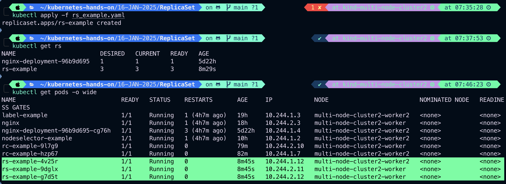

## Imperative way to manage ReplicaSet

1. ### Scale a ReplicaSet
   Example:

```
kubectl get rs && kubectl get pods -o wide
```

```
kubectl scale rs/rs_example --replicas=5
```

Output:
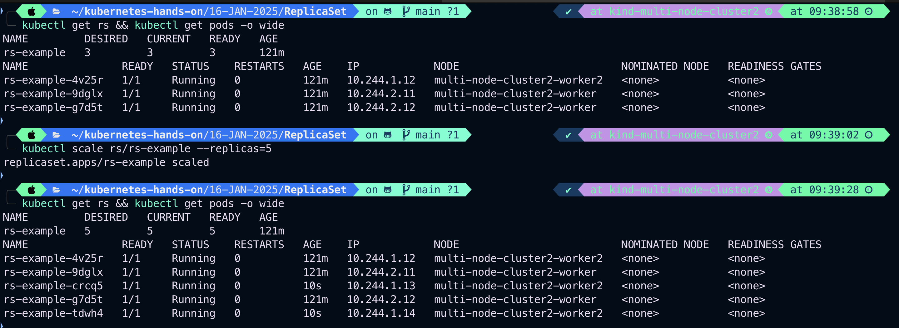

### Scale Down from 5 to 1

```
kubectl scale rs/rs_example --replicas=1
```

Output:
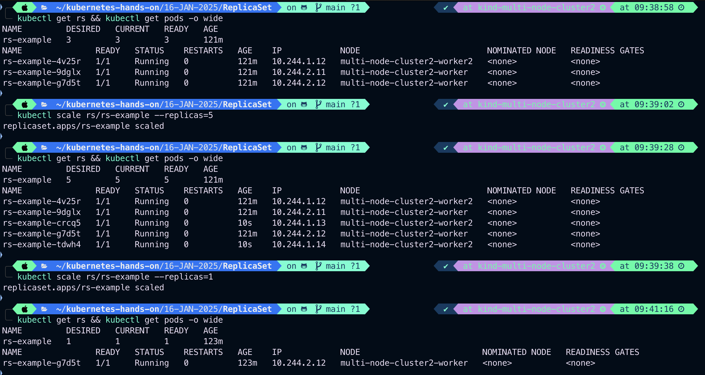

2. ### Update the Image of a ReplicaSet
   Example:

```
kubectl set image rs/rs_example rs-example-container=nginx:1.23.1
```

Explanation:
example-container=nginx:1.23.1 Updates the image of the specified container in the ReplicaSet.

```
kubectl set image rs/<pod-name> <container-name>=<image>:<tag>
```

Output:
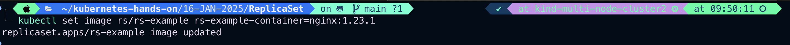

### Verify the image of ReplicaSet

```
kubectl describe rs/rs_example
```

Output:
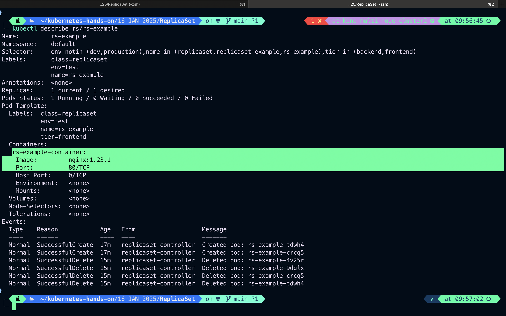

3. Delete a ReplicaSet
   Example:

```
kubectl delete rs/rs_example
```

#### Explanation:Deletes the ReplicaSet named rs-example.

Output:
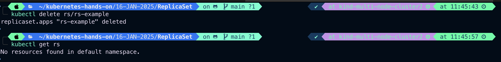

4. Get Details of ReplicaSets

```
kubectl get rs
```

Output:
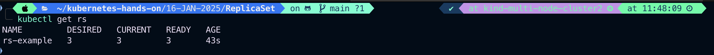

Get detailed information about a ReplicaSet:

```
kubectl describe rs/rs_example
```

Output:
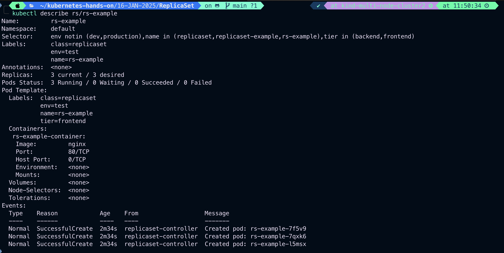

5. Autoscale a ReplicaSet

```
kubectl autoscale rs/rs_example --min=2 --max=10 --cpu-percent=70
```

Explanation:

- --min=2: Minimum number of replicas.
- --max=10: Maximum number of replicas.
- --cpu-percent=70: Scales based on CPU usage.
  Output:
  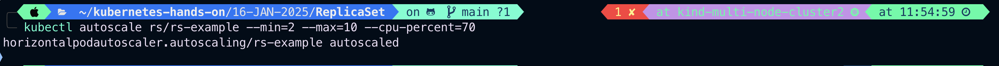
  To test autoscaling in a ReplicaSet, you need an image that consumes CPU or memory resources in a way that simulates a load. The k8s.gcr.io/stress-ng image or ghcr.io/dhruvkp/stress is commonly used for this purpose because it provides tools to generate CPU, memory, or I/O stress.

- Recommended Image
  Image: **_ghcr.io/dhruvkp/stress_** or **_k8s.gcr.io/stress-ng_**
  These images are ideal for testing because you can configure them to generate resource usage, which triggers the Horizontal Pod Autoscaler (HPA).
  Steps to Use the Image

## 1. Define the ReplicaSet YAML

Here’s an example of a ReplicaSet using the stress image to simulate high CPU load:

```
vim rs_stress_test.yaml
```

```
apiVersion: apps/v1
kind: ReplicaSet
metadata:
  name: rs-stress-test
  labels:
    app: stress-test
spec:
  replicas: 3
  selector:
    matchLabels:
      app: stress-test
  template:
    metadata:
      name: rs-stress-test
      labels:
        app: stress-test
    spec:
      containers:
      - name: stress-test-container
        image: k8s.gcr.io/stress-ng
  #     ports:
  #     - containerPort: 80
        args:
        - "--cpu"
        - "2"
        - "--timeout"
        - "300s"
        resources:
          requests:
            cpu: 100m
            memory: 128Mi
          limits:
            cpu: 200m
            memory: 256Mi
```

Here’s a detailed explanation of the YAML file for the ReplicaSet designed to test autoscaling:

### YAML File Breakdown

```
apiVersion: apps/v1
kind: ReplicaSets
```

- apiVersion: apps/v1 : Specifies API version of ReplicaSet Object
- kind: ReplicaSet : Indicates that this is ReplicaSet resource.

#

### Metadata Section

```
metadata:
  name: rs-stress-test
```

name: rs-stress-test :Sets the name of the ReplicaSet to rs-stress-test. This name is used to manage the ReplicaSet and its associated Pods.

#

### Spec Section

```
spec:
  replicas: 3
  selector:
    matchLabels:
      app: stress-test
```

- **_replicas: 3_**: Defines the desired number of replicas (Pods) that the ReplicaSet should maintain.
- **_selector_**: Defines how the ReplicaSet identifies which Pods it manages.
  - **_matchLabels_**: Specifies the labels that the ReplicaSet uses to select the Pods it controls. Here, it looks for Pods with the label app: stress-test.

#

### Template Section

```
template:
  metadata:
    name: rc-stress-test
    labels:
      app: stress-test
```

- **_template_**: Defines the Pod template used to create new Pods.
- **_metadata.labels_**: Assigns the label **_app: stress-test_** to the Pods created by this ReplicaSet. This ensures that the Pods match the selector.

#

### Container Definition

```
spec:
  containers:
  - name: stress-test-container
    image: ghcr.io/dhruvkp/stress
```

- **_containers_**: Lists the containers to run in each Pod.
- **_name_**: stress-container: Sets the name of the container.
- **_image: ghcr.io/dhruvkp/stress_**: Specifies the container image to use, which is the **_stress_** image used for resource stress testing.

#

### Command/Arguments

```
args:
  - "--cpu"
  - "2"
  - "--timeout"
  - "300s"
```

- **_args_**: Specifies command-line arguments for the stress image:
  - **_--cpu 2_**: Runs a stress test that uses 2 CPU cores.
  - **_--timeout 300s_**: Limits the stress test to 300 seconds (5 minutes).

#

### Resource Requests and Limits

```
resources:
  requests:
    cpu: 100m
    memory: 128Mi
  limits:
    cpu: 200m
    memory: 256Mi
```

- **_resources_**:Defines CPU and memory usage for the container:
  - **_requests_**: Guaranteed minimum resources for the container:
    - **_cpu: 100m_**: Requests 100 millicores (10% of a single CPU core).
    - **_memory: 128Mi_**: Requests 128 MiB of memory.
  - **_limits_**:
    - **_cpu: 200m_**: Limits CPU usage to 200 millicores (20% of a single CPU core).
    - **_memory: 256Mi_**: Limits memory usage to 256 MiB.

## 2. Apply the YAML

```
kubectl apply -f rs_stress_test.yaml
```

Output:
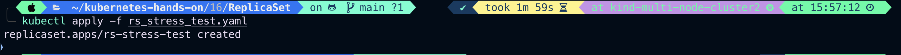

## 3. Create Horizontal Pod Autoscaler (HPA)

### Create an HPA to autoscale the ReplicaSet based on CPU usage:

```
kubectl autoscale rs/rs-stress-test --min=2 --max=10 --cpu-percent=50
```

- **_--min=3_**: Minimum 3 replicas.
- **_--max=10_**: Maximum 10 replicas
- **_--cpu-percent_**: Scale when CPU usage exceeds 50%.

Output:
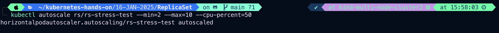

## Monitor the Autoscaling

Use these commands to observe the behavior:

- check HPA(Horizontal Pod Autoscaling) ststus

```
kubectl get hpa
```

Output:
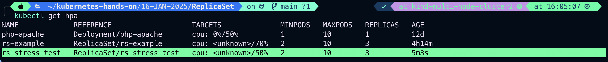

- Check the ReplicaSet:

```
kubectl get rs
```

Output:
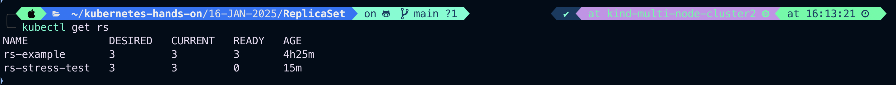

- View resource usage:

```
kubectl top pods
```
