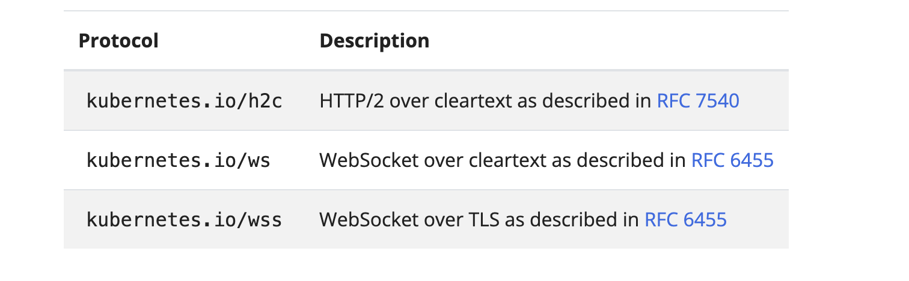

# Service

## Expose an application running in your cluster behind a single outward-facing endpoint, even when the workload is split across multiple backends.

- In Kubernetes, a `Service` is a method for exposing a network application that is running as one or more `Pods` in your cluster.
- If you use a `Deployment` to run your app, that Deployment can create and delete Pods dynamically. From the moment to the next, how many of those Pods are working and healthy; you might not even know what does that healthy Pods are named.
- Kubernetes Pods are created and destroy to match the desire state of your cluster.
- Pods are `ephemeral` resource(you should not expect that individual pod is reliable and durable)
- Each Pod gets its own IP address(Kubernetes expects network plugin to ensure this).
- For a given Deployment in your cluster, the set of Pods running in one moment in time could be different from the set of pods running that application a moment later.
- This leads to a problem: If some set of Pods(call them "backends") provide functionality to other Pods(call them "frontend") inside your cluster, how do the frontend find out and keep track of which IP address to connect to, so the frontend can use the backend part of the workload?

## `Enter Services`

- The `Service API`, part of the Kubernetes, is an abstraction to help you expose group of Pods over a network.
- Each Service object defines a logical set of endpoints(usually these endpoints are Pods) along with a policy about how to make those Pods accessible
- For example, consider a stateless image-processing backend which is running with 3 replicas. Those replicas are fungible—frontends do not care which backend they use. While the actual Pods that compose the backend set may change, the frontend clients should not need to be aware of that, nor should they need to keep track of the set of backends themselves.
  The Service abstraction enables this decoupling.
- The set of Pods targeted by a Service is usually determined by a selector that you define.
- To learn about other ways to define Service endpoints, see [Services without selectors](https://kubernetes.io/docs/concepts/services-networking/service/#services-without-selectors).
- If your workload speaks HTTP, you might choose to use an Ingress to control how web traffic reaches that workload. Ingress is not a Service type, but it acts as the entry point for your cluster. An Ingress lets you consolidate your routing rules into a single resource, so that you can expose multiple components of your workload, running separately in your cluster, behind a single listener.

---

# Cloud-native service discovery

- If you're able to use Kubernetes APIs for service discovery in your application, you can query the API server for matching EndpointSlices. Kubernetes updates the EndpointSlices for a Service whenever the set of Pods in a Service changes.
- For non-native applications, Kubernetes offers ways to place a network port or load balancer in between your application and the backend Pods.

---

# Defining a Service

- A Service is an object (the same way that a Pod or a ConfigMap is an object). You can create, view or modify Service definitions using the Kubernetes API. Usually you use a tool such as kubectl to make those API calls for you.
- For example, suppose you have a set of Pods that each listen on TCP port 9376 and are labelled as app=myapp. You can define a Service to publish that TCP listener:

`service/simple-service.yaml`

```py
apiVersion: v1
kind: Service
metadata:
  name: my-service
spec:
  selector:
    app: myapp # This service manifest file manage Pods labeled app:myapp
  ports:
  - protocol: TCP
    port: 80
    targetPort: 9376 # All Pods with 9376 port exposed by this service object

```

- Applying this manifest creates a new Service named "my-service" with the default ClusterIP service type.
- The Service targets TCP port `9376` on any Pod with the `app: myapp` label.
- Kubernetes assigns this Service an IP address (the cluster IP), that is used by the virtual IP address mechanism.
- For more details on that mechanism, read [Virtual IPs and Service Proxies](https://kubernetes.io/docs/reference/networking/virtual-ips/).
- The controller for that Service continuously scans for Pods that match its selector, and then makes any necessary updates to the set of EndpointSlices for the Service.

> > > `Note:` A Service can map any incoming port to a targetPort. By default and for convenience, the targetPort is set to the same value as the port field.

---

# Port definitions

- Port definitions in Pods have names, and you can reference these names in the targetPort attribute of a Service. For example, we can bind the targetPort of the Service to the Pod port in the following way:

```py
apiVersion: v1
kind: Pod
metadata:
  name: nginx
  labels:
    app.kubernetes.io/name: proxy
spec:
  containers:
  - name: nginx
    image: nginx:stable
    ports:
      - containerPort: 80
        name: http-web-svc

---
apiVersion: v1
kind: Service
metadata:
  name: nginx-service
spec:
  selector:
    app.kubernetes.io/name: proxy
  ports:
  - name: name-of-service-port
    protocol: TCP
    port: 80
    targetPort: http-web-svc
```

## This works even if there is a mixture of Pods in the Service using a single configured name, with the same network protocol available via different port numbers. This offers a lot of flexibility for deploying and evolving your Services.

- For example, you can change the port numbers that Pods expose in the next version of your backend software, without breaking clients.
- The default protocol for Services is TCP; you can also use any other [supported protocol](https://kubernetes.io/docs/reference/networking/service-protocols/).
- Because many Services need to expose more than one port, Kubernetes supports multiple port definitions for a single Service. Each port definition can have the same protocol, or a different one.

---

# Services without selectors

- Services most commonly abstract access to Kubernetes Pods thanks to the selector, but when used with a corresponding set of EndpointSlices objects and without a selector, the Service can abstract other kinds of backends, including ones that run outside the cluster.
- For example:

  - You want to have an external database cluster in production, but in your test environment you use your own databases.
  - You want to point your Service to a Service in a different Namespace or on another cluster.

    - To access a service from a different namespace use `<service-name>.<namespace>.svc.cluster.local`
    - For Example:
      If you have a Service named `backend` in the `backend-ns` namespace, a pod in another namespace can access it using:

      ```sh
      backend.backend-ns.svc.cluster.local
      ```

      `Or in an environment variable:`

      ```sh
      env:
        - name: BACKEND_URL
          value: "http://backend.backend-ns.svc.cluster.local:8080"

      ```

      `Example Deployment YAML:`

      ```py
      apiVersion: apps/v1
      kind: Deployment
      metadata:
        name: frontend
        namespace: frontend-ns
      spec:
        replicas: 2
        selector:
          matchLabels:
            app: frontend
        template:
          metadata:
            labels:
              app: frontend
          spec:
            containers:
            - name: frontend
              image: my-frontend-image
              env:
              - name: BACKEND_URL
                value: "http://backend.backend-ns.svc.cluster.local:8080"
      ```

    # Exposing a Service Across Clusters

    - For inter-cluster communication, use Service Mesh (Istio, Linkerd), Kubernetes Multi-Cluster Services (MCS), or an Ingress Controller.
    - Option 1: Istio Multi-Cluster (East-West Gateway)
      If using Istio, set up an East-West gateway to expose services across clusters. 1. Expose the service in Cluster 1:

      ```py
      apiVersion: networking.istio.io/v1alpha3
      kind: VirtualService
      metadata:
      name: backend
      namespace: backend-ns
      spec:
        hosts:
        - backend.global
        gateways:
        - mesh
        http:
        - route:
          - destination:
              host: backend.backend-ns.svc.cluster.local
      ```

      2. Configure Cluster 2 to access backend.global.

      ```py
      env:
        - name: BACKEND_URL
          value: "http://backend.global:8080"

      ```

      ***

    - ## Option 2: ExternalName Service for External Clusters

      If you have a backend service on another cluster (backend.example.com), you can create an ExternalName service.

      ```py
      apiVersion: v1
      kind: Service
      metadata:
        name: backend
        namespace: frontend-ns
      spec:
       type: ExternalName
       externalName: backend.example.com


      ```

      Now, http://backend inside the cluster resolves to backend.example.com.

  - You are migrating a workload to Kubernetes. While evaluating the approach, you run only a portion of your backends in Kubernetes.
  - In any of these scenarios you can define a Service without specifying a selector to match Pods. For example:

  ```py
  apiVersion: v1
  kind: Service
  metadata:
  name: my-service
  spec:
  ports:
    - name: http
      protocol: TCP
      port: 80
      targetPort: 9376

  ```

- Because this Service has no selector, the corresponding EndpointSlice (and legacy Endpoints) objects are not created automatically. You can map the Service to the network address and port where it's running, by adding an EndpointSlice object manually. For example:
  `endpointslice.yaml`

```py
apiVersion: discovery.k8s.io/v1
kind: EndpointSlice
metadata:
  name: my-service-1 # by convention, use the name of the Service
                     # as a prefix for the name of the EndpointSlice
  labels:
    # You should set the "kubernetes.io/service-name" label.
    # Set its value to match the name of the Service
    kubernetes.io/service-name: my-service
addressType: IPv4
ports:
  - name: http # should match with the name of the service port defined above
    appProtocol: http
    protocol: TCP
    port: 9376
endpoints:
  - addresses:
      - "10.4.5.6"
  - addresses:
      - "10.1.2.3"
```

---

# Custom EndpointSlices

- When you create an [EndpointSlice](https://kubernetes.io/docs/concepts/services-networking/service/#endpointslices) object for a Service, you can use any name for the EndpointSlice. Each EndpointSlice in a namespace must have a unique name. You link an EndpointSlice to a Service by setting the `kubernetes.io/service-name` label on that EndpointSlice.
  > > Note:
  > > The endpoint IPs must not be: loopback (127.0.0.0/8 for IPv4, ::1/128 for IPv6), or link-local (169.254.0.0/16 and 224.0.0.0/24 for IPv4, fe80::/64 for IPv6).

## The endpoint IP addresses cannot be the cluster IPs of other Kubernetes Services, because kube-proxy doesn't support virtual IPs as a destination.

# Accessing a Service without a selector

- Accessing a Service without a selector works the same as if it had a selector. In the example for a Service without a selector, traffic is routed to one of the two endpoints defined in the EndpointSlice manifest: a TCP connection to 10.1.2.3 or 10.4.5.6, on port 9376.

> > > `Note:`

## The Kubernetes API server does not allow proxying to endpoints that are not mapped to pods. Actions such as kubectl port-forward service/<service-name> forwardedPort:servicePort where the service has no selector will fail due to this constraint. This prevents the Kubernetes API server from being used as a proxy to endpoints the caller may not be authorized to access.

- An ExternalName Service is a special case of Service that does not have selectors and uses DNS names instead.

---

# [EndpointSlices](https://kubernetes.io/docs/concepts/services-networking/endpoint-slices/)

- EndpointSlices are objects that represent a subset (a slice) of the backing network endpoints for a Service.
- Your Kubernetes cluster tracks how many endpoints each EndpointSlice represents. If there are so many endpoints for a Service that a threshold is reached, then Kubernetes adds another empty EndpointSlice and stores new endpoint information there. By default, Kubernetes makes a new EndpointSlice once the existing EndpointSlices all contain at least 100 endpoints. Kubernetes does not make the new EndpointSlice until an extra endpoint needs to be added.

---

# [Endpoints](https://kubernetes.io/docs/reference/kubernetes-api/service-resources/endpoints-v1/)

- In the Kubernetes API, an Endpoints (the resource kind is plural) defines a list of network endpoints, typically referenced by a Service to define which Pods the traffic can be sent to.

- The EndpointSlice API is the recommended replacement for Endpoints.

---

# Over-capacity endpoints

- Kubernetes limits the number of endpoints that can fit in a single Endpoints object. When there are over 1000 backing endpoints for a Service, Kubernetes truncates the data in the Endpoints object. Because a Service can be linked with more than one EndpointSlice, the 1000 backing endpoint limit only affects the legacy Endpoints API.
- In that case, Kubernetes selects at most 1000 possible backend endpoints to store into the Endpoints object, and sets an annotation on the Endpoints: endpoints.kubernetes.io/over-capacity: truncated. The control plane also removes that annotation if the number of backend Pods drops below 1000.
- Traffic is still sent to backends, but any load balancing mechanism that relies on the legacy Endpoints API only sends traffic to at most 1000 of the available backing endpoints.

- The same API limit means that you cannot manually update an Endpoints to have more than 1000 endpoints.

---

# Application protocol

> > FEATURE STATE: Kubernetes v1.20 [stable]

- The `appProtocol` field provides a way to specify an application protocol for each Service port. This is used as a hint for implementations to offer richer behavior for protocols that they understand.
  The value of this field is mirrored by the corresponding Endpoints and EndpointSlice objects.
- This field follows standard Kubernetes label syntax. Valid values are one of:
  - IANA standard service names.
  - Implementation-defined prefixed names such as `mycompany.com/my-custom-protocol`.
  - Kubernetes-defined prefixed names:
    

---

# Multi-port Services

- For some Services, you need to expose more than one port. Kubernetes lets you configure multiple port definitions on a Service object. When using multiple ports for a Service, you must give all of your ports names so that these are unambiguous. For example:

```py
apiVersion: v1
kind: Service
metadata:
  name: my-service
spec:
  selector:
    app.kubernetes.io/name: MyApp
  ports:
    - name: http
      protocol: TCP
      port: 80
      targetPort: 9376
    - name: https
      protocol: TCP
      port: 443
      targetPort: 9377
```

> > Note:
> > As with Kubernetes names in general, names for ports must only contain lowercase alphanumeric characters and -. Port names must also start and end with an alphanumeric character.
> > For example, the names 123-abc and web are valid, but 123_abc and -web are not.

---

# Service type

- For some parts of your application (for example, frontends) you may want to expose a Service onto an external IP address, one that's accessible from outside of your cluster.
- Kubernetes Service types allow you to specify what kind of Service you want.
- The available type values and their behaviors are:

  - [ClusterIP](https://kubernetes.io/docs/concepts/services-networking/service/#type-clusterip)

    - Exposes the Service on a cluster-internal IP. Choosing this value makes the Service only reachable from within the cluster. This is the default that is used if you don't explicitly specify a type for a Service. You can expose the Service to the public internet using an [Ingress](https://kubernetes.io/docs/concepts/services-networking/ingress/) or a [Gateway](https://gateway-api.sigs.k8s.io/).
    - Example:
      `ClusterIP`

    ```py
    apiVersion: v1
    kind: Service
    metadata:
      name: backend-service
      namespace: backend-ns  # Namespace where the service is deployed
    spec:
      selector:
        app: backend  # Matches pods with the label app=backend
      ports:
        - protocol: TCP
          port: 80      # Port exposed by the service
          targetPort: 8080  # Port where the backend application runs inside the pod
      type: ClusterIP  # Default type (internal-only service)

    ```

    ***

    `Backend Deployment`

    ```py
    apiVersion: apps/v1
    kind: Deployment
    metadata:
      name: backend
      namespace: backend-ns
    spec:
      replicas: 2
      selector:
        matchLabels:
          app: backend
      template:
        metadata:
          labels:
            app: backend
        spec:
          containers:
          - name: backend
            image: my-backend-image
            ports:
            - containerPort: 8080
    ```

    - Accessing the ClusterIP Service
    - Pods in the same cluster (even in different namespaces) can access the backend-service using:

    1. From a Pod in the Same Namespace

    ```sh
     curl http://backend-service:80

    ```

    2. From a Pod in Another Namespace

    ```sh
    curl http://backend-service.backend-ns.svc.cluster.local:80
    ```

    - Verify the Service
      `To check if the ClusterIP service is running`

      ```sh
      kubectl get svc -n backend-ns
      ```

    ***

  - [NodePort](https://kubernetes.io/docs/concepts/services-networking/service/#type-nodeport) (Must be between 30000-32767)
    - Exposes the Service on each Node's IP at a static port (the NodePort). To make the node port available, Kubernetes sets up a cluster IP address, the same as if you had requested a Service of type: ClusterIP.
  - Example:
    `Deployment YAML`

    ```py
    apiVersion: apps/v1
    kind: Deployment
    metadata:
      name: nginx-deployment
    spec:
      replicas: 2
      selector:
        matchLabels:
          app: nginx
      template:
        metadata:
          labels:
            app: nginx
       spec:
         containers:
         - name: nginx-container
           image: nginx
           resources:
             requests:
                memory: "128Mi"
                cpu: "500m"
             limits:
               memory: "128Mi"
               cpu: "500m"
             ports:
             - containerPort: 80
             env:
             - name: CONTAINER_PORT
               value: "80"
    ```

  ````

  `NodePort Service YAML`

  - This service exposes the NGINX deployment on a NodePort.

  ```py
  apiVersion: v1
  kind: Service
  metadata:
    name: nginx-service
  spec:
    type: NodePort
    selector:
      app: nginx
    ports:
      - protocol: TCP
        port: 80       # Cluster IP Port
        targetPort: 80  # Container Port
        nodePort: 30080 # NodePort (Must be between 30000-32767)


  ````

  `Apply the Configuration`

  ```sh
  kubectl apply -f deployment.yaml
  kubectl apply -f service.yaml
  ```

  `Access the Service`

  - Find the Node IP:

  ```sh
  kubectl get nodes -o wide
  ```

  - Now, access the service using

  ```sh
  http://<NODE-IP>:30080
  ```

  This will serve the NGINX page on your browser.

  - [LoadBalancer](https://kubernetes.io/docs/concepts/services-networking/service/#loadbalancer)

  1. Kubernetes LoadBalancer (YAML)

  - If you're deploying a service in Kubernetes with a LoadBalancer, use the following YAML

  ```py
  apiVersion: v1
  kind: Service
  metadata:
    name: my-loadbalancer
  spec:
    selector:
      app: nginx
    type: LoadBalancer
    ports:
    - protocol: TCP # Protocol Used in this service
      port: 80 # Container Port
      targetPort: 8080 # NodePort (Must be between 30000-32767)


  ```

  2. AWS Elastic Load Balancer (Terraform)

  - If you're using AWS ELB (Application Load Balancer) with Terraform

  ```py
  resource "aws_lb" "example" {
  name               = "my-loadbalancer"
  internal           = false
  load_balancer_type = "application"
  security_groups    = [aws_security_group.lb_sg.id]
  subnets            = aws_subnet.public.*.id
  }

  resource "aws_lb_listener" "http" {
  load_balancer_arn = aws_lb.example.arn
  port              = 80
  protocol          = "HTTP"

  default_action {
    type = "forward"
    target_group_arn = aws_lb_target_group.example.arn
  }
  }

  resource "aws_lb_target_group" "example" {
  name     = "my-target-group"
  port     = 80
  protocol = "HTTP"
  vpc_id   = aws_vpc.main.id
  }
  ```

  This sets up an AWS ALB with an HTTP listener forwarding requests to a target group.

  3. NGINX Load Balancer (Config File)

  - For NGINX as a Load Balancer, use this configuration

  ```py
  http {
    upstream backend {
        server 192.168.1.10;
        server 192.168.1.11;
    }

    server {
        listen 80;
        location / {
            proxy_pass http://backend;
        }
    }
  }


  ```

  4.  Python Load Balancer (Round Robin)

  - If you want a simple Python-based Load Balancer, use this

  ```py
  import random
  from http.server import BaseHTTPRequestHandler, HTTPServer


  backend_servers = ["http://localhost:5001", "http://localhost:5002"]

  class LoadBalancerHandler(BaseHTTPRequestHandler):
  def do_GET(self):
  backend = random.choice(backend_servers)
  self.send_response(302)
  self.send_header('Location', backend)
  self.end_headers()

  server = HTTPServer(('0.0.0.0', 8080), LoadBalancerHandler)
  print("Load Balancer running on port 8080")
  server.serve_forever()
  ```

  - [ExternalName](https://kubernetes.io/docs/concepts/services-networking/service/#externalname)

    - The ExternalName service type in Kubernetes is used to map a service inside a cluster to an external DNS name without proxying traffic. Instead of forwarding requests to a cluster IP, it simply returns the CNAME record (external domain name) to the client, letting it directly connect to the external service.
    - How `ExternalName` Service Works

    1. When a pod or another service tries to access the `ExternalName` service, Kubernetes returns a `CNAME` record instead of a `cluster IP`.
    2. The application running inside the cluster directly resolves and communicates with the external service.
    3. No kube-proxy or load balancing is involved.

    - Key Use Cases

      - Accessing external databases (e.g., AWS RDS, external MySQL/PostgreSQL).
      - Connecting to third-party services like APIs, SaaS, etc.
      - Creating an alias for an external service so that internal applications can use a consistent service name.
      - Example: ExternalName Service for an External Database
        - Let's assume we have an external PostgreSQL database running on database.example.com. We want our Kubernetes applications to connect to it using a Kubernetes service name instead of a raw domain.
      - `Step 1:` Create the ExternalName Service
      - Apply the following YAML manifest

      ```py
      apiVersion: v1
      kind: Service
      metadata:
        name: my-external-db
      spec:
        type: ExternalName
        externalName: database.example.com

      ```

      - `Step 2:` Verify the Service

      ```sh
      kubectl get svc my-external-db

      ```

      - Testing the ExternalName Service

        - Once the service is created, any pod inside the cluster can resolve my-external-db to database.example.com. You can test this using an interactive pod

        ```sh
        kubectl run -it --rm test-pod --image=busybox --restart=Never -- nslookup my-external-db

        ```

      - Connecting Applications to `ExternalName` Service

        - Example: Connecting a Pod to the External Database
        - Modify a pod’s configuration to connect to the database using `my-external-db`

        ```py
        apiVersion: v1
        kind: Pod
        metadata:
          name: app-pod
        spec:
          containers:
          - name: app-container
            image: my-app-image
            env:
              - name: DB_HOST
                value: "my-external-db"
              - name: DB_PORT
                value: "5432"

        ```

        - The application running inside the pod will now connect to `my-external-db:5432`, which resolves to `database.example.com:5432`.

      -
      -
      -
      -
      -
      -

    -
    -
    -
    -
    -
    -

-
-
-
-
-
-
-
-

```

```
