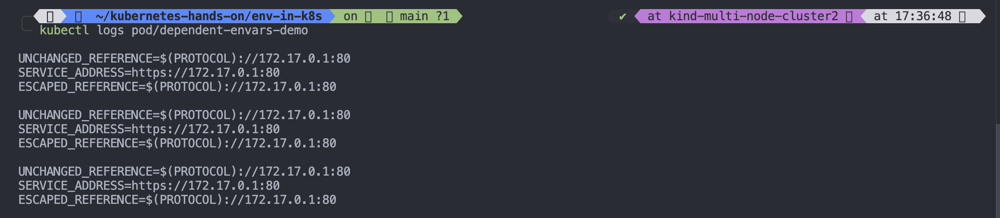

# Define Dependent Environment Variables

## Before you begin

- You need to have a K8s cluster, and the 'kubectl' command line tool must be configured to communicate with your cluster, it is recommended to run with at least two nodes that are not acting as control plane hosts.
-

# Define an environment dependent variable for a container.

- When you create a Pod, you can set dependent environment variables for the container that run in the Pod. To set dependent environment variables you can use $(VAR_NAME) in the 'value' of 'env' in the configuration file.

- Here you create a Pod that run one container. The configuration file for the pod defines a dependent environment variable with common usage defined.

```
apiVersion: v1
kind: Pod
metadata:
  name: dependent-envars-demo
spec:
  containers:
    - name: dependent-envars-demo
      args:
        - while true; do echo -en '\n'; printf UNCHANGED_REFERENCE=$UNCHANGED_REFERENCE'\n'; printf SERVICE_ADDRESS=$SERVICE_ADDRESS'\n';printf ESCAPED_REFERENCE=$ESCAPED_REFERENCE'\n'; sleep 30; done;
      command:
        - sh
        - -c
      image: busybox:1.28
      env:
        - name: SERVICE_PORT
          value: "80"
        - name: SERVICE_IP
          value: "172.17.0.1"
        - name: UNCHANGED_REFERENCE
          value: "$(PROTOCOL)://$(SERVICE_IP):$(SERVICE_PORT)"
        - name: PROTOCOL
          value: "https"
        - name: SERVICE_ADDRESS
          value: "$(PROTOCOL)://$(SERVICE_IP):$(SERVICE_PORT)"
        - name: ESCAPED_REFERENCE
          value: "$$(PROTOCOL)://$(SERVICE_IP):$(SERVICE_PORT)"


```

1. Create a Pod on that manifest

```
kubectl apply -f dependent-envar.yaml
```

2. List the running Pod

```
kubectl get pods
```

3. Check the logs for the container running in your Pod

```
kubectl log pod/dependent-envar.yaml

```

Output:

