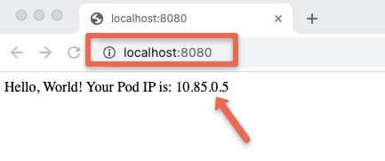

## Init Container Practical Example

- Init containers are defined in the `spec.initContainers` field of a Pod’s manifest. This is similar to a regular `spec.containers` definition. We can define as many containers under `initContainers` section.
- Let's look at a practical example. Here is our user case. We need a Nginx web server pod that shows the Pod IP on the index page.
- Here is how we can utilize init containers to deploy the pod displaying its IP address.
  1. One init container named `write-ip` gets the pod IP using the `MY_POD_IP` env variable populated from the Pod's own status. and writes to an `ip.txt` file inside the `/web-content` volume attached to the pod.
  2. The second init container named `create-html` reads the pod IP from `/web-content/ip.txt`file that contains the pod IP created by the first init container and writes it to `/web-content/index.html` file.
  3. Now, the main nginx container (web-container) mounts the default `/usr/share/nginx/html` to /`web-content` volume where we have the `index.html` file.

```bash
touch init-container.yaml
```

```yaml
apiVersion: v1
kind: Pod
metadata:
  name: web-server-pod
spec:
  initContainers:
    - name: write-ip
      image: busybox
      command:
        [
          "sh",
          "-c",
          "echo $MY_POD_IP > /web-content/ip.txt; echo 'Wrote the Pod IP to ip.txt'",
        ]
      env:
        - name: MY_POD_IP
          valueFrom:
            fieldRef:
              fieldPath: status.podIP
      volumeMounts:
        - name: web-content
          mountPath: /web-content
    - name: create-html
      image: busybox
      command:
        [
          "sh",
          "-c",
          "echo 'Hello, World! Your Pod IP is: ' > /web-content/index.html; cat /web-content/ip.txt >> /web-content/index.html; echo 'Created index.html with the Pod IP'",
        ]
      volumeMounts:
        - name: web-content
          mountPath: /web-content
  containers:
    - name: web-container
      image: nginx
      volumeMounts:
        - name: web-content
          mountPath: /usr/share/nginx/html
  volumes:
    - name: web-content
      emptyDir: {}
```

### Let's deploy this pod.

```bash
kubectl apply -f init-container.yaml

```

Now if you get the pod status, you will see 1/1 container running

```bash
$ kubectl get pods

NAME             READY   STATUS    RESTARTS   AGE
web-server-pod   1/1     Running   0          22s
```

- We had three containers in the pod but only one is in running state. This is because as we discussed before init contianers run to completion. In this case two init contianers created the nginx index HTML page and exited with non-zero exit codes and then the main nginx contianer started running with the custom html page.
- Even though the init containers are not running, we can check the completed container logs. We have added a simple echo command to both the init containers. Let's check the init container logs and see if it has executed successfully.
- As you can see both init containers have executed successfully and shows the echoed message in the logs.

```bash
$ kubectl logs web-server-pod -c write-ip
Wrote the Pod IP to ip.txt

$ kubectl logs web-server-pod -c create-html
Created index.html with the Pod IP

```

- Now, to verify if the Nginx pod is using the custom HTML, lets access the Nginx pod using port forwarding

```bash
kubectl port-forward pod/web-server-pod 8080:80

```

- Now, if you try to access the Nginx app on localhost:8080 from your workstation, you can see the Nginx index page displaying a message with the Pod IP address as shown in the image below.
  

## Adding CPU/Memory Resources

- Init containers require CPU and memory resources to run to complete the specific tasks. The limits and requests can be set up based on the criticality of the tasks.
- If there are several init containers the highest values set for any init container is called the effective init request/limit. Meaning, that if you have an init container without a CPU/Memory limit set, it can use the maximum of the effective init request/limit.
- We can specify CPU and memory resource limits and requests for Init Containers using Kubernetes resource specifications like below:

```yaml
spec:
  initContainers:
    - name: init-container
      image: init-container-image
      resources:
        requests:
          cpu: 50m
          memory: 64Mi
        limits:
          cpu: 100m
          memory: 128Mi
```

- Monitoring and adjusting resource limits based on the actual usage patterns of Init Containers is a good practice to optimize the cluster's resource allocation. However, we have to ensure that the sum of resources requested by Init Containers and main containers does not exceed the available resources on cluster nodes.

## Adding Volumes

- Volumes in Init Containers play a crucial role in performing data setup, initialization, and preparation tasks before the main application containers start running. We can mount volumes in Init containers in the same way.
  -For example, sometimes application may require access to a dataset or files that we don't want to bundle within the container image due to size constraints. In this case, an Init Container can be used to fetch and load these datasets into a shared volume and further, this volume can be used by the main container. Below is the example YAML file:

```yaml
apiVersion: v1
kind: Pod
metadata:
  name: volume-example-pod
spec:
  initContainers:
    - name: download-dataset
      image: busybox
      command:
        ["wget", "-O", "/data/dataset.zip", "https://example.com/dataset.zip"]
      volumeMounts:
        - name: data-volume
          mountPath: /data
    - name: unzip-dataset
      image: busybox
      command: ["unzip", "/data/dataset.zip", "-d", "/data"]
      volumeMounts:
        - name: data-volume
          mountPath: /data
  containers:
    - name: main-app
      image: main-app-image
      volumeMounts:
        - name: data-volume
          mountPath: /app-data
  volumes:
    - name: data-volume
      emptyDir: {}
```

---
