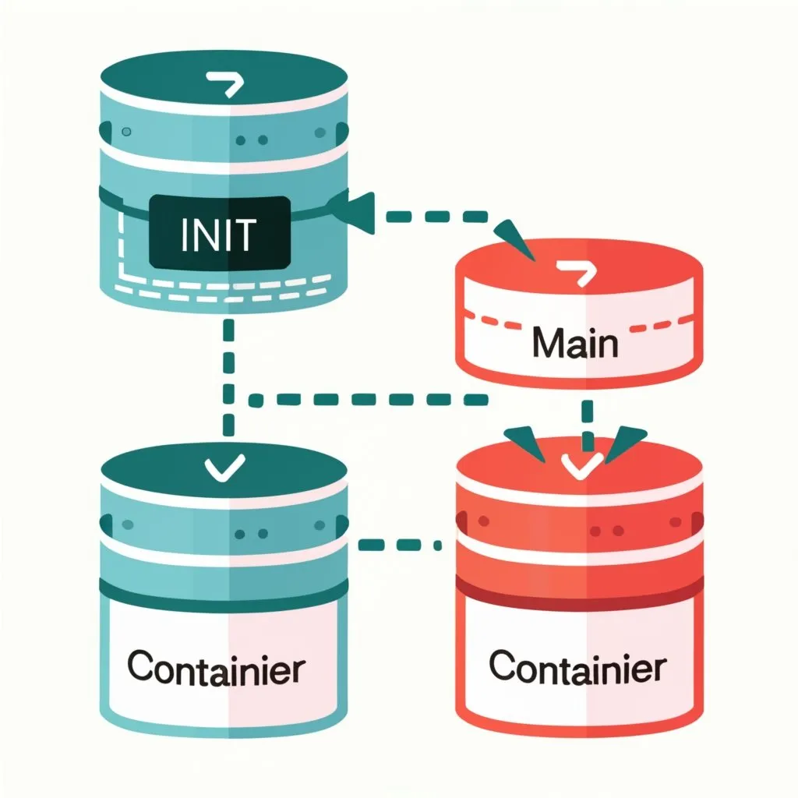
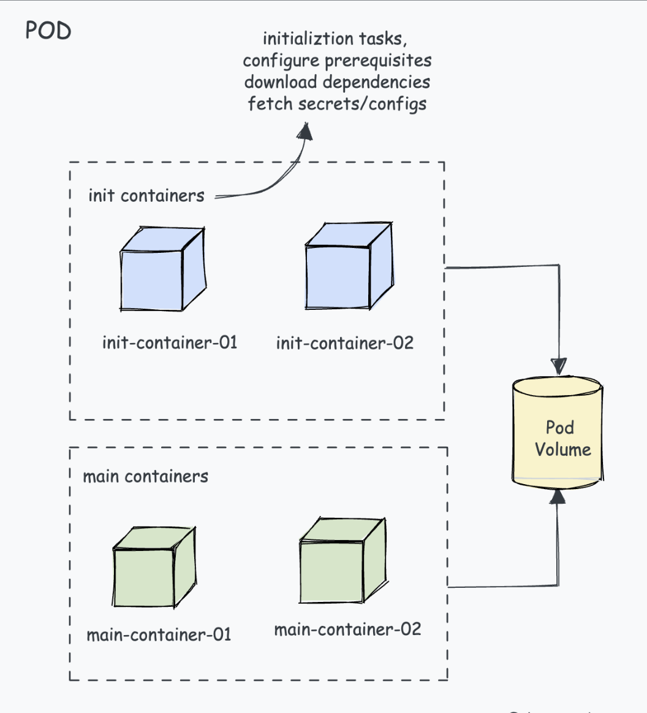
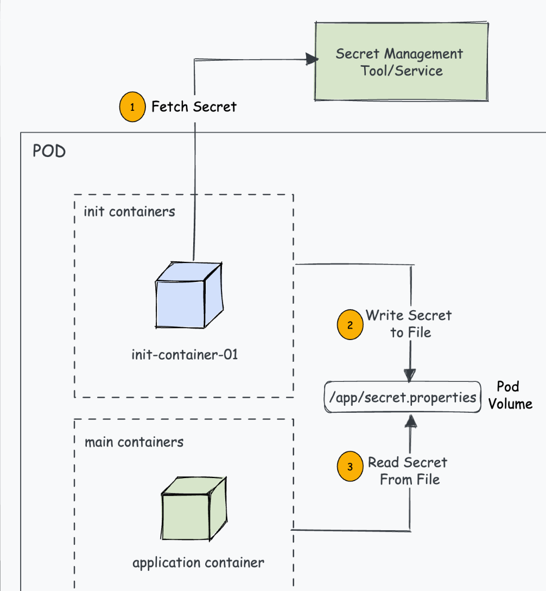
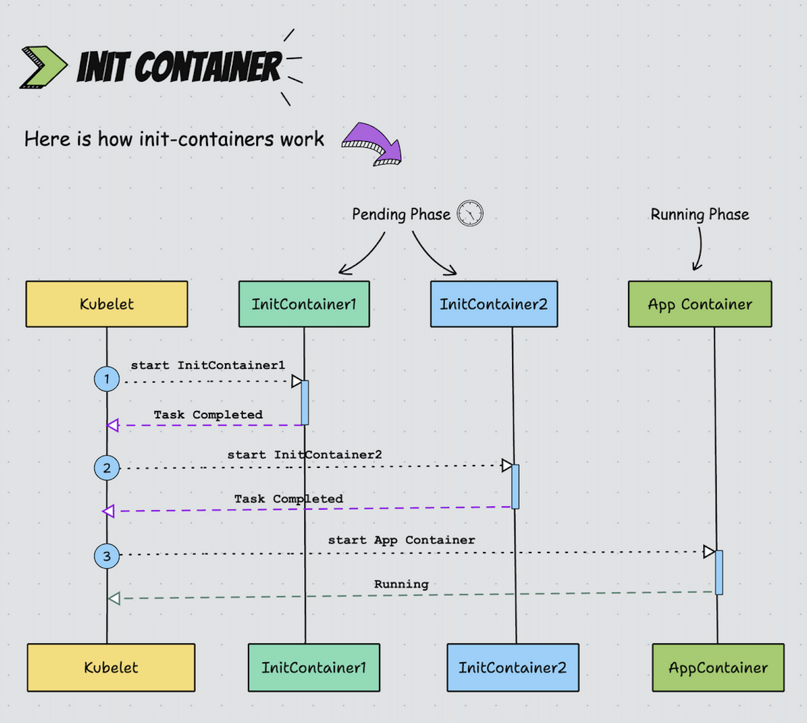
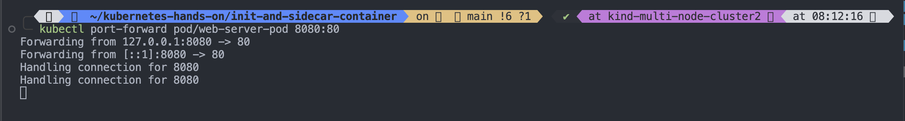
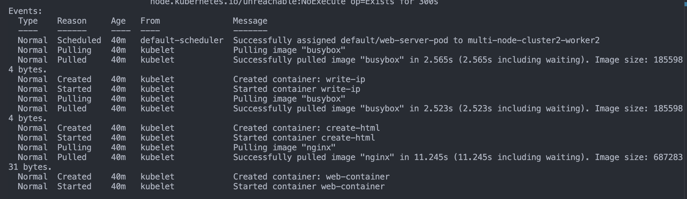
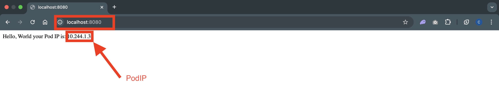
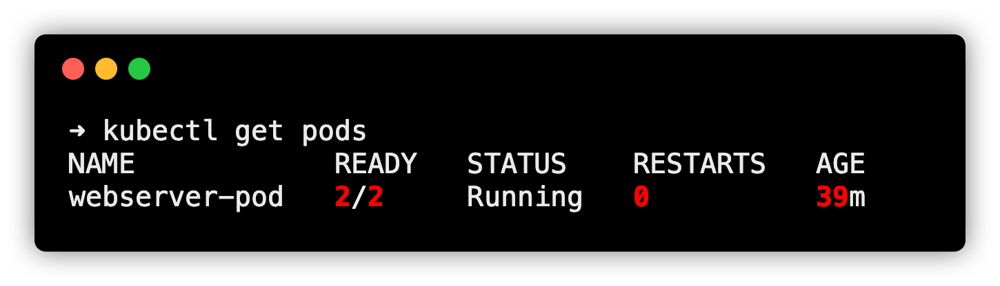

# `init` Container



- Kubernetes pods can have more than one container. These containers in a pod work together to achieve a common goal.
- Init Containers are containers that start and run to completion before starting the main containers in the pod. It acts as a preparatory step, allowing us to perform initialization tasks, configure prerequisites, or configure dependencies required by the application in the main containers.
  

## Let's understand this with an example.

- Let's say we have an application that needs a secret to connect to an API. You can't hardcode this secret into the application or use Kubernetes secrets due to compliance reasons. In this case, you can use an init container to fetch the secret from a secret management service like Vault or AWS Secrets Manager and write it to a location in the pod where the application container can access it.
  
- This way when the application pod starts, it will have access to the secret to connect to the API.
- To put it simply, init containers can ensure your applications are always `properly configured and initialized` before they are started.

## How Init Containers Work?

1. `kubelet` runs the init containers in the order they appear in the Pod's spec ensuring that each container completes its task before starting the next. Meaning only one init container runs at a time, this is also known as the startup order.
2. Init Containers run before the main application containers start.
3. If the Pod is restarted, all its init containers will run again.
4. In the `pods lifecycle`, `init` containers run to completion in the pending phase.
5. Although init containers share the same container specification, they do not support the lifecycle, livenessProbe, readinessProbe, and startupProbe fields. (except for the native sidecar alpha feature)
   

## Init Container Use Cases

- The actual use case of an init container may vary depending on the specific needs of your application. Here are some common use cases:
  1. `Load and Configure Dependencies`:: Init containers can load and configure dependencies needed by the main application container before it starts running.
  2. `Create Database Schema`: You can use the init container to create a database schema.
  3. `Warm Up Cache`: You can warm up a cache using the init container. For example, preloading some frequently used data into the Redis cache.
  4. `Network Configuration`: Init containers can handle tasks such as establishing network configuration or establishing connections to external services.
  5. `Git Clone`: Init containers can clone Git repositories or write files into attached pod volumes.
  6. `Security Checks`: Init containers can perform security checks, such as vulnerability scanning or TLS certificate verification, before starting the main application container.
  7. `Access to Secrets`: Init containers have access to Secrets that application containers cannot, such as retrieving secrets from a vault.
  8. `Environment Setup`:: Init containers can handle tasks such as creating directories, applying permissions, or running custom scripts to set up the environment for the main application.
  9. `Wait for Services`:: Init containers can wait for a service to start before the main application starts.

## Init Container Practical Example

- Init containers are defined in the `spec.initContainers` field of a Pod’s manifest. This is similar to a regular `spec.containers` definition. We can define as many containers under `initContainers` section.
- Let's look at a practical example. Here is our user case. We need a Nginx web server pod that shows the Pod IP on the index page.
- Here is how we can utilize init containers to deploy the pod displaying its IP address.
  1. One init container named `write-ip` gets the pod IP using the `MY_POD_IP` env variable populated from the Pod's own status. and writes to an `ip.txt` file inside the `/web-content` volume attached to the pod.
  2. The second init container named `create-html` reads the pod IP from `/web-content/ip.txt`file that contains the pod IP created by the first init container and writes it to `/web-content/index.html` file.
  3. Now, the main nginx container (web-container) mounts the default `/usr/share/nginx/html` to /`web-content` volume where we have the `index.html` file.

```bash
touch init-container.yaml
```

```yaml
apiVersion: v1
kind: Pod
metadata:
  name: web-server-pod
spec:
  initContainers:
    - name: write-ip
      image: busybox
      command:
        [
          "sh",
          "-c",
          "echo $MY_POD_IP > /web-content/ip.txt; echo 'Wrote the Pod IP to ip.txt'",
        ]
      env:
        - name: MY_POD_IP
          valueFrom:
            fieldRef:
              fieldPath: status.podIP
      volumeMounts:
        - name: web-content
          mountPath: /web-content
    - name: create-html
      image: busybox
      command:
        [
          "sh",
          "-c",
          "echo 'Hello, World! Your Pod IP is: ' > /web-content/index.html; cat /web-content/ip.txt >> /web-content/index.html; echo 'Created index.html with the Pod IP'",
        ]
      volumeMounts:
        - name: web-content
          mountPath: /web-content
  containers:
    - name: web-container
      image: nginx
      volumeMounts:
        - name: web-content
          mountPath: /usr/share/nginx/html
  volumes:
    - name: web-content
      emptyDir: {}
```

### Let's deploy this pod.

```bash
kubectl apply -f init-container.yaml

```

Now if you get the pod status, you will see 1/1 container running

```bash
$ kubectl get pods

NAME             READY   STATUS    RESTARTS   AGE
web-server-pod   1/1     Running   0          22s
```

- We had three containers in the pod but only one is in running state. This is because as we discussed before init contianers run to completion. In this case two init contianers created the nginx index HTML page and exited with non-zero exit codes and then the main nginx contianer started running with the custom html page.
- Even though the init containers are not running, we can check the completed container logs. We have added a simple echo command to both the init containers. Let's check the init container logs and see if it has executed successfully.
- As you can see both init containers have executed successfully and shows the echoed message in the logs.

```bash
$ kubectl logs web-server-pod -c write-ip
Wrote the Pod IP to ip.txt

$ kubectl logs web-server-pod -c create-html
Created index.html with the Pod IP

```

- Now, to verify if the Nginx pod is using the custom HTML, lets access the Nginx pod using port forwarding

```bash
kubectl port-forward pod/web-server-pod 8080:80

```



## Check events

```bash
kubectl describe pod/web-server-pod
```

## 

- Now, if you try to access the Nginx app on localhost:8080 from your workstation, you can see the Nginx index page displaying a message with the Pod IP address as shown in the image below.
  

## Adding CPU/Memory Resources

- Init containers require CPU and memory resources to run to complete the specific tasks. The limits and requests can be set up based on the criticality of the tasks.
- If there are several init containers the highest values set for any init container is called the effective init request/limit. Meaning, that if you have an init container without a CPU/Memory limit set, it can use the maximum of the effective init request/limit.
- We can specify CPU and memory resource limits and requests for Init Containers using Kubernetes resource specifications like below:

```yaml
spec:
  initContainers:
    - name: init-container
      image: init-container-image
      resources:
        requests:
          cpu: 50m
          memory: 64Mi
        limits:
          cpu: 100m
          memory: 128Mi
```

- Monitoring and adjusting resource limits based on the actual usage patterns of Init Containers is a good practice to optimize the cluster's resource allocation. However, we have to ensure that the sum of resources requested by Init Containers and main containers does not exceed the available resources on cluster nodes.

## Adding Volumes

- Volumes in Init Containers play a crucial role in performing data setup, initialization, and preparation tasks before the main application containers start running. We can mount volumes in Init containers in the same way.
  -For example, sometimes application may require access to a dataset or files that we don't want to bundle within the container image due to size constraints. In this case, an Init Container can be used to fetch and load these datasets into a shared volume and further, this volume can be used by the main container. Below is the example YAML file:

```yaml
apiVersion: v1
kind: Pod
metadata:
  name: volume-example-pod
spec:
  initContainers:
    - name: download-dataset
      image: busybox
      command:
        ["wget", "-O", "/data/dataset.zip", "https://example.com/dataset.zip"]
      volumeMounts:
        - name: data-volume
          mountPath: /data
    - name: unzip-dataset
      image: busybox
      command: ["unzip", "/data/dataset.zip", "-d", "/data"]
      volumeMounts:
        - name: data-volume
          mountPath: /data
  containers:
    - name: main-app
      image: main-app-image
      volumeMounts:
        - name: data-volume
          mountPath: /app-data
  volumes:
    - name: data-volume
      emptyDir: {}
```

---

## Native Sidecars Using Init Containers

> `Note`: In Kubernetes 1.28, native sidecar support was introduced using init containers with a new `restartPolicy` field set to `Always`.As of Kubernetes 1.33, native sidecars are now a stable feature.

- Native Sidecar functionality relies on the concept of the "persistent init container," where the initialization process starts with an init container and leverages the `restartPolicy` to empower the capabilities of the sidecar container.
- It starts before the main containers and keeps running for the entire duration of the `Pod's lifecycle`.
- So to make an init container a sidecar, we need to add the "`restartPolicy`: `Always`" attribute to its `spec`. It's an optional field, if the `restartPolicy` is not there the container will act as a regular init container.
- Now let's look at a practical example with a use case.
- Let's assume the following scenario

1. An nginx web server pod with an nginx main container that writes logs to `/var/log/nginx` volume mount.

2. We need a native sidecar fluentd logging agent container that reads all the nginx logs from `/var/log/nginx`.
   > Here is the Pod YAML for the above use case. The nginx-logs volume mount is common for the logging-agent sidecar container and nginx main container. The restartPolicy: Always is added to the logging-agent init container to make it behave like a sidecar container.

```yaml
apiVersion: v1
kind: Pod
metadata:
  name: webserver-pod
spec:
  initContainers:
    - name: logging-agent
      image: fluentd:latest
      restartPolicy: Always # If we don't use `restartPolicy` then this container will be initContainers.
      volumeMounts:
        - name: nginx-logs
          mountPath: /var/log/nginx
  containers:
    - name: nginx
      image: nginx:1.14.2
      ports:
        - containerPort: 80
      volumeMounts:
        - name: nginx-logs
          mountPath: /var/log/nginx
  volumes:
    - name: nginx-logs
      emptyDir: {}
```

- To test it, save it as sidecar.yaml and deploy it using kubectl.

```bash
kubectl apply -f sidecar.yaml

```

Now if you check the pod status, you can use 2/2 contianers are in running status. One is the native sidecar init container and the other one is the main Nginx container.


### Overall, the native sidecar containers have the following key properties:

1. `Dedicated lifecycle`: Native Sidecar containers have a dedicated lifecycle which is independent of the lifecycle of the main containers in the Pod

2. It doesn't block the Pod's termination as non-native sidecars do.

3. `Lifecycle Handlers and Probes`: We can add PostStart and PreStop lifecycle handlers and probes (startup, readiness, liveness) to ensure sidecar readiness & pod readiness.

## Comprehensive Init Container YAML

- Let's see what an Init Container object YAML file looks like if we add all the supported parameters. To get information on all the supported fields you can use the following kubectl command.

```bash
kubectl explain pod.spec.initContainers
```

Below is the comprehensive Init Container YAML.

```yaml
spec:
  initContainers:
    - name: init-container
      image: busybox:latest
      command:
        - "sh"
        - "-c"
        - "echo Initializing... && sleep 5"
      imagePullPolicy: IfNotPresent
      env:
        - name: INIT_ENV_VAR
          value: "init-value"
      resources:
        limits:
          memory: "128Mi"
          cpu: "500m"
        requests:
          memory: "64Mi"
          cpu: "250m"
      volumeMounts:
        - name: init-container-volume
          mountPath: /init-data
      ports:
        - containerPort: 80
      securityContext:
        runAsUser: 1000
        runAsGroup: 1000
        capabilities:
          add: ["NET_ADMIN"]
      readinessProbe:
        httpGet:
          path: /
          port: 80
        initialDelaySeconds: 5
        periodSeconds: 10
      livenessProbe:
        httpGet:
          path: /
          port: 80
        initialDelaySeconds: 15
        periodSeconds: 20
      startupProbe:
        httpGet:
          path: /
          port: 80
        initialDelaySeconds: 5
        periodSeconds: 5
      lifecycle:
        postStart:
          exec:
            command: ["/bin/sh", "-c", "echo 'PostStart'"]
        preStop:
          exec:
            command: ["/bin/sh", "-c", "echo 'PreStop'"]
      restartPolicy: Always
  volumes:
    - name: init-container-volume
      emptyDir: {}
```

There are also other fields like workingDir, volumeDevices, resizePolicy related to init container volumes.

# Init Container Functions

The following are some of the key functions of the Init container

1. The Init containers will complete all the dependent tasks before starting the main container.
2. The temporary volume created by the Init container to store the configuration can be used as the persistent storage for the main container, even if the Init container task is completed.
3. For databases, the Init container can fetch and store all the schemas and tables, so that the database container can directly access them when it starts.
4. Init containers can ensure the external service availability before the main application starts to communicate with them.

# Init Container Best Practices

Below are some of the best practices to follow:

1. Ensure init containers are designed to do specific tasks quickly without using too many resources.
2. If you have multiple initialization tasks, use separate init containers for each task. This helps manage and troubleshoot them individually.
3. Init containers can fail, so plan for that. Implement retries, back-off strategies, and clear error messages to diagnose and resolve issues effectively.
4. Take advantage of the pre-run and post-run hooks provided by Kubernetes to run custom scripts or commands during specific phases of a container's lifecycle.
5. Protect sensitive information used during initialization and avoid disclosure.
6. Make sure the init containers have enough resources allocated. A lack of resources can cause initialization tasks to fail or be delayed.

# Init Container vs Sidecar Container

1. Init Container performs tasks that need to be completed before the main container can start while the Sidecar Container provides supplementary functionality to the main container.
2. Init Container doesn't share the same network and storage resources as the main container while Sidecar Container shares the same.
3. Init Container executes sequentially and completes before the main container starts. On the other hand, the Sidecar Container starts, runs, and terminates alongside the main container.
4. The Init Container ensures that the main container starts with the necessary prerequisites while the Sidecar Container directly affects the behavior and functionality of the main container.
5. Init Containers can be used to set up the environment for the main application such as downloading configuration files or initializing shared volumes. Sidecar Containers can be used for tasks such as logging data to external systems, collecting metrics, or handling security-related functions.

---

# Init Containers FAQs

Let’s look at some frequently asked questions based on Init Containers.

## What's the difference between Init Containers and Regular Containers?

The main distinction between Init Containers and Regular Containers is their purpose and lifecycle. Init Containers focus on initialization tasks and ensuring readiness, while Regular Containers handle the core application logic and functionality.

## Can I have multiple init containers in a pod?

Yes, you can have multiple init containers in a pod. They execute sequentially, with each init container completing before the next one starts.

## What's the difference between Init Containers and Sidecar Containers?

Init Containers focus on the initialization task of preparing the environment for the main container, while Sidecar Containers provide additional features and services that work with the main container to enhance its functionality throughout its lifetime.
