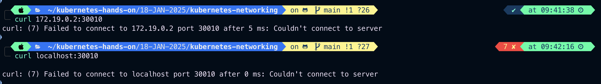

# Kubernetes Networking, services, NodePort and Volumes

Kubenetes Networking addresses four concerns

1. Container within Pod use networking to communicate via loopback.
   
   
2. Cluster networking provides communication between different Pods.
3. The service resources lets you expose an application runnint on a Pod to be reachable from outside your cluster.
4. You can also use services to publish services only for consumption inside your cluster container to container communication on same pod happen through localhost within the container.

#

#### Container within Pod use networking to communicate via loopback.

Example:

```
vim container-networking.yaml
```

```
apiVersion: v1
kind: Pod
metadata:
  name: container-networking
  labels:
    name: container-networking
    class: Pod
    env: test
    app: httpd
spec:
  containers:
  - name: ubuntu-container
    image: ubuntu
    command: ["/bin/bash", "-c", 'while true; echo 'You are in the ubuntu container; sleep 60; true']
    ports:
    - containerPort: 8000
  - name: httpd-container
    image: httpd
    ports:
    - containerPort: 3000
```

Output:


### Lets exec into ubuntu container and try acces httpd container

```
kubectl get pods -o wide
```

Output:


## The CrashLoopBackOff status indicates that one of the containers in your pod is repeatedly failing to start or run properly. Let’s diagnose and resolve the issue.

### Steps:

1. Describe the Pod

```
kubectl describe pod/container-networking
```

Output:


2. Check Pod Logs
   Since you have two containers (ubuntu-container and httpd-container), check the logs of the failing container. Identify which container is crashing.

```
kubectl logs pod/container-networking -c ubuntu-container
```


or

```
kubectl logs pod/container-networking -c httpd-container
```

From step 1 we can see clearly our ubuntu container we are getting **_CrashLoopBackOff_** error

```
kubectl logs pod/container-networking -c ubuntu-container
```


Now we got the issue cause in command field in ubuntu-container

## error-

**_/bin/bash: -c: line 1: unexpected EOF while looking for matching `''_**

Replace

```
command: ["/bin/bash", "-c", "while true; do echo 'You are in the ubuntu container'; sleep 60; done"]

```

to

```
args: ["-c", "while true; do echo 'You are in the ubuntu container'; sleep 60; done"]

```

### Port Conflict:

- Both containers use ports (8000 and 3000). Ensure these ports are not conflicting or being used by other applications.

### Image Issues:

- Check if the specified images (ubuntu and httpd) are valid and accessible from your Kubernetes nodes.

### Resources

Insufficient CPU or memory might cause container crashes. Add resource requests and limits:

```
resources:
  requests:
    memory: "64Mi"
    cpu: "250m"
  limits:
     memory: "128Mi"
     cpu: "500m"
```

```
vim container-networking.yaml
```

```
apiVersion: v1
kind: Pod
metadata:
  name: container-networking
  labels:
    name: container-networking
    class: Pod
    env: test
    app: httpd
spec:
  containers:
  - name: ubuntu-container
    image: ubuntu
    command: ["/bin/bash", "-c", "while true; do echo 'You are in the nginx container'; sleep 20; done"]
    ports:
    - containerPort: 8000
  - name: httpd-container
    image: httpd
    ports:
    - containerPort: 80
```

# Update YAML and Reapply

```
kubectl delete pod/container-networking
kubectl apply -f multi-container-networking.yaml
```


```
kubectl get pods -o wide
```


# exec into ubuntu-container and acess httpd-container

```
kubectl exec -it pod/container-networking -c ubuntu-container -- sh
```

```
apt update
apt install curl
curl localhost:80
exit
```

Output:


#

# Now try to establish connection between two different Pods within the same machine

In Kubernetes, each Pod has an IP address. A Pod can communicate with another Pod by directly addressing its IP address, but the recommended way is to use Services.
A Service is a set of Pods, which can be reached by a single, fixed DNS name or IP address.

- Pod to Pod communication on same worker node happens through **_Pod IP_**
- By default Pod IP is not accessible outside the node.

Example:

### Create two pods on the same node

```
kubectl get nodes -o wide
```


### Label resion=us-east-1 on multi-node-cluster2-worker

```
kubectl label node multi-node-cluster2-worker resion=us-east-1
```


### Create first pod file named- nginx-pod.yaml, should schedule on multi-node-cluster2-worker node, Here we will use nodeSelector to schedule this pod on multi-node-cluster2-worker

```
vim nginx-pod.yaml
```

```
apiVersion: v1
kind: Pod
metadata:
  name: nginx-pod
  labels:
    env: test
    class: pod
spec:
  containers:
  - name: nginx-container
    image: nginx
    ports:
    - containerPort: 8080
  nodeSelector:
    resion: us-east-1
```

### Create second pod file named httpd-pod.yaml, should schedule on multi-node-cluster2-worker, here we will use Node Affinity to schedule this pod on multi-node-cluster2-worker

```
vim httpd-pod.yaml
```

```
apiVersion: v1
kind: Pod
metadata:
  name: httpd-pod
  labels:
    env: test
    class: pod
spec:
  affinity:
    nodeAffinity:
      requiredDuringSchedulingIgnoredDuringExecution:
        nodeSelectorTerms:
        - matchExpressions:
          - key: resion
            operator: In
            values:
            - us-east-1
  containers:
  - name: httpd-container
    image: httpd
    ports:
    - containerPort: 80
```

### Apply nginx-pod.yaml and httpd-pod.yaml

```
kubectl apply -f nginx-pod.yaml
```


```
kubectl apply -f httpd-pod.yaml
```


#

## Lets get inside nginx-pod and try to access httpd-pod

First check the IP address of the nginx-pod and httpd-po

```
kubectl get pods -o wide
```


### For nginx-pod

```
kubectl exec -it pod/nginx-pod -c nginx-container -- sh
```

inside the nginx-container

```
apt update && apt install curl
curl 10.244.2.11:80
```

Output:


### For httpd-pod

```
kubectl exec -it pod/httpd-pod -c httpd-container -- sh

```

Inside the httpd-container

```
apt update && apt install curl
curl 10.244.2.13:80
```

Output:


#

# Service in Kubernetes

Each Pod gets it's own IP address, however in a deployment the set of Pods running in one moment in time could be different from the set of pods running that application a moment later.

This leads to a problem: If some set of Pods(call them 'backends') provides functionality to other Pods('Call them frontend') inside your cluster, how do the frontend find out and keep track of which IP address to connect, so that the frontend can use the backend parts of the workloads.


- When using RC(ReplicationController), Pods are terminated and created during scaling or replication operation.
- When using **_Deployment_**, while updating the image version the Pods are terminated and new Pods takes the place of other Pods
- Pods are very dynamic i.e they come and go on the K8S cluster and on any of the available nodes & it would be
  difficult to acess the Pods as the Pods IP changes once it is recreate.
- **_Service Object_** is a logical bridge between Pods and end users, which provides virtual IP (VIP)
- **_service_** allows client to reliably connect to the container running in the Pod using the **VIP** .
- The **_virtual IP (VIP)_** is not the actual IP connected to a network interface, but it's purpose is purely to forward traffic to one or more Pods.
- **_kube proxy_** is one which keep the mapping between the
  **_virtual IP(VIP)_** and the Pods up to date, which Queries the **_API SERVER_** to learn about new services in the cluster.
- Although each Pod has a unique IP address, Thos IP address is not expose outside the cluster.
- services helps to expose the VIP mapped to the Pod and allows application to receice traffic.
- Labels are used to select which are the Pods to be put under a Service.
- Getting a Service will create an endpoint to access the Pod/application in it.
- **_Services_** can be exposed in different ways by specifying the type in the **_service spec:_**
  - ClusterIP
    
  - NodePort
    
  - LoadBalancer: Creted by cloud providers that will route external traffic to every node on the NodePort(eg- ELB on AWS)
    
  - Headless: Creates several endpoints that are used to produse **_DNS Record_** is bound to a Pod.
  - By defaul **_service can run only between ports: 30000 to 32767 _**
  - The set of Pods targeted by a **_Service_** is usually determined by a **Selector**

#

# All service in one pic


#

# Services: Cluster IP

- Exposes virtual ip only reachable from within the cluster.
- Mainly used to communicate between components of Microservices.
  
  

Example:
Create one Deployment with nginx image

```
vim deploynginx.yaml
```

```
apiVersion: apps/v1
kind: Deployment
metadata:
  name: deployment-example-nginx
  labels:
    env: test
    class: deployment
    type: frontend
    app: nginx
    kind: Deployment
spec:
  replicas: 2
  selector:
    matchLabels:
      env: test
      class: deployment
      app: nginx
      kind: Deployment
  template:
    metadata:
      name: deployment-example-nginx
      labels:
        env: test
        class: deployment
        type: frontend
        app: nginx
        kind: Deployment
    spec:
      containers:
      - name: nginx-deploy-container
        image: nginx
        ports:
        - containerPort: 80
```

Apply it

```
kubectl apply -f deploynginx.yaml
```


```
kubectl get pods -o wide
```


```
kubectl get pods --show-labels
```


### create clusterIP service to communicate internally

```
vim clusterip-service.yaml
```

```
apiVersion: v1
kind: Service
metadata:
  name: clusterip-service
  labels:
    env: test
    class: service
    type: frontend
    kind: Service
spec:
  type: ClusterIP     # Specifies the service type i.e ClusterIP or NodePort
  selector:
    kind: Deployment   # Apply this service to any pods which has the specific label
  ports:
  - port: 80     #Containers port exposed
    targetPort: 80   # Pods port

```

### Apply clusterip-service.yaml

```
kubectl apply -f clusterip-service.yaml
```


```
kubectl get svc
```


### Connect Pods through cluster IP service -10.96.2.243:80

### Get inside the deployment container

```
kubectl exec -it deploy/deployment-example-nginx -c nginx-deploy-container -- sh
```

Now try to connect through ClusterIP

```
curl 10.96.2.243:80
```


### Lets delete one of the pod, the another replica will get added at the place of deleted pod which will have different IP from the deleted one

```
kubectl get pods -o wide
```

```
kubectl delete pod/deployment-example-nginx-6bd8599c84-kcchv
```

```
kubectl get pods -o wide
```


We can see a new pod get scheduled with new IP, now let get inside the nginx-deploy-container and try to connect now with pods using **_ClusterIP_** :**_port-number_**

```
kubectl exec -it deploy/deployment-example-nginx -c nginx-deploy-container -- sh
```

```
curl 10.96.2.243:80
```


### ClusterIP used only for internal communication between pods where we don't need to worry about Pod IP , just need ClusterIP:port-number

Note: We can't connect with pods using ClusterIP from outside of cluster.

### Imperative way to create ClusterIp service

```
kubectl create service clusterip NAME --tcp=<port>:<targetPort>
```

we can use **_service_** or **_svc_**

```
kubectl create svc clusterip clusterip-service --tcp=80:80
```

### To generate yaml file through Imperative way

```
kubectl create svc clusterip clusterip-service --tcp=80:80 --dry-run=client -o yaml > clusterip-service.yaml
```

### To generate json file through Imperative way

```
kubectl create svc clusterip clusterip-service --tcp=80:80 --dry-run=client -o json > clusterip-service.json
```

To connect from outside of the cluster we have to use NodePort service

#

#

# NodePort

- Make a service accessible from outside the cluster
- Expose the service on the same port of each selected node in the cluster using **NAT**
  
  
  
  
  
  Example

```
vim deploynginx.yaml
```

```
apiVersion: apps/v1
kind: Deployment
metadata:
  name: deployment-example-nginx
  labels:
    env: test
    class: deployment
    type: frontend
    app: nginx
    kind: Deployment
spec:
  replicas: 2
  selector:
    matchLabels:
      env: test
      class: deployment
      app: nginx
      kind: Deployment
  template:
    metadata:
      name: deployment-example-nginx
      labels:
        env: test
        class: deployment
        type: frontend
        app: nginx
        kind: Deployment
    spec:
      containers:
      - name: nginx-deploy-container
        image: nginx
        ports:
        - containerPort: 80
```

### Apply deploynginx.yaml

```
kubectl apply -f deploynginx.yaml
```

```
kubectl get pods -o wide
```


### now create NodePort service to access deployment-example-nginx pod

```
vim nodeport-service.yaml
```

```
apiVersion: v1
kind: Service
metadata:
  name: nodeport-service
  labels:
    class: service
    env: test
    tier: frontend
spec:
  type: NodePort
  selector:
    kind: Deployment
    app: nginx
    env: test
  ports:
  # Optional field
  # By default and for convenience, the Kubernetes control plane
  # will allocate a port from a range (default: 30000-32767)
  - nodePort: 30010
    port: 80
    # By default and for convenience, the `targetPort` is set to
    # the same value as the `port` field.
    targetPort: 80
```

### Apply nodeport-service.yaml

```
kubectl apply -f nodeport-service.yaml
```


```
kuibectl get svc
```


### lets try to connect deployment-example-nginx pod using NodePort service IP: curl <node-IP>:<nodePort-IP>

- Check Service Endpoints
  Ensure the service is correctly mapping to the Pod

```
kubectl kubectl get endpoints nodeport-service
```


```
kubectl get nodes -o wide
```


```
curl 172.19.0.2:30010
curl localhost:30010
```



### Our Pods are not accessible from outside of cluster, even though we apply nodeport-service.yaml,

Here we are using **_kind cluster_** ,
ensure your cluster configuration has proper port mappings.

```
kind: Cluster
apiVersion: kind.x-k8s.io/v1alpha4
nodes:
- role: control-plane
  extraPortMappings:
  - containerPort: 30010
    hostPort: 30010
    protocol: TCP

```

### Recreate the cluster with the updated configuration.

```
kind get clusters
```


### Lets create a new cluster and apply deployngix.yaml and nodeport-service.yaml in new cluster and then connect with the same localhost:<nodePort-IP> you can check thin in terminal as well as in any of your fav. browser

```
vim multinode-cluster.yaml
```

```
apiVersion: kind.x-k8s.io/v1alpha4
kind: Cluster
name: multinode
nodes:
- role: control-plane
  extraPortMappings:
  - containerPort: 30010
    hostPort: 30010
    protocol: TCP
- role: worker
- role: worker
- role: worker
```

```
kind create cluster --config multinode-cluster.yaml
```

```
kubectl cluster-info --context kind-multinode
```


```
kubectl config get-contexts
```


```
kubectl config current-context
```


### App apply deployngix.yaml and nodeport-service.yaml in the **_current context which is kind-multinode_**

```
kubectl apply -f deploynginx.yaml
```

```
kubectl apply -f nodeport-service.yaml
```

```
kubectl get nodes -o wide
```

```
kubectl get svc
```


```
curl localhost:30010
```


### Describe nodePort service to check the details

```
kubectl describe svc/nodeport-service
```


#

# LoadBalancer Service
