# Day 24/40 - Kubernetes RBAC Continued - Clusterrole and Clusterrole Binding

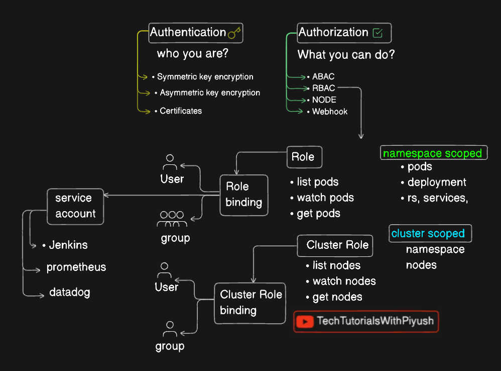

### Notes and key takeaways from the video

**Roles & Role Bindings: Granting Permissions**

Think of roles as job descriptions defining user or group actions. Role bindings link these roles to specific users or groups, granting them those permissions.

- **Roles:** Define permissions within a namespace.
  - Example: A "developer" role might allow getting, viewing, and deleting pods, as well as creating and viewing secrets.
- **Role Bindings:** Connect roles to users or groups.

**Cluster Roles: Expanding Permissions Beyond Namespaces**

Cluster roles are like superpowered roles that can access resources across all namespaces. This includes powerful stuff like managing nodes, persistent volumes (PVs), certificate signing requests (CSRs), and even namespaces.

- **Check Available Resources:** Use

```
kubectl api-resources namespaced=false
```

to see cluster-scoped resources. Replace `false` with `true` to check the namespace-scoped resources.

```
kubectl api-resources namespaced=false
```

**Cluster Role Bindings: Linking Users to Cluster Roles**

Like role bindings, cluster role bindings connect users or groups to cluster roles, granting cluster-wide permissions.

### Commands to create cluster role and cluster role binding

[Using RBAC Authorization](https://kubernetes.io/docs/reference/access-authn-authz/rbac/)

```
kubectl create clusterrole node-reader --verb=get,list,watch --resource=nodes
```

```
kubectl create clusterrolebinding node-reader-binding --clusterrole=node-reader --user=adam
```

**Key Points:**

- Roles are namespace-scoped, while cluster roles are cluster-wide.
- Use role bindings and cluster role bindings to assign permissions to users or groups.
- Carefully manage permissions to ensure security and prevent unauthorized access.

#

# Useful Commands

## To check wheter I have access or not

```
kubectl auth can-i get pod
```

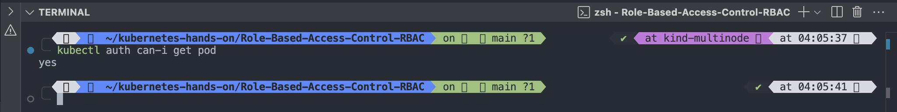

#

## To check which User am I

```
kubectl auth whoami
```

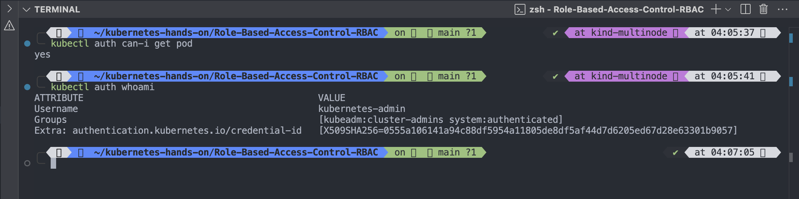

#

```
kubectl auth --help
```

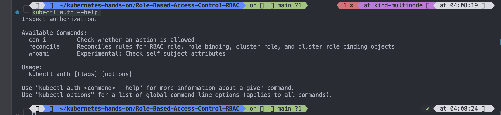

#

## To list all users

```
kubectl config get-users

```

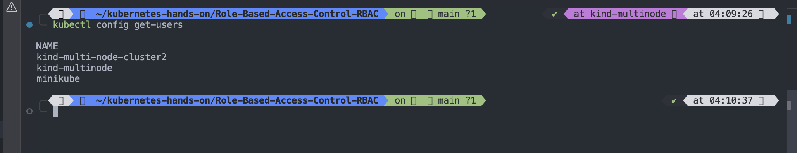

#

# To create Role

## Here's an example Role in the "default" namespace that can be used to grant read access to pods:

```
apiVersion: rbac.authorization.k8s.io/v1
kind: Role
metadata:
  namespace: default
  name: pod-reader
rules:
- apiGroups: [ "" ] # Indicates the core API group
  resources: [ "pods" ]
  verbs: [ "get", "watch", "list" ] # Read only access to the pods

```

## To apply role.yaml

```
kubectl apply -f ./yaml-file/role.yaml
```

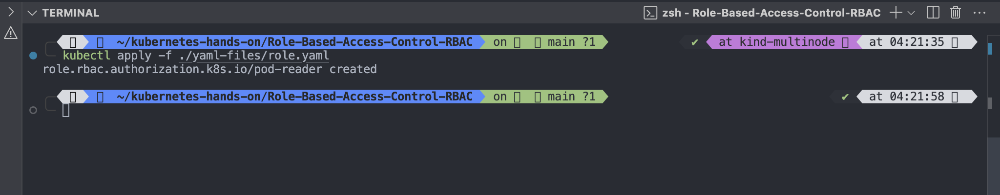

#

## To list all Role

```
kubectl get role
```

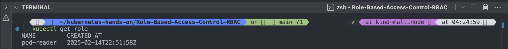

#

## Like any other K8S object we can describe Role as well

```
kubectl describe role/pod-reader
```

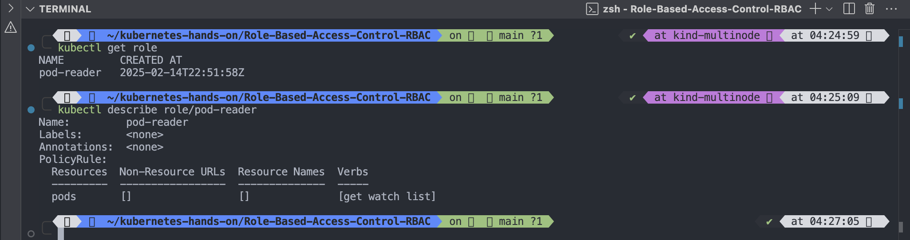

#

## We have created Role now need to create rolebinding.

## RoleBinding examples

- Here is an example of a RoleBinding that grants the "pod-reader" Role to the user "rajeev" within the "default" namespace. This allows "rajeev" to read pods in the "default" namespace.

```
vim rolebinding-with-role.yaml
```

```
apiVersion: rbac.authorization.k8s.io/v1
# This role binding allows "jane" to read pods in the "default" namespace.
# You need to already have a Role named "pod-reader" in that namespace.
kind: RoleBinding
metadata:
  name: read-pods
  namespace: default
subjects:
# You can specify more than one "subject"
- kind: User
  name: jane # "name" is case sensitive
  apiGroup: rbac.authorization.k8s.io
roleRef:
  # "roleRef" specifies the binding to a Role / ClusterRole
  kind: Role #this must be Role or ClusterRole
  name: pod-reader # this must match the name of the Role or ClusterRole you wish to bind to
  apiGroup: rbac.authorization.k8s.io

```

### Apply rolebinding-with-role.yaml

```
kubectl apply -f rolebinding-with-role.yaml
```

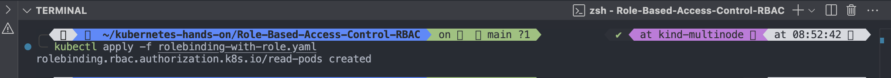

#

### To list all rolebinding

```
kubectl get rolebinding
```

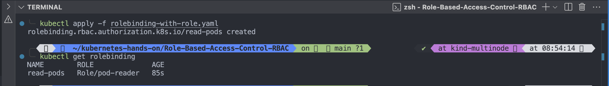

#

### To get more details of rolebinding

```
kubectl describe rolebinding/read-pods
```


#

# Now check whether rajeev user is able to get pods

```
kubectl auth can-i get pod --as rajeev
```

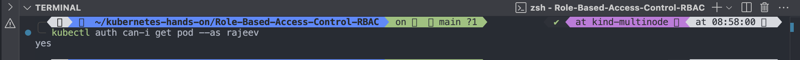

#

# Now the next part is, we have to login a rajeev and we have to get the pod

```
kubectl config set-credentials rajeev \
> --client-key=rajeev.key \
> --client-certificate=rajeev.crt \
> --embed-certs=true
```

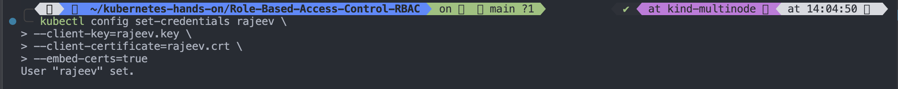

#

# Now we have to set the context

```
kubectl config set-context rajeev --cluster=kind-multinode \
> --user=rajeev
```

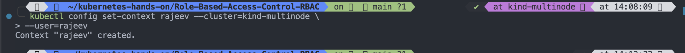

#

# List all context

```
kubectl config get-contexts
```

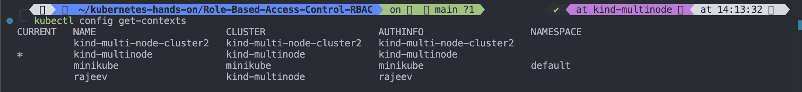

#

# Now let's switch the context from kind-multinode to rajeev to get login as rajeev to check whether pod details are accessible or not

```
kubectl config use-context
kubectl config get contexts
```


#

# Now let's see which user I have used to login

```
kubectl auth whoami
```

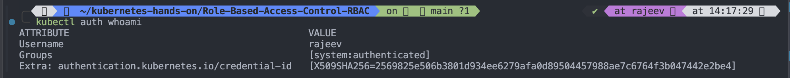

#

# Now let's check the pod if created then will get details

```
kubectl get po
```

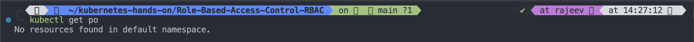

#

# Let's try to do something which user rajeev is not allowed

```
kubectl get ns
kubectl get deploy -o wide -n development
```

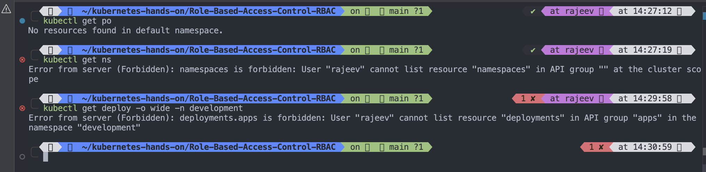
rajeev has only access to get,list and watch

#

#

#

#

#

# How to generate and issue certificate for a USER, Follow below steps

## 1. Generate a PKI private key and CSR and name it as rajeev.key and rajeev.csr

- To generate rajeev.key

```

openssl genrsa -out rajeev.key 2048

```

- To generate rajeev.csr

```

openssl req -new -key rajeev.key -out rajeev.csr -subj "/CN=rajeev"

```

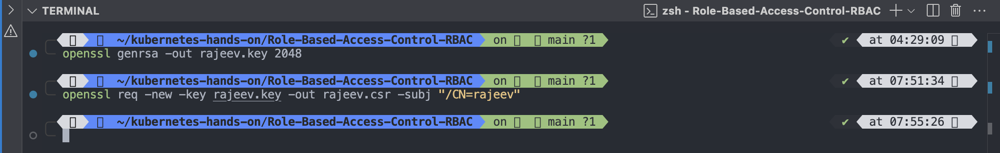


#

## 2. To get base64 encoded value

```

cat rajeev.csr| base64 |tr -d "\n"

```

```

LS0tLS1CRUdJTiBDRVJUSUZJQ0FURSBSRVFVRVNULS0tLS0KTUlJQ1ZqQ0NBVDRDQVFBd0VURVBNQTBHQTFVRUF3d0djbUZxWldWMk1JSUJJakFOQmdrcWhraUc5dzBCQVFFRgpBQU9DQVE4QU1JSUJDZ0tDQVFFQWx5eUFWL1VxaTZtcXFwSEszZDdYZVF1MzBOa092NUNkWGoyWnZrMkpWZ2FnCllLVmlIUVJiNllyd2FLWWlaTFJ3ODRsQUVpV0lGU0FScGhJdjR0ejFGZHZOWk0vMWthNS9jYWVYK2w3WG50WFIKdnQ2a1BZd0RtZVJxTmFqRnlvdHRDNDQ3cXBTTXVLdHlFQmx5clZwVllsR3lZb1BVZEV0ekRxck5Cb3ZrYlRuRwpNUVhYcUl1blFXTVFPNUNrTmFLa0VrdGtCVWF1MExsdTdSVlRySURESWQwV2J2Unh0WGFZN3JrdDhCZkFZdEowCkxQUXczeisrTVF1QW9mbEpRclptbU5pdXpTV3NmTjVKSmxFaFVDSnhmNEVJL1VtYXhmcTc2S3hERUFQNm93T2IKMWx6eHJvaHltcE1Da1lKS1owSENVMW5CZHZwd3QvaGJyODVpTGc5YktRSURBUUFCb0FBd0RRWUpLb1pJaHZjTgpBUUVMQlFBRGdnRUJBRlArT0ZkUS9wN2dFZWxNcEFqNkpEemlXRkhtWTB0VEltaVErNzgwVlpvMU5nRXdGL1lJClg4YU5iZ2MyS2RvMm1UUlNkYWlYMEpSelF5N3RNSUpIckJrVVUybEdkd1B2dUc4ZHpoamRNOUlGUWlXdVYzNzUKQnZvZzlKNzZnVmhnQ1QwT2hjSCtZa0xKV0g4R2NLMlZSaEtnRHhTMkh3MDljdVBtSnhqWVpSV2cwVHlQM2VRTQpNa2hldU5EaklVSGdBbWxxcXZ5ZDZVOXNXV3BLazlqSVNjUERDSDFPL3BhWFkxTEZWSzBDSEdMQTcxcnl2OTBZCkVHMHJTL3A4SUNXQkhlL1BnYjcrb2dQSTlsa0Fjc1lDa2FEZ2kvRGJoTktsRzJoc01lcUxZcVBnSU9qVmxIQloKMitVOUhlekVYdE9pbDlsb0JCRUh6a2pxblQ4MjB1VmxWL1k9Ci0tLS0tRU5EIENFUlRJRklDQVRFIFJFUVVFU1QtLS0tLQo=

```

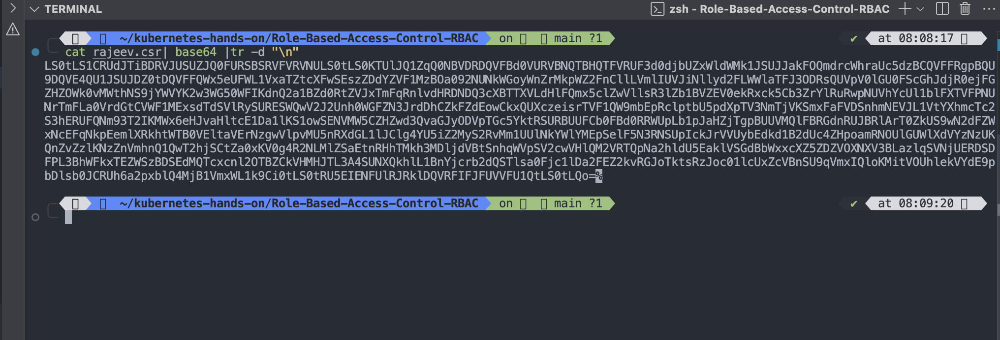

## 3. Create a CertificateSigningRequest

- Create a CertificateSigningRequest and submit it to a Kubernetes Cluster via kubectl.
- Below is a script to generate the CertificateSigningRequest.

```

vim csr.yaml

```

```

apiVersion: certificates.k8s.io/v1
kind: CertificateSigningRequest
metadata:
name: rajeev
spec:
request: LS0tLS1CRUdJTiBDRVJUSUZJQ0FURSBSRVFVRVNULS0tLS0KTUlJQ1ZqQ0NBVDRDQVFBd0VURVBNQTBHQTFVRUF3d0djbUZxWldWMk1JSUJJakFOQmdrcWhraUc5dzBCQVFFRgpBQU9DQVE4QU1JSUJDZ0tDQVFFQWx5eUFWL1VxaTZtcXFwSEszZDdYZVF1MzBOa092NUNkWGoyWnZrMkpWZ2FnCllLVmlIUVJiNllyd2FLWWlaTFJ3ODRsQUVpV0lGU0FScGhJdjR0ejFGZHZOWk0vMWthNS9jYWVYK2w3WG50WFIKdnQ2a1BZd0RtZVJxTmFqRnlvdHRDNDQ3cXBTTXVLdHlFQmx5clZwVllsR3lZb1BVZEV0ekRxck5Cb3ZrYlRuRwpNUVhYcUl1blFXTVFPNUNrTmFLa0VrdGtCVWF1MExsdTdSVlRySURESWQwV2J2Unh0WGFZN3JrdDhCZkFZdEowCkxQUXczeisrTVF1QW9mbEpRclptbU5pdXpTV3NmTjVKSmxFaFVDSnhmNEVJL1VtYXhmcTc2S3hERUFQNm93T2IKMWx6eHJvaHltcE1Da1lKS1owSENVMW5CZHZwd3QvaGJyODVpTGc5YktRSURBUUFCb0FBd0RRWUpLb1pJaHZjTgpBUUVMQlFBRGdnRUJBRlArT0ZkUS9wN2dFZWxNcEFqNkpEemlXRkhtWTB0VEltaVErNzgwVlpvMU5nRXdGL1lJClg4YU5iZ2MyS2RvMm1UUlNkYWlYMEpSelF5N3RNSUpIckJrVVUybEdkd1B2dUc4ZHpoamRNOUlGUWlXdVYzNzUKQnZvZzlKNzZnVmhnQ1QwT2hjSCtZa0xKV0g4R2NLMlZSaEtnRHhTMkh3MDljdVBtSnhqWVpSV2cwVHlQM2VRTQpNa2hldU5EaklVSGdBbWxxcXZ5ZDZVOXNXV3BLazlqSVNjUERDSDFPL3BhWFkxTEZWSzBDSEdMQTcxcnl2OTBZCkVHMHJTL3A4SUNXQkhlL1BnYjcrb2dQSTlsa0Fjc1lDa2FEZ2kvRGJoTktsRzJoc01lcUxZcVBnSU9qVmxIQloKMitVOUhlekVYdE9pbDlsb0JCRUh6a2pxblQ4MjB1VmxWL1k9Ci0tLS0tRU5EIENFUlRJRklDQVRFIFJFUVVFU1QtLS0tLQo=
signerName: kubernetes.io/kube-apiserver-client
expirationSeconds: 6912000 # one day
usages:

- client auth

```

```

kubectl apply -f csr.yaml

```

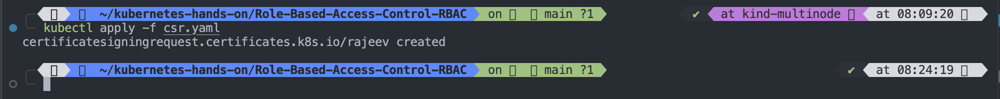

## 4. List all CertificateSigningRequest

```

kubectl get csr

```


#

## 5. It shows condition in pending, so lets approve it

## To approve a csr

```

kubectl certificate approve <certificate-signing-request-name>

```

```

kubectl certificate approve rajeev

```

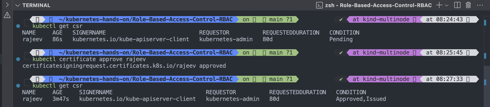

#

## 6. Now we have generated the CertificateSigningRequest and approved it, now you have to share it with the user

```

kubectl get csr -o yaml > issuedcert.yaml

```

- Here csr will get save into issuedcert.yaml file where you will get certificate in encoded format, so now decode that and share the same decoded one to the user
  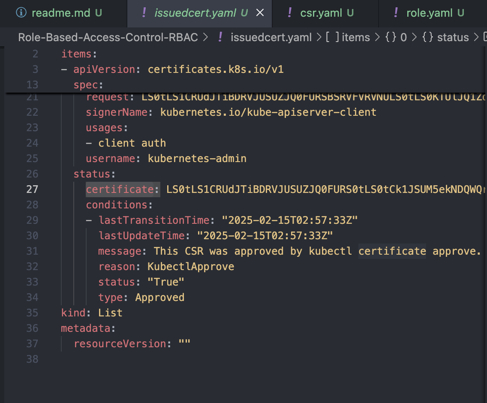
- To decode

```

echo "LS0tLS1CRUdJTiBDRVJUSUZJQ0FURS0tLS0tCk1JSUM5ekNDQWQrZ0F3SUJBZ0lSQU9nR3R3bWdVc2xlZzBDUkZLdWEvUFV3RFFZSktvWklodmNOQVFFTEJRQXcKRlRFVE1CRUdBMVVFQXhNS2EzVmlaWEp1WlhSbGN6QWVGdzB5TlRBeU1UVXdNalV5TXpOYUZ3MHlOVEExTURZdwpNalV5TXpOYU1CRXhEekFOQmdOVkJBTVRCbkpoYW1WbGRqQ0NBU0l3RFFZSktvWklodmNOQVFFQkJRQURnZ0VQCkFEQ0NBUW9DZ2dFQkFKY3NnRmYxS291cHFxcVJ5dDNlMTNrTHQ5RFpEcitRblY0OW1iNU5pVllHb0dDbFloMEUKVyttSzhHaW1JbVMwY1BPSlFCSWxpQlVnRWFZU0wrTGM5UlhieldUUDlaR3VmM0dubC9wZTE1N1YwYjdlcEQyTQpBNW5rYWpXb3hjcUxiUXVPTzZxVWpMaXJjaEFaY3ExYVZXSlJzbUtEMUhSTGN3NnF6UWFMNUcwNXhqRUYxNmlMCnAwRmpFRHVRcERXaXBCSkxaQVZHcnRDNWJ1MFZVNnlBd3lIZEZtNzBjYlYybU82NUxmQVh3R0xTZEN6ME1OOC8KdmpFTGdLSDVTVUsyWnBqWXJzMGxySHplU1NaUklWQWljWCtCQ1AxSm1zWDZ1K2lzUXhBRCtxTURtOVpjOGE2SQpjcHFUQXBHQ1NtZEJ3bE5ad1hiNmNMZjRXNi9PWWk0UFd5a0NBd0VBQWFOR01FUXdFd1lEVlIwbEJBd3dDZ1lJCkt3WUJCUVVIQXdJd0RBWURWUjBUQVFIL0JBSXdBREFmQmdOVkhTTUVHREFXZ0JReFVaSzNxbmhWYVFacHVraloKRldLdVFXdHEzekFOQmdrcWhraUc5dzBCQVFzRkFBT0NBUUVBTlFRcDlHbzM4QkVHbk5ROWZvdWlob0E4RWZWVApmc3oxc3QweXFHd0UydE1HSVRNQTkrcktkajVwT0RBY3lwaWpOYUN0N2NSRjkyU0I3RjRQS0lXRS9IOGZLUHAvCmxLM3FCVnJqUUc2YXdPNE9yNWMrem5LWFI2N2Zvc0djZG5LSmluNzQwSmtzNnFIL1daK1dOa0FiRm1aV3pwblIKWm1PaHVWbmFIQ3R2SUt1ZkdKNVNIL3hlMDg3NFh5eGtTQlgzOXU5RFJqcjNLbXVDdCtGc1lZRmIzZTRuaFlsVgo3QUdoVmNxKzVRT216M3dwbFFqMU5TVWI1M1FhVElxNU1iUEFnTUlqRGI3czZieGdKaGFneU9heW9pejVjMFZWCkViOXR4Z3FDN29aZFRLYjJLb1gxSWN1Q3ljZThMemRNU0NKemhZZnI2Z3JkRGhiTW9ZN0syRC9PS0E9PQotLS0tLUVORCBDRVJUSUZJQ0FURS0tLS0tCg==" | base64 -d

```

Output

```

-----BEGIN CERTIFICATE-----
MIIC9zCCAd+gAwIBAgIRAOgGtwmgUsleg0CRFKua/PUwDQYJKoZIhvcNAQELBQAw
FTETMBEGA1UEAxMKa3ViZXJuZXRlczAeFw0yNTAyMTUwMjUyMzNaFw0yNTA1MDYw
MjUyMzNaMBExDzANBgNVBAMTBnJhamVldjCCASIwDQYJKoZIhvcNAQEBBQADggEP
ADCCAQoCggEBAJcsgFf1KoupqqqRyt3e13kLt9DZDr+QnV49mb5NiVYGoGClYh0E
W+mK8GimImS0cPOJQBIliBUgEaYSL+Lc9RXbzWTP9ZGuf3Gnl/pe157V0b7epD2M
A5nkajWoxcqLbQuOO6qUjLirchAZcq1aVWJRsmKD1HRLcw6qzQaL5G05xjEF16iL
p0FjEDuQpDWipBJLZAVGrtC5bu0VU6yAwyHdFm70cbV2mO65LfAXwGLSdCz0MN8/
vjELgKH5SUK2ZpjYrs0lrHzeSSZRIVAicX+BCP1JmsX6u+isQxAD+qMDm9Zc8a6I
cpqTApGCSmdBwlNZwXb6cLf4W6/OYi4PWykCAwEAAaNGMEQwEwYDVR0lBAwwCgYI
KwYBBQUHAwIwDAYDVR0TAQH/BAIwADAfBgNVHSMEGDAWgBQxUZK3qnhVaQZpukjZ
FWKuQWtq3zANBgkqhkiG9w0BAQsFAAOCAQEANQQp9Go38BEGnNQ9fouihoA8EfVT
fsz1st0yqGwE2tMGITMA9+rKdj5pODAcypijNaCt7cRF92SB7F4PKIWE/H8fKPp/
lK3qBVrjQG6awO4Or5c+znKXR67fosGcdnKJin740Jks6qH/WZ+WNkAbFmZWzpnR
ZmOhuVnaHCtvIKufGJ5SH/xe0874XyxkSBX39u9DRjr3KmuCt+FsYYFb3e4nhYlV
7AGhVcq+5QOmz3wplQj1NSUb53QaTIq5MbPAgMIjDb7s6bxgJhagyOayoiz5c0VV
Eb9txgqC7oZdTKb2KoX1IcuCyce8LzdMSCJzhYfr6grdDhbMoY7K2D/OKA==
-----END CERTIFICATE-----

```

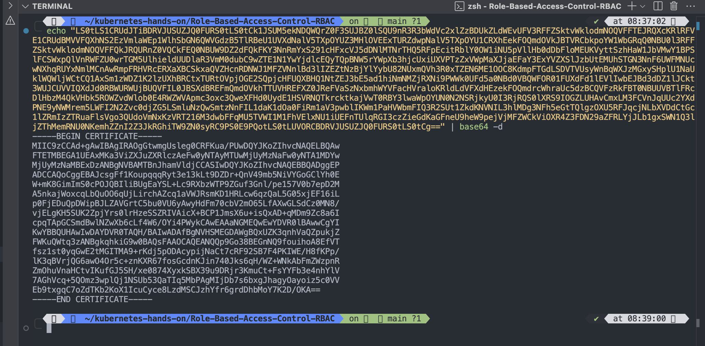

#

- Now you can add this certificate to the cube config and assign certain role to it so that user will have certain permissions and that will be done user can access the server using that certificate.

#
