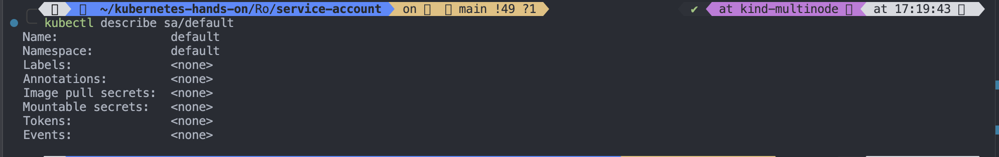

# Day 25/40 - Kubernetes Service Account - RBAC Continued

### Service account in Kubernetes


#### What is a service account in Kubernetes

There are multiple types of accounts in Kubernetes that interact with the cluster. These could be user accounts used by Kubernetes Admins, developers, operators, etc., and service accounts primarily used by other applications/bots or Kubernetes components to interact with other services.

- To list all service account

```
kubectl get sa
kubectl get sa -A # list service account with all the namespaces
kubectl get sa -A | grep default # List all the service account with default namespace
```


#

- To describe service account with specific namespace

```
kubectl describe sa/default
```



#

- To see the default service account in yaml format

```
kubectl get sa/default -o yaml
```


#

- To redirect the default service account in yaml format

```
kubectl get sa/default -o yaml >default-sa.yaml
```

#

#

- To create a service account

```
kubectl create sa name
kubectl get sa
```

```
kubectl create sa build-sa
kubectl get sa
```

- To get build-sa service account in yaml and redirect it to a build-sa.yaml file

```
kubectl create sa build-sa --dry-run=client -o yaml >build-sa.yaml
```


#

# Manually create a long-lived API token for a ServiceAccount

```
vim secret.yaml
```

```
apiVersion: v1
kind: Secret
metadata:
  name: build-robot-secret
  annotations:
    kubernetes.io/service-account.name: build-sa
type: kubernetes.io/service-account-token
```

## Apply secret.yaml

```
kubectl apply -f secret.yaml
```


#

```
kubectl get secret
```


#

```
kubectl describe secret/build-robot-secret
```


#

```
kubectl get pods --as build-sa
```


#

```
kubectl auth can-i get pod --as build-sa
```


#

#

- Then you can add role and role binding to grant access

## Create a role

```
kubectl create role build-role \
--verb=list,get,watch \
--resource=pod,node
```


#

```
kubectl get role
```


#

## Now create a rolebinding

```
kubectl create rolebinding build-role-binding \
--role=build-role \
--user=build-sa
```


#

```
kubectl get rolebinding
```


#

```
kubectl auth can-i get pod --as build-sa
```


#

```
kubectl get pods --as build-sa
```


#

> Note: Kubernetes also create 1 default service account in each of the default namespace such as kube-sytem, kube-node-lease and so on
