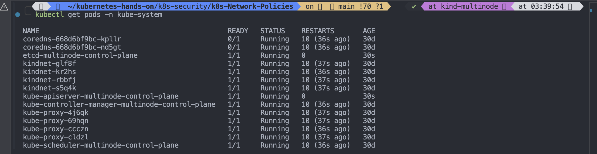
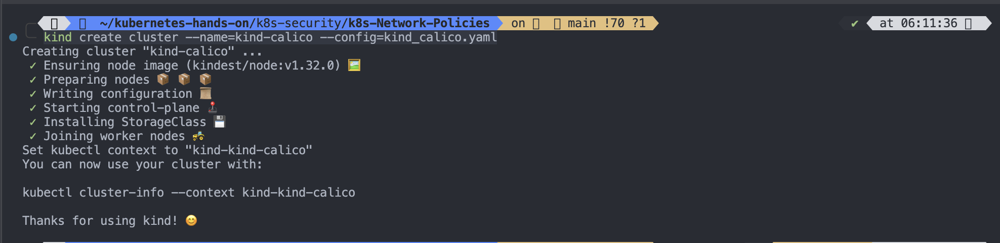
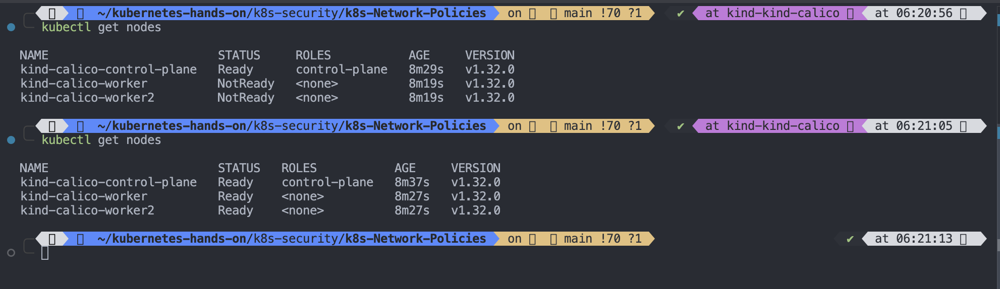
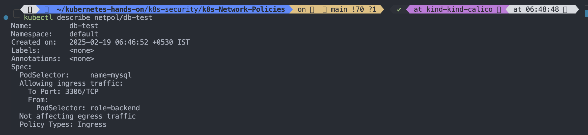

# Day 26/40 - Kubernetes Network Policies Explained

### What is a network policy

Network policy allows you to control the Inbound and Outbound traffic to and from the cluster.
For example, you can specify a deny-all network policy that restricts all incoming traffic to the cluster, or you can create an allow-network policy that will only allow certain services to be accessed by certain pods on a specific port.


# Container Network Interface(CNI)

## CNI providers

- Weave-net
- flannel, kindnet(comes with kind cluster) - We can't put Network policies in these two
- calico
- cilium, etc.
  
  > Note: On flannel and kindnet we can't put network policies, because these two does not support Network Policies. To apply Network Policies we can choose weave-net, calico, cilium etc (Container Network Interface).

#

## List all pods with kube-system namespace

```
kubectl get pods -n kube-system
```



#

## List all daemonset with all namespace

```
kubectl get ds -A
```


#

#### Kind cluster yaml

```yaml
kind: Cluster
apiVersion: kind.x-k8s.io/v1alpha4
nodes:
  - role: control-plane
    extraPortMappings:
      - containerPort: 30001
        hostPort: 30001
  - role: worker
  - role: worker
networking:
  disableDefaultCNI: true
  podSubnet: 192.168.0.0/16
```

# Create a kind cluster

```
kind create cluster --name=cluster-with-custom-networkpolicies --config=kind.yaml
```


#

## List all nodes

```
kubectl get nodes
```


- It's not ready because we disable the default CNI Plugin
- Lets describe any of node and check the reason
- It requires cni-plugin to be installed to create a fully functional kubernetes cluster

```
kubectl describe node/cluster-with-custom-networkpolicies-control-plane
```


#

#

#### Document to install `calico` on your cluster

[installing on kind | calico documentation](https://docs.tigera.io/calico/latest/getting-started/kubernetes/kind)

[Declare Network Policy](https://kubernetes.io/docs/tasks/administer-cluster/declare-network-policy/)

#

# Install weave-net addons

```
kubectl apply -f https://github.com/weaveworks/weave/releases/download/v2.8.1/weave-daemonset-k8s.yaml
```


#

## List all daemonset

```
kubectl get ds -A
```


#

```
kubectl get pods -n kube-system | grep weave-net
```


#

```
kubectl get ds -A
kubectl get pods -n kube-system -o wide | grep weave
kubectl get nodes
```


#

# Create three deployment, one for front end, one for backend, one for mysql database and three services one for frontend, one for backend and one for database.

- Let's try to implement Network Policies on that
- We will try to restrict direct access from frontend to database.
  

#

#

#

#### Application manifest

```yaml
apiVersion: v1
kind: Pod
metadata:
  name: frontend
  labels:
    role: frontend
spec:
  containers:
    - name: nginx
      image: nginx
      ports:
        - name: http
          containerPort: 80
          protocol: TCP
---
apiVersion: v1
kind: Service
metadata:
  name: frontend
  labels:
    role: frontend
spec:
  selector:
    role: frontend
  ports:
    - protocol: TCP
      port: 80
      targetPort: 80
---
apiVersion: v1
kind: Pod
metadata:
  name: backend
  labels:
    role: backend
spec:
  containers:
    - name: nginx
      image: nginx
      ports:
        - name: http
          containerPort: 80
          protocol: TCP
---
apiVersion: v1
kind: Service
metadata:
  name: backend
  labels:
    role: backend
spec:
  selector:
    role: backend
  ports:
    - protocol: TCP
      port: 80
      targetPort: 80
---
apiVersion: v1
kind: Service
metadata:
  name: db
  labels:
    name: mysql
spec:
  selector:
    name: mysql
  ports:
    - protocol: TCP
      port: 3306
      targetPort: 3306
---
apiVersion: v1
kind: Pod
metadata:
  name: mysql
  labels:
    name: mysql
spec:
  containers:
    - name: mysql
      image: mysql:latest
      env:
        - name: "MYSQL_USER"
          value: "mysql"
        - name: "MYSQL_PASSWORD"
          value: "mysql"
        - name: "MYSQL_DATABASE"
          value: "testdb"
        - name: "MYSQL_ROOT_PASSWORD"
          value: "verysecure"
      ports:
        - name: http
          containerPort: 3306
          protocol: TCP
```

#### Network policy sample used in the example

```
vim netpolicy.yaml
```

```yaml
apiVersion: networking.k8s.io/v1
kind: NetworkPolicy
metadata:
  name: db-test
spec:
  podSelector:
    matchLabels:
      name: mysql
  policyTypes:
    - Ingress
  ingress:
    - from:
        - podSelector:
            matchLabels:
              role: backend
      ports:
        - port: 3306
```

## Apply manifest.yaml

```
kubectl apply -f manifest.yaml
```


#

## List pods

```
kubectl get pods
```


#

## List all service

```
kubectl get svc
```


#

# We have created infrastructure to host our application, now let's exec into one of the front end pod.

```
kubectl exec -it pod/frontend -- sh
```

## From inside the pod now do curl on backend and db service

```
curl backend:80
```


#

## Now curl will not work in case of database connection so let's install the telnet utility first.

```
apt-get update && apt-get install telnet
```


#

```
telnet db 3306
```


> It's connected to db and we are getting reply back.

> We are able to access from frontend to database and from frontend to backend

#

# Now we have to restrict this access

- We will be creating a Network Policy object

## Apply netpolicy.yaml

```
kubectl apply -f netpolicy.yaml
```


#

```
kubectl get netpol
```

> netpol is short of networkpolicy
> 

#

```
kubectl describe netpol/db-test
```


#

### Let's exec again into frontend pod and try to access database

```
kubectl exec -it pod/frontend -- sh
```

```
# telnet db 3306
```


> now it says trying to database service but not getting reply, it basically gonna timeout after sometime because we have actually block that port from this service.


#

### ### Let's exec again into backend pod and try to access database because we have give selector role=backend while creating network policy.

```
kubectl exec -it pod/backend -- sh
```

## Install the telnet utility for database connection from backend to dadabase

```
apt-get update && apt-get install telnet
```


#

```
telnet db 3306
```


> backend also not getting response from database , the reason is the cni (Weave-net)that we were using is out-of-date like the last commit on this project was 2 years ago, We can see that from the github repository and it's not been maintained properly, It's either not been compatible with the Kubernetes version or the kind cluster setuo we are using,
> github.com/weaveworks/weave
> 

- So that is why we have to clean up everything then install another plugin such as Calico on the same cluster
- let's delete the old cluster

```
kind get clusters
kind delete cluster --name cluster-with-custom-networkpolicies
kind get clusters
```


- Let's create a new cluster and try it out
- Follow this link to create cluster and install Calico
  [installing on kind | calico documentation](https://docs.tigera.io/calico/latest/getting-started/kubernetes/kind)

```
vim kind_calico.yaml
```

```
kind: Cluster
apiVersion: kind.x-k8s.io/v1alpha4
nodes:
- role: control-plane
  extraPortMappings:
  - containerPort: 30001
    hostPort: 30001
- role: worker
- role: worker
networking:
  disableDefaultCNI: true
  podSubnet: 192.168.0.0/16
```

```
kind create cluster --name=kind-calico --config=kind_calico.yaml
```



#

- Confirm that you now have three nodes in your cluster by running the following command:

```
kubectl get nodes -o wide
```


#

# Now Install Calico

- Install Calico by using the following command.

```
kubectl apply -f https://raw.githubusercontent.com/projectcalico/calico/v3.29.2/manifests/calico.yaml
```


#

- Now check the nodes id ready or not

```
kubectl get nodes
```



#

- Verify Calico installation
  > You can verify Calico installation in your cluster by issuing the following command.

```
kubectl get pods -l k8s-app=calico-node -A
```


#

- Now let's apply manifest.yaml

```
kubectl apply -f manifest.yaml
```


#

- list pod

```
kubectl get pods
```


#

- list all services

```
kubectl get svc
```


#

- Let's exec into frontend pod

```
kubectl exec -it pod/frontend -- sh
```

from inside the pod

```
curl backend 80
```


```
apt-get update && apt-get install telnet
telnet db 3306
```


> As we see getting response back from backend and db while accessing from frontend

#

- Now let's acess frontend and db from backend

```
kubectl exec -it pod/backend -- sh
```

```
curl frontend 80
```


#

```
apt-get update && apt-get install telnet -y
telnet db 3306
```


> As we see getting response back from frontend and db while accessing from backend

> All pods are connectd to each other, they are exposed the ports are open

- Now what we want to do restrict access to database from only backend from only backend port.

- Only backend pod should be able to access your database on Port 3306 and frontend should not have access to database.
- let's apply networkpolicy object

```
kubectl apply -f netpolicy.yaml
```


#

- List networkpolicy

```
kubectl get netpol
```


#

- Describe networkpolicy

```
kubectl describe netpol/db-test
```



#

- Let's access database from frontend

```
kubectl exec -it pod/frontend -- sh
telnet db 3306
```


> As we see from frontend unable to access database

- Let's try the same from backend

```
kubectl exec -it pod/backend -- sh
telnet db 3306
```


> We are able to access database from backend because we specified matchLabels: role: backend in our networkpolicy

```
policyTypes:
  - Ingress
  ingress:
  - from:
    - podSelector:
        matchLabels:
          role: backend
```


#
