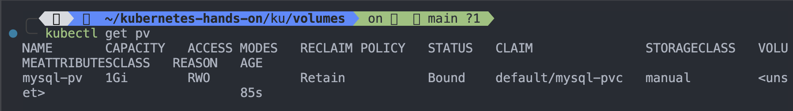
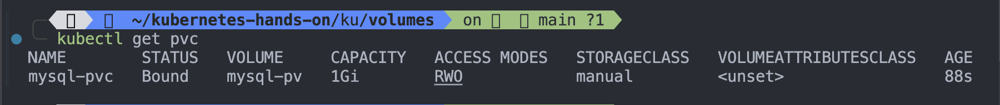
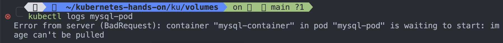
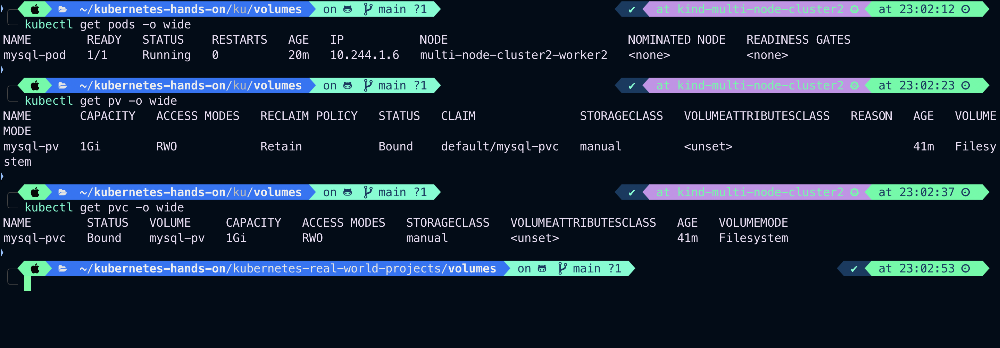

# Kubernetes Volumes with Real-World Example

## Understanding Kubernetes Volumes

In Kubernetes, **Volumes** provide a way to store and share data between containers within a pod. By default, when a container crashes or restarts, the data inside it is lost. Volumes solve this issue by providing persistent storage.

### Real-World Example: MySQL Database

Consider a scenario where you need to deploy a **MySQL database** in Kubernetes. If the database pod restarts, all stored data would be lost unless we use persistent storage. To solve this, we use a **Persistent Volume (PV)** and a **Persistent Volume Claim (PVC)** to ensure data persists across restarts.

## Kubernetes Project: Deploy MySQL with Persistent Volume

This project demonstrates how to set up a MySQL database in Kubernetes with **Persistent Volume**.

### Step 1: Create a Persistent Volume (PV)

```yaml
apiVersion: v1
kind: PersistentVolume
metadata:
  name: mysql-pv
spec:
  capacity:
    storage: 1Gi
  accessModes:
    - ReadWriteOnce
  persistentVolumeReclaimPolicy: Retain
  storageClassName: manual
  hostPath:
    path: "/mnt/data"
```

### Step 2: Create a Persistent Volume Claim (PVC)

```yaml
apiVersion: v1
kind: PersistentVolumeClaim
metadata:
  name: mysql-pvc
spec:
  accessModes:
    - ReadWriteOnce
  resources:
    requests:
      storage: 1Gi
  storageClassName: manual
```

### Step 3: Deploy MySQL Pod with Persistent Volume

```yaml
apiVersion: v1
kind: Pod
metadata:
  name: mysql-pod
  labels:
    app: mysql
spec:
  containers:
    - name: mysql
      image: mysql:5.7
      env:
        - name: MYSQL_ROOT_PASSWORD
          value: "rootpassword"
      ports:
        - containerPort: 3306
      volumeMounts:
        - mountPath: "/var/lib/mysql"
          name: mysql-storage
  volumes:
    - name: mysql-storage
      persistentVolumeClaim:
        claimName: mysql-pvc
```

### Step 4: Apply the Configuration

Run the following commands to deploy:

```sh
kubectl apply -f persistent-volume.yaml
kubectl apply -f persistent-volume-claim.yaml
kubectl apply -f mysql-pod.yaml
```

### Step 5: Verify Storage Persistence

1. **Check Persistent Volume:**

   ```sh
   kubectl get pv
   ```

   

   ***

2. **Check Persistent Volume Claim:**

   ```sh
   kubectl get pvc
   ```

   

   ***

3. **Check MySQL Pod Logs:**
   ```sh
   kubectl logs mysql-pod
   ```
   
   `Output:`

```sh
kubectl logs mysql-pod
2025-03-08 17:11:58+00:00 [Note] [Entrypoint]: Entrypoint script for MySQL Server 8.0.41-1.el9 started.
2025-03-08 17:11:58+00:00 [Note] [Entrypoint]: Switching to dedicated user 'mysql'
2025-03-08 17:11:58+00:00 [Note] [Entrypoint]: Entrypoint script for MySQL Server 8.0.41-1.el9 started.
2025-03-08 17:11:58+00:00 [Note] [Entrypoint]: Initializing database files
2025-03-08T17:11:58.704508Z 0 [Warning] [MY-011068] [Server] The syntax '--skip-host-cache' is deprecated and will be removed in a future release. Please use SET GLOBAL host_cache_size=0 instead.
2025-03-08T17:11:58.704566Z 0 [System] [MY-013169] [Server] /usr/sbin/mysqld (mysqld 8.0.41) initializing of server in progress as process 84
2025-03-08T17:11:58.713759Z 1 [System] [MY-013576] [InnoDB] InnoDB initialization has started.
2025-03-08T17:11:59.210524Z 1 [System] [MY-013577] [InnoDB] InnoDB initialization has ended.
2025-03-08T17:11:59.954977Z 6 [Warning] [MY-010453] [Server] root@localhost is created with an empty password ! Please consider switching off the --initialize-insecure option.
2025-03-08 17:12:02+00:00 [Note] [Entrypoint]: Database files initialized
2025-03-08 17:12:02+00:00 [Note] [Entrypoint]: Starting temporary server
2025-03-08T17:12:02.605082Z 0 [Warning] [MY-011068] [Server] The syntax '--skip-host-cache' is deprecated and will be removed in a future release. Please use SET GLOBAL host_cache_size=0 instead.
2025-03-08T17:12:02.608830Z 0 [System] [MY-010116] [Server] /usr/sbin/mysqld (mysqld 8.0.41) starting as process 128
2025-03-08T17:12:02.631803Z 1 [System] [MY-013576] [InnoDB] InnoDB initialization has started.
2025-03-08T17:12:02.881280Z 1 [System] [MY-013577] [InnoDB] InnoDB initialization has ended.
2025-03-08T17:12:03.095590Z 0 [Warning] [MY-010068] [Server] CA certificate ca.pem is self signed.
2025-03-08T17:12:03.095627Z 0 [System] [MY-013602] [Server] Channel mysql_main configured to support TLS. Encrypted connections are now supported for this channel.
2025-03-08T17:12:03.096933Z 0 [Warning] [MY-011810] [Server] Insecure configuration for --pid-file: Location '/var/run/mysqld' in the path is accessible to all OS users. Consider choosing a different directory.
2025-03-08T17:12:03.105874Z 0 [System] [MY-011323] [Server] X Plugin ready for connections. Socket: /var/run/mysqld/mysqlx.sock
2025-03-08T17:12:03.105929Z 0 [System] [MY-010931] [Server] /usr/sbin/mysqld: ready for connections. Version: '8.0.41'  socket: '/var/run/mysqld/mysqld.sock'  port: 0  MySQL Community Server - GPL.
2025-03-08 17:12:03+00:00 [Note] [Entrypoint]: Temporary server started.
'/var/lib/mysql/mysql.sock' -> '/var/run/mysqld/mysqld.sock'
Warning: Unable to load '/usr/share/zoneinfo/iso3166.tab' as time zone. Skipping it.
Warning: Unable to load '/usr/share/zoneinfo/leap-seconds.list' as time zone. Skipping it.
Warning: Unable to load '/usr/share/zoneinfo/leapseconds' as time zone. Skipping it.
Warning: Unable to load '/usr/share/zoneinfo/tzdata.zi' as time zone. Skipping it.
Warning: Unable to load '/usr/share/zoneinfo/zone.tab' as time zone. Skipping it.
Warning: Unable to load '/usr/share/zoneinfo/zone1970.tab' as time zone. Skipping it.

2025-03-08 17:12:04+00:00 [Note] [Entrypoint]: Stopping temporary server
2025-03-08T17:12:04.051025Z 10 [System] [MY-013172] [Server] Received SHUTDOWN from user root. Shutting down mysqld (Version: 8.0.41).
2025-03-08T17:12:05.766487Z 0 [System] [MY-010910] [Server] /usr/sbin/mysqld: Shutdown complete (mysqld 8.0.41)  MySQL Community Server - GPL.
2025-03-08 17:12:06+00:00 [Note] [Entrypoint]: Temporary server stopped

2025-03-08 17:12:06+00:00 [Note] [Entrypoint]: MySQL init process done. Ready for start up.

2025-03-08T17:12:06.277865Z 0 [Warning] [MY-011068] [Server] The syntax '--skip-host-cache' is deprecated and will be removed in a future release. Please use SET GLOBAL host_cache_size=0 instead.
2025-03-08T17:12:06.281796Z 0 [System] [MY-010116] [Server] /usr/sbin/mysqld (mysqld 8.0.41) starting as process 1
2025-03-08T17:12:06.291874Z 1 [System] [MY-013576] [InnoDB] InnoDB initialization has started.
2025-03-08T17:12:06.447365Z 1 [System] [MY-013577] [InnoDB] InnoDB initialization has ended.
2025-03-08T17:12:06.546659Z 0 [Warning] [MY-010068] [Server] CA certificate ca.pem is self signed.
2025-03-08T17:12:06.546682Z 0 [System] [MY-013602] [Server] Channel mysql_main configured to support TLS. Encrypted connections are now supported for this channel.
2025-03-08T17:12:06.547845Z 0 [Warning] [MY-011810] [Server] Insecure configuration for --pid-file: Location '/var/run/mysqld' in the path is accessible to all OS users. Consider choosing a different directory.
2025-03-08T17:12:06.554634Z 0 [System] [MY-011323] [Server] X Plugin ready for connections. Bind-address: '::' port: 33060, socket: /var/run/mysqld/mysqlx.sock
2025-03-08T17:12:06.554683Z 0 [System] [MY-010931] [Server] /usr/sbin/mysqld: ready for connections. Version: '8.0.41'  socket: '/var/run/mysqld/mysqld.sock'  port: 3306  MySQL Community Server - GPL.
```

---



---

```sh
kubectl descibe pod/mysql-pod
```

`Output:`

```sh
kubectl describe pod/mysql-pod
Name:             mysql-pod
Namespace:        default
Priority:         0
Service Account:  default
Node:             multi-node-cluster2-worker2/172.19.0.3
Start Time:       Sat, 08 Mar 2025 22:41:58 +0530
Labels:           name=mysql-pod
Annotations:      <none>
Status:           Running
IP:               10.244.1.6
IPs:
  IP:  10.244.1.6
Containers:
  mysql-container:
    Container ID:   containerd://98f040df2be130dc96d0ea933fd1cf50060065456e940db9fea80c7e9b545049
    Image:          mysql:8.0
    Image ID:       docker.io/library/mysql@sha256:50b5ee0656a2caea76506fe702b1baddabe204cf3ab34c03752d2d7cd8ad83fc
    Port:           <none>
    Host Port:      <none>
    State:          Running
      Started:      Sat, 08 Mar 2025 22:41:58 +0530
    Ready:          True
    Restart Count:  0
    Environment:
      MYSQL_ROOT_PASSWORD:  rootpassword
    Mounts:
      /var/lib/mysql from mysql-storage (rw)
      /var/run/secrets/kubernetes.io/serviceaccount from kube-api-access-bj7bs (ro)
Conditions:
  Type                        Status
  PodReadyToStartContainers   True
  Initialized                 True
  Ready                       True
  ContainersReady             True
  PodScheduled                True
Volumes:
  mysql-storage:
    Type:       PersistentVolumeClaim (a reference to a PersistentVolumeClaim in the same namespace)
    ClaimName:  mysql-pvc
    ReadOnly:   false
  kube-api-access-bj7bs:
    Type:                    Projected (a volume that contains injected data from multiple sources)
    TokenExpirationSeconds:  3607
    ConfigMapName:           kube-root-ca.crt
    ConfigMapOptional:       <nil>
    DownwardAPI:             true
QoS Class:                   BestEffort
Node-Selectors:              <none>
Tolerations:                 node.kubernetes.io/not-ready:NoExecute op=Exists for 300s
                             node.kubernetes.io/unreachable:NoExecute op=Exists for 300s
Events:
  Type    Reason     Age   From               Message
  ----    ------     ----  ----               -------
  Normal  Scheduled  22m   default-scheduler  Successfully assigned default/mysql-pod to multi-node-cluster2-worker2
  Normal  Pulled     22m   kubelet            Container image "mysql:8.0" already present on machine
  Normal  Created    22m   kubelet            Created container: mysql-container
  Normal  Started    22m   kubelet            Started container mysql-container
```

### Conclusion

This project ensures that MySQL data remains persistent even if the pod restarts. Kubernetes **Persistent Volumes** provide a reliable way to manage database storage in real-world applications.
