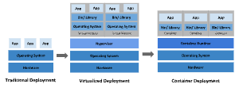
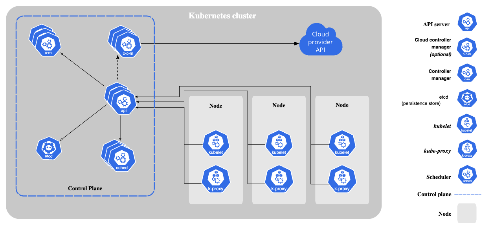

# Overview of Kubernetes & Key Concepts

## Why you need Kubernetes and what it can do

- Containers are a good way to bundle and run your applications. In a production environment, you need to manage the containers that run the applications and ensure that there is no downtime. For example, if a container goes down, another container needs to start. Wouldn't it be easier if this behavior was handled by a system?
- That's how Kubernetes comes to the rescue! Kubernetes provides you with a framework to run distributed systems resiliently. It takes care of scaling and failover for your application, provides deployment patterns, and more. For example: Kubernetes can easily manage a canary deployment for your system.

### Kubernetes provides you with:

- **Service discovery and load balancing** Kubernetes can expose a container using the DNS name or using their own IP address. If traffic to a container is high, Kubernetes is able to load balance and distribute the network traffic so that the deployment is stable.
- **Storage orchestration** Kubernetes allows you to automatically mount a storage system of your choice, such as local storages, public cloud providers, and more.
- **Automated rollouts and rollbacks** You can describe the desired state for your deployed containers using Kubernetes, and it can change the actual state to the desired state at a controlled rate. For example, you can automate Kubernetes to create new containers for your deployment, remove existing containers and adopt all their resources to the new container.
- **Automatic bin packing** You provide Kubernetes with a cluster of nodes that it can use to run containerized tasks. You tell Kubernetes how much CPU and memory (**RAM**) each container needs. Kubernetes can fit containers onto your nodes to make the best use of your resources.
- **Self-healing** Kubernetes restarts containers that fail, replaces containers, kills containers that don't respond to your user-defined health check, and doesn't advertise them to clients until they are ready to serve.
- **Secret and configuration management** Kubernetes lets you store and manage sensitive information, such as passwords, OAuth tokens, and SSH keys. You can deploy and update secrets and application configuration without rebuilding your container images, and without exposing secrets in your stack configuration.
- **Batch execution** In addition to services, Kubernetes can manage your batch and CI workloads, replacing containers that fail, if desired.

> **Batch** workloads are tasks that are executed **non-interactively**, often in a scheduled or on-demand manner, like data processing or reports generation. **CI** workloads are related to Continuous Integration, which involves automated building, testing, and deployment of code changes, often using tools like Jenkins or GitLab CI

- Horizontal scaling Scale your application up and down with a simple command, with a UI, or automatically based on CPU usage.
- IPv4/IPv6 dual-stack Allocation of IPv4 and IPv6 addresses to Pods and Services
- Designed for extensibility Add features to your Kubernetes cluster without changing upstream source code.

---

## What Kubernetes is not

Kubernetes is not a traditional, all-inclusive PaaS (Platform as a Service) system. Since Kubernetes operates at the container level rather than at the hardware level, it provides some generally applicable features common to PaaS offerings, such as deployment, scaling, load balancing, and lets users integrate their logging, monitoring, and alerting solutions. However, Kubernetes is not monolithic, and these default solutions are optional and pluggable. Kubernetes provides the building blocks for building developer platforms, but preserves user choice and flexibility where it is important.

### Kubernetes:

- Does not limit the types of applications supported. Kubernetes aims to support an extremely diverse variety of workloads, including stateless, stateful, and data-processing workloads. If an application can run in a container, it should run great on Kubernetes.
- Does not deploy source code and does not build your application. Continuous Integration, Delivery, and Deployment (CI/CD) workflows are determined by organization cultures and preferences as well as technical requirements.
- Does not provide application-level services, such as middleware (for example, message buses), data-processing frameworks (for example, Spark), databases (for example, MySQL), caches, nor cluster storage systems (for example, Ceph) as built-in services. Such components can run on Kubernetes, and/or can be accessed by applications running on Kubernetes through portable mechanisms, such as the `Open Service Broker`.
- Does not dictate logging, monitoring, or alerting solutions. It provides some integrations as proof of concept, and mechanisms to collect and export metrics.
- Does not provide nor mandate a configuration language/system (for example, Jsonnet). It provides a declarative API that may be targeted by arbitrary forms of declarative specifications.
- Does not provide nor adopt any comprehensive machine configuration, maintenance, management, or self-healing systems.
- Additionally, Kubernetes is not a mere orchestration system. In fact, it eliminates the need for orchestration. The technical definition of orchestration is execution of a defined workflow: first do A, then B, then C. In contrast, Kubernetes comprises a set of independent, composable control processes that continuously drive the current state towards the provided desired state. It shouldn't matter how you get from A to C. Centralized control is also not required. This results in a system that is easier to use and more powerful, robust, resilient, and extensible.

---

## Historical context for Kubernetes

Let's take a look at why Kubernetes is so useful by going back in time.



### Traditional deployment era:

Early on, organizations ran applications on physical servers. There was no way to define resource boundaries for applications in a physical server, and this caused resource allocation issues. For example, if multiple applications run on a physical server, there can be instances where one application would take up most of the resources, and as a result, the other applications would underperform. A solution for this would be to run each application on a different physical server. But this did not scale as resources were underutilized, and it was expensive for organizations to maintain many physical servers.

---

### Virtualized deployment era:

As a solution, virtualization was introduced. It allows you to run multiple Virtual Machines (VMs) on a single physical server's CPU. Virtualization allows applications to be isolated between VMs and provides a level of security as the information of one application cannot be freely accessed by another application.

Virtualization allows better utilization of resources in a physical server and allows better scalability because an application can be added or updated easily, reduces hardware costs, and much more. With virtualization you can present a set of physical resources as a cluster of disposable virtual machines.

Each VM is a full machine running all the components, including its own operating system, on top of the virtualized hardware.

---

### Container deployment era:

Containers are similar to VMs, but they have relaxed isolation properties to share the Operating System (OS) among the applications. Therefore, containers are considered lightweight. Similar to a VM, a container has its own filesystem, share of CPU, memory, process space, and more. As they are decoupled from the underlying infrastructure, they are portable across clouds and OS distributions.

Containers have become popular because they provide extra benefits, such as:

- Agile application creation and deployment: increased ease and efficiency of container image creation compared to VM image use.
- Continuous development, integration, and deployment: provides for reliable and frequent container image build and deployment with quick and efficient rollbacks (due to image immutability).
- Dev and Ops separation of concerns: create application container images at build/release time rather than deployment time, thereby decoupling applications from infrastructure.
- Observability: not only surfaces OS-level information and metrics, but also application health and other signals.
- Environmental consistency across development, testing, and production: runs the same on a laptop as it does in the cloud.
- Cloud and OS distribution portability: runs on Ubuntu, RHEL, CoreOS, on-premises, on major public clouds, and anywhere else.
- Application-centric management: raises the level of abstraction from running an OS on virtual hardware to running an application on an OS using logical resources.
- Loosely coupled, distributed, elastic, liberated micro-services: applications are broken into smaller, independent pieces and can be deployed and managed dynamically – not a monolithic stack running on one big single-purpose machine.
- Resource isolation: predictable application performance.
- Resource utilization: high efficiency and density.

---

# Kubernetes Components

## 

## Core Components

A Kubernetes cluster consists of a control plane and one or more worker nodes. Here's a brief overview of the main components:

### Control Plane Components

Manage the overall state of the cluster:

#### [`kube-apiserver`](https://kubernetes.io/docs/concepts/architecture/#kube-apiserver)

The core component server that exposes the Kubernetes HTTP API.

#### [`etcd`](https://kubernetes.io/docs/concepts/architecture/#etcd)

Consistent and highly-available key value store for all API server data.

#### [`kube-scheduler`](https://kubernetes.io/docs/concepts/architecture/#kube-scheduler)

Looks for Pods not yet bound to a node, and assigns each Pod to a suitable node.

#### [`kube-controller-manager`](https://kubernetes.io/docs/concepts/architecture/#kube-controller-manager)

Runs controllers to implement Kubernetes API behavior.

#### [cloud-controller-manager (optional)](https://kubernetes.io/docs/concepts/architecture/#cloud-controller-manager)

Integrates with underlying cloud provider(s).

---

### Node Components

Run on every node, maintaining running pods and providing the Kubernetes runtime environment:

#### [`kubelet`](https://kubernetes.io/docs/concepts/architecture/#kubelet)

Ensures that Pods are running, including their containers.

#### [`kube-proxy (optional)`](https://kubernetes.io/docs/concepts/architecture/#kube-proxy)

Maintains network rules on nodes to implement Services.

#### [`Container runtime`](https://kubernetes.io/docs/concepts/architecture/#container-runtime)

Software responsible for running containers.

> This item links to a third party project or product that is not part of Kubernetes itself.

### `Addons`

Addons extend the functionality of Kubernetes. A few important examples include:

#### [`DNS`](https://kubernetes.io/docs/concepts/architecture/#dns)

For cluster-wide DNS resolution.

#### [`Web UI (Dashboard)`](https://kubernetes.io/docs/concepts/architecture/#web-ui-dashboard)

For cluster management via a web interface.

#### [`Container Resource Monitoring`](https://kubernetes.io/docs/concepts/architecture/#container-resource-monitoring)

For collecting and storing container metrics.

#### [`Cluster-level Logging`](https://kubernetes.io/docs/concepts/architecture/#cluster-level-logging)

---

# The Kubernetes API

The Kubernetes API lets you query and manipulate the state of objects in Kubernetes. The core of Kubernetes' control plane is the API server and the HTTP API that it exposes. Users, the different parts of your cluster, and external components all communicate with one another through the API server.

- The Kubernetes API lets you query and manipulate the state of API objects in Kubernetes (for example: Pods, Namespaces, ConfigMaps, and Events).
- Most operations can be performed through the [`kubectl`](https://kubernetes.io/docs/reference/kubectl/) command-line interface or other command-line tools, such as [`kubeadm`](https://kubernetes.io/docs/reference/setup-tools/kubeadm/), which in turn use the API. However, you can also access the API directly using REST calls. Kubernetes provides a set of [`client libraries`](https://kubernetes.io/docs/reference/using-api/client-libraries/) for those looking to write applications using the Kubernetes API.
- Each Kubernetes cluster publishes the specification of the APIs that the cluster serves. There are two mechanisms that Kubernetes uses to publish these API specifications; both are useful to enable automatic interoperability. For example, the kubectl tool fetches and caches the API specification for enabling command-line completion and other features. The two supported mechanisms are as follows:

  - [`The Discovery API`](https://kubernetes.io/docs/concepts/overview/kubernetes-api/#discovery-api) provides information about the Kubernetes APIs: API names, resources, versions, and supported operations. This is a Kubernetes specific term as it is a separate API from the Kubernetes OpenAPI. It is intended to be a brief summary of the available resources and it does not detail specific schema for the resources. For reference about resource schemas, please refer to the OpenAPI document.

  - The [`Kubernetes OpenAPI Document`](https://kubernetes.io/docs/concepts/overview/kubernetes-api/#openapi-interface-definition) provides (full) OpenAPI v2.0 and 3.0 schemas for all Kubernetes API endpoints. The OpenAPI v3 is the preferred method for accessing OpenAPI as it provides a more comprehensive and accurate view of the API. It includes all the available API paths, as well as all resources consumed and produced for every operations on every endpoints. It also includes any extensibility components that a cluster supports. The data is a complete specification and is significantly larger than that from the Discovery API.

---

### Discovery API

Kubernetes publishes a list of all group versions and resources supported via the Discovery API. This includes the following for each resource:

- Name
- Cluster or namespaced scope
- Endpoint URL and supported verbs
- Alternative names
- Group, version, kind

The API is available in both aggregated and unaggregated form. The aggregated discovery serves two endpoints, while the unaggregated discovery serves a separate endpoint for each group version.

Kubernetes offers stable support for `aggregated discovery`, publishing all resources supported by a cluster through two endpoints (**/api** and **/apis**). Requesting this endpoint drastically reduces the number of requests sent to fetch the discovery data from the cluster. You can access the data by requesting the respective endpoints with an Accept header indicating the aggregated discovery resource: `Accept: application/json;v=v2;g=apidiscovery.k8s.io;as=APIGroupDiscoveryList`.

- Without indicating the resource type using the `Accept` header, the default response for the `/api` and `/apis` endpoint is an unaggregated discovery document.
- The [`discovery document`](https://github.com/kubernetes/kubernetes/blob/release-1.33/api/discovery/aggregated_v2.json) for the built-in resources can be found in the Kubernetes GitHub repository. This Github document can be used as a reference of the base set of the available resources if a Kubernetes cluster is not available to query.
- The endpoint also supports ETag and protobuf encoding.

---

#### Unaggregated discovery

Without discovery aggregation, discovery is published in levels, with the root endpoints publishing discovery information for downstream documents.

- A list of all group versions supported by a cluster is published at the /api and /apis endpoints. Example:

```json
{
  "kind": "APIGroupList",
  "apiVersion": "v1",
  "groups": [
    {
      "name": "apiregistration.k8s.io",
      "versions": [
        {
          "groupVersion": "apiregistration.k8s.io/v1",
          "version": "v1"
        }
      ],
      "preferredVersion": {
        "groupVersion": "apiregistration.k8s.io/v1",
        "version": "v1"
      }
    },
    {
      "name": "apps",
      "versions": [
        {
          "groupVersion": "apps/v1",
          "version": "v1"
        }
      ],
      "preferredVersion": {
        "groupVersion": "apps/v1",
        "version": "v1"
      }
    },
    ...
}
```

Additional requests are needed to obtain the discovery document for each group version at `/apis/<group>/<version>` (for example: `/apis/rbac.authorization.k8s.io/v1alpha1`), which advertises the list of resources served under a particular group version. These endpoints are used by kubectl to fetch the list of resources supported by a cluster.

---

## Persistence

Kubernetes stores the serialized state of objects by writing them into etcd.

## API groups and versioning

- To make it easier to eliminate fields or restructure resource representations, Kubernetes supports multiple API versions, each at a different API path, such as `/api/v1` or `/apis/rbac.authorization.k8s.io/v1alpha1`.
- Versioning is done at the API level rather than at the resource or field level to ensure that the API presents a clear, consistent view of system resources and behavior, and to enable controlling access to end-of-life and/or experimental APIs.
- To make it easier to evolve and to extend its API, Kubernetes implements [`API groups`](https://kubernetes.io/docs/reference/using-api/#api-groups) that can be [`enabled or disabled`](https://kubernetes.io/docs/reference/using-api/#enabling-or-disabling).
- API resources are distinguished by their API group, resource type, namespace (for namespaced resources), and name. The API server handles the conversion between API versions transparently: all the different versions are actually representations of the same persisted data. The API server may serve the same underlying data through multiple API versions.
- For example, suppose there are two API versions, `v1` and `v1beta1`, for the same resource. If you originally created an object using the `v1beta1` version of its API, you can later read, update, or delete that object using either the `v1beta1` or the `v1` API version, until the v1beta1 version is deprecated and removed. At that point you can continue accessing and modifying the object using the `v1` API.

#### API changes

- Any system that is successful needs to grow and change as new use cases emerge or existing ones change. Therefore, Kubernetes has designed the Kubernetes API to continuously change and grow. The Kubernetes project aims to not break compatibility with existing clients, and to maintain that compatibility for a length of time so that other projects have an opportunity to adapt.
- In general, new API resources and new resource fields can be added often and frequently. Elimination of resources or fields requires following the [`API deprecation policy`](https://kubernetes.io/docs/reference/using-api/deprecation-policy/).
- Kubernetes makes a strong commitment to maintain compatibility for official Kubernetes APIs once they reach general availability (GA), typically at API version `v1`. Additionally, Kubernetes maintains compatibility with data persisted via beta API versions of official Kubernetes APIs, and ensures that data can be converted and accessed via GA API versions when the feature goes stable.
- If you adopt a beta API version, you will need to transition to a subsequent beta or stable API version once the API graduates. The best time to do this is while the beta API is in its deprecation period, since objects are simultaneously accessible via both API versions. Once the beta API completes its deprecation period and is no longer served, the replacement API version must be used.

  > `Note`:
  > Although Kubernetes also aims to maintain compatibility for alpha APIs versions, in some circumstances this is not possible. If you use any alpha API versions, check the release notes for Kubernetes when upgrading your cluster, in case the API did change in incompatible ways that require deleting all existing alpha objects prior to upgrade.

-
-
-
-
-
-
-
-
-
-
-
