# 🐳 Setting Up a KIND (Kubernetes IN Docker) Cluster

KIND (Kubernetes IN Docker) is a tool for running local Kubernetes clusters using Docker container "nodes". It is primarily designed for testing Kubernetes itself, or CI workloads, but is great for local development.

---

## ✅ Prerequisites

Make sure you have the following installed:

- **Docker**: https://docs.docker.com/get-docker/
- **kubectl**: https://kubernetes.io/docs/tasks/tools/
- **Go** (optional, for building from source)
- **kind**: https://kind.sigs.k8s.io/

---

## 🔧 Installation Steps

### 1. Install `kind`

**Using Go:**

```bash
GO111MODULE="on" go install sigs.k8s.io/kind@v0.20.0
```

**Or with Homebrew (macOS):**

```bash
brew install kind
```

**Or via curl (Linux/macOS):**

```bash
curl -Lo ./kind https://kind.sigs.k8s.io/dl/v0.20.0/kind-$(uname)-amd64
chmod +x ./kind
mv ./kind /usr/local/bin/kind
```

---

### 2. Verify Installation

```bash
kind version
```

---

## 🚀 Creating Your First KIND Cluster

### Basic Cluster

```bash
kind create cluster --name dev-cluster
```

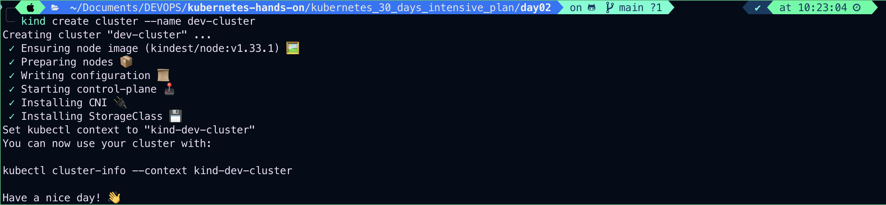
This command creates a Kubernetes cluster named `dev-cluster` using a default configuration.

---

## Get cluster info

```bash
kubectl cluster-info --context kind-dev-cluster
```

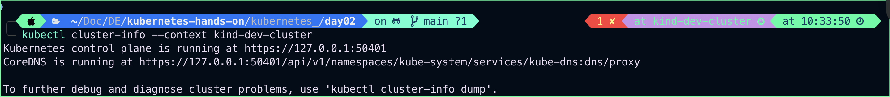

## List all clusters

```bash
kind get clusters
```

## 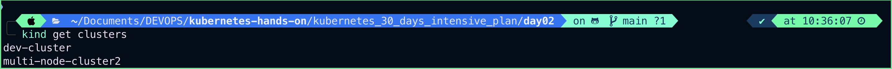

---

## ⚙️ Custom Cluster Configuration

You can create a custom config YAML file to define nodes and roles.

### Example: 1 Control Plane + 2 Worker Nodes

**cluster-config.yaml**

```yaml
kind: Cluster
apiVersion: kind.x-k8s.io/v1alpha4
nodes:
  - role: control-plane
  - role: worker
  - role: worker
```

### Create cluster with config

```bash
kind create cluster --name custom-cluster --config cluster-config.yaml
```

## 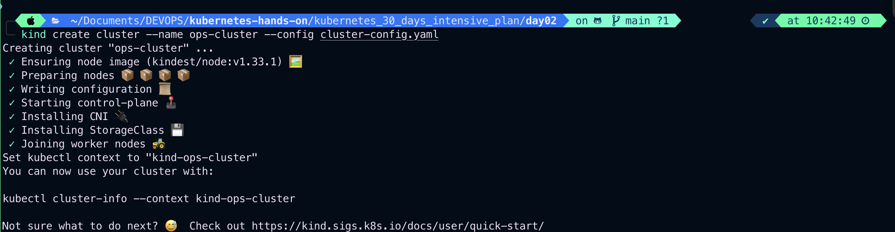

## List all contexts

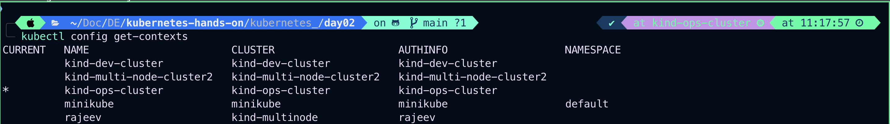

> `Note`: The \* indicates the current (active) context/cluster.

## Switch to Another Cluster

```bash
kubectl config use-context kind-ops-cluster
```

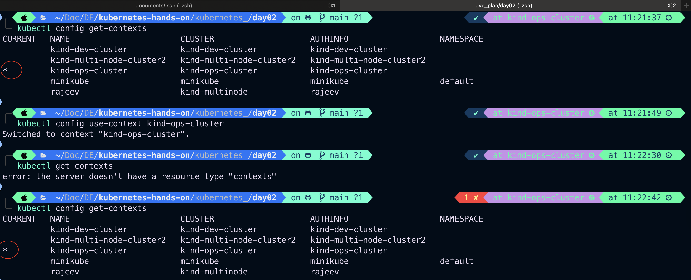

## Verify the Switch

```bash
kubectl config current-context
```

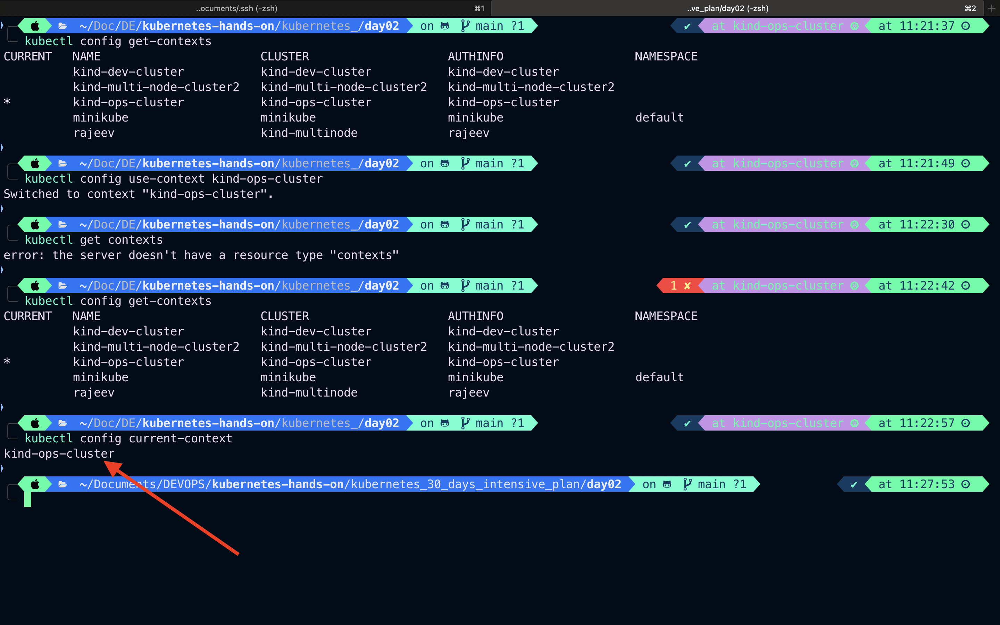

## 📂 Where is this Configuration Stored?

Kubernetes uses a file called kubeconfig, typically located at:

```bash
~/.kube/config
```

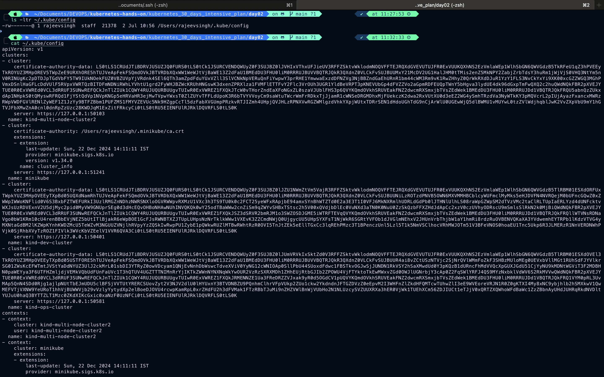

If you are using KIND, each cluster is automatically added to this file when created.

## Rename a context (to make switching easier):

```bash

```

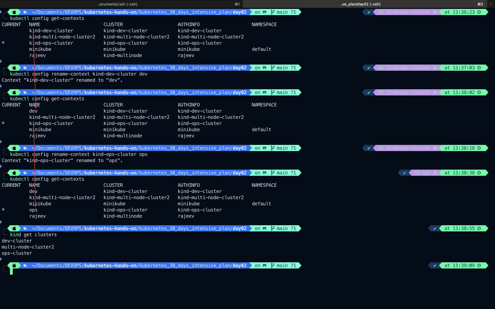

# Set KUBECONFIG for multiple files (optional):

```bash
export KUBECONFIG=~/.kube/config:~/other-kubeconfigs/dev.kubeconfig
kubectl config view --merge

```

## 🔍 Interact with the Cluster

### Get Cluster Info

```bash
kubectl cluster-info --context kind-custom-cluster
```

### Get Nodes

```bash
kubectl get nodes
```

## 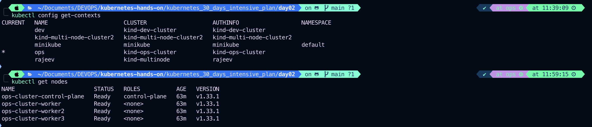

## 🧹 Delete the KIND Cluster

```bash
kind delete cluster --name
```

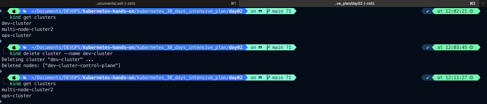

## 🔁 Delete Multiple KIND Clusters (Safely)

✅ 1. List all KIND clusters

```bash
kubectl config get-clusters
```

✅ 2. Delete them all (one-liner)

```bash
for cluster in $(kind get clusters); do kind delete cluster --name "$cluster"; done
```

---

## 📁 Working with Load Balancer / Ingress

You can install ingress like NGINX with Helm or manually:

```bash
kubectl apply -f https://raw.githubusercontent.com/kubernetes/ingress-nginx/controller-v1.10.1/deploy/static/provider/kind/deploy.yaml
```

Wait for the ingress controller to be ready:

```bash
kubectl wait --namespace ingress-nginx   --for=condition=Ready pod   --selector=app.kubernetes.io/component=controller   --timeout=120s
```

---

## 📦 Mounting Local Volumes (Optional)

Example of mounting a local directory into a node:

```yaml
kind: Cluster
apiVersion: kind.x-k8s.io/v1alpha4
nodes:
  - role: control-plane
    extraMounts:
      - hostPath: /path/on/host
        containerPath: /path/in/container
```

---

## 🧪 Use Cases for KIND

- Local development
- CI/CD testing
- Kubernetes manifest testing
- Lightweight environment for quick iterations

---

## 🔗 Useful Links

- [Official KIND Documentation](https://kind.sigs.k8s.io/)
- [Kubernetes Getting Started](https://kubernetes.io/docs/setup/)
