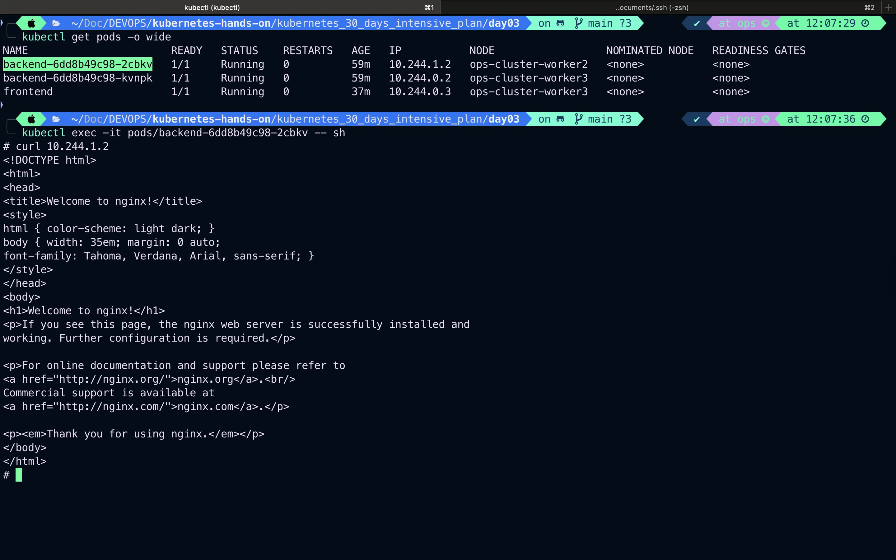

# Cluster Networking in Kubernetes

Cluster networking is a core concept in Kubernetes that enables communication between different components within a cluster. This includes communication between Pods, between Pods and Services, and between external clients and Services.

---

## 📌 Key Concepts

### 1. **Pod-to-Pod Communication**

- Every Pod gets its own IP address.
- Pods can communicate with each other without NAT (Network Address Translation).
- The network must allow all Pods to communicate freely (flat network model).

### 2. **Pod-to-Service Communication**

- Kubernetes Services provide stable IPs and DNS names.
- Services use labels and selectors to route traffic to backend Pods.

### 3. **Service-to-External Communication**

- ClusterIP (default): Internal-only access.
- NodePort: Exposes the service on each Node’s IP at a static port.
- LoadBalancer: Provision external load balancer to expose service externally.
- Ingress: Manage external access using HTTP/HTTPS routes.

### 4. **Network Policies**

- Control traffic flow at IP address or port level.
- Define rules using selectors (e.g., allow traffic only from certain Pods or Namespaces).

---

## 🔧 Example Scenario

Let’s say we have a simple app:

- Frontend Pod (`frontend`)
- Backend Pod (`backend`)
- A Service (`backend-service`) that exposes the backend

### Deployment YAMLs

#### `backend-deployment.yaml`

```yaml
apiVersion: apps/v1
kind: Deployment
metadata:
  name: backend
spec:
  replicas: 1
  selector:
    matchLabels:
      app: backend
  template:
    metadata:
      labels:
        app: backend
    spec:
      containers:
        - name: backend
          image: nginx
          ports:
            - containerPort: 80
```

#### `backend-service.yaml`

```yaml
apiVersion: v1
kind: Service
metadata:
  name: backend-service
spec:
  selector:
    app: backend
  ports:
    - protocol: TCP
      port: 80
      targetPort: 80
  type: ClusterIP
```

#### `frontend-pod.yaml`

```yaml
apiVersion: v1
kind: Pod
metadata:
  name: frontend
spec:
  containers:
    - name: curl-container
      image: curlimages/curl
      command: ["sleep", "3600"]
```

### Testing Network

1. `kubectl exec -it frontend -- sh`
2. `curl backend-service`

If the network is correctly set up, this should return the default Nginx page.

---

## 🔐 Network Policy Example

```yaml
apiVersion: networking.k8s.io/v1
kind: NetworkPolicy
metadata:
  name: allow-frontend
spec:
  podSelector:
    matchLabels:
      app: backend
  ingress:
    - from:
        - podSelector:
            matchLabels:
              app: frontend
```

This policy allows only Pods labeled as `frontend` to access `backend` Pods.

---

## 📘 Summary

| Feature         | Description                     |
| --------------- | ------------------------------- |
| Pod-to-Pod      | Flat IP network, no NAT         |
| Pod-to-Service  | Via stable ClusterIP and DNS    |
| External Access | NodePort, LoadBalancer, Ingress |
| Isolation       | Controlled via Network Policies |

---

## Pod-to-Pod communication

### Get all pods and exec in first one , try to access 2nd Pod from first one through IP address.

```bash
kubectl get pods -o wide
kubectl exec -it pods/backend-6dd8b49c98-2cbkv -- sh
```



---

## 🔗 Useful Commands

```bash
kubectl get pods -o wide
kubectl get svc
kubectl exec -it <pod-name> -- sh
```

---

## ✅ Best Practices

- Use network policies to secure communication.
- Monitor network performance and DNS resolution.
- Prefer Services over direct Pod IP access.

---

## 🌐 Recommended Learning Resources

### 📚 Official Documentation

- [Kubernetes Networking Concepts (Official)](https://kubernetes.io/docs/concepts/cluster-administration/networking/)
- [Kubernetes Services](https://kubernetes.io/docs/concepts/services-networking/service/)
- [Network Policies](https://kubernetes.io/docs/concepts/services-networking/network-policies/)

### 🎥 Video Tutorials

- [Learn Kubernetes Networking in 13 mins | TechWorld with Nana](https://www.youtube.com/watch?v=nnZ8f4M5xWI)
- [Kubernetes Networking | Gaurav Sen](https://www.youtube.com/watch?v=fdlZOfxDqPY)
- [`channel link`](https://www.youtube.com/@TechWorldwithNana/playlists)

### 🧑‍💻 Hands-On Labs & Simulations

- [Katacoda - Kubernetes Networking Scenarios](https://katacoda.com/courses/kubernetes/networking-introduction)
- [Play with Kubernetes (by Docker)](https://labs.play-with-k8s.com/)

### 📘 Articles & Blogs

- [A Comprehensive Guide to Kubernetes Networking](https://medium.com/swlh/a-comprehensive-guide-to-kubernetes-networking-3a346f5a1f4d)
- [The Illustrated Guide to Kubernetes Networking](https://speakerdeck.com/thockin/illustrated-guide-to-kubernetes-networking)

### 🔧 Tools for Testing/Debugging Networking

- `kubectl exec -it <pod> -- sh`
- `nslookup`, `curl`, `wget`, `ping`
- [netshoot - Container with networking tools](https://github.com/nicolaka/netshoot)
