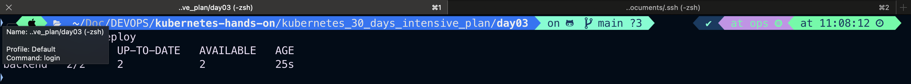
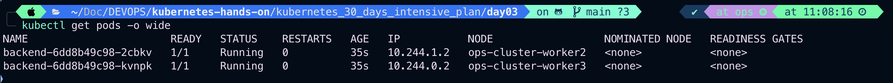
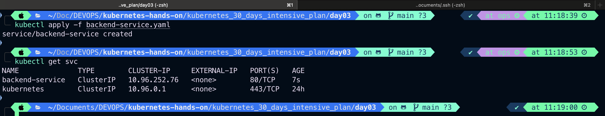
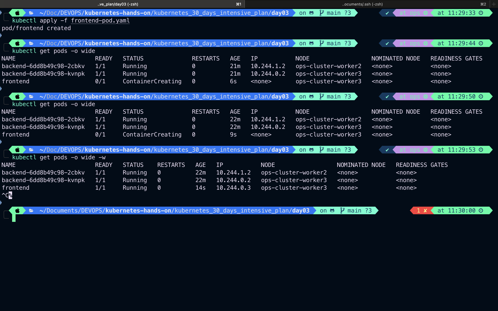
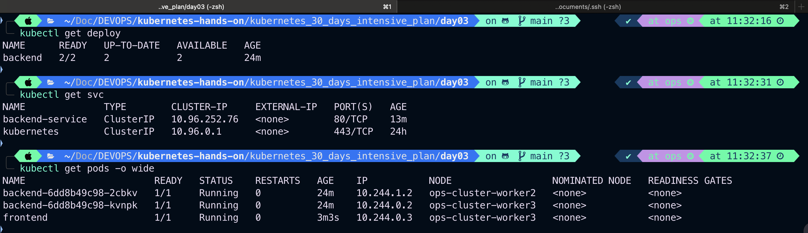
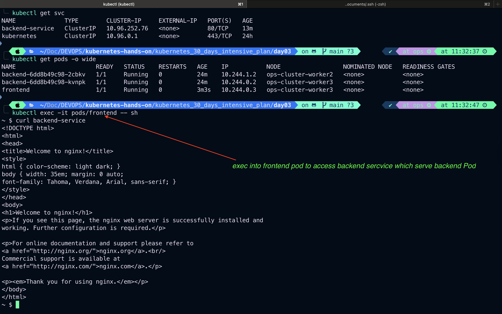
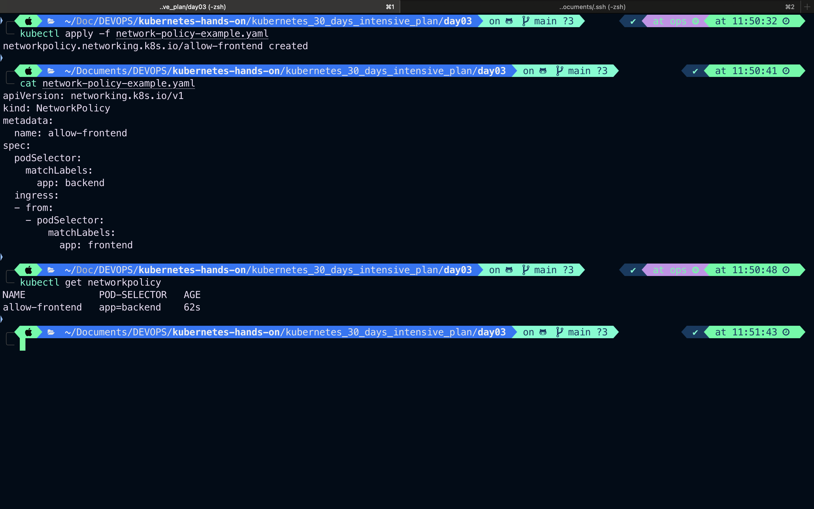
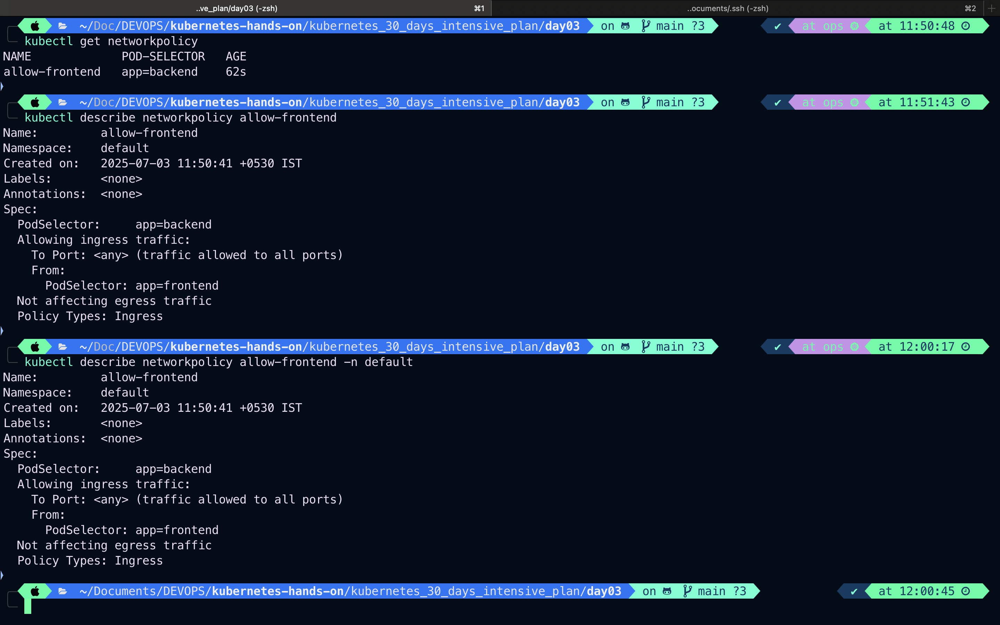

# Day-03: Cluster Networking Basics

## 🔧 Example Scenario

Let’s say we have a simple app:

- Frontend Pod (`frontend`)
- Backend Pod (`backend`)
- A Service (`backend-service`) that exposes the backend

## Backend Deployment

```bash
vim backend-deployment.yaml
```

```yaml
apiVersion: apps/v1
kind: Deployment
metadata:
  name: backend
spec:
  replicas: 2
  selector:
    matchLabels:
      app: backend
  template:
    metadata:
      labels:
        app: backend
    spec:
      containers:
        - name: backend-container
          image: nginx
          ports:
            - containerPort: 80
```

## Create Deployment

```bash
kubectl apply -f backend-deployment.yaml
```

## Check deployments

```bash
kubectl get deploy
```



## Check pods

```bash
kubectl get pods -o wide
```



---

## Backend service

```bash
vim backend-service.yaml
```

```yaml
apiVersion: v1
kind: Service
metadata:
  name: backend-service
spec:
  selector:
    app: backend # Select all which label is app: backend
  ports:
    - protocol: TCP
      port: 80
      targetPort: 80
  type: ClusterIP
```

### Create and list Service

```bash
kubectl apply -f backend-service.yaml
kubectl get svc
```



---

## FrontEnd Pod

```bash
vim frontend-pod.yaml
```

```yaml
apiVersion: v1
kind: Pod
metadata:
  name: frontend
spec:
  containers:
    - name: curl-container
      image: curlimages/curl
      command: ["sleep", "3600"]
```

### Create and list Pod

```bash
kubectl apply -f frontend-pod.yaml
kubectl get pods -o wide -w
```



---

### Pod, Service and Deployment



---

### Testing Network

1. `kubectl exec -it frontend -- sh`
2. `curl backend-service`

If the network is correctly set up, this should return the default Nginx page.


---

### Network Policy Example

```bash
vim network-policy-example.yaml
```

```yaml
apiVersion: networking.k8s.io/v1
kind: NetworkPolicy
metadata:
  name: allow-frontend
spec:
  podSelector:
    matchLabels:
      app: backend
  ingress:
    - from:
        - podSelector:
            matchLabels:
              app: frontend
```

This policy allows only Pods labeled as `frontend` to access `backend` Pods.

#### Create network policy and check network policy applied

```bash
kubectl apply -f network-policy-example.yaml
kubectl get networkpolicy

#kubectl get networkpolicy -n <namespace> # In specific namespace
kubectl get networkpolicy -n default
```



---

#### Describe network policy

```bash
kubectl describe networkpolicy <policy-name> -n <namespace>

```

```bash
kubectl describe networkpolicy allow-frontend -n default

# OR

kubectl describe networkpolicy allow-frontend # here by default k8s will look in to the default namespace
# Both output will be same
```



---
