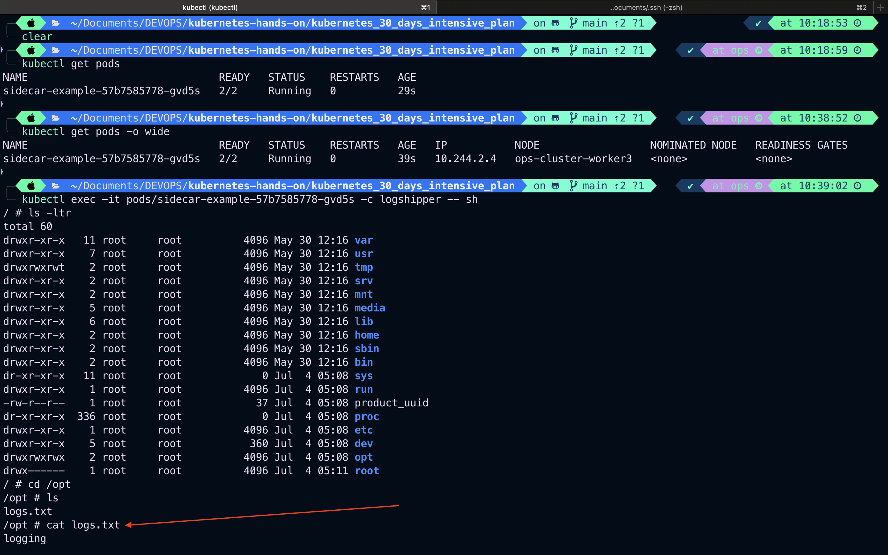
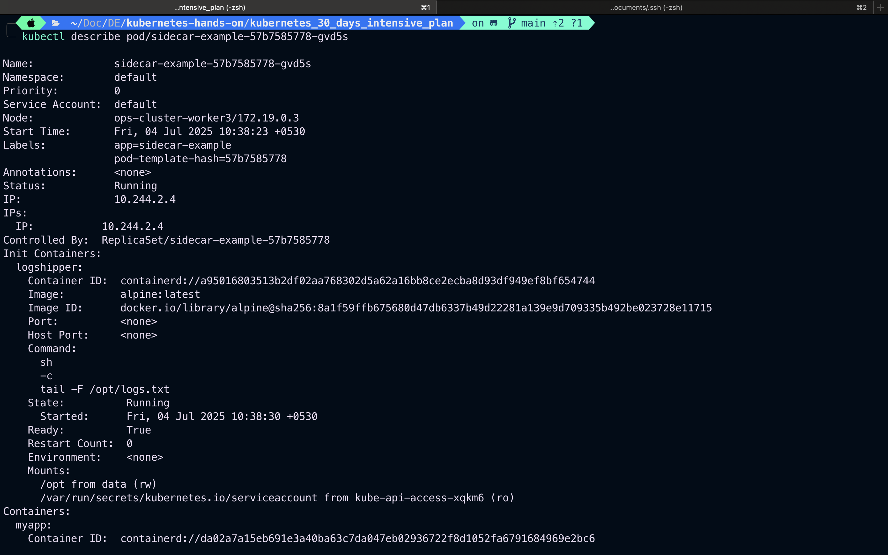
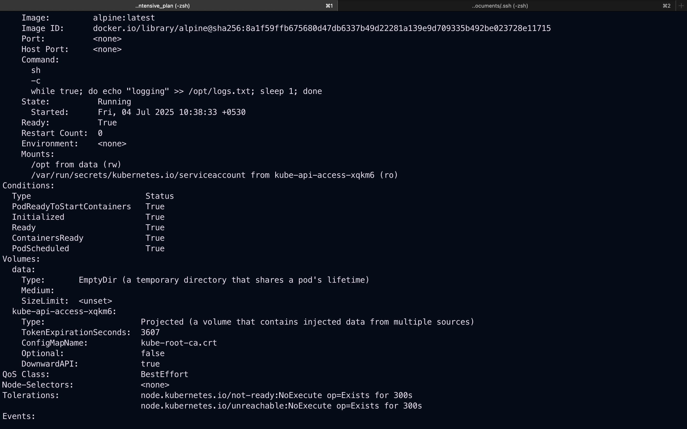
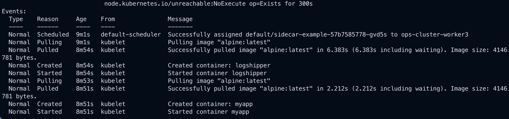

# Day-04: Tasks

Topic: Pods: What, Why, and How

- 📘 **Learn**: Study using official docs, blogs, or video tutorials
- ✍️ **Practice**: Apply in your own cluster (minikube/kind/kubeadm)
- 🧪 **Real-World Task**: Simulate use cases like service exposure, scaling, etc.
- 🔄 **Optional**: Explore GitHub repos or Helm charts related to the topic

Topic: Creating and Managing Pods

- 📘 **Learn**: Study using official docs, blogs, or video tutorials
- ✍️ **Practice**: Apply in your own cluster (minikube/kind/kubeadm)
- 🧪 **Real-World Task**: Simulate use cases like service exposure, scaling, etc.
- 🔄 **Optional**: Explore GitHub repos or Helm charts related to the topic

Both done using below example

---

Topic: Replication Controllers, ReplicaSets, Deployments

- 📘 **Learn**: Study using official docs, blogs, or video tutorials
- ✍️ **Practice**: Apply in your own cluster (minikube/kind/kubeadm)
- 🧪 **Real-World Task**: Simulate use cases like service exposure, scaling, etc.
- 🔄 **Optional**: Explore GitHub repos or Helm charts related to the topic

---

```bash
vim deployment-sidecar.yaml
```

```yaml
apiVersion: apps/v1
kind: Deployment
metadata:
  name: sidecar-example
spec:
  replicas: 1
  selector:
    matchLabels:
      app: sidecar-example
  template:
    metadata:
      labels:
        app: sidecar-example
    spec:
      containers:
        - name: myapp
          image: alpine:latest
          command:
            [
              "sh",
              "-c",
              'while true; do echo "logging" >> /opt/logs.txt; sleep 1; done',
            ]
          volumeMounts:
            - name: data
              mountPath: /opt
      initContainers:
        - name: logshipper
          image: alpine:latest
          restartPolicy: Always
          command: ["sh", "-c", "tail -F /opt/logs.txt"]
          volumeMounts:
            - name: data
              mountPath: /opt
      volumes:
        - name: data
          emptyDir: {}
```

```bash
kubectl apply -f deployment-sidecar.yaml
deployment.apps/sidecar-example created
```

```bash
kubectl get deploy
NAME              READY   UP-TO-DATE   AVAILABLE   AGE
sidecar-example   0/1     1            0           10s
```

```bash
kubectl get deploy
NAME              READY   UP-TO-DATE   AVAILABLE   AGE
sidecar-example   1/1     1            1           12s
```

```bash
kubectl exec -it pods/sidecar-example-57b7585778-gvd5s -c logshipper -- sh
```



```bash
kubectl describe pod/sidecar-example-57b7585778-gvd5s
```





---

> Note: Day04-Pods: What, Why, and How , Creating and Managing Pods,Replication Controllers, ReplicaSets, Deployments done but tomorrow will continue from replication, ReplicaSets and Deployment revision
