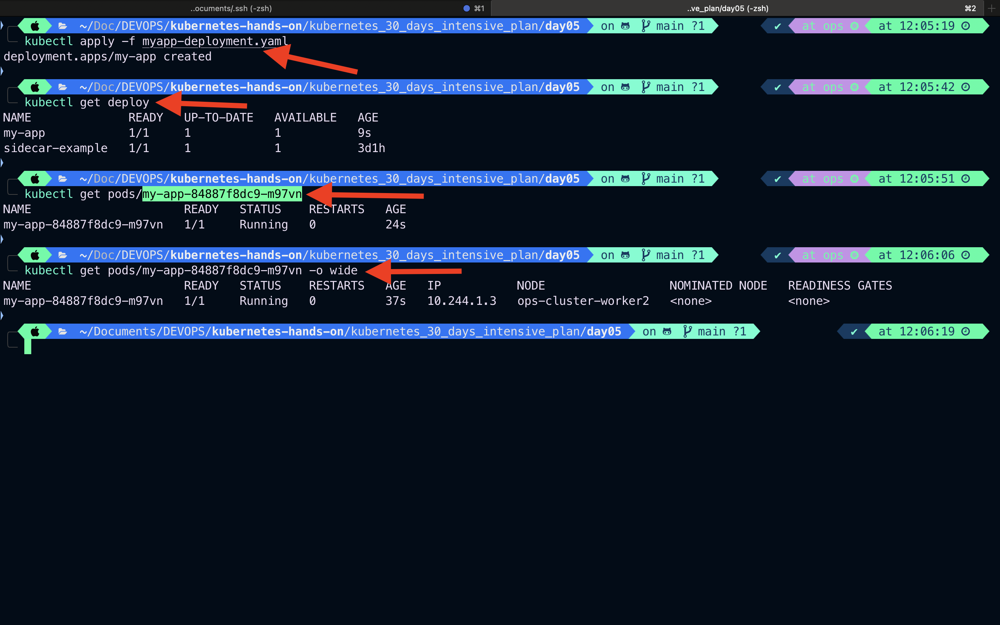

# Day-05: Tasks

# Topic: Scaling and Rolling Updates

## Example Deployment yaml for scalling

```bash
vim myapp-deployment.yaml
```

```yaml
apiVersion: apps/v1
kind: Deployment
metadata:
  name: my-app
  labels:
    env: test
spec:
  replicas: 1
  selector:
    matchLabels:
      name: my-app
  template:
    # Define template which deployment has to manage using labels
    metadata:
      labels:
        name: my-app # Deployment has to manage all resources which labeled 'name-myapp'
    spec:
      containers:
        - name: my-app-container
          image: nginx
          resources:
            requests:
              cpu: "250m"
              memory: "64Mi"
            limits:
              cpu: "500m"
              memory: "128Mi"
          ports:
            - containerPort: 80
```

### Create deployment

```bash
kubectl apply -f myapp-deployment.yaml
```

### Verify deployment, replicaset count, and Pods

```bash
kubectl get deploy
```

```bash
kubectl get pods/my-app-84887f8dc9-m97vn -o wide
```



---

## You can increase the number of replicas in the above file and apply using:

```bash
kubectl scale deploment my-app --replicas 3 # current replicas count = 1

```

! [scale up](./img/deploy-scal-up.png)

## Describe deployment

```bash
kubectl describe deploy/my-app
```


## Verify Pods and deployments

```bash
kubectl get deploy/my-app
kubectl get pods -o wide
```


---

# Rolling Updates

- `Rolling updates` allows updating Pods incremently with zero downtime by gradually replacing older versions with new one.

### Default rolling update strategy

```bash
kubectl set image deploy/my-app my-app-container=nginx:1.2
```

This replaces the image gradually while maintaining availability.

#### Before rolling update

```bash
kubectl describe pod/my-app-84887f8dc9-2n6nd
```


#### After rolling update

```bash
kubectl set image deploy/my-app my-app-container=nginx:1.2
```

```bash
kubectl describe deploy/my-app
```


---

# Start tomorrow with rolling update
