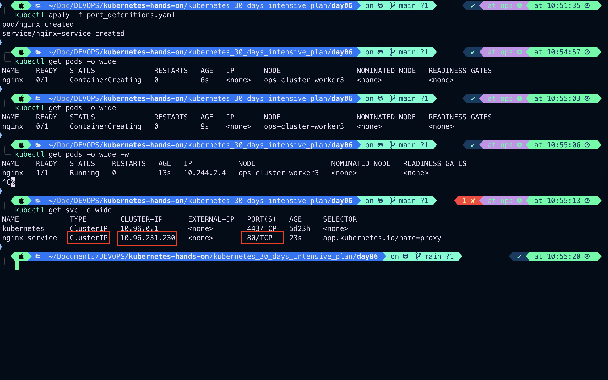
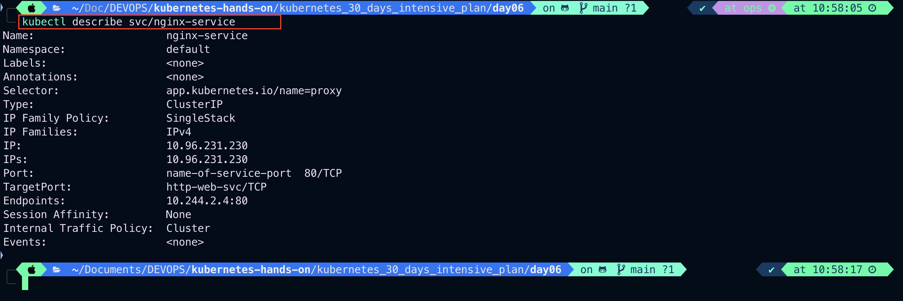
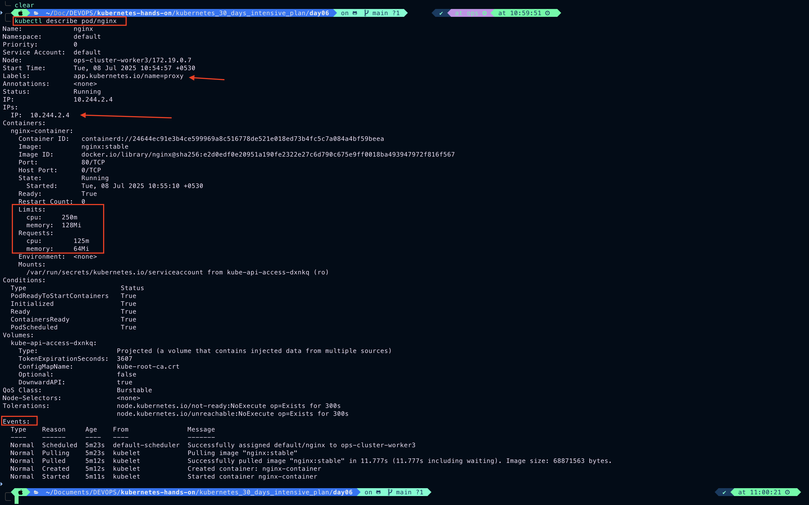
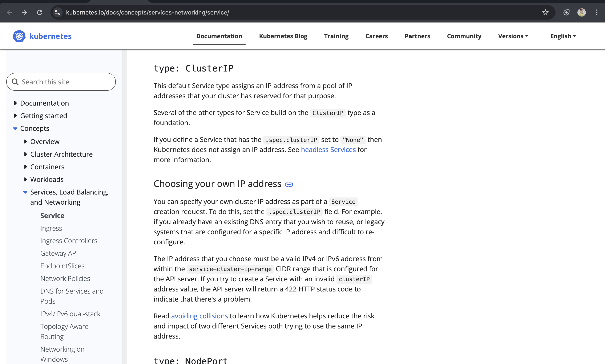

# Service

Expose an application running in your cluster behind a single outward-facing endpoint, even when the workload is split across multiple backends.

- In Kubernetes, a Service is a method for exposing a network application that is running as one or more Pods in your cluster.
- A key aim of Services in Kubernetes is that you don't need to modify your existing application to use an unfamiliar service discovery mechanism. You can run code in Pods, whether this is a code designed for a cloud-native world, or an older app you've containerized. You use a Service to make that set of Pods available on the network so that clients can interact with it.
- If you use a Deployment to run your app, that Deployment can create and destroy Pods dynamically. From one moment to the next, you don't know how many of those Pods are working and healthy; you might not even know what those healthy Pods are named. Kubernetes Pods are created and destroyed to match the desired state of your cluster. Pods are ephemeral resources (you should not expect that an individual Pod is reliable and durable).
- Each Pod gets its own IP address (Kubernetes expects network plugins to ensure this). For a given Deployment in your cluster, the set of Pods running in one moment in time could be different from the set of Pods running that application a moment later.
- This leads to a problem: if some set of Pods (call them "backends") provides functionality to other Pods (call them "frontends") inside your cluster, how do the frontends find out and keep track of which IP address to connect to, so that the frontend can use the backend part of the workload?

# Services in Kubernetes

- The Service API, part of Kubernetes, is an abstraction to help you expose groups of Pods over a network. Each Service object defines a logical set of endpoints (usually these endpoints are Pods) along with a policy about how to make those pods accessible.
- For example, consider a stateless image-processing backend which is running with 3 replicas. Those replicas are fungible—frontends do not care which backend they use. While the actual Pods that compose the backend set may change, the frontend clients should not need to be aware of that, nor should they need to keep track of the set of backends themselves.
- The Service abstraction enables this decoupling.
- The set of Pods targeted by a Service is usually determined by a selector that you define. To learn about other ways to define Service endpoints, see [`Services without selectors`](https://kubernetes.io/docs/concepts/services-networking/service/#services-without-selectors).
- If your workload speaks `HTTP`, you might choose to use an [`Ingress`](https://kubernetes.io/docs/concepts/services-networking/ingress/) to control how web traffic reaches that workload. Ingress is not a Service type, but it acts as the entry point for your cluster. An Ingress lets you consolidate your routing rules into a single resource, so that you can expose multiple components of your workload, running separately in your cluster, behind a single listener.
- The [`Gateway`](https://gateway-api.sigs.k8s.io/#what-is-the-gateway-api) API for Kubernetes provides extra capabilities beyond Ingress and Service. You can add Gateway to your cluster - it is a family of extension APIs, implemented using `CustomResourceDefinitions` - and then use these to configure access to network services that are running in your cluster.

## Cloud-native service discovery

- If you're able to use Kubernetes APIs for service discovery in your application, you can query the `API server` for matching EndpointSlices. Kubernetes updates the EndpointSlices for a Service whenever the set of Pods in a Service changes.
- For non-native applications, Kubernetes offers ways to place a network port or load balancer in between your application and the backend Pods.
- Either way, your workload can use these [`service discovery`](https://kubernetes.io/docs/concepts/services-networking/service/#discovering-services) mechanisms to find the target it wants to connect to.

# Defining a Service

- A Service is an `object` (the same way that a Pod or a ConfigMap is an object). You can `create`, `view` or `modify` Service definitions using the `Kubernetes API`. Usually you use a tool such as `kubectl` to make those API calls for you.

```yaml
apiVersion: v1
kind: service
metadata:
  name: my-service
spec:
  selector:
    app.kubernetes.io/name: MyApp
  ports:
    - protocol: TCP
      port: 80
      targetPort: 9376
```

- Applying this manifest creates a new Service named "my-service" with the default `ClusterIP` [`service type`](https://kubernetes.io/docs/concepts/services-networking/service/#publishing-services-service-types). The Service targets `TCP` port **9376** on any Pod with the **app.kubernetes.io/name: MyApp** label.
- Kubernetes assigns this Service an IP address (the cluster IP), that is used by the virtual IP address mechanism. For more details on that mechanism, read [`Virtual IPs and Service Proxies`](https://kubernetes.io/docs/reference/networking/virtual-ips/).
- The controller for that Service continuously scans for Pods that match its selector, and then makes any necessary updates to the set of EndpointSlices for the Service.
  > `Note`: A Service can map any incoming port to a targetPort. By default and for convenience, the targetPort is set to the same value as the port field.

---

## Port definitions

Port definitions in Pods have names, and you can reference these names in the `targetPort` attribute of a Service. For example, we can bind the `targetPort` of the Service to the Pod port in the following way:

```yaml
apiVersion: v1
kind: Pod
metadata:
  name: nginx
  labels:
    app.kubernetes.io/name: proxy
spec:
  containers:
    - name: nginx-container
      image: nginx:stable
      resources:
        # Defining resources to pod
        requests:
          memory: "64Mi"
          cpu: "125m"
        limits:
          memory: "128Mi"
          cpu: "250m"
      # Exposing Container on port 80
      ports:
        - containerPort: 80
          name: http-web-svc # Named containerPort as http-web-svc which we will use in service manifest
---
apiVersion: v1
kind: Service
metadata:
  name: nginx-service
spec:
  selector:
    app.kubernetes.io/name: proxy
  ports:
    - name: name-of-service-port
      protocol: TCP
      port: 80
      targetPort: http-web-svc
```

- This works even if there is a mixture of Pods in the Service using a single configured name, with the same network protocol available via different port numbers. This offers a lot of flexibility for deploying and evolving your Services. For example, you can change the port numbers that Pods expose in the next version of your backend software, without breaking clients.
- The default protocol for Services is `TCP`; you can also use any other [`supported protocol`](https://kubernetes.io/docs/reference/networking/service-protocols/).
- Because many Services need to expose more than one port, Kubernetes supports [`multiple port definitions`](https://kubernetes.io/docs/concepts/services-networking/service/#multi-port-services) for a single Service. Each port definition can have the same protocol, or a different one.

```bash
kubectl apply port_defenitions.yaml
```



```bash
kubectl describe svc/nginx-service
```



```bash
kubectl describe pod/nginx
```



---

## Multi-port Services

- For some Services, you need to expose more than one port. Kubernetes lets you configure multiple port definitions on a Service object. When using multiple ports for a Service, you must give all of your ports names so that these are unambiguous. For example:

```yaml
apiVersion: v1
kind: Service
metadata:
  name: multiple-port-service
spec:
  selector:
    app.kubernetes.io/name: MyApp
  ports:
    - name: http
      protocol: TCP
      port: 80
      targetPort: 9376
    - name: https
      protocol: TCP
      port: 443
      targetPort: 9377
```

> `Note`: As with Kubernetes names in general, names for ports must only contain lowercase alphanumeric characters and -. Port names must also start and end with an alphanumeric character.
> For example, the names 123-abc and web are valid, but 123_abc and -web are not.

---

## Services without selectors

- Services most commonly abstract access to Kubernetes Pods thanks to the `selector`, but when used with a corresponding set of `EndpointSlices`(tracks the IP address of Pods with matching service selector) objects and without a `selector`, the Service can abstract other kinds of backends, including ones that **run outside the cluster**.
  > For example:
  - You want to have an external database cluster in production, but in your test environment you use your own databases.
  - You want to point your Service to a Service in a different `Namespace` or on another cluster.
  - You are migrating a workload to Kubernetes. While evaluating the approach, you run only a portion of your backends in Kubernetes.
- In any of these scenarios you can define a Service without specifying a selector to match Pods. For example:

```yaml
apiVersion: v1
kind: Service
metadata:
  name: service-without-selector
spec:
  ports:
    - name: http
      protocol: TCP
      port: 80
      targetPort: 9376
```

- Because this Service has no selector, the corresponding `EndpointSlice` objects are not created automatically. You can map the Service to the **network address** and **port** where it's running, by adding an `EndpointSlice` object manually. For example:

```yaml
apiVersion: discovery.k8s.io/v1
kind: EndpointSlice
metadata:
  name:
    service-without-selector-1
    # by convention, use the name of the Service
    # as a prefix for the name of the EndpointSlice
  labels:
    # You should set the "kubernetes.io/service-name" label.
    # Set its value to match the name of the Service
    kubernetes.io/service-name: service-without-selector
addressType: IPV4
ports:
  - name: http # should match with the name of the service port defined in 'service-without-selector'
    appProtocol: TCP
    protocol: TCP
    port: 9376
endPoints:
  - addresses:
      - "10.4.5.6"
  - addresses:
      - "10.1.2.3"
```

---

## Custom EndpointSlices

When you create an `EndpointSlice` object for a Service, you can use any name for the `EndpointSlice`. Each `EndpointSlice` in a `namespace` must have a **unique name**. You link an `EndpointSlice` to a Service by setting the `kubernetes.io/service-name` **label**(tags object with identifying attributes that are meaningful and relevant to user.) on that `EndpointSlice`.

> `Note`: The endpoint IPs must not be: loopback (127.0.0.0/8 for IPv4, ::1/128 for IPv6), or link-local (169.254.0.0/16 and 224.0.0.0/24 for IPv4, fe80::/64 for IPv6).

> The endpoint IP addresses cannot be the **cluster IPs** of other Kubernetes Services, because `kube-proxy`(kube-proxy is a network proxy that runs on each node in the cluster) doesn't support virtual IPs as a destination.

- For an `EndpointSlice` that you create yourself, or in your own code, you should also pick a value to use for the label `endpointslice.kubernetes.io/managed-by`. If you create your own **controller code** to manage `EndpointSlices`, consider using a value similar to "`my-domain.example/name-of-controller`". If you are using a **third party tool**, use the **name** of the tool in **all-lowercase** and **change spaces and other punctuation to dashes (`-`)**. If people are directly using a tool such as `kubectl` to manage `EndpointSlices`, use a name that describes this manual management, such as "**staff**" or "_cluster-admins_". You should avoid using the reserved value "`controller`", which identifies `EndpointSlices` managed by Kubernetes' own **control plane**.

---

## Accessing a Service without a selector

- Accessing a Service without a selector works the same as if it had a selector.

```yaml
apiVersion: v1
kind: Service
metadata:
  name: service-without-selector
spec:
  ports:
    - name: http
      protocol: TCP
      port: 80
      targetPort: 9376
```

- In the above example for a service without `selector`, traffic is routed to one of the two `endpoints` defined in `EndpointSlice` manifest above: a TCP connection to 10.1.2.3 or 10.4.5.6 on port 9776.

> `Note`: The Kubernetes API server does not allow proxying to endpoints that are not mapped to pods. Actions such as `kubectl port-forward service/<service-name> forwardedPort:servicePort` where the `service` has no **selector** will fail due to this constraint. This prevents the Kubernetes API server from being used as a proxy to endpoints the caller may not be authorized to access.

- An `ExternalName` Service is a special case of Service that does not have `selectors` and uses `DNS` names instead. For more information, see the [`ExternalName`](https://kubernetes.io/docs/concepts/services-networking/service/#externalname) section.

---

## EndpointSlices

- EndpointSlices are objects that represent a subset (a slice) of the backing network endpoints for a Service.

- Your Kubernetes cluster tracks how many endpoints each EndpointSlice represents. If there are so many endpoints for a Service that a threshold is reached, then Kubernetes adds another empty EndpointSlice and stores new endpoint information there. By default, Kubernetes makes a new EndpointSlice once the existing EndpointSlices all contain at least 100 endpoints. Kubernetes does not make the new EndpointSlice until an extra endpoint needs to be added.

## Endpoints (deprecated)

> FEATURE STATE: Kubernetes v1.33 [deprecated]

- The EndpointSlice API is the evolution of the older Endpoints API. The deprecated Endpoints API has several problems relative to EndpointSlice:
  - It does not support dual-stack clusters.
  - It does not contain information needed to support newer features, such as [`trafficDistribution`](https://kubernetes.io/docs/concepts/services-networking/service/#traffic-distribution).
  - It will truncate the list of endpoints if it is too long to fit in a single object.
- Because of this, **it is recommended that all clients use the `EndpointSlice` API rather than `Endpoints`**.

## Over-capacity endpoints

- Kubernetes limits the number of endpoints that can fit in a single Endpoints object. When there are over 1000 backing endpoints for a Service, Kubernetes truncates the data in the Endpoints object. Because a Service can be linked with more than one EndpointSlice, the 1000 backing endpoint limit only affects the legacy Endpoints API.
- In that case, Kubernetes selects at most 1000 possible backend endpoints to store into the Endpoints object, and sets an annotation(a key-value pair that is used to attach arbitrary non identifying metadata to objects ) on the Endpoints: `endpoints.kubernetes.io/over-capacity: truncated`. The control plane also removes that annotation if the number of backend Pods drops below 1000.
- Traffic is still sent to backends, but any load balancing mechanism that relies on the legacy Endpoints API only sends traffic to at most 1000 of the available backing endpoints.
- The same API limit means that you cannot manually update an Endpoints to have more than 1000 endpoints.

## Application protocol

- The `appProtocol` field provides a way to specify an application protocol for each Service port. This is used as a hint for implementations to offer richer behavior for protocols that they understand. The value of this field is mirrored by the corresponding Endpoints and EndpointSlice objects.
- This field follows standard Kubernetes label syntax. Valid values are one of:
  - [`IANA standard service names`](https://www.iana.org/assignments/service-names).
  - Implementation-defined prefixed names such as `mycompany.com/my-custom-protocol`.
  - Kubernetes-defined prefixed names:
    |Protocol | Description|
    | ------ | ------------|
    | kubernetes.io/h2c | HTTP/2 over cleartext as described in [`RFC 7540`](https://www.rfc-editor.org/rfc/rfc7540)|
    | kubernetes.io/ws | WebSocket over cleartext as described in [`RFC 6455`](https://www.rfc-editor.org/rfc/rfc6455) |
    | kubernetes.io/wss | WebSocket over TLS as described in [`RFC 6455`](https://www.rfc-editor.org/rfc/rfc6455)|

---

# Service type

- For some parts of your application (for example, frontends) you may want to expose a Service onto an external IP address, one that's accessible from outside of your cluster.
- Kubernetes Service types allow you to specify what kind of Service you want.
- ## The available type values and their behaviors are:

  - `ClusterIP`: Exposes the Service on a cluster-internal IP. Choosing this value makes the Service only reachable from within the cluster. This is the default that is used if you don't explicitly specify a type for a Service. You can expose the Service to the public internet using an [`Ingress`](https://kubernetes.io/docs/concepts/services-networking/ingress/) or a [`Gateway`](https://gateway-api.sigs.k8s.io/).
  - `NodePort`: Exposes the Service on each Node's IP at a static port (the NodePort). To make the node port available, Kubernetes sets up a cluster IP address, the same as if you had requested a Service of `type: ClusterIP`.
  - `LoadBalancer`: Exposes the Service externally using an external load balancer. Kubernetes does not directly offer a load balancing component; you must provide one, or you can integrate your Kubernetes cluster with a cloud provider.

  - `ExternalName`: Maps the Service to the contents of the `externalName` field (for example, to the hostname api.foo.bar.example). The mapping configures your cluster's DNS server to return a CNAME record with that external hostname value. No proxying of any kind is set up.

- The type field in the Service API is designed as nested functionality - each level adds to the previous. However there is an exception to this nested design. You can define a LoadBalancer Service by [`disabling the load balancer `NodePort` allocation`](https://kubernetes.io/docs/concepts/services-networking/service/#load-balancer-nodeport-allocation).

---

### Start tomorrow from type ClusterIP

https://kubernetes.io/docs/concepts/services-networking/service/

