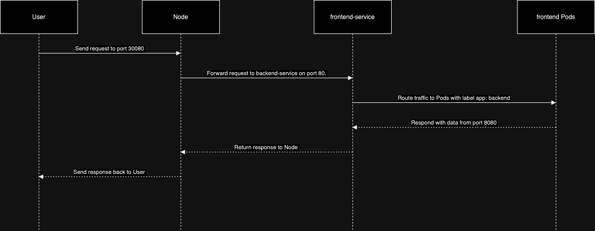

# Service Type- `NodePort`

- Exposes the Service on each **Node's IP** at a **_static port_** (the **_NodePort_**). To make the node port available, Kubernetes sets up a cluster IP address, the same as if you had requested a Service of type: **_ClusterIP_**.
- If you set the type field to `NodePort`, the Kubernetes control plane allocates a port from a range specified by `--service-node-port-range` flag (`default: 30000-32767`). Each node proxies that port (**the same port number on every Node**) into your Service. Your Service reports the allocated port in its `.spec.ports[*].nodePort` field.
- Using a `NodePort` gives you the freedom to set up your own load balancing solution, to configure environments that are not fully supported by Kubernetes, or **even to expose one or more nodes' IP addresses directly**.
- For a node port Service, Kubernetes additionally allocates a port (`TCP`, `UDP` or `SCTP`(Stream Control Transmission Protocol) to match the protocol of the Service). Every node in the cluster configures itself to listen on that assigned port and to forward traffic to one of the ready `endpoints` associated with that Service. You'll be able to contact the `type: NodePort` Service, from outside the cluster, by connecting to any node using the appropriate protocol (for example: `TCP`), and the appropriate port (as assigned to that Service).

## Choosing your own port

- If you want a specific port number, you can specify a value in the `nodePort` field. The control plane will either allocate you that port or report that the API transaction failed. This means that you need to take care of possible port collisions yourself. You also have to use a valid port number(30000-32767), one that's inside the range configured for `NodePort` use.
- Here is an example manifest for a Service of `type: NodePort` that specifies a NodePort value (30007, in this example):

```yaml
apiVersion: v1
kind: Service
metadata:
  name: NodePort-Service
spec:
  type: NodePort
  selector:
    app.kubernetes.io/name: MyApp
  ports:
    - port: 80
      # By default and for convenience, the `targetPort` is set to
      # the same value as the `port` field.
      targetPort: 80
      # Optional field
      # By default and for convenience, the Kubernetes control plane
      # will allocate a port from a range (default: 30000-32767)
      nodePort: 30007
```

## Reserve Nodeport ranges to avoid collisions

- The policy for assigning ports to NodePort services applies to both the **auto-assignment **and the **manual assignment scenarios**. When a user wants to create a NodePort service that uses a specific port, the target port may conflict with another port that has already been assigned.
- To avoid this problem, the port range for NodePort services is divided into two bands. Dynamic port assignment uses the upper band by default, and it may use the lower band once the upper band has been exhausted. Users can then allocate from the lower band with a lower risk of port collision.

#### ⚠️ Port Conflict Risk

If you manually assign a `nodePort` that is already in use, Kubernetes will return an error:

```
spec.ports[0].nodePort: Invalid value: 30080: provided port is already allocated
```

#### 📘 Conflict Example

```yaml
# First service using port 30080
apiVersion: v1
kind: Service
metadata:
  name: frontend-service
spec:
  type: NodePort
  selector:
    app: frontend
  ports:
    - port: 80 # Service port (cluster internal)
      targetPort: 8080 # Container port
      nodePort: 30080 # External Node IP port
```

In this example, a `service` named frontend-service is created with type: NodePort. It exposes port 80 internally and port 30080 externally on all nodes. Traffic hitting port 30080 on any node will be forwarded to the pods selected by the `app: frontend` `label`, which are expected to be listening on port 8080.


```yaml
# Second service using the same port 30080 (will fail)
apiVersion: v1
kind: Service
metadata:
  name: backend-service
spec:
  type: NodePort
  selector:
    app: backend
  ports:
    - port: 80 # Service port (cluster internal)
      targetPort: 8080  # Container port
     nodePort: 30080    # ❌ Conflict! already occupied by frontend NodePort Service, so we can use any port between 30000 to 32767 except 30080 to avoid collision.
     #nodePort: 300081  # External Node IP port
```

In this example, a `service` named backend-service is created with type: NodePort. It exposes port 80 internally and port 30080 externally on all nodes. Traffic hitting port 30080 on any node will be forwarded to the pods selected by the `app: backend` `label`, which are expected to be listening on port 8080.


## Front-end and Back-end Pod

```bash
# Frontend Pod
apiVersion: v1
kind: Pod
metadata:
  name: backend
  labels:
    app: backend
spec:
  containers:
  - name: backend-container
    image: nginx
    resources:
      requests:
        memory: "64Mi"
        cpu: "250m"
      limits:
        memory: "64Mi"
        cpu: "250m"
    ports:
    - containerPort: 8080
---
# Backend Pod
apiVersion: v1
kind: Pod
metadata:
  name: backend
  labels:
    app: backend
spec:
  containers:
  - name: backend-container
    image: curlimages/curl
    resources:
      requests:
        memory: "64Mi"
        cpu: "250m"
      limits:
        memory: "128Mi"
        cpu: "500m"
    ports:
    - containerPort: 8080

```

-
- It's a straightforward way to make services accessible from outside the cluster, but it's generally not recommended for production due to limitations in `load balancing` and `security`.

---

## How it works:

### Port Assignment:

A NodePort service assigns a port (within the range of 30000-32767 by default) on each node in the cluster.

### External Access:

Clients can then access the service by connecting to any node's IP address and the assigned NodePort.

### Routing:

Kubernetes automatically routes traffic from the NodePort to the appropriate pods backing the service.

## Key characteristics:

### Simple to use:

NodePorts offer a quick and easy way to expose services for testing and development.

### Limited load balancing:

While Kubernetes does some internal load balancing between pods, NodePorts don't inherently provide robust load balancing across nodes.

### Security concerns:

Exposing a port on every node can increase the risk of unauthorized access if not managed carefully.

### Port conflicts:

Only one service can use a specific NodePort at a time.

## When to use NodePort:

### Development and testing:

NodePorts are convenient for quickly exposing applications during development or testing.

### Simple deployments:

For applications with limited traffic or where advanced load balancing isn't required, NodePort can be sufficient.

### Integrating with external load balancers:

NodePorts can be used as a building block for more advanced setups, like integrating with external load balancers.
