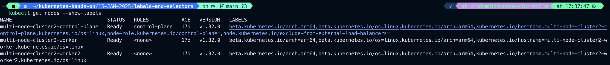
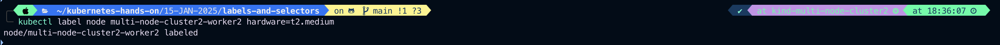
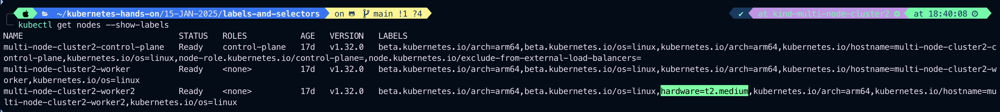
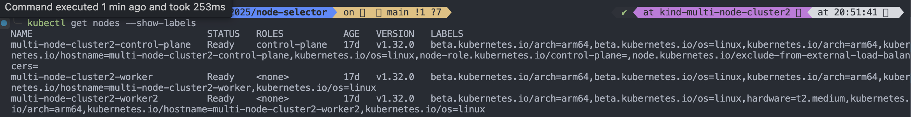
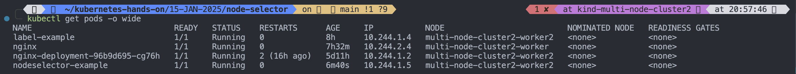

# Node Selector

- One use case for selecting labels is to constrain the set of nodes onto which a pod can schedule. i.e you can tell a pod to only schedule/run on a specified/particular node.
- Generally, such constraints are unnecessary, as the scheduler will automatically do a reasonable placement, but on certain circumstances we might need it.
- we can use label to tag nodes.
- You the nodes are tagged, you can use the **_label-selector_** to specify the pods run only on specific nodes.
- First we give lable to the node.
- Then use node-selector to the configuration of the pod.

# Let's Create a Pod with nodeSelector

```
vim pod-with-nodeSelector.yaml
```

```
apiVersion: v1
kind: Pod
metadata:
  name: nodeselector-example
  labels:
    name: nodeseletor-example
    run: nginx
    env: test
    class: pod
spec:
  containers:
  - name: nodeselector-example-nginx-container
    image: nginx
  nodeSelector:
    hardware: t2.medium
```

Now let's set hardware=t2.medium lable on a node

1. List the nodes with labels

```
kubectl get nodes --show-labels
```

Output:
 2. Let's set hardware=t2.meduim label on multi-node-cluster2-worker2

```
kubectl label node multi-node-cluster2-worker2 hardware=t2.medium
```

 3. Verify the label on multi-node-cluster2-worker2

```
kubectl get nodes --show-labels
```



4. Apply the pod-with-nodeSelector.yaml to see the resul whether this pod is getting schedule on multi-node-cluster2-worker2

```
kubectl apply -f pod-with-nodeSelector.yaml
```

5. Verify this pod scheduling

```
kubectl get node --show-labels -o wide
```

Output:


```
kubectl get pods -o wide
```

Output:

