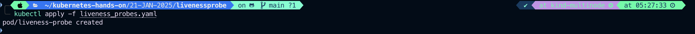
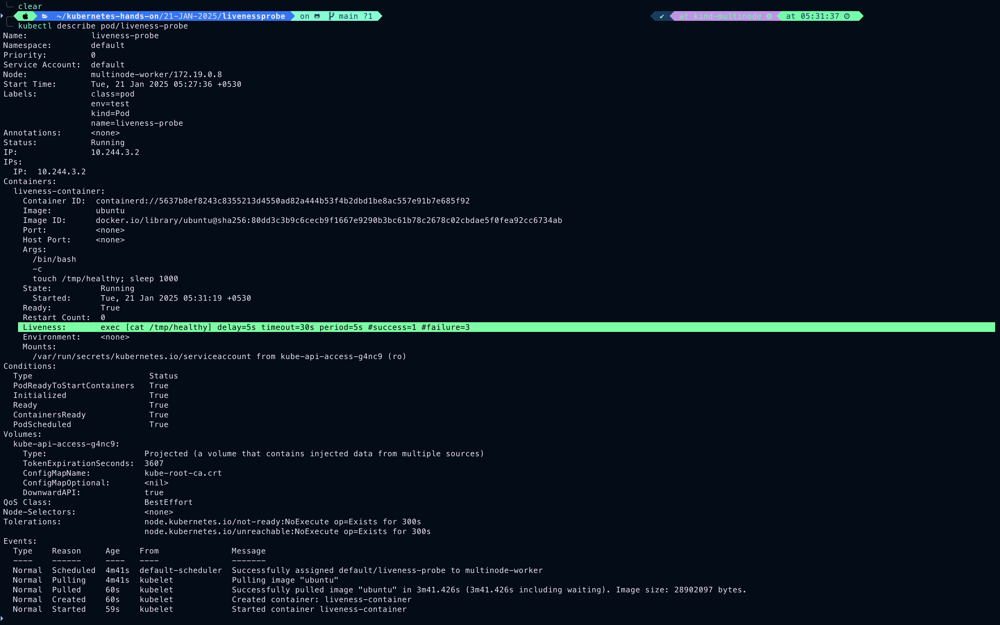
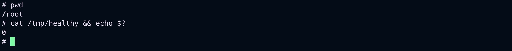
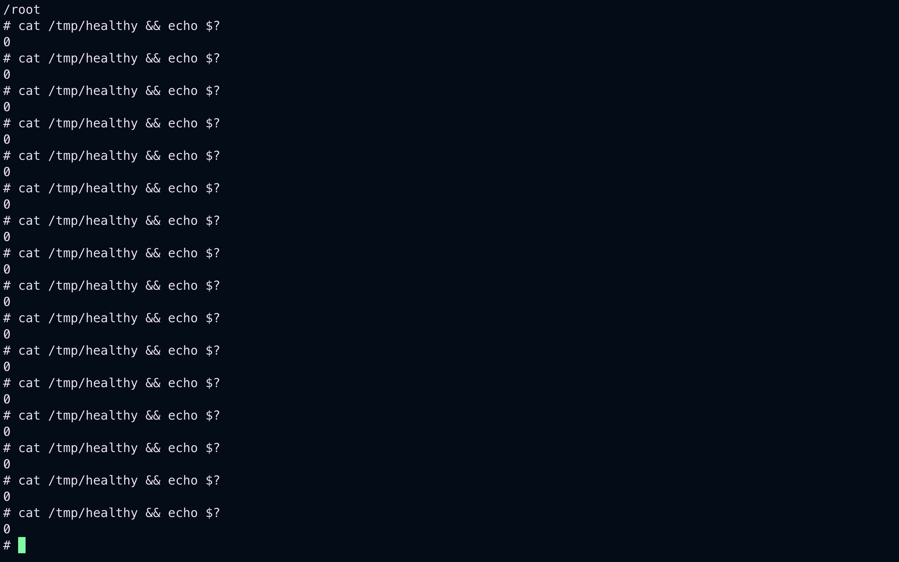
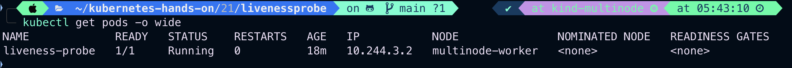
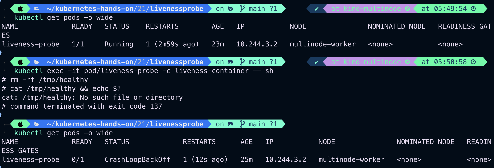
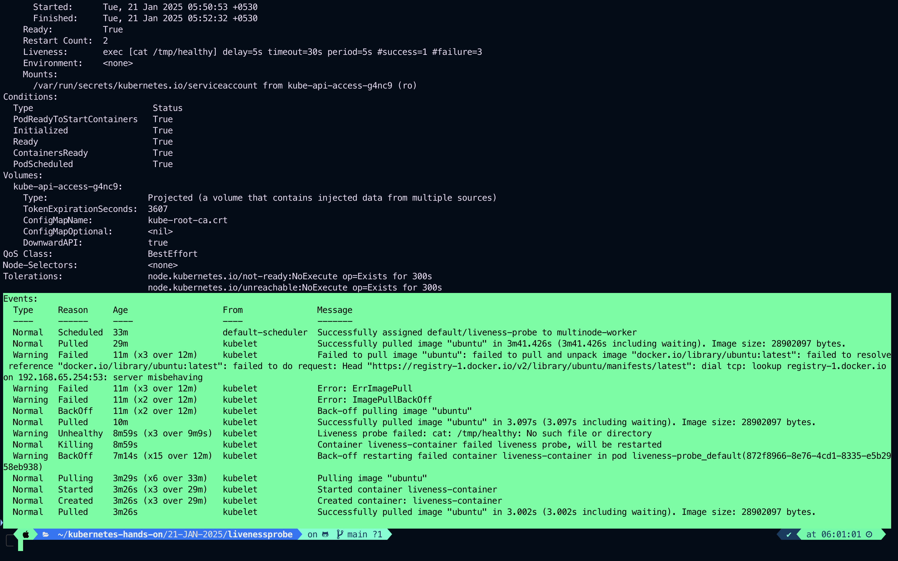
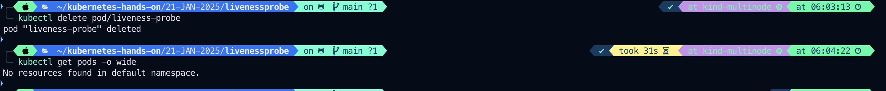

# Healthcheak/LivenessProbe

- A Pod is considered ready when all of it's containers are ready.
- In order to verify if a container in a Pod id <font style="color: yellow">Healthy</font> and <font style="color: yellow">Ready to serve traffic</font>, Kubernetes provides for a range of healthy checking mechanism.
- <font style="color: yellow">Health Checks</font> or <font style="color: yellow">Probes</font> are carried out by kubelet to determine when to recreate a container.<font style="color: yellow">(For LivenessProbe)</font> and used by services and deployments to determine if a Pod should receive traffic.

### Example

Liveness Probe could catch a deadlock, when an application is running, but unable to make progress restarting a container in such a state can help to make the application more available despite bugs.

- One use of <font style="color: yellow">readiness probe</font> is to control which Pods are used as backend for services. When a Pod is not ready, it is removed from <font style="color: yellow">Service- LoadBalancer</font>
- For running <font style="color: yellow">Heeathcheck</font>, we would use <font style="color: yellow">cmd specific to the application</font>
- If the <font style="color: yellow">CMD</font> succeeds, it returns <font style="color: yellow">Zero/ 0</font>, and the kubelet consider the container to be alive and healthy. If the command returns <font style="color: yellow">non-zero</font> value, the kubelet kills the Pod and recreate it.

# Example

```
vim liveness_probes.yaml
```

```
apiVersion: v1
kind: Pod
metadata:
  name: liveness-probe
  labels:
    name: liveness-probe
    class: pod
    kind: Pod
    env: test
spec:
  containers:
  - name: liveness-container
    image: ubuntu
    args:
    - /bin/bash
    - -c
    - touch /tmp/healthy; sleep 1000
    livenessProbe:                       # Define the Health Check
      exec:
        command:                           # Command to run Periodically
        - cat
        - /tmp/healthy
      initialDelaySeconds: 5             # Wait for the specified time before it runs the first probe
      periodSeconds: 5                   # Run the above command every 5 Second
      timeoutSeconds: 30
```

```
kubectl apply -f liveness_probes.yaml
```



```
kubectl describe liveness-probe
```



```
kubectl exec -it pod/liveness-probe -c liveness-container -- sh
```

### From inside

```
ls -ltr
pwd
cat /tmp/healthy && echo $?
```



Command which we wrote for container to health check

```
livenessProbe:                       # Define the Health Check
      exec:
        command:                           # Command to run Periodically
        - cat
        - /tmp/healthy

```

If it returns non-zero for 3 times then kubelet will recreate the Pod


### Now remove healthy file , get inside the container and run

```
kubectl get pods -o wide
```



### get inside the container and delete healthy file to see the effect

```
kubectl exec -it pod/liveness-probe -c liveness-container -- sh
```

```
rm -rf /tmp/healthy
```


Post delete it throws me out and creating new Pod because it get non-zero output of

```
cat /tmp/healthy
```

Output :
ls /tmp/healthy command terminated with exit code 137

```
kubectl describe pods/liveness-probe
```



### Delete the pod

```
kubectl delete pod/liveness-probe
```

kubectl get pods -o wide

```


```


