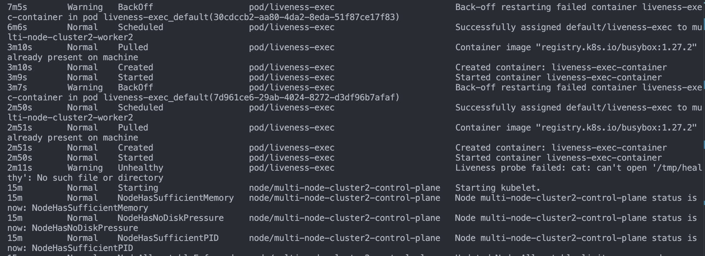
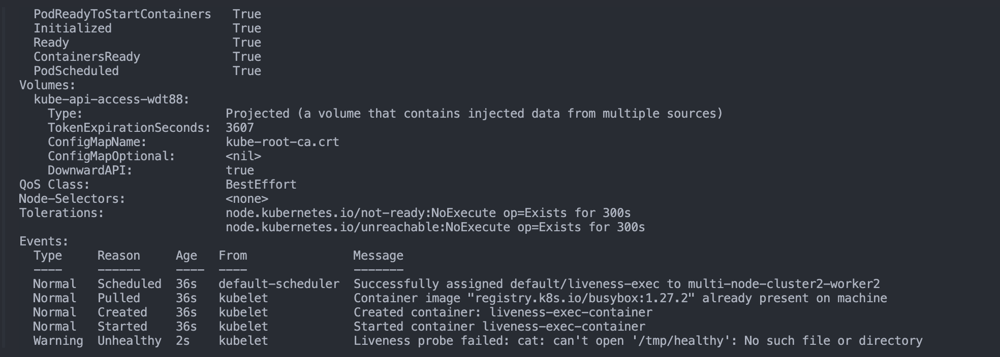
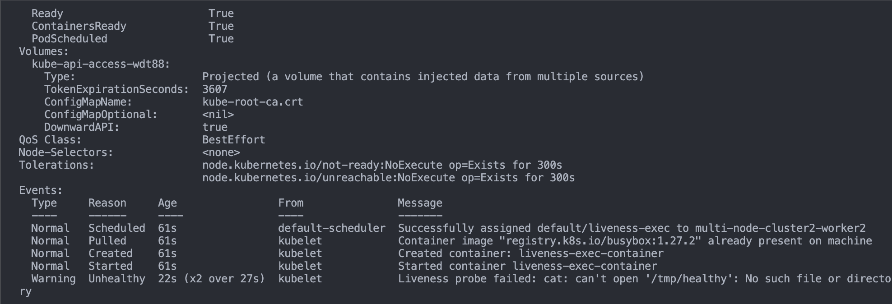
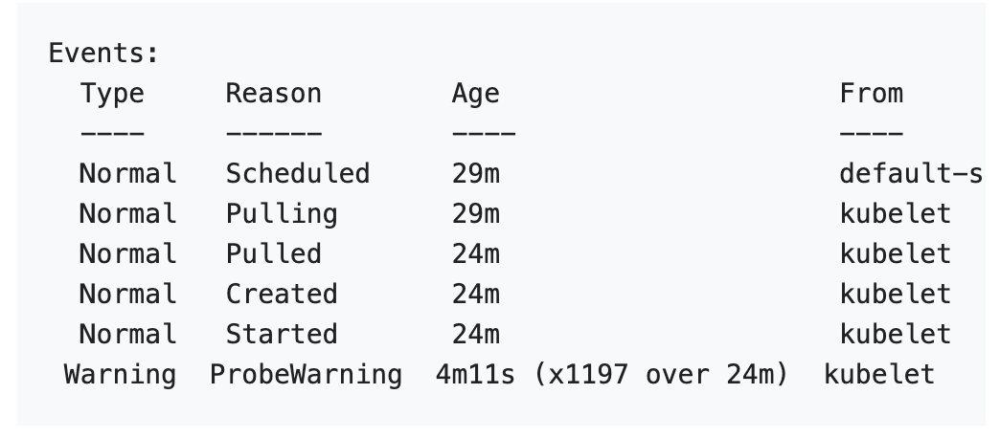

# Configure Liveness, Readiness and Startup Probes

## Kubernetes has various types of probes

- Liveness probe
- Readiness probe
- Startup probe

---

## Liveness probe

- Liveness probe determine when to restart a container. For example `liveness probes` could catch a deadlock when an application is running but unable to make progress.
- If a containers fails it's liveness probe repeatedly, the kubelet restart the container.
- Liveness probe do not wait for readiness probes to succed. If you want to wait before executing a liveness probe, you can either define `initialDelaySeconds` or use a `startup probe`.
- The `kubelet` uses the liveness probe to know when to restart a container. For example, liveness probe could catch a deadlock, where an application is running but unable to make progress. Restarting a container in such a state can help to make the application more available despite bugs.
- A common pattern for liveness probe is use the same low-cost HTTP endpoint as for readiness probes but with a higher failureThresold. This ensures that the pod is observed as not ready for some period of time before it is hard killed.

## Caution

Liveness probes can be a powerful way to recover from application failures, but they should be used with caution. Liveness probes must be configured carefully to ensure that they truly indicate unrecoverable application failure, for example a deadlock.

## Note

Incorrect implementation of liveness probes can lead to cascading failures. This results in restarting of container under high load; failed client requests as your application became less scalable; and increased workload on remaining pods due to some failed pods. Understand the difference between readiness and liveness probes and when to apply them for your app.

- Many applications running for long period of time
  eventually transition to brocken states, and cannot recover except by being restarted. Kubernetes provides to detect and remedy such situations.

# Exercise

- In this exercise you create a Pod that runs container based on `registry.k8s.io/busybox:1.27.2` image.

```py
apiVersion: v1
kind: Pod
metadata:
  name: liveness
  label:
    test: liveness
    name: liveness-exec
spec:
  containers:
    name: liveness-container
    image: registry.k8s.io/busybox:1.27.2
    args:
    - /bin/sh
    - -c
    - touch /tmp/healthy; sleep 30; rm -f /tmp/healthy; sleep 600
    livenessProbe:
      exec:
        command:
        - cat
        - /tmp/healthy
        initialDelaySeconds: 5
        periodSeconds: 5


```

- In the configuration file you can see the Pod has single `container`. The `periodSeconds` field specifies the kubelet should perform the liveness prob every 5 seconds. The `initialDelaySeconds` field tells the kubelet that it should wait 5 seconds before performing the first probe.
- To perform a probe, the kubelet executes the command `cat /tmp/healthy` in the target container. if the command succeds it returns 0, and the kubelet considered the container to be alive and healthy. if the command returns the non -zero values the kubelet kills the container and restarts it.
- When the container starts, it executes this command.

```sh
/bin/sh -c "touch /tmp/healthy; sleep 30; rm -f /tmp/healthy; sleep 600;
```

- For the first 30 seconds of container life, there is a /tmp/healthy file. So during first 30 seconds, the command `cat /tmp/healthy` returns success code. After 30 seconds `cat /tmp/healthy` returns a failure code.
- Create the Pod

```sh
kubectl apply -f liveness-check.yaml
```

within 30 seconds view the Pod events

```sh
kubectl describe pod/liveness-exec
```

Or

```sh
kubectl get events
```

The output indicates that no liveness probes have failed yet:

After 35 seconds, view the Pod events again:

```sh
kubectl get events
```

At the bottom of the output, there are messages indicating that the liveness probes have failed, and the failed containers have been killed and recreated.


Wait another 30 seconds, and verify that the container has been restarted:

```sh
kubectl get pod liveness-exec
```

The output shows that RESTARTS has been incremented. Note that the RESTARTS counter increments as soon as a failed container comes back to the running state:


---

## Define a liveness HTTP request

- Another kind of liveness probe uses an `HTTP GET` request. Here is the configuration file for Pod that runs a container based on `registry.k8s.io/e2e-test-images/agnhost` image

```sh
touch liveness-http.yaml
```

```py
apiVersion: v1
kind: Pod
metadata:
  name: liveness-http
  labels:
    test: liveness
spec:
  containers:
  - name: liveness-http-container
    image: registry.k8s.io/e2e-test-images/agnhost:2.40
    args:
    - liveness
    livenessProbe:
      httpGet:
        path: /healthz
        port: 8080
        httpHeaders:
        - name: Custome-Header
          value: Awesome
      initialDelaySeconds: 3
      periodSeconds: 3

```

- In the configuration file, you can see that the Pod has single container.
- The `periodSeconds` field specifies that the kubelet should perform prob every 3 seconds.
- The `initialDelaySeconds` field tells the kubelet that it should wait 3 seconds before performing first probe.
- TO perform a probe, the kubelet sends the `HTTP GET` request to the server that is running in the container and listening on port 8080. If the handler for the server's `/healthz` path return a success code, the kubelet considers the container to be alive and healthy. If the handler returns a failure code, the kubelet kills the container and restart it.
- Any code greater than 200 and less than 400 indicates success. Any other code indicates failure.
- For the first 10 seconds the container is alive. The `/healthz` handler returns a status of 200. After that, the handler returns a status of 500.

```go
package main

import (
    "fmt"
    "net/http"
    "time"
)

var started = time.Now()

func main() {
    http.HandleFunc("/healthz", func(w http.ResponseWriter, r *http.Request) {
        duration := time.Since(started) // More idiomatic than time.Now().Sub(started)
        if duration.Seconds() > 10 {
            w.WriteHeader(http.StatusInternalServerError)
            w.Write([]byte(fmt.Sprintf("error: %.2f seconds since start", duration.Seconds())))
        } else {
            w.WriteHeader(http.StatusOK)
            w.Write([]byte("ok"))
        }
    })

    fmt.Println("Server starting on :8080...")
    http.ListenAndServe(":8080", nil)
}

```

- The kubelet starts performing health checks 3 seconds after the container starts. So the first couple of health check will succed. But after 10 seconds, the health check will fail, and the kubelet will kill and restart the container.
- To try HTTP liveness check, create a Pod

```sh
kubectl apply -f liveness-http.yaml
```

- After 10 seconds, view Pod events to verify that the liveness probe has failed and the container has been restarted.

```sh
kubectl describe pod/liveness-http
```

`O/P`

```sh
kubectl describe pod/liveness-http
Name:             liveness-http
Namespace:        default
Priority:         0
Service Account:  default
Node:             multi-node-cluster2-worker2/172.19.0.4
Start Time:       Thu, 12 Jun 2025 06:35:18 +0530
Labels:           test=liveness
Annotations:      <none>
Status:           Running
IP:               10.244.1.3
IPs:
  IP:  10.244.1.3
Containers:
  liveness-http-container:
    Container ID:  containerd://3472f4ced1b0a281c2e2d612e06cfb2fa5063a90c27ec8a43eaeb77d697d759b
    Image:         registry.k8s.io/e2e-test-images/agnhost:2.40
    Image ID:      registry.k8s.io/e2e-test-images/agnhost@sha256:af7e3857d87770ddb40f5ea4f89b5a2709504ab1ee31f9ea4ab5823c045f2146
    Port:          <none>
    Host Port:     <none>
    Args:
      liveness
    State:          Running
      Started:      Thu, 12 Jun 2025 06:35:54 +0530
    Last State:     Terminated
      Reason:       Error
      Exit Code:    2
      Started:      Thu, 12 Jun 2025 06:35:36 +0530
      Finished:     Thu, 12 Jun 2025 06:35:54 +0530
    Ready:          True
    Restart Count:  2
    Liveness:       http-get http://:8080/healthz delay=3s timeout=1s period=3s #success=1 #failure=3
    Environment:    <none>
    Mounts:
      /var/run/secrets/kubernetes.io/serviceaccount from kube-api-access-dcd8h (ro)
Conditions:
  Type                        Status
  PodReadyToStartContainers   True
  Initialized                 True
  Ready                       True
  ContainersReady             True
  PodScheduled                True
Volumes:
  kube-api-access-dcd8h:
    Type:                    Projected (a volume that contains injected data from multiple sources)
    TokenExpirationSeconds:  3607
    ConfigMapName:           kube-root-ca.crt
    ConfigMapOptional:       <nil>
    DownwardAPI:             true
QoS Class:                   BestEffort
Node-Selectors:              <none>
Tolerations:                 node.kubernetes.io/not-ready:NoExecute op=Exists for 300s
                             node.kubernetes.io/unreachable:NoExecute op=Exists for 300s
Events:
  Type     Reason     Age                From               Message
  ----     ------     ----               ----               -------
  Normal   Scheduled  48s                default-scheduler  Successfully assigned default/liveness-http to multi-node-cluster2-worker2
  Normal   Pulled     12s (x3 over 48s)  kubelet            Container image "registry.k8s.io/e2e-test-images/agnhost:2.40" already present on machine
  Normal   Created    12s (x3 over 48s)  kubelet            Created container: liveness-http-container
  Normal   Started    12s (x3 over 48s)  kubelet            Started container liveness-http-container
  Warning  Unhealthy  12s (x6 over 36s)  kubelet            Liveness probe failed: HTTP probe failed with statuscode: 500
  Normal   Killing    12s (x2 over 30s)  kubelet            Container liveness-http-container failed liveness probe, will be restarted
```

```sh
kubectl get pods -o wide
```

`O/P`

```sh
kubectl get pods -o wide
NAME            READY   STATUS    RESTARTS     AGE   IP           NODE                          NOMINATED NODE   READINESS GATES
liveness-http   1/1     Running   3 (8s ago)   62s   10.244.1.3   multi-node-cluster2-worker2   <none>           <none>

kubectl get pods -o wide
NAME            READY   STATUS             RESTARTS     AGE   IP           NODE                          NOMINATED NODE   READINESS GATES
liveness-http   0/1     CrashLoopBackOff   3 (8s ago)   80s   10.244.1.3   multi-node-cluster2-worker2   <none>           <none>

kubectl get pods -o wide
NAME            READY   STATUS             RESTARTS      AGE   IP           NODE                          NOMINATED NODE   READINESS GATES
liveness-http   0/1     CrashLoopBackOff   3 (12s ago)   84s   10.244.1.3   multi-node-cluster2-worker2   <none>           <none>


 kubectl get pods -o wide
NAME            READY   STATUS    RESTARTS      AGE    IP           NODE                          NOMINATED NODE   READINESS GATES
liveness-http   1/1     Running   4 (29s ago)   101s   10.244.1.3   multi-node-cluster2-worker2   <none>           <none>

```

---

## Define the TCP liveness probe

- A third type of liveness probe uses a TCP socket. With this configuration, the kubelet will attempt to open to your container on the specified port. If it can established a connection, the container is considered healthy, if it can't considered a failure.

```sh
touch tcp-liveness-readiness.yaml
```

```py
apiVersion: v1
kind: Pod
metadata:
  name: goproxy
  labels:
    app: goproxy
spec:
  containers:
  - name: goproxy
    image: registry.k8s.io/goproxy:0.1
    ports:
    - containerPort: 8080
    resinessProbe:
      tcpSocket:
        port: 8080
      initialDelaySeconds: 15
      periodSeconds: 10
    livenessProbe:
      tcpSocket:
        port: 8080
      initialDelaySeconds: 15
      periodSeconds: 10

```

- As you can see configuration for a `TCP` check is quite similar to an `HTTP` check. This example uses both `rediness` and `liveness` probes. The `kubelet` will run the first liveness probe 15 seconds after container starts. this will attempt to connect to `goproxy` container on port 8080. If the liveness probe fails, the container will be restarted. The kubelet will continue to run this check every 10 seconds.
- In addition to the liveness probe, this configuration includes a readiness probe. The kubelet will run the first readiness probe 15 seconds after the container starts. Similar to the liveness probe, this will attempt to connect to the `goproxy` container on port 8080. If the prove succed, the Pod will be marked as ready and will receive traffic from service. If the readiness prob fails, the Pod will be marked unready and will not receive traffic from any services.
- To try `TCP` liveness check, create Pod:

```sh
touch tcp-liveness-readiness.yaml
```

- After 15 seconds, view Pod events to verify that liveness probes.

```sh
kubectl describe pod/goproxy
```

---

## Define a gRPC liveness probe

- If your application implements the `gRPC Health Checking Protocol`, this example shows how to configure Kubernetes to use it for application liveness checks. Similarly you can configure readiness and startup probe.

```sh
touch grpc-liveness.yaml
```

```py
apiVersion: v1
kind: Pod
metadata:
  name: etcd-with-grpc
  labels:
    env: etcd-with-grpc
spec:
  containers:
  - name: etcd
    image: registry.k8s.io/etcd:3.5.1-0
    command: [ "/usr/local/bin/etcd", "--data-dir", "/var/lib/etc", "--listen-client-urls", "http://0.0.0.0:2379", "--advertise-client-urls", "http://127.0.0.1:2379", "--log-level", "debug" ]
    ports:
    - containerPort: 2379
    livenessProbe:
      grpc:
        port: 2379
      initialDelaySeconds: 10

```

- To use a `gRPC` probe, `port` must be configured. If you want to distinguish probes of different types and probes for different features you can use the `Service` field. You can set `Service` to the value `liveness` and make your gRPC health checking endpoints respond to this request differently than when you set `service` set to `readiness` this let you use the same endpoint for different kind of container health check rather than listening on two different ports. If you want to specify your own custom service name and also specify a probe type, the Kubernetes projects recommends that you use a name that concatenates those. For example: `myservice-liveness`(using `-` as a separator).

## Note:

### Unlike HTTP or TCP probes you cannot specify the health check port by name, and you cannot configure a custome hostname.

- Configurations probelems ( for example: incorrect port or service, unimplimented health checking protocols) are considered a probe failure, similar to HTTP and TCP probe.
- To try the `gRPC` liveness check, create a pod using conmmand below

```sh
kubectl apply grpc-liveness.yaml
```

- After 15 seconds, view Pod events to verify that liveness check has not failed.

```sh
kubectl describe pod/etc-with-grpc
```

- ## When using `gRPC` probe, there are some technical to be aware of:
  - The probes run against the Pod IP address or hostname. Be sure to configure your gRPC endpoint to listen on the Pod IP address.
  - The probe do not support any authentication parameters(like `tls`).
  - There are no error code for built-in-probes. All errors are considered as probe failure.
  - If `execProbeTimeout` feature gate is set to `false`, `grpc-health-probe` does not respect the `timeoutSeconds` setting(which default to 1s), while built-in probe would fail on timeout.
-
-

- ***

## Readiness probe

- Readiness probe determine when a container is ready to start accepting traffic. This is useful when waiting for an application time consuming initial tasks, such as establishing network connections, loading files and warming catches.
- If a readiness probe returns a failed failed state, kubernetes remove the probes from all matching `service endpoints`.
- Readiness probes runs on a container during it's whole lifecycle.
- The kubelet uses readiness probes to know when a container is ready to start accepting traffic. One use of this signal is to control which Pods are used as backend for Services.
- A Pod is considered ready when it's `ready condition` is true.
- When a Pod is not `ready`, it is removed from service loadbalancer.
- A Pod's `Ready` condition is false when it's `Node's ready condition is not true,` when one of the Pod's `readinessGates` is false, or when atleast one of it's container is not ready.

---

## Startup probe

- A startup probe verifies whether the application within the container is started. This can be used to adopt liveness checks on slow starting containers, avoiding them getting killed by the `kubelet` before they are up and running.
- If such a probe is configured, it disable `liveness` and `readiness` checks until it succeds.
- This type of probe only executes at startup, unlike liveness and readiness probes, which are run periodically.

---

## Use a name port

- You can use a name `port` for `HTTP` and `TCP` probes. `gRPC` probes do not support named port.

### For example

```py
ports:
- name: liveness-port
  containerPort: 8080

livenessProbe:
  httpGet:
    path: /healthz
    port: liveness-port
```

-
-
-
- ***

## Protect slow starting container with `startup probes`

- Sometimes, you have to deal with applications that require additional startup time on their first initialization. In such cases it can be risky to setup `livenessProbe` parameters without compromising the fast response to deadlock that motivated such a probe. The solution is to set up a `startup` probe with the same command, `HTTP` or `TCP` check, with a `failureThresold * periodSeconds` long enough to cover the worst case startup time.

```py
ports:
- name: liveness-port
  containerPort: 8080
livenessProbe:
  httpGet:
    path: /healthz
    port: liveness-port
  failureThreshold: 1
  periodSeconds: 10

startupProbe:
  httpGet:
    path: /healthz
    port: liveness-port
  failureThreshold: 30
  periodSeconds: 10
```

- Thanks to the `startup probe`, the application will have a maximum of(30 \* 10=300s) to finish it's startup. Once the startup probe has succeded once, the liveness probe take over to provide fast response to container deadlocks. If the startup probe never succeds the container is killed after 300s and subject to the pod `restartPolicy`.

---

## Define `readiness` probes

- Sometimes, applications are temporarly unable to serve traffic. For example, an application might need to load large data or configuration files during startup, or depend on external services after startup. In such cases, you don't want to kill the application, but you don't want to sent it request either. Kubernetes provides `readinessProbe` to detect and miligate these situations. A Pod with container reporting that they are not ready does not receive traffic through Kubernetes service.

---

> `Note:` readiness probes runs on container during it's whole lifecycle.

---

> `Caution`: The readiness and liveness does not depend on each other to succed. if you want to wait before executing readiness probe, you should use `initialDelaySeconds` or a `startupProbe`

- `Readiness` probes are configured similarly to liveness probe. The only difference is that you use `readinessProbe` field istead of the `livenessProbe` field.

```py
readinessProbe:
  exec:
    command:
    - cat
    - /tmp/healthy
    initialDelaySeconds: 5
    periodSeconds: 5
```

- Configuration for `HTTP` and `TCP` readiness probes also remains identical to liveness probes.
- Readiness and liveness probes can be used in parallel for the same container. Using both can ensure that traffic does not reach a container that is not ready for it, and the containers are restartes when they fail.

---

## Configure Probes

- `Probes` have a number of fields that you can use to more preciesly control the behaviour of `startup`, `liveness`, and `readiness` checks.

  - `initialDelaySeconds`: Number of seconds after the container has started before startup, liveness or readiness probes are initiated. If a startup probe is defined, liveness and readiness probe delays do not begin untill the startup probe has succeded. If the value of `periodSeconds` is greater than `initialDelaySeconds` then the `initialDelaySeconds` will be ignored. Default to `0` seconds. Minimum value is `0`.
  - `periodSeconds`: How often (in seconds) to perform the probe. Default to 10 seconds. The minimum value is 1. While a container is not ready, the `readiness` probe is executed at times other than the configured `periodSeconds` interval. This is to make the Pod ready faster.
  - `timeoutSeconds`: Number of seconds after which the probe times out. Defaults to 1 second. Minimum value is 1.
  - `successThreshold`: Minimum consecutive successes for the probe to be considered successful after having failed. Defaults to 1. Must be 1 for liveness and startup Probes. Minimum value is 1.
  - `failureThreshold`: After a probe fails `failureThreshold` times in a row, Kubernetes considers that the overall check has failed: the container is not ready/healthy/live. Defaults to 3. Minimum value is 1. For the case of a startup or liveness probe, if at least `failureThreshold` probes have failed, Kubernetes treats the container as unhealthy and triggers a restart for that specific container. The kubelet honors the setting of `terminationGracePeriodSeconds` for that container. For a failed readiness probe, the kubelet continues running the container that failed checks, and also continues to run more probes; because the check failed, the kubelet sets the `Ready` `condition` on the Pod to `false`.

  > `Caution`: Incorrect implementation of readiness probes may result in an ever growing number of processes in the container, and resource starvation if this is left unchecked.

---

## HTTP probes

- ## `HTTP` probes have additional fields that can be set on `httpGet`:
  - `host`: Host name to connect to, defaults to the pod IP. You probably want to set "Host" in `httpHeaders` instead.
  - `scheme`: Scheme to use for connecting to the host (HTTP or HTTPS). Defaults to "HTTP".
  - `path`: Path to access on the HTTP server. Defaults to "/".
  - `httpHeaders`: Custom headers to set in the request. HTTP allows repeated headers.
  - `port`: Name or number of the port to access on the container. Number must be in the range 1 to 65535.
  -
- For an HTTP probe, the kubelet sends an HTTP request to the specified port and path to perform the check. The kubelet sends the probe to the Pod's IP address, unless the address is overridden by the optional `host` field in `httpGet`. If `scheme` field is set to HTTPS, the kubelet sends an `HTTPS` request skipping the certificate verification. In most scenarios, you do not want to set the `host` field. Here's one scenario where you would set it. Suppose the container listens on 127.0.0.1 and the Pod's hostNetwork field is true. Then `host`, under `httpGet`, should be set to 127.0.0.1. If your pod relies on virtual hosts, which is probably the more common case, you should not use `host`, but rather set the Host header in `httpHeaders`.
- ## For an HTTP probe, the kubelet sends two request headers in addition to the mandatory `Host` header:
  - `User-Agent`: The default value is `kube-probe/1.33`, where `1.33` is the version of the kubelet.
  - `Accept`: The default value is `*/*`.
- You can override the default headers by defining httpHeaders for the probe. For example:

```py
livenessProbe:
  httpGet:
    httpHeaders:
      - name: Accept
        value: application/json

startupProbe:
  httpGet:
    httpHeaders:
      - name: User-Agent
        value: MyUserAgent
```

- You can also remove these two headers by defining them with an empty value.

```py
livenessProbe:
  httpGet:
    httpHeaders:
      - name: Accept
        value: ""

startupProbe:
  httpGet:
    httpHeaders:
      - name: User-Agent
        value: ""
```

> `Note`:
> When the kubelet probes a Pod using HTTP, it only follows redirects if the redirect is to the same host. If the kubelet receives 11 or more redirects during probing, the probe is considered successful and a related Event is created:
> 

## If the kubelet receives a redirect where the hostname is different from the request, the outcome of the probe is treated as successful and kubelet creates an event to report the redirect failure.

---

## TCP probes

- For a TCP probe, the kubelet makes the probe connection at the node, not in the Pod, which means that you can not use a service name in the host parameter since the kubelet is unable to resolve it.

### Probe-level terminationGracePeriodSeconds

- In 1.25 and above, users can specify a probe-level `terminationGracePeriodSeconds` as part of the probe specification. When both a pod- and probe-level `terminationGracePeriodSeconds` are set, the kubelet will use the probe-level value.
- ## When setting the terminationGracePeriodSeconds, please note the following:

  - The kubelet always honors the probe-level `terminationGracePeriodSeconds` field if it is present on a Pod.
  - If you have existing Pods where the `terminationGracePeriodSeconds` field is set and you no longer wish to use per-probe termination grace periods, you must delete those existing Pods.
    For example:

```py
spec:
  terminationGracePeriodSeconds: 3600  # pod-level
  containers:
  - name: test
    image: ...

    ports:
    - name: liveness-port
      containerPort: 8080

    livenessProbe:
      httpGet:
        path: /healthz
        port: liveness-port
      failureThreshold: 1
      periodSeconds: 60
      # Override pod-level terminationGracePeriodSeconds #
      terminationGracePeriodSeconds: 60

```

- Probe-level terminationGracePeriodSeconds cannot be set for readiness probes. It will be rejected by the API server.
