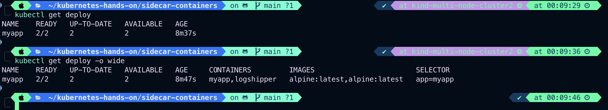

# Sidecar Containers

- Sidecar container is the secondary containers that runs along with the main container within the same Pod.
- These containers are used to inhance or to extend the functionality of the `primary app container` by providing additional services, or functionality such as logging, monitoring, security, or data synchronization, without directly altering the `primary application code`
- Typically, you only have one app container in a Pod.
- For example, if you have a web application that require a local webserver, the local webserver is a `sidecar` and the `web application` itself is the app container.

# Sidecar containers in Kubernetes

- Kubernetes implements sidecar containers as a special case of `init containers`; sidecar containers remain running after Pod startup.
- This document uses the term regular init containers to clearly refer to containers that only run during Pod startup.
- Provided that your cluster has the SidecarContainers feature gate enabled (the feature is active by default since Kubernetes v1.29), you can specify a restartPolicy for containers listed in a Pod's initContainers field. These restartable sidecar containers are independent from other init containers and from the main application container(s) within the same pod. These can be started, stopped, or restarted without affecting the main application container and other init containers.
- You can also run a Pod with multiple containers that are not marked as init or sidecar containers. This is appropriate if the containers within the Pod are required for the Pod to work overall, but you don't need to control which containers start or stop first. You could also do this if you need to support older versions of Kubernetes that don't support a container-level restartPolicy field.
- Example application

```sh
touch deployment-sidecar.yaml
```

```py
apiVersion: apps/v1
kind: Deployment
metadata:
  name: myapp
spec:
  replicas: 2
  selector:
    matchLabels:
      app: myapp
  template:
    metadata:
      labels:
        app: myapp
    spec:
      containers:
      - name: myapp
        image: alpine:latest
        command: [ "sh", "-c", "while true; do echo 'logging' >> /opt/logs.txt; sleep 1; done" ]
        volumeMounts:
        - name: data
          mountPath: /opt

      - name: logshipper
        image: alpine:latest
        command: [ "sh", "-c", "tail -F /opt/logs.txt" ]
        volumeMounts:
        - name: data
          mountPath: /opt

      volumes:
      - name: data
        emptyDir: {}


```

`RUN`
`Terraform apply -f deployment-sidecar.yaml`
`kubectl get pods`
`Output:`

```sh
kubectl get pods
NAME                     READY   STATUS    RESTARTS   AGE
myapp-798fd568bd-2nrxj   2/2     Running   0          2m10s
myapp-798fd568bd-qwszd   2/2     Running   0          2m10s
```

---

```sh
kubectl exec -it myapp-798fd568bd-2nrxj -c logshipper -- sh
```

`Output:`

```sh
/ # cd /opt
/opt # ls
logs.txt
/opt # tail -F logs.txt
logging
logging
logging
logging
logging
logging
logging
logging
^C
/opt #
```

---

```sh
kubectl get deploy
kubectl get deploy -o wide
```

`Output:`

```sh
kubectl get deploy -o wide
NAME    READY   UP-TO-DATE   AVAILABLE   AGE     CONTAINERS         IMAGES                        SELECTOR
myapp   2/2     2            2           8m47s   myapp,logshipper   alpine:latest,alpine:latest   app=myapp
```



---

# Sidecar containers and Pod lifecycle

- If an init container is created with its restartPolicy set to Always, it will start and remain running during the entire life of the Pod. This can be helpful for running supporting services separated from the main application containers.
- If a readinessProbe is specified for this init container, its result will be used to determine the ready state of the Pod.
- Since these containers are defined as init containers, they benefit from the same ordering and sequential guarantees as regular init containers, allowing you to mix sidecar containers with regular init containers for complex Pod initialization flows.
- Compared to regular init containers, sidecars defined within `initContainers` continue to run after they have started. This is important when there is more than one entry inside `.spec.initContainers` for a Pod. After a sidecar-style init container is running (the kubelet has set the `started` status for that init container to true), the kubelet then starts the next init container from the ordered `.spec.initContainers` list. That status either becomes true because there is a process running in the container and no startup probe defined, or as a result of its startupProbe succeeding.
- Upon Pod termination, the kubelet postpones terminating sidecar containers until the main application container has fully stopped. The sidecar containers are then shut down in the opposite order of their appearance in the Pod specification. This approach ensures that the sidecars remain operational, supporting other containers within the Pod, until their service is no longer required.

---

# Jobs with sidecar containers

- If you define a Job that uses sidecar using Kubernetes-style init containers, the sidecar container in each Pod does not prevent the Job from completing after the main container has finished.
- Here's an example of a Job with two containers, one of which is a sidecar:

```py
apiVersion: batch/v1
kind: Job
metadata:
  name: myjob
spec:
  template:
    spec:
      containers:
        - name: myjob
          image: alpine:latest
          command: ['sh', '-c', 'echo "logging" > /opt/logs.txt']
          volumeMounts:
            - name: data
              mountPath: /opt
      initContainers:
        - name: logshipper
          image: alpine:latest
          restartPolicy: Always
          command: ['sh', '-c', 'tail -F /opt/logs.txt']
          volumeMounts:
            - name: data
              mountPath: /opt
      restartPolicy: Never
      volumes:
        - name: data
          emptyDir: {}
```

---

# Differences from application containers

- Sidecar containers run alongside app containers in the same pod. However, they do not execute the primary application logic; instead, they provide supporting functionality to the main application.
- Sidecar containers have their own independent lifecycles. They can be started, stopped, and restarted independently of app containers. This means you can update, scale, or maintain sidecar containers without affecting the primary application.
- Sidecar containers share the same network and storage namespaces with the primary container. This co-location allows them to interact closely and share resources.
- From a Kubernetes perspective, the sidecar container's graceful termination is less important. When other containers take all allotted graceful termination time, the sidecar containers will receive the `SIGTERM` signal, followed by the `SIGKILL` signal, before they have time to terminate gracefully. So exit codes different from `0` (`0` indicates successful exit), for sidecar containers are normal on Pod termination and should be generally ignored by the external tooling.

---

# Differences from init containers

- Sidecar containers work alongside the main container, extending its functionality and providing additional services.
- Sidecar containers run concurrently with the main application container. They are active throughout the lifecycle of the pod and can be started and stopped independently of the main container. Unlike init containers, sidecar containers support probes to control their lifecycle.
- Sidecar containers can interact directly with the main application containers, because like init containers they always share the same network, and can optionally also share volumes (filesystems).
- Init containers stop before the main containers start up, so init containers cannot exchange messages with the app container in a Pod. Any data passing is one-way (for example, an init container can put information inside an `emptyDir` volume).
- Changing the image of a sidecar container will not cause the Pod to restart, but will trigger a container restart.

---

# Resource sharing within containers

- Given the order of execution for init, sidecar and app containers, the following rules for resource usage apply:
  - The highest of any particular resource request or limit defined on all init containers is the effective init request/limit. If any resource has no resource limit specified this is considered as the highest limit.
  - The Pod's effective request/limit for a resource is the sum of pod overhead and the higher of:
    - the sum of all non-init containers(app and sidecar containers) request/limit for a resource
    - the effective init request/limit for a resource
  - Scheduling is done based on effective requests/limits, which means init containers can reserve resources for initialization that are not used during the life of the Pod.
  - The QoS (quality of service) tier of the Pod's effective QoS tier is the QoS tier for all init, sidecar and app containers alike.
  - Quota and limits are applied based on the effective Pod request and limit.
  -
-
-
-
-
-
-
-
-
-
-
-
-
-
-
-
-
-
-
-
-
-
-
-
-
-
-
-
-
-
-
-
-
-
-
-
-
-
-
-
-
-
-
-
-
-
-
-
-
-
-
-
-
-
-
-
-
-
-
-
-
-
-
-
-
-
-
-
-
-
-
-
-
-
-
-
-
-
-
-
-
-
