# Volume

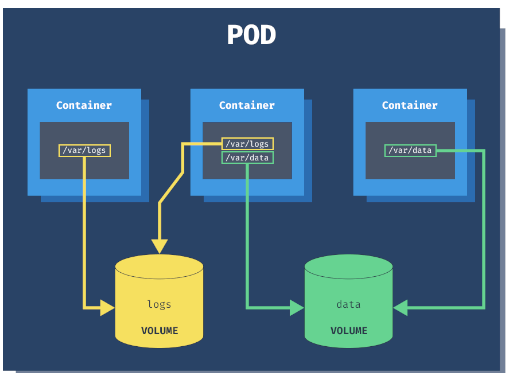
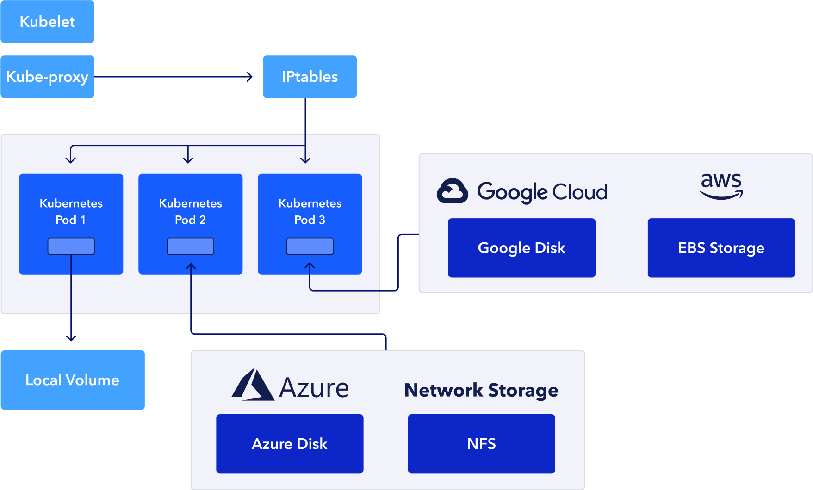


- containers are short lived in nature
- All data stored inside a container is deleted if the container crashes. However the **kubelete** will restart it with new state, which means that it will not have any old data.
- To overcome this problem, Kubernetes uses **_Volumes_**. A volume is essentially a **directory** backed by a storage medium. The storage medium and it's content are determined by the Volume type.
- In k8s a volume is attached to a Pod and shared among the containers of that Pod.
- The volume has the same life span as the Pod, and it **outlives** the containers of the Pod. This allows data to be preserved across container restart.

#

# Volume Types

- A volume type decide the property of the directory, like size, content, etc.
- **node-local** type such as **emptydir** and **hostpath**
- File sharing types such as **nfs**.
- Cloud provers specific types like **awselasticblockstore(AWS-EBS)**, **azuredisk**
- distributed file system type, for example **glusterfs** **cephfs**
- Special purpose like **secret** **gitrepo**

#

# emptydir

- Uses this when we want to share contents between multiple containers on the same Pod & not to the host machin.
- An **emptydir volume** is first created when a Pod is assign to a node, and exist as long as the pod is running on that node.
- As the name says, It is initially empty.
- Containers in the Pod can all **read and write** the same files in the **emptydir Volume** though that volume can be mounted at the same or different paths in each container.
- When a Pod is removed from a node for any reason, the data in the **emptydir** is deleted forever.
- A container crashing does not remove a Pod from a node, so the data in an **emptydir** is safe across container crashes.
  Example:

```
vim emptydir-volume.yaml
```

```
apiVersion: v1
kind: Pod
metadata:
  name: emptydir-volume
  labels:
    kind: pod
    env: test
    tier: backend
spec:
  containers:
  - name: c01
    image: centos
    command: ["/bin/bash/", "-c", "sleep 150000"]
    volumeMounts:             # Mount definition inside the container
    - mountPath: /tmp/cache
      name: cache-volume
  - name: c02
    image: centos
    command: ["/bin/bash/", "-c", "sleep 150000"]
    volumeMounts:
    - mountPath: /tmp/cache
      name: cache-volume
  volumes:
  - name: cache-volume
    emptyDir:
     sizeLimit: "500Mi"
     medium: Memory
```

### Apply emptydir-volume.yaml

```
kubectl apply -f emptydir-volume.yaml
```

```
kubectl get pods -o wide
```

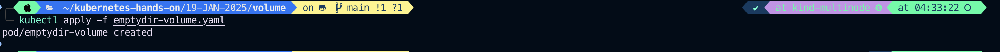
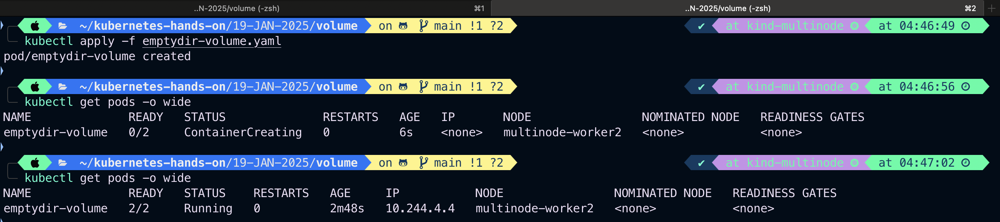

### Now let's get inside into both of the container one by one do some work in emptydir volume

```
kubectl exec -it pod/emptydir-volume -c c01 -- sh
```

From inside the container

```
cd tmp
pwd
cd cache
pwd

```

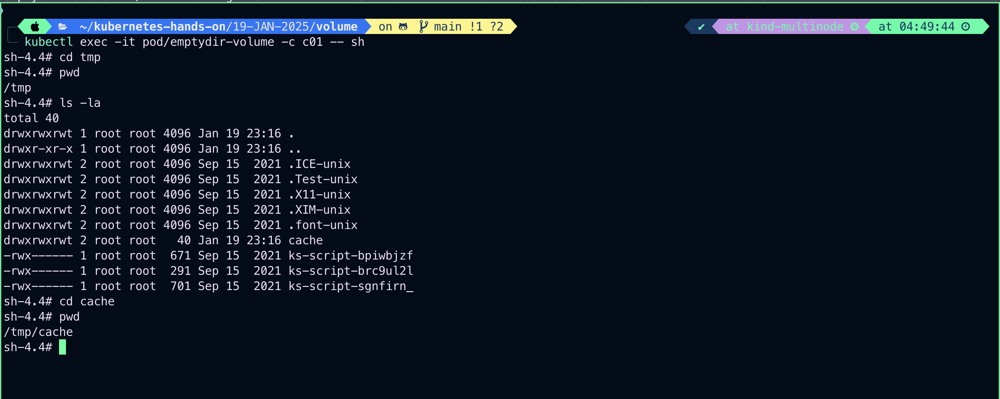

```
touch test.txt
```

```
echo "I am writing this from co1 container" > test.txt
```

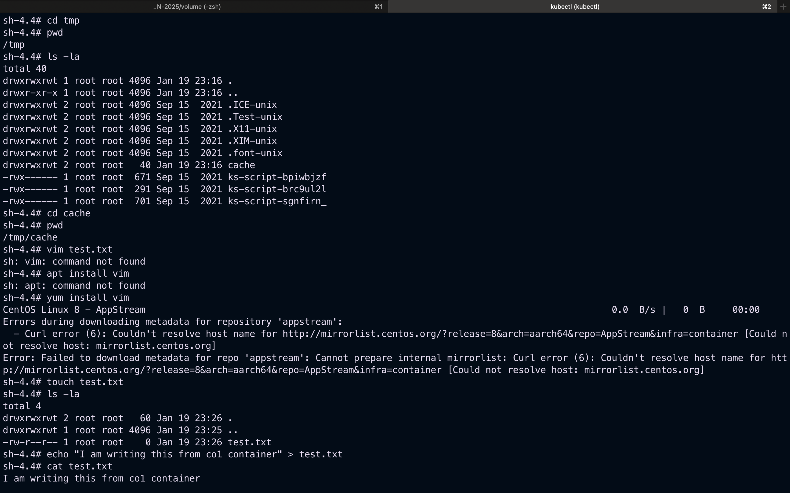

### Now let's exec into the 2nd container

```
kubectl exec -it pod/emptydir-volume -c c02 -- sh

```

From inside the container

```
cd tmp
pwd
cd cache
pwd
la -la

```

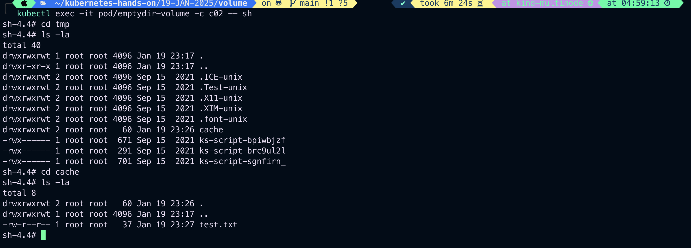

### file created in c01 is visible in c02, let's edit and see whether this change is visible from container co1 or not

```
echo "Hey, I am container c02, Welcome to my container" >> test.txt

cat test.txt
```

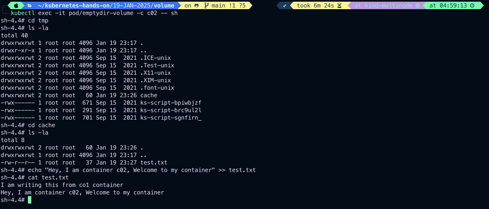

```
kubectl exec -it pod/emptydir-volume -c c01 -- sh
```

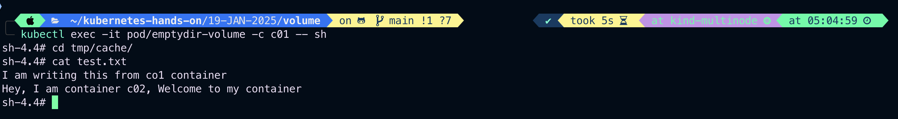

# hostpath

- Use this when we want to **_access_** the content of a Pod/container from **hostmachine**.
- A **_hostpath_** volume mounts a file or a directory from the **host node's filesystem\_** into your Pod.
  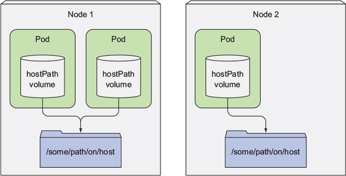
  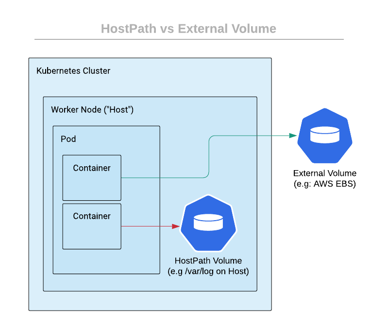
  Example:

```
vim hostpath-volume.yaml
```

```
apiVersion: v1
kind: Pod
metadata:
  name: hostpath-volume
  labels:
    class: Pod
    env: test
spec:
  containers:
  - name: hostpath-volume-container
    image: centos
    command: ["/bin/bash", "-c", "sleep 20000"]
    volumeMounts:
    - name: myhostpath
      mountPath: /tmp/hostpath
  volumes:
  - name: myhostpath
  hostPath:
  path: /tmp/data

```

or

```
apiVersion: v1
kind: Pod
metadata:
  name: hostpath-volume
  labels:
    class: Pod
    env: test
spec:
  initContainers:
  #init container ensure directory is created on the host system automatically
  - name: init-container
    image: busybox
    command: ["sh", "-c", "mkdir -p /tmp/hostpath-data"]
    volumeMounts:
    - name: myhostpath
      mountPath: /tmp/hostpath-data
  containers:
  - name: hostpath-volume-container
    image: centos
    command: ["/bin/bash", "-c", "sleep 20000"]
    volumeMounts:
    - name: myhostpath
      mountPath: /tmp/hostpath
  volumes:
  - name: myhostpath
    hostPath:
      path: /tmp/hostpath-data
      type: DirectoryOrCreate   # create the directory if it doesn't already exist
```

kubectl apply -f hostpath-volume.yaml

```

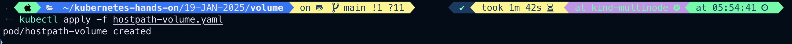

### Let's exec into the containe and add a file with content which should be avaiale in the given hostpath

```

kubectl exec -it pod/hostpath-volume -c hostpath-volume-container -- sh

```

```

```
cd tmp/hostpath/

ls -la

echo "I am writing this from hostpath-volume-container, Hope it is visible to your hostmachine as well" > test.txt

ls -la
```

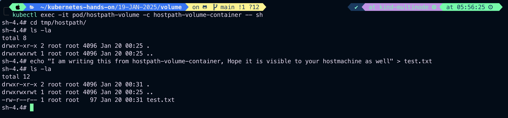

### Let's check the directory on the host /tmp/data

```
kubectl get pods -o wide
```

```
kubectl get nodes -o wide
```

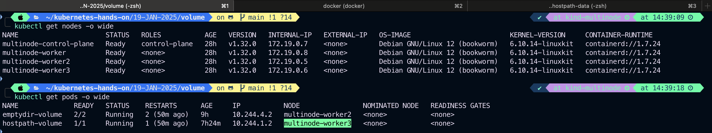

```
docker inspect multinode-worker3
```


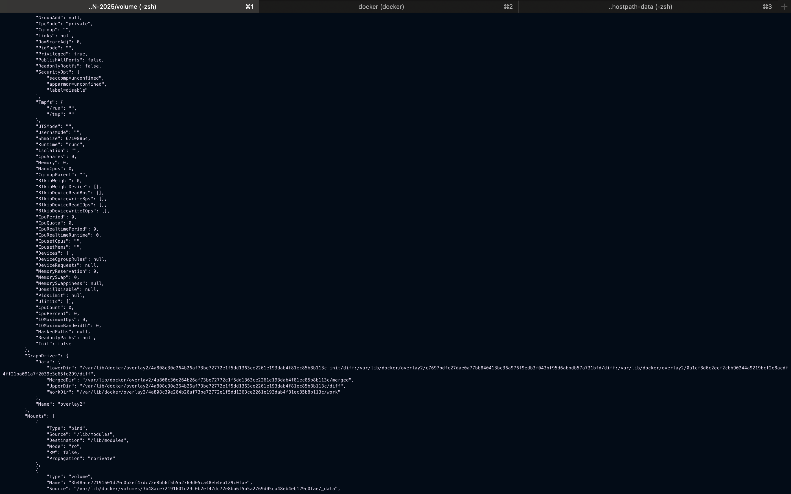
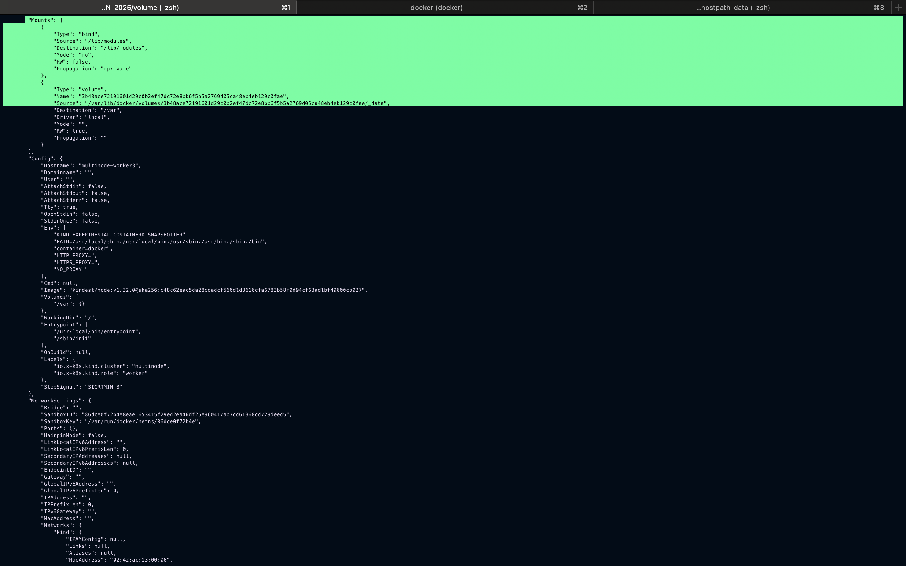

```
docker exec -it multinode-worker3 bash
```

### Inside the multinode-worker3

```
ls -la
cd tmp
ls -la
cd hostpath-data/
ls -la
echo "Message from hostpath-data volume which is on host machine/node of pod."> test.txt
cat test.txt

```

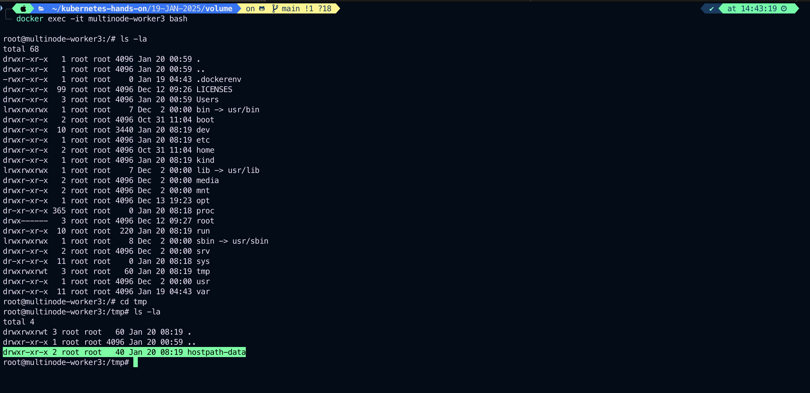
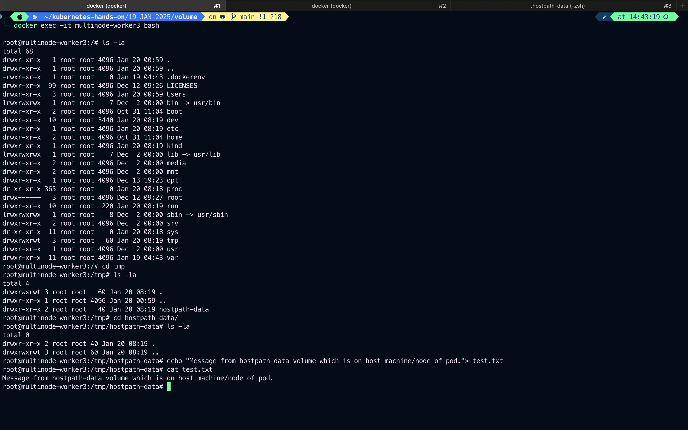

### Now get inside the container to check the file created on hostmachine/node is accessible or not (mount is working or not between volume inside the Pod and volume at hostmachine)

```
kubectl exec -it pod/hostpath-volume -c hostpath-volume-container -- sh
```

### Run inside the container

```
cd /tmp/hostpath/
ls -la
cat test.txt
echo "Reply from hostpath volume/__emptydir__ inside the pod">>test.txt
cat test.txt
```

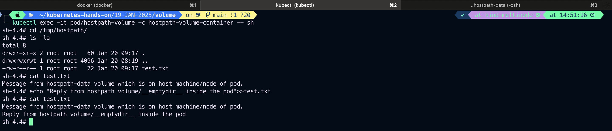

### Check now from multinode-worker3 whether content is accessible or not which added from Pod "emptydir" volume.

```
docker exec -it multinode-worker3 bash
```

### Inside the node

```
cd /tmp/hostpath-data
pwd
ls -la
cat test.txt
```

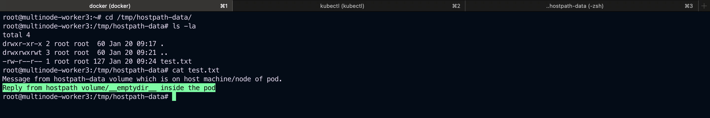
